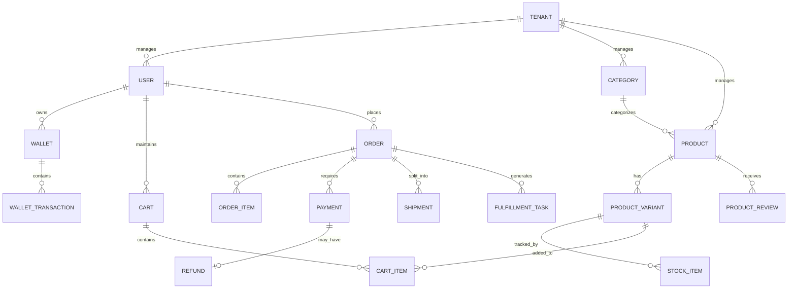

# E-Commerce Enterprise Backend Architecture

<div align="center">
  
  
  
</div>

<div align="center">
  
  
  
  
  
  
</div>

<br/>

## Executive Summary

A production-grade, highly scalable **Multi-Tenant SaaS E-Commerce Backend** built with **.NET 10**. This repository represents a complete microservices-ready monolithic architecture, engineered to demonstrate advanced enterprise-level software design patterns. The system is highly decoupled, fault-tolerant, and designed to handle high-throughput concurrent operations without data corruption or state inconsistency across thousands of isolated tenants.

## Table of Contents
- [Architecture & Applied Design Patterns](#architecture--applied-design-patterns)
- [Project Structure](#project-structure)
- [Database Design & Entity Relationship Diagram (ERD)](#database-design--entity-relationship-diagram-erd)
- [Technical Stack & Infrastructure](#technical-stack--infrastructure)
- [Comprehensive Feature Set](#comprehensive-feature-set)
- [CI/CD Pipeline & Quality Gates](#cicd-pipeline--quality-gates)
- [Local Development Environment](#local-development-environment)

---

## Architecture & Applied Design Patterns

This system strictly adheres to the following architectural principles and patterns to ensure high maintainability, testability, and scalability:

- **Multi-Tenancy (SaaS Ready):** Designed as a Shared Database, Shared Schema architecture. Every core entity implements a `TenantId` discriminator. Entity Framework Core Global Query Filters are applied automatically by the `ITenantService` to guarantee strict data isolation across different tenants seamlessly.
- **Clean Architecture (Onion Architecture):** Strict separation of concerns divided into Domain, Use Cases (Application), Infrastructure, and API Presentation layers. Dependencies point inwards.
- **Domain-Driven Design (DDD):** Rich, encapsulated domain models utilizing Aggregate Roots, Value Objects, Entities, and Domain Events to represent complex business logic.
- **CQRS (Command Query Responsibility Segregation):** Mediated via MediatR. Write operations (Commands) are fully separated from Read operations (Queries), allowing for independent scaling and optimization.
- **Event-Driven Architecture:** Asynchronous inter-module communication using MassTransit and RabbitMQ to decouple services and improve system resilience.
- **Transactional Outbox Pattern:** Guarantees "at-least-once" delivery of messages to the message broker. Domain events are atomically saved with business transactions to the database and later published asynchronously by a background sweeper.
- **Idempotency:** Critical mutating endpoints (such as Payment Processing and Order Placement) implement Idempotency-Keys to safely handle network retries and prevent duplicate transactions.
- **Optimistic Concurrency Control:** Implemented via Entity Framework Core `RowVersion` tokens to prevent race conditions during high-frequency wallet deposits/withdrawals and inventory decrements.
- **Distributed Locking:** Utilizes Redis distributed locks (RedLock algorithm) to serialize access to highly contested resources (e.g., reserving stock for a specific product variant).
- **Soft Deletion Mechanism:** Global EF Core query filters and interceptors ensure records are never hard-deleted, maintaining referential integrity and audit trails.

---

## Project Structure

The project follows a standard Clean Architecture folder structure:

```text
backend/
├── src/
│   ├── ECommerce.Domain/          # Enterprise business rules (Entities, Value Objects, Domain Events)
│   ├── ECommerce.UseCases/        # Application business rules (CQRS Handlers, Validation, Ports)
│   ├── ECommerce.Infrastructure/  # Frameworks & Drivers (EF Core, RabbitMQ, Redis, Background Jobs)
│   ├── ECommerce.Gateway/         # YARP Reverse Proxy for advanced routing
│   ├── ECommerce.Shared/          # Cross-cutting concerns (Exceptions, Constants, Result pattern)
│   └── ECommerce.API/             # Entry point, Controllers, Middlewares, GraphQL endpoints
├── tests/
│   ├── ECommerce.UnitTests/         # Isolated logic tests
│   ├── ECommerce.IntegrationTests/  # DB/Broker tests using TestContainers
│   └── ECommerce.ArchitectureTests/ # Validates dependency rules (NetArchTest)
├── perf/                            # k6 Load Testing scripts
└── docker-compose.yml               # Local infrastructure orchestration
```

---

## Database Design & Entity Relationship Diagram (ERD)

The relational database is carefully normalized while maintaining performance read-models. Below is a high-level representation of the core Schema and Relationships. Note the implicit `TenantId` across all primary aggregates.



---

## Technical Stack & Infrastructure

- **Framework:** .NET 10.0 (ASP.NET Core Web API)
- **Language:** C# 13
- **ORM:** Entity Framework Core (Code-First Migrations)
- **Primary Database:** PostgreSQL (Relational Data)
- **Caching & Locks:** Redis (Distributed Caching, Session State, Distributed Locking)
- **Message Broker:** RabbitMQ (Asynchronous Messaging)
- **Service Bus Wrapper:** MassTransit
- **Background Jobs:** Hangfire (Persistent Scheduled Tasks)
- **GraphQL Engine:** HotChocolate
- **Real-Time Communication:** ASP.NET Core SignalR (WebSockets)
- **Logging:** Serilog (Structured JSON Logging)
- **Observability:** OpenTelemetry, Prometheus, and Grafana (Metrics & Tracing)
- **Validation:** FluentValidation (Pipeline Behaviors)
- **Testing:** xUnit, Moq, FluentAssertions, Testcontainers, Respawn, k6 (Load Testing)

---

## Comprehensive Feature Set

### 1. Identity, Security & Access Management
- **Multi-Tenancy:** Secure data isolation using Entity Framework Core Global Query Filters bound to `TenantId`.
- **JWT Bearer Authentication:** Secure stateless authentication.
- **Role-Based Access Control (RBAC):** Claims-based authorization policies for separating Customers and Administrators.
- **Password Security:** Hashes utilizing Argon2id / PBKDF2.
- **Rate Limiting:** Global and endpoint-specific rate limiting to prevent Brute-Force and DDoS attacks using ASP.NET Core RateLimiter.
- **Content-Security-Policy (CSP):** Hardened middleware rejecting inline scripts, cross-origin framing, and enforcing secure resource loading.

### 2. Catalog & Search Module
- Comprehensive management of Products, Brands, Categories, and Variants.
- **REST & GraphQL:** Dual API exposure. REST for standard management, and GraphQL for highly flexible, client-driven product queries, filtering, and pagination.
- **Caching Strategy:** Redis-backed caching for frequently accessed catalog read-models.

### 3. Shopping Cart & Checkout Workflow
- **Persistent Distributed Cart:** User shopping carts are stored in Redis for low-latency read/write access.
- **Complex Checkout Pipeline:** An orchestrated flow that handles validation, stock reservation, price calculation, payment execution, and order generation atomically.

### 4. Digital Wallets & Payments
- **Wallet System:** Users possess internal digital wallets allowing deposits, withdrawals, and direct transfers.
- **Concurrency Protection:** EF Core Concurrency Tokens ensure that simultaneous transactions cannot overdraw a wallet or corrupt the ledger.

### 5. Inventory & Warehouse Management
- Real-time stock tracking per product variant.
- **Distributed Locking:** Redis locks ensure that if two users attempt to buy the last item simultaneously, only one succeeds.
- Stock replenishment and low-stock alerts.

### 6. Order Management & Real-Time Tracking
- Comprehensive order state machine (Pending -> Payment Verified -> Processing -> Shipped -> Delivered).
- **SignalR Integration:** WebSockets push live order status updates directly to the frontend clients without requiring polling.

### 7. Background Processing & Scheduling
- **Hangfire Jobs:** Recurring and fire-and-forget jobs for tasks such as cleaning up abandoned carts, generating daily sales reports, and sending asynchronous email notifications.
- **Outbox Sweeper:** A hosted background service that polls the `OutboxMessages` table and publishes pending events to RabbitMQ.

---

## CI/CD Pipeline & Quality Gates

The repository features a fully automated, multi-stage GitHub Actions pipeline designed to enforce extreme code quality and system stability:

1. **Format Check:** Enforces strict code formatting via `dotnet format`.
2. **Static Code Analysis (Secret Scanning):** GitLeaks integration prevents accidental committing of sensitive API keys or credentials.
3. **Unit Tests:** High coverage of domain logic and use-case handlers using mocked dependencies.
4. **Architecture Tests:** Validates that Clean Architecture rules are not violated (e.g., Domain layer referencing Infrastructure).
5. **Integration Tests:** Utilizes Testcontainers to spin up real instances of PostgreSQL and Redis to test database interactions and API endpoints.
6. **Load & Performance Testing:** Uses k6 to execute smoke load tests against the API within the pipeline to prevent performance regressions.

---

## Local Development Environment

The system is configured for a frictionless developer experience using Docker Compose.

### Requirements
- Docker Desktop
- .NET 10 SDK

### Startup Instructions

1. Navigate to the backend directory:
   ```bash
   cd backend
   ```
2. Spin up the infrastructure dependencies:
   ```bash
   docker compose up -d postgres redis rabbitmq
   ```
3. Run the application:
   ```bash
   dotnet run --project src/ECommerce.API
   ```

### API Documentation & Diagnostics
- **Swagger UI (REST APIs):** `http://localhost:5139/swagger`
- **GraphQL IDE (Banana Cake Pop):** `http://localhost:5139/graphql`
- **Hangfire Dashboard:** `http://localhost:5139/hangfire`
