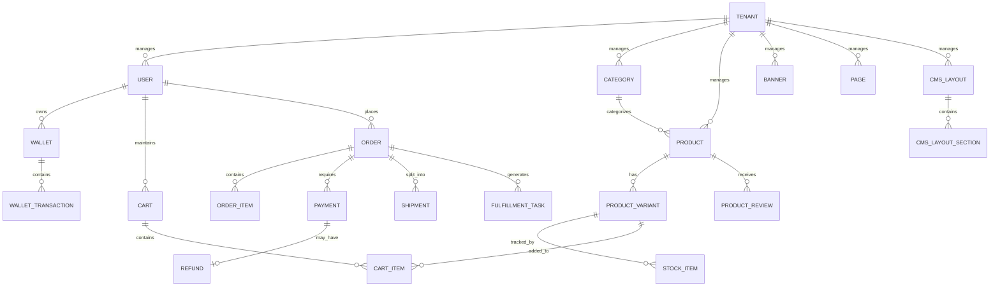

# E-Commerce Enterprise Backend Architecture

<div align="center">
  
  
</div>

<div align="center">
  
  
  
  
  
  
</div>

<br/>

## Executive Summary

A **Multi-Tenant SaaS E-Commerce Backend** built on **.NET 10**. This repository is a microservices-ready monolithic architecture that applies a consistent set of software design patterns: Clean Architecture, Domain-Driven Design, CQRS, and event-driven messaging. It is decoupled and designed for concurrent operations with tenant-isolated data, but it is a reference architecture rather than a fully hardened production system.

## Table of Contents
- [Architecture & Applied Design Patterns](#architecture--applied-design-patterns)
- [Project Structure](#project-structure)
- [Database Design & Entity Relationship Diagram (ERD)](#database-design--entity-relationship-diagram-erd)
- [Technical Stack & Infrastructure](#technical-stack--infrastructure)
- [Comprehensive Feature Set](#comprehensive-feature-set)
- [CI/CD Pipeline & Quality Gates](#cicd-pipeline--quality-gates)
- [Local Development Environment](#local-development-environment)

---

## Architecture & Applied Design Patterns

This system strictly adheres to the following architectural principles and patterns to ensure high maintainability, testability, and scalability:

- **Multi-Tenancy (SaaS Ready):** Designed as a Shared Database, Shared Schema architecture. Every core entity implements a `TenantId` discriminator. Entity Framework Core Global Query Filters are applied automatically by the `ITenantService` to guarantee strict data isolation across different tenants.
- **Clean Architecture (Onion Architecture):** Strict separation of concerns divided into Domain, Use Cases (Application), Infrastructure, and API Presentation layers. Dependencies point inwards.
- **Domain-Driven Design (DDD):** Rich, encapsulated domain models utilizing Aggregate Roots, Value Objects, Entities, and Domain Events to represent complex business logic.
- **CQRS (Command Query Responsibility Segregation):** Mediated via MediatR. Write operations (Commands) are fully separated from Read operations (Queries), allowing for independent scaling and optimization.
- **Event-Driven Architecture:** Asynchronous inter-module communication using MassTransit and RabbitMQ to decouple services and improve system resilience.
- **Transactional Outbox Pattern:** Guarantees "at-least-once" delivery of messages to the message broker. Domain events are atomically saved with business transactions to the database and later published asynchronously by a background sweeper.
- **Idempotency:** Critical mutating endpoints (such as Payment Processing and Order Placement) implement Idempotency-Keys to safely handle network retries and prevent duplicate transactions.
- **Optimistic Concurrency Control:** Implemented via Entity Framework Core `RowVersion` tokens to prevent race conditions during high-frequency wallet deposits/withdrawals and inventory decrements.
- **Distributed Locking:** Utilizes Redis distributed locks (RedLock algorithm) to serialize access to highly contested resources (e.g., reserving stock for a specific product variant).
- **Soft Deletion Mechanism:** Global EF Core query filters and interceptors ensure records are never hard-deleted, maintaining referential integrity and audit trails.

---

## Project Structure

The project follows a standard Clean Architecture folder structure:

```text
backend/
├── src/
│   ├── ECommerce.Domain/          # Enterprise business rules (Entities, Value Objects, Domain Events)
│   ├── ECommerce.UseCases/        # Application business rules (CQRS Handlers, Validation, Ports)
│   ├── ECommerce.Infrastructure/  # Frameworks & Drivers (EF Core, RabbitMQ, Redis, Background Jobs)
│   ├── ECommerce.Gateway/         # YARP Reverse Proxy for advanced routing
│   ├── ECommerce.Shared/          # Cross-cutting concerns (Exceptions, Constants, Result pattern)
│   └── ECommerce.API/             # Entry point, Controllers, Middlewares, GraphQL endpoints
├── tests/
│   ├── ECommerce.UnitTests/         # Isolated logic tests
│   ├── ECommerce.IntegrationTests/  # DB/Broker tests using TestContainers
│   └── ECommerce.ArchitectureTests/ # Validates dependency rules (NetArchTest)
├── perf/                            # k6 Load Testing scripts
└── docker-compose.yml               # Local infrastructure orchestration
```

---

## Database Design & Entity Relationship Diagram (ERD)

The relational database is carefully normalized while maintaining performance read-models. Below is a high-level representation of the core Schema and Relationships. Note the implicit `TenantId` across all primary aggregates.



---

## Technical Stack & Infrastructure

- **Framework:** .NET 10.0 (ASP.NET Core Web API)
- **Language:** C# 13
- **ORM:** Entity Framework Core (Code-First Migrations)
- **Primary Database:** PostgreSQL (Relational Data)
- **Caching & Locks:** Redis (Distributed Caching, Session State, Distributed Locking)
- **HTTP Output Caching:** ASP.NET Core response caching on storefront-facing endpoints with a tenant-aware vary-by policy
- **Message Broker:** RabbitMQ (Asynchronous Messaging)
- **Service Bus Wrapper:** MassTransit
- **Background Jobs:** Hangfire (Persistent Scheduled Tasks)
- **GraphQL Engine:** HotChocolate
- **Real-Time Communication:** ASP.NET Core SignalR (WebSockets)
- **Logging:** Serilog (Structured JSON Logging)
- **Observability:** OpenTelemetry, Prometheus, and Grafana (Metrics & Tracing)
- **Validation:** FluentValidation (Pipeline Behaviors)
- **Testing:** xUnit, Moq, FluentAssertions, Testcontainers, Respawn, k6 (Load Testing)

---

## Comprehensive Feature Set

### 1. SaaS & Platform Management
- **Tenant-Based Rate Limiting:** Prevents the "Noisy Neighbor" problem by enforcing API quotas based on the tenant's subscription plan.
- **Automated Billing & Webhooks:** Integrated with Stripe Webhooks to automatically handle subscription upgrades, downgrades, and cancellations (`customer.subscription.updated`).
- **Trial Management:** Automated background jobs via Hangfire that scan for expired trials and automatically suspend inactive tenants.
- **Custom Domains & SSL:** Infrastructure ready with Traefik Docker Compose, allowing wildcard domain routing and automatic Let's Encrypt SSL provisioning for tenant custom domains.

### 2. Identity, Security & Access Management
- **Multi-Tenancy:** Secure data isolation using Entity Framework Core Global Query Filters bound to `TenantId`.
- **JWT Bearer Authentication:** Secure stateless authentication.
- **OAuth 2.0 (Authorization Code + PKCE):** OAuth clients obtain short-lived, single-use authorization codes bound to the authenticated user and exchange them at the token endpoint with a `code_verifier` (plus `client_credentials` and `password` grants), with support for token revocation and OpenID Connect discovery.
- **Role-Based Access Control (RBAC):** Claims-based authorization policies for separating Customers and Administrators.
- **Password Security:** Password hashing utilizing BCrypt (adaptive work factor 12).
- **Multi-Dimensional Rate Limiting:** Every request is evaluated against multiple chained layers using ASP.NET Core`s `PartitionedRateLimiter.CreateChained` — strict per-IP brute-force protection on `/api/v1/auth/*` (10/min), per-user quotas (120/min), per-IP quotas (300/min), and per-tenant "noisy neighbor" quotas (600/min). Exceeding any single layer returns `429 Too Many Requests`, protecting against brute force, per-user abuse, per-IP abuse, and cross-tenant resource starvation simultaneously.
- **Content-Security-Policy (CSP):** Hardened middleware rejecting inline scripts, cross-origin framing, and enforcing secure resource loading.

### 3. Catalog, Search & Localization
- Comprehensive management of Products, Brands, Categories, and Variants.
- **Localization:** Native support for Product Translations allowing multi-language product names and descriptions.
- **REST & GraphQL:** Dual API exposure. REST for standard management, and GraphQL for highly flexible, client-driven product queries, filtering, and pagination.
- **Caching Strategy:** Redis-backed caching for frequently accessed catalog read-models.

### 4. Shopping Cart, Wishlist & Checkout Workflow
- **Persistent Distributed Cart:** User shopping carts are stored in Redis for low-latency read/write access.
- **Wishlist:** Users can save products for later via the Wishlists module.
- **Complex Checkout Pipeline:** An orchestrated flow that handles validation, stock reservation, price calculation, payment execution, and order generation atomically.

### 5. Digital Wallets, Payments & Promotions
- **Wallet System:** Users possess internal digital wallets allowing deposits, withdrawals, and direct transfers.
- **External Payment Gateways:** Real integration with Stripe for processing credit card payments.
- **Coupons & Promotions:** Advanced promotional engine for discounts and coupon codes.
- **Concurrency Protection:** EF Core Concurrency Tokens ensure that simultaneous transactions cannot overdraw a wallet or corrupt the ledger.

### 6. Inventory & Warehouse Management
- Real-time stock tracking per product variant.
- **Distributed Locking:** Redis locks ensure that if two users attempt to buy the last item simultaneously, only one succeeds.
- Stock replenishment and low-stock alerts.

### 7. Order Management, Shipping & Notifications
- Comprehensive order state machine (Pending -> Payment Verified -> Processing -> Shipped -> Delivered).
- **Shipping Integrations:** Integrations with Aramex and DHL for real-time shipment handling.
- **Notifications Engine:** Integration with SendGrid (Email) and Twilio (SMS) for customer notifications on order state changes.
- **SignalR Integration:** WebSockets push live order status updates directly to the frontend clients without requiring polling.

### 8. Background Processing & Scheduling
- **Hangfire Jobs:** Recurring and fire-and-forget jobs for tasks such as cleaning up abandoned carts, generating daily sales reports, and sending asynchronous email notifications.
- **Outbox Sweeper:** A hosted background service that polls the `OutboxMessages` table and publishes pending events to RabbitMQ.

### 9. Content Management System (CMS)
- **Home Page Banners:** Toggle, reorder, activate, and soft-delete banners rendered on the storefront homepage.
- **Dynamic Layouts:** Database-backed layout definitions composed of ordered sections (Hero, Banner Carousel, Featured Products, Rich Text) with JSON configuration, letting the storefront front page be templated at runtime without redeploys.
- **Static Pages:** Manage About Us, Terms & Conditions, and similar pages with rich HTML content, SEO meta fields, and published/draft state.
- **Tenant-Scoped & Audit-Logged:** All content entities are tenant-isolated via the shared-schema `TenantId` filter, and every create/update/deactivate writes a tamper-evident audit-trail entry.
- **Permission-Gated Admin API:** Management operations are protected by `content.banner.*`, `content.page.*`, and `content.layout.*` permissions (granted to Admin/SuperAdmin).
- **Output-Cached Public API:** Storefront reads (`GET /content/banners`, `GET /content/pages/{slug}`, `GET /content/layouts/{slug}`) are served from the HTTP output cache.

---

## CI/CD Pipeline & Quality Gates

The repository features an automated, multi-stage GitHub Actions pipeline that enforces code quality and stability:

1. **Format Check:** Enforces strict code formatting via `dotnet format`.
2. **Static Code Analysis (Secret Scanning):** GitLeaks integration prevents accidental committing of sensitive API keys or credentials.
3. **Unit Tests:** Core domain logic and use-case handlers, tested with mocked dependencies.
4. **Architecture Tests:** Validates that Clean Architecture rules are not violated (e.g., Domain layer referencing Infrastructure).
5. **Integration Tests:** Utilizes Testcontainers to spin up real instances of PostgreSQL, Redis, and RabbitMQ to test database interactions, caching, and API endpoints.
6. **Load & Performance Testing:** Uses k6 to execute smoke load tests against the API within the pipeline to prevent performance regressions.

---

## Local Development Environment

The system is configured for local development using Docker Compose.

### Requirements
- Docker Desktop
- .NET 10 SDK

### Startup Instructions

1. Navigate to the backend directory:
   ```bash
   cd backend
   ```
2. Spin up the infrastructure dependencies:
   ```bash
   docker compose up -d postgres redis rabbitmq
   ```
3. **(Optional) Seed the Database with Fake Data:**
   To populate the database with realistic mock data (Tenants, Users, Wallets, Carts, Products, Orders, Stock, etc.) for testing:
   ```bash
   dotnet run --project src/ECommerce.DataSeeder
   ```
   *Warning: This will truncate existing records and generate a fresh dataset.*
   *(Note: Generated users can be logged into using the default password `Password123!`)*
4. Run the application:
   ```bash
   dotnet run --project src/ECommerce.API
   ```

### Local Dashboards & Testing Guide

Once the infrastructure and API are running, you can access the following dashboards to monitor and test the system:

#### Quick Reference Table

| Service | URL | Credentials |
|---------|-----|-------------|
| **Swagger UI (REST APIs)** | http://localhost:5139/swagger | - |
| **GraphQL IDE (Banana Cake Pop)** | http://localhost:5139/graphql | - |
| **Hangfire Dashboard (Background Jobs)** | http://localhost:5139/hangfire | - |
| **RabbitMQ Management (Event Bus)** | http://localhost:15672 | `ecommerce` / `ecommerce_dev_pw` |
| **Seq (Structured Logging)** | http://localhost:5341 | `admin` / `ecommerce_dev_pw` |
| **Grafana (Metrics & Performance)** | http://localhost:3000 | `admin` / `admin` |
| **Mailpit (Local Email Testing)** | http://localhost:8025 | - |
| **ElasticSearch Indices** | http://localhost:9200/_cat/indices?v | - |

#### Seeded Test Users

| Info | Value |
|------|-------|
| **Password (all users)** | `Password123!` |
| **Tenants** | O'Reilly Group, Durgan Kertzmann and McClure, Effertz and Sons |
| **API Base URL** | http://localhost:5139 |

#### Detailed Testing Guide

**API Endpoints & Background Jobs**
- **Swagger UI:** Click `Authorize` to enter a JWT token, or execute public endpoints (e.g., GET Products) to verify API functionality.
- **GraphQL IDE:** Write a sample query (e.g., `query { products { nodes { id name } } }`) and click run.
- **Hangfire Dashboard:** Navigate to "Recurring Jobs", select a job like `CheckTrialExpirationsJob`, and click "Trigger Now" to manually run it.

**Infrastructure & Monitoring**
- **RabbitMQ Management:** Open the "Queues" tab. Trigger an event (like placing an order via Swagger) and watch the message count spike.
- **Seq:** Trigger a bad request (e.g., 400 Validation Error) in Swagger, then open Seq to see detailed structured JSON logs.
- **Grafana:** Generate load by hitting an endpoint repeatedly. Open the default .NET metrics dashboard to see live CPU/Memory and Request/Sec spikes.
- **Mailpit:** Trigger an action that sends an email (e.g., Request Password Reset). Open Mailpit to view intercepted HTML emails.
- **ElasticSearch:** Visit the indices endpoint to confirm indexes (like `products`) are created and syncing data properly.
