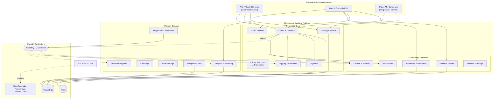
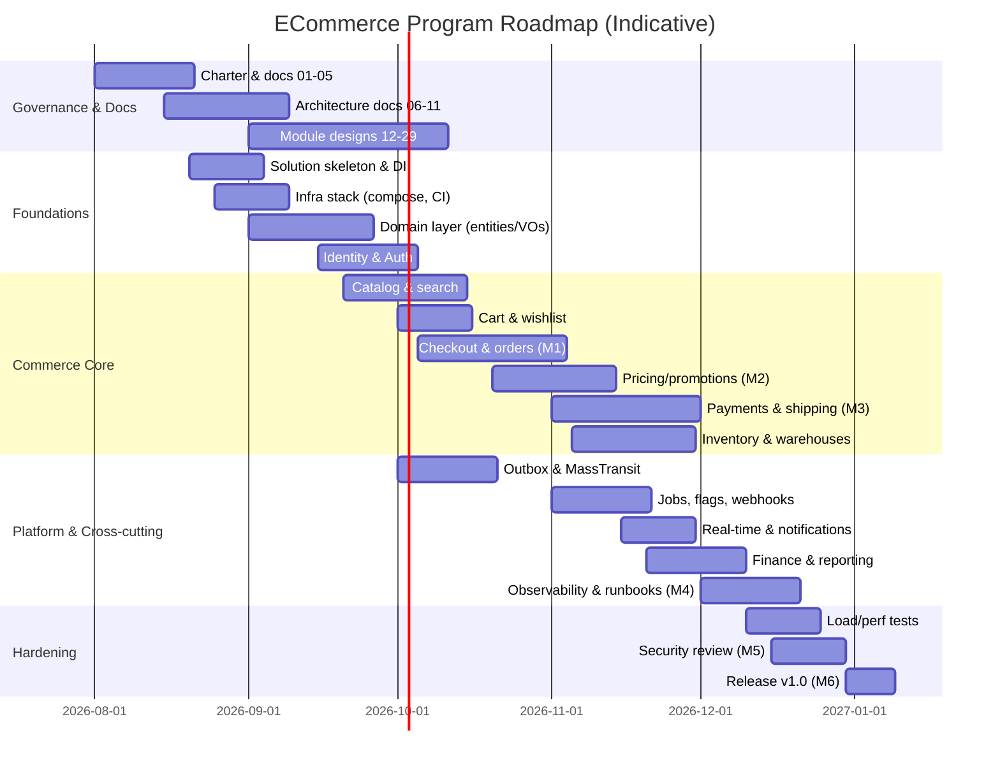
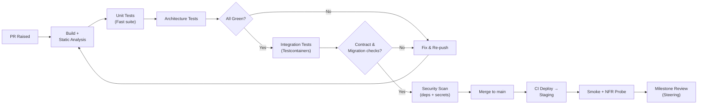

# Document 01 — Project Charter & Product Vision

> **Platform:** E-Commerce Platform (Working Title: `ECommerce`)
> **Document Type:** Project Charter (Baseline)
> **Status:** Draft v1.0 for review
> **Audience:** Executive Sponsors, Engineering Leadership, Architecture Review Board, Product, QA, DevOps, Security

---

## 1. Document Control

### 1.1 Version History

| Version | Date       | Author / Owner | Change Summary                                  |
|---------|------------|----------------|--------------------------------------------------|
| 0.1     | 2026-07-15 | Product Owner  | Initial skeleton and draft outline               |
| 0.2     | 2026-07-25 | Enterprise Architect | Architecture principles and target stack added |
| 0.3     | 2026-07-30 | Tech Lead      | Scale targets, KPI baseline, risk register       |
| 1.0     | 2026-07-31 | Product Owner  | Baseline release for stakeholder sign-off        |

### 1.2 Approvals

| Role                    | Name          | Decision | Date       | Signature |
|--------------------------|---------------|----------|------------|-----------|
| Executive Sponsor        | TBD           | Pending  | —          | —         |
| Product Owner            | TBD           | Pending  | —          | —         |
| Enterprise Architect     | TBD           | Pending  | —          | —         |
| Technical Lead           | TBD           | Pending  | —          | —         |
| Head of Security         | TBD           | Pending  | —          | —         |
| QA Lead                  | TBD           | Pending  | —          | —         |

### 1.3 Related Documents (see §13 Documentation Roadmap)

- `02-glossary-and-definitions.md`
- `03-business-requirements.md`
- `04-functional-requirements.md`
- `05-non-functional-requirements.md`
- `06-system-architecture.md`
- `07-data-model-erd.md`
- `08-api-design.md`
- `09-security-architecture.md`
- `REFACTOR_PLAN.md` (existing working refactor plan — superseded incrementally by this documentation set)

---

## 2. Executive Summary

We are building **ECommerce**, a greenfield, enterprise-grade, cloud-native e-commerce platform. The platform is not a CRUD application: it is designed and engineered to operate as a production commerce backbone serving **5 million customers**, **300,000 active products**, across **30 warehouses**, **15 countries**, **10 languages**, and **5 currencies**, sustaining **1,000 orders per minute** during peak load with high availability and horizontal scaling.

The platform will serve as:

- A **portfolio project** demonstrating production-grade engineering;
- An **enterprise architecture reference**;
- An **interview reference** for senior backend positions;
- A **backend engineering learning system**; and
- A **system design reference**.

The system will be implemented on **ASP.NET Core (.NET 10)** using a disciplined combination of **Vertical Slice Architecture** and **Clean Architecture**, with **Domain-Driven Design (DDD)**, **CQRS**, **MediatR**, **Entity Framework Core**, **PostgreSQL**, **Redis**, **RabbitMQ** with **MassTransit**, and a complete observability stack (**Serilog/Seq**, **OpenTelemetry**, **Prometheus/Grafana**), background processing (**Hangfire**), real-time delivery (**SignalR**), and a hardened authentication/authorization model (**Identity + JWT + Refresh Tokens**).

This charter establishes the **business case, objectives, scope, governance, success metrics, risks, and delivery roadmap** that govern the entire program. It is the single controlling document for all subsequent technical and product artifacts.

---

## 3. Background & Problem Statement

### 3.1 Background

Modern consumers expect a seamless, fast, and reliable shopping experience across web and mobile. Retailers operating at scale require a commerce platform that can:

- Present a catalog of hundreds of thousands of products across categories and brands;
- Manage inventory across multiple warehouses with multi-country fulfillment;
- Process payments through multiple providers with provider-agnostic abstraction and automatic failover;
- Compute complex discounts and promotions at cart and order level;
- Keep order, payment, fulfillment, and finance states consistent under concurrency;
- Emit reliable notifications and real-time order status updates;
- Provide actionable analytics and reporting to operations, finance, and management.

### 3.2 Problem Statement

Legacy and conventional CRUD-style commerce implementations fail at this scale because they:

| Failure Mode                        | Consequence                                                        |
|-------------------------------------|---------------------------------------------------------------------|
| Monolithic single data model        | Coupling between catalog, orders, inventory, and finance            |
| Transaction-heavy synchronous flows | Degraded checkout under load; poor availability                     |
| Tight coupling to a payment/shipping provider | Vendor lock-in; expensive migration; single point of failure |
| No eventing infrastructure          | Inconsistent state between services; lost business events           |
| No observability strategy           | Blind operations; long mean-time-to-resolution (MTTR)               |
| No background job framework         | Sync email/SMS/PDF/report generation blocks the request path        |
| Weak security posture               | Token theft, unauthorized access, audit gaps, regulatory exposure   |
| No test strategy beyond unit tests  | Regressions in commerce-critical flows                              |

### 3.3 Solution Direction

A modular, layered .NET backend that combines:

- **Vertical slice + Clean Architecture** so each business capability is independently comprehensible and testable;
- **CQRS with MediatR** separating reads (fast, cached, optimized) from writes (validated, transactional, eventing);
- **DDD aggregates and domain events** encoding business rules where they belong;
- **RabbitMQ/MassTransit + Outbox** guaranteeing reliable, at-least-once event delivery;
- **Redis** for distributed cache, rate limiting, and distributed locking;
- **Hangfire** for durable background work (invoices, emails, reports, stock sync);
- **SignalR** for real-time customer and warehouse notifications;
- **Full observability and containerized local development**.

---

## 4. Business Objectives & Success Metrics

### 4.1 Strategic Objectives (SMART)

| # | Objective | Measure | Target | Horizon |
|---|-----------|---------|--------|---------|
| O1 | Deliver a production-ready commerce backend | Modules delivered against scope (FDD checklist) | 100% of committed scope | End of program |
| O2 | Achieve architectural completeness as a reference | Coverage of documented architecture/ADR items | ≥ 95% traceability | End of program |
| O3 | Prove scale readiness | Load-tested throughput at target | 1,000 orders/min sustained, p95 checkout < 1.5 s | Milestone M3 |
| O4 | Guarantee data consistency | Outbox delivery latency and order/payment reconciliation drift | Zero undetected drift | Continuous |
| O5 | Ensure engineering quality | Code coverage, static analysis, architecture tests | ≥ 80% branch coverage; 0 critical violations | Continuous |
| O6 | Enable multi-provider commerce | Payment + shipping provider adapters | ≥ 2 adapters each with failover | Milestone M4 |
| O7 | Build a reusable interview/learning asset | Documentation + code + runbooks | Complete runbook set | Milestone M5 |

### 4.2 Success Criteria (Program Definition of Done)

The program is considered successful when all of the following hold:

1. **All planned documents** (per §13) are published, approved, and traceable to implementation.
2. **The backend** builds, passes unit, integration, architecture, and contract tests in CI on every push.
3. **The system runs locally** with a single `docker compose up` bringing up all infrastructure.
4. **The system survives the scale test** defined in `05-non-functional-requirements.md` (load profile §NFR-SCALE-01).
5. **Observability** is end-to-end: traces, metrics, and structured logs flow to Seq, Prometheus, and Grafana.
6. **Security baseline** passes: no known high/CVSS ≥ 7.0 dependency vulnerabilities; OWASP ASVS Level 1 verified items applied.
7. **High-availability targets** are demonstrably met in the HA/redundancy test (see `05-non-functional-requirements.md`).

### 4.3 KPI Baseline & Targets

| KPI                          | Baseline | Target        | Instrument                                     |
|------------------------------|----------|---------------|-------------------------------------------------|
| Checkout p95 latency         | —        | ≤ 1.5 s       | OpenTelemetry trace duration, Grafana dashboard |
| Order ingestion (peak)       | —        | ≥ 1,000/min   | k6 / JMeter load profile, API metrics           |
| API availability             | —        | ≥ 99.9%       | Prometheus up metrics, synthetic probes         |
| Event delivery (outbox) p99  | —        | ≤ 2 s         | Outbox publisher latency metric                 |
| Background job failure rate  | —        | ≤ 1%          | Hangfire job metrics                            |
| Cache hit ratio (catalog)    | —        | ≥ 90%         | Redis hit ratio                                 |
| Auth token validation p95    | —        | ≤ 50 ms       | Auth middleware timing metric                   |

---

## 5. Product Vision Statement

> **For** retailers and their customers operating at national and international scale,
> **who** need a reliable, fast, and secure commerce backbone,
> **the** ECommerce platform
> **is a** modular, cloud-native commerce backend
> **that** handles catalog, cart, checkout, payment, fulfillment, discounting, notifications, analytics, and integrations as production-grade, independently deployable capabilities,
> **unlike** typical CRUD-driven store projects,
> **our product** guarantees transactional integrity, horizontal scalability, multi-provider resilience, and full observability out of the box.

---

## 6. Scope

### 6.1 In Scope

The platform covers the following business capabilities (each is decomposed in `04-functional-requirements.md` and architecture docs):

| Domain | Included Capabilities |
|--------|----------------------|
| Identity & Access | Registration, login, refresh tokens, roles, permissions, RBAC, account management, impersonation (super admin), lockout, 2FA-ready hooks |
| Catalog | Products, variants, categories (hierarchical), brands, attributes, SEO fields, search, filters, pricing per currency, multi-language names/descriptions |
| Cart & Wishlist | Anonymous and authenticated cart, cart persistence, wishlist, merge on login, cart expiry, price snapshot |
| Checkout & Orders | Address management, shipping method selection, order placement, order states, cancellation, reorder, order history, 1,000 orders/min ingestion |
| Inventory & Warehouses | Multi-warehouse stock, stock allocation, reservations, low-stock alerts, stock movement ledger, transfer between warehouses |
| Pricing, Discounts & Promotions | List/offer pricing, discount engine (rule-based), promotion engine (conditions & actions), coupon codes, stacking rules, cart/order/shipping discounts |
| Payments | Multi-provider abstraction (e.g., Stripe + sandbox provider), payment intents, webhooks, idempotency, refunds, capture, reconciliation-ready ledger |
| Shipping & Fulfillment | Multi-provider abstraction, rate calculation, label/consignment generation, tracking updates, warehouse fulfillment tasks, shipments |
| Finance | Invoices, credit notes, refunds ledger, tax calculation hooks, financial reporting feeds |
| Notifications | Email, SMS, push-ready, in-app; templates; per-channel preferences; events-driven |
| Reviews & Ratings | Verified-purchase review, moderation workflow, rating aggregation, product rating calculation |
| Analytics & Reporting | Sales analytics, product performance, conversion funnel, inventory reports, finance reports, export jobs |
| Platform Services | Audit logs, feature flags, background jobs, health checks, rate limiting, API versioning, problem details, integration hooks/webhooks, admin management console APIs |

### 6.2 Out of Scope (for this program)

| Item | Rationale |
|------|-----------|
| Customer-facing web/mobile UI (storefront) | Backend-first program; UI is a consumer of the documented public API |
| Machine learning–based recommendations | Out of scope; feature-flagged hook reserved via integration contracts |
| Self-built payment gateway / PSP | We integrate providers, never process card data ourselves (PCI-DSS scope avoidance) |
| On-premise / legacy database migration tooling | Greenfield; migration tooling is out of scope |
| Multitenant (SaaS multi-tenant tenant isolation across different retailers) | Single-tenant-per-deployment model; multi-tenant isolation documented as future work |
| Physical logistics (courier fleet, warehouse robotics) | We integrate logistics APIs, not operate fleets |

### 6.3 Exclusions & Assumptions

| Assumption | Impact |
|-----------|--------|
| PostgreSQL 16+ is the primary OLTP database; no dual-write databases in v1 | Simplifies transactions; read scaling via replicas + Redis |
| RabbitMQ is the single event bus; MassTransit is the client | One transport guarantees Outbox + bus behavior consistency |
| Cloud deployment assumed (Azure preferred; any CNCF-aligned cloud accepted) | All infra as code / docker-compose parity |
| PCI scope avoided by delegating card data to PSP tokens | No raw card data in our storage, logs, or traces |
| Currency conversion uses a centralized daily FX feed (integrated, not built) | Consistent conversion; documented integration point |
| VAT/tax calculation via an integration provider (e.g., tax API) with local fallback rules | Multi-country compliance without building tax engines |

---

## 7. Stakeholders & Governance

### 7.1 Stakeholder Register

| Stakeholder | Role / Interest | Engagement | Influence |
|-------------|-----------------|------------|-----------|
| Executive Sponsor | Funding, decisions, risk acceptance | Monthly steering | High |
| Product Owner | Vision, backlog, priorities, acceptance | Daily | High |
| Enterprise Architect | Architecture, standards, ADRs, NFRs | Weekly review | High |
| Technical Lead | Implementation leadership, code standards | Daily | High |
| Security Officer | Threat model, compliance, review gates | Per milestone | High |
| QA Lead | Test strategy, quality gates | Continuous | Medium |
| DevOps / SRE | CI/CD, observability, runbooks, deployment | Continuous | Medium |
| Finance Team (product role) | Invoices, refunds, reporting requirements | Requirement workshops | Medium |
| Warehouse Ops (product role) | Fulfillment, inventory, shipping requirements | Requirement workshops | Medium |
| Customer Support (product role) | Order lifecycle, notifications, moderation | Requirement workshops | Medium |
| Developers | Implement features per docs | Daily | Medium |

### 7.2 RACI — Delivery Governance

| Activity | Sponsor | PO | Architect | Tech Lead | QA | DevOps | Security |
|----------|:-------:|:--:|:---------:|:---------:|:--:|:------:|:--------:|
| Approve charter & scope | **A** | R | C | C | C | C | C |
| Maintain requirement docs | I | **A/R** | C | C | C | I | I |
| Approve architecture/ADRs | I | C | **A/R** | C | C | C | C |
| Approve API contracts | I | C | **A** | R | C | I | C |
| Threat model & security review | I | I | C | R | C | I | **A** |
| Test strategy & quality gates | I | C | C | R | **A/R** | C | I |
| Release / deployment approval | I | C | C | R | C | **A/R** | C |
| Escalated defect triage | I | **A** | C | R | C | I | I |

---

## 8. Personas & User Roles

### 8.1 End-User Personas

| Persona | Profile | Goals | Pain Points |
|---------|---------|-------|-------------|
| **Guest Shopper** | Anonymous visitor | Browse and check out without account | Losing cart; forced registration |
| **Registered Customer** | Account holder | Fast checkout, order history, wishlist, reviews | Slow checkout; no order tracking |
| **Admin** | Store operations | Manage catalog, prices, promotions, orders | Complex UIs; no bulk operations; no audit trail |
| **Warehouse Employee** | Fulfillment operator | Process orders, manage stock, ship consignments | Stale stock; manual tracking; no real-time signals |
| **Finance Team** | Accounting/operations | Invoices, refunds, tax, reconciliation reports | Disconnected payment/order data; manual reconciliation |
| **Customer Support** | Service desk | Order lookup, refunds, disputes, moderation | No unified order timeline; slow payment status |
| **Super Admin** | Platform operator | Roles/permissions, feature flags, audit, impersonation | No governance tooling; no risk controls |

### 8.2 System Roles (Authorization)

| Role | Scope | Representative Permissions |
|------|-------|-----------------------------|
| `Customer` | Self | View/order products, manage own cart/wishlist/addresses, view own orders, write reviews, request refunds |
| `Admin` | Store-wide | Catalog, pricing, promotions, orders, customers, reviews moderation |
| `WarehouseEmployee` | Warehouse | Fulfillment queues, stock adjustments, shipping, inventory transfers |
| `Finance` | Finance | Invoices, refunds approval, payment ledger, financial reports |
| `Support` | Support | Order lookup, refund initiation, dispute handling, customer communication |
| `SuperAdmin` | Platform | Role/permission management, feature flags, audit logs, impersonation, integration/webhook management |

> Full permission matrix (permission → endpoint → role) is defined in `04-functional-requirements.md` §Security and `09-security-architecture.md`.

---

## 9. Scale & Capacity Targets

The following targets define the sizing contract for all capacity, performance, and architecture decisions.

| Dimension | Target |
|-----------|--------|
| Customers | 5,000,000 registered accounts |
| Active products (SKUs) | 300,000 |
| Warehouses | 30 |
| Countries served | 15 |
| Languages | 10 |
| Currencies | 5 |
| Orders (peak sustained) | 1,000 orders/minute (≈ 16.7 orders/sec) |
| Order line items (peak) | ≈ 3,000 line items/minute (avg 3 per order) |
| Checkout peak RPS (total API) | ≈ 10,000 requests/min across endpoints |
| Catalog browse peak RPS | ≈ 50,000 requests/min |
| Concurrent shoppers | ≈ 250,000 |
| Availability | 99.9% monthly |
| Recovery objective (RTO) | ≤ 15 minutes |
| Data loss objective (RPO) | ≤ 5 minutes (Outbox + transactional outbox recovery) |

> These numbers are inputs, not outputs, of the sizing model. Each NFR in `05-non-functional-requirements.md` references the specific target it is derived from.

---

## 10. High-Level Capability Map

---

## 11. Constraints, Dependencies & Assumptions

### 11.1 Constraints

| Constraint | Detail |
|------------|--------|
| Runtime | .NET 10 / ASP.NET Core 10 |
| Database | PostgreSQL 16+ (primary OLTP), Redis 7+ (cache/rate-limit/lock) |
| Messaging | RabbitMQ 3.13+, MassTransit 8.x |
| Deployment | Containerized; Docker + Docker Compose for dev; cloud-native for prod |
| Code style | Clean Architecture layering + Vertical Slices; solution layout mandated by `06-system-architecture.md` |
| Observability | Serilog + OpenTelemetry required in every process |
| Security | No secrets in repo; JWT short-lived + refresh tokens; ASP.NET Core Data Protection for encryption |
| Testing | Unit, integration (Testcontainers), architecture, and contract tests required in CI |

### 11.2 Key Dependencies

| Dependency | Use | Failure Impact | Mitigation |
|-----------|-----|----------------|------------|
| PostgreSQL | OLTP storage | Orders/payments unavailable | Read replicas, pooling, retries, outbox for events |
| Redis | Cache, rate limit, distributed locks, SignalR backplane | Degraded performance; checkout rate limit off | Cache fallback to DB; lock TTL safeguards |
| RabbitMQ | Event bus | Event delivery stalls | Outbox keeps events durable; bus reconnection; queue HA |
| PSP (payment provider) | Payments | Cannot capture payments | Multi-provider adapter + failover policy |
| Shipping providers | Rates + labels | Cannot quote/ship | Multi-provider adapter + manual rate fallback |
| Email/SMS gateway | Notifications | Notifications delayed | Queued via Hangfire; retries; dead-letter alerting |
| FX feed | Multi-currency conversion | Conversion stale | Cached daily rates with last-known-good |

### 11.3 Budget & Effort (Indicative)

| Workstream | Share | Rationale |
|-----------|:-----:|-----------|
| Commerce core (orders, catalog, cart, pricing) | 30% | Highest domain complexity |
| Payments, shipping, finance | 20% | Provider integrations + reconciliation |
| Identity, security, audit | 15% | Compliance-grade baseline |
| Platform (outbox, jobs, flags, webhooks, rate limiting) | 15% | Reliability backbone |
| Observability, resilience, deployment | 10% | SLO enforcement |
| Testing, documentation, ADRs | 10% | Quality + reference value |

---

## 12. Risks & Mitigations

### 12.1 Risk Register (Top Risks)

| # | Risk | Likelihood | Impact | Score | Mitigation | Owner |
|---|------|-----------|--------|-------|------------|-------|
| R1 | Scope creep from "cover every concept" ambition | High | High | **Critical** | FDD traceability; freeze scope at M2; features behind flags | PO |
| R2 | Eventual consistency bugs in order/payment/refund flows | Medium | High | High | Outbox, idempotency keys, state machines, reconciliation job, chaos tests | Tech Lead |
| R3 | Load targets not met (1,000 orders/min) | Medium | High | High | Load tests at M3, capacity model, caching strategy, async boundaries | Architect |
| R4 | Provider integration drift (PSP/shipping API changes) | Medium | Medium | Medium | Provider adapters behind interfaces, contract tests, sandboxes | Tech Lead |
| R5 | Security regression (tokens, RBAC, injection) | Medium | High | High | Threat model, static analysis, dependency scanning, security tests in CI | Security |
| R6 | Multi-currency/multi-language data complexity | Medium | Medium | Medium | Dedicated pricing/locale model; early spike | Architect |
| R7 | Documentation becomes stale vs. code | High | Medium | Medium | Docs-as-code in repo; CI checks links; ADR enforced changes | PO/Architect |
| R8 | Developer ramp-up with many patterns | Medium | Medium | Medium | Starter templates, ADRs with rationale, pairing | Tech Lead |

### 12.2 Issue Escalation Path

1. Developer/Team → Tech Lead (same day)
2. Tech Lead → Architect + PO (same day)
3. Architect/PO → Steering (weekly; immediate for Critical)
4. Steering → Sponsor (decision on risk acceptance / scope change)

---

## 13. Documentation Roadmap

All documents live under `docs/` in the repository, are versioned, and are linked from `docs/00-index.md`. Documents marked **(P)** precede development; **(D)** are produced during development.

| # | Document | Type | Phase |
|---|----------|------|-------|
| 00 | Master Document Index | Index | P |
| 01 | Project Charter | Governance | **This document** |
| 01a | Product Vision Document | Product | Approved baseline — `docs/01a-product-vision.md` |
| 02 | Glossary & Domain Definitions | Reference | P |
| 02a | User Personas (Complete Reference) | Product | Baseline — `docs/02a-user-personas.md` |
| 03 | Business Requirements & User Stories | Product | P |
| 03a | User Stories with Acceptance Criteria | Product | Baseline — `docs/03a-user-stories.md` |
| 03b | Product Backlog (Epics, Features & Release Plan) | Product | Baseline — `docs/03b-product-backlog.md` |
| 03c | Sprint Plan (Program-Wide) | Product | Baseline — `docs/03c-sprint-plan.md` |
| 04 | Software Requirements Specification (SRS) | Engineering | Baseline — `docs/04-software-requirements-specification.md` |
| 04a | Functional Requirements Specification (FRS) | Engineering | Baseline — `docs/04a-functional-requirements-specification.md` |
| 05 | Non-Functional Requirements & SLOs | Engineering | P |
| 06 | System Architecture & Solution Design | Architecture | Baseline — `docs/06-system-architecture.md` |
| 06a | Domain Model (DDD) | Architecture | Baseline — `docs/06a-domain-model.md` |
| 06b | Event Storming | Architecture | Baseline — `docs/06b-event-storming.md` |
| 06c | Bounded Contexts (DDD) | Architecture | Baseline — `docs/06c-bounded-contexts.md` |
| 07 | Data Model & ERD | Architecture | Baseline — `docs/07-data-model-erd.md` |
| 08 | API Design & Contracts | Engineering | Baseline — `docs/08-api-design.md` |
| 09 | Security Architecture | Security | Baseline — `docs/09-security-architecture.md` |
| 10 | Authentication & Authorization Design | Security | P |
| 11 | Identity & Roles/Permissions Matrix | Security | P |
| 12 | Catalog & Search Design | Module | P |
| 13 | Cart & Wishlist Design | Module | P |
| 14 | Checkout & Order Design | Module | P |
| 15 | Pricing, Discount & Promotion Engine | Module | P |
| 16 | Inventory & Warehouse Design | Module | P |
| 17 | Payment Integration Design | Module | P |
| 18 | Shipping & Fulfillment Design | Module | P |
| 19 | Finance, Invoices & Refunds | Module | P |
| 20 | Notifications & Templates | Module | P |
| 21 | Reviews & Moderation | Module | P |
| 22 | Analytics & Reporting | Module | P |
| 23 | Audit Logging & Observability | Engineering | P |
| 24 | Background Jobs (Hangfire) Design | Engineering | P |
| 25 | Eventing, Outbox & MassTransit | Engineering | P |
| 26 | Caching Strategy (Redis) | Engineering | P |
| 27 | Real-time (SignalR) Design | Engineering | P |
| 28 | API Versioning, Rate Limiting & Problem Details | Engineering | P |
| 29 | Feature Flags & Configuration | Engineering | P |
| 30 | Test Strategy & Quality Gates | QA | Baseline — `docs/30-test-strategy-and-quality-gates.md` |
| 31 | CI/CD Pipeline & Release Management | DevOps | Baseline — `docs/31-ci-cd-pipeline-and-release-management.md` |
| 32 | Deployment, Infrastructure & Runbooks | DevOps | Baseline — `docs/32-deployment-infrastructure-and-runbooks.md` |
| 33 | Architecture Decision Records (ADRs) | Reference | D |
| 34 | Load & Performance Test Report | QA | D |
| 35 | Security Review & Pen-Test Report | Security | D |
| 36 | Developer Onboarding Guide | Reference | D |
| 37 | Coding Standards & Conventions | Reference | Baseline — `docs/37-coding-standards.md` |

---

## 14. Architecture Principles

The following principles govern all design decisions (expanded in `06-system-architecture.md`):

| # | Principle | Implication |
|---|-----------|-------------|
| P1 | **Domain model first** | Business rules live in domain aggregates; infrastructure never leaks into domain |
| P2 | **CQRS on every capability** | Reads optimized independently from writes |
| P3 | **Slices over layers** | New features are vertical slices; Clean Architecture governs dependencies |
| P4 | **Events over polling** | State changes publish domain events; integrations consume them |
| P5 | **At-least-once, idempotent** | All consumers idempotent; outbox guarantees delivery; dead letters surfaced |
| P6 | **Cache aggressively, invalidate precisely** | Redis caching with explicit invalidation via events |
| P7 | **Fail fast, degrade gracefully** | Health checks, circuit breakers, fallbacks for providers |
| P8 | **Observability by default** | Every process emits structured logs, metrics, traces |
| P9 | **Security at every layer** | AuthN/AuthZ, validation, rate limiting, audit, secrets management |
| P10 | **Dependencies inward** | `Domain` → `UseCases` → `Infrastructure` → `API`; no reverse references |

---

## 15. High-Level Delivery Roadmap

### 15.1 Milestones

| Milestone | Name | Exit Criteria |
|-----------|------|---------------|
| M1 | Foundational Backbone | Skeleton, infra compose, identity, catalog CRUD slices, CI green |
| M2 | Commerce Core | Checkout-to-order flow with pricing/promotions, unit + integration coverage |
| M3 | Scale Proof | Load test at 1,000 orders/min passes NFR targets |
| M4 | Platform Completeness | Outbox, jobs, flags, webhooks, real-time, finance, observability GA |
| M5 | Hardening | Security review + architecture tests + runbooks complete |
| M6 | v1.0 Release | All Definition-of-Done items met; documentation set approved |

---

## 16. Technology Stack (v1.0 Baseline)

| Tier | Technology | Purpose |
|------|-----------|---------|
| Runtime | .NET 10 / ASP.NET Core | Platform runtime |
| API | Minimal APIs (+ controllers where required) | Endpoint surface |
| Architecture | Vertical Slice + Clean Architecture + DDD | Structure |
| CQRS | MediatR | Command/query bus |
| Validation | FluentValidation | Validation pipelines |
| ORM | Entity Framework Core 10 | Data access |
| OLTP DB | PostgreSQL 16+ | Primary store |
| Cache | Redis 7+ | Cache, rate limits, locks, SignalR backplane |
| Messaging | RabbitMQ + MassTransit | Event bus + consumer framework |
| Background jobs | Hangfire | Durable job processing |
| Real-time | SignalR | Live notifications/orders |
| AuthN | ASP.NET Core Identity | Identity management |
| AuthZ | JWT + Refresh Tokens + Policy-based | Access control |
| Mapping | Mapster | DTO/entity mapping |
| Logging | Serilog + Seq | Structured logging |
| Observability | OpenTelemetry + Prometheus + Grafana | Traces, metrics, dashboards |
| Health | ASP.NET Core Health Checks + UI | Liveness/readiness |
| Docs | Swagger/OpenAPI | API documentation |
| Proxy | Nginx | Edge proxy (prod topology) |
| Container | Docker + Docker Compose | Local + prod parity |
| CI/CD | GitHub Actions | Build/test/deploy |
| Testing | xUnit, Testcontainers, FluentAssertions | Unit/integration/architecture tests |
| Errors | RFC 9457 Problem Details | Error contract |

> Per-technology rationale and trade-offs are documented as ADRs (`33-architecture-decision-records.md`).

---

## 17. Governance & Quality Gates

Every pull request and milestone passes the following quality gates:

### 17.1 Definition of Done (per feature)

1. Business rules from the FRD implemented and traceable.
2. FluentValidation rules and Problem Details errors defined.
3. Unit tests for domain logic; integration test for the slice; happy + error paths.
4. Domain events published where FRD requires; outbox registered.
5. Audit log entries where applicable.
6. OpenTelemetry attributes/span on the slice; structured logging on failure.
7. API documented (Swagger), versioned, rate-limit-aware.
8. No secrets, no TODOs, no commented-out code; lint clean.

---

## 18. Glossary (Key Terms)

| Term | Definition |
|------|-----------|
| Aggregate | A cluster of domain objects treated as a single unit (e.g., `Order`) |
| Outbox | DB table used to atomically persist domain events with the transaction that creates them |
| Slice | Self-contained vertical feature (command/query + handler + validator + DTO + mapping) |
| SLO | Service Level Objective — target value for a metric (e.g., p95 latency) |
| PSP | Payment Service Provider |
| SKU | Stock Keeping Unit — unique product identifier |
| ADR | Architecture Decision Record |
| FDD | Feature-Driven Development — feature decomposition and traceability |

> Complete glossary in `02-glossary-and-definitions.md`.

---

## 19. Approval & Sign-off

Sign-off confirms alignment with: business objectives (§4), scope (§6), governance (§7), capacity targets (§9), constraints (§11), risks (§12), roadmap (§15), and technology baseline (§16).

| Role | Name | Decision | Date | Notes |
|------|------|----------|------|-------|
| Executive Sponsor | — | — | — | — |
| Product Owner | — | — | — | — |
| Enterprise Architect | — | — | — | — |
| Technical Lead | — | — | — | — |
| Head of Security | — | — | — | — |
| QA Lead | — | — | — | — |

---

*End of Document 01 — Project Charter & Product Vision.*
*Next document on request: `02-glossary-and-definitions.md`.*
