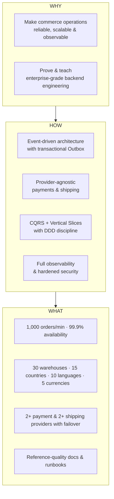
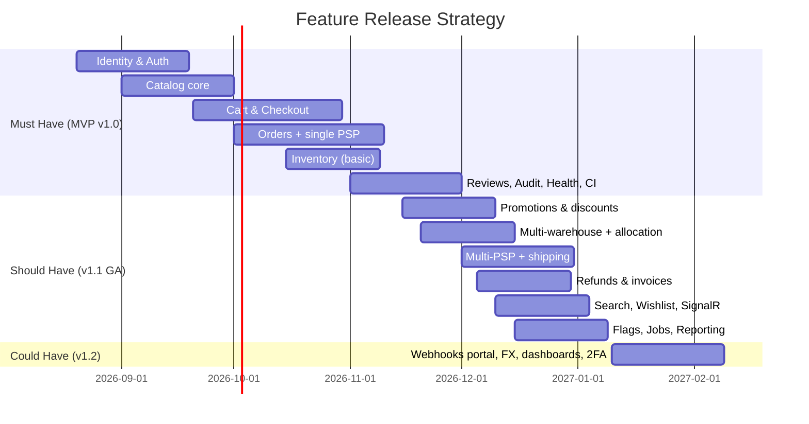

# Document 01a — Product Vision Document

> **Platform:** E-Commerce Platform (Working Title: `ECommerce`)
> **Document Type:** Vision & Scope (Business/Product Baseline)
> **Status:** Draft v1.0 for review
> **Audience:** Executive Sponsors, Product, Engineering, Architecture Review Board, Sales/Partners (integration), QA, Security
> **Supersedes:** n/a (complements `01-project-charter.md`)

---

## 1. Document Control

### 1.1 Version History

| Version | Date       | Author / Owner | Change Summary                                        |
|---------|------------|----------------|--------------------------------------------------------|
| 0.1     | 2026-07-10 | Product Owner  | Initial vision draft                                   |
| 0.2     | 2026-07-20 | Product Owner  | Personas, market context, competitive analysis         |
| 0.3     | 2026-07-28 | Enterprise Architect | Capability roadmap, MoSCoW, success metrics       |
| 1.0     | 2026-07-31 | Product Owner  | Baseline release for stakeholder alignment             |

### 1.2 Approvals

| Role                | Name | Decision | Date | Signature |
|----------------------|------|----------|------|-----------|
| Executive Sponsor    | —    | Pending  | —    | —         |
| Product Owner        | —    | Pending  | —    | —         |
| Enterprise Architect | —    | Pending  | —    | —         |
| Technical Lead       | —    | Pending  | —    | —         |

---

## 2. Executive Summary

`ECommerce` is a **cloud-native, event-driven, enterprise-grade commerce backend** designed from first principles to operate at the scale of large retailers: **5 million customers, 300,000 products, 30 warehouses, 15 countries, 10 languages, 5 currencies**, and a sustained **1,000 orders per minute** with **99.9% availability**.

The product deliberately excludes the storefront and instead delivers the **complete commerce backbone** — catalog, cart, checkout, orders, pricing and promotions, multi-provider payments and shipping, multi-warehouse inventory, finance, notifications, reviews, analytics, audit, feature flags, background jobs, and integration APIs — engineered with production-grade practices (DDD, CQRS, Event Sourcing–style eventing via Outbox, full observability, hardened security, and a layered test strategy).

It serves three strategic audiences simultaneously:

1. **A production-ready commerce backend** for retailers/teams that want a resilient, provider-agnostic commerce engine.
2. **An enterprise architecture & system-design reference** demonstrating how large-scale commerce is actually built.
3. **A backend engineering learning system** covering the modern ASP.NET Core ecosystem end-to-end.

This document defines the **vision, target users, needs, value proposition, scope decisions, phased capability roadmap, and business success metrics** that guide every downstream product and engineering artifact.

---

## 3. Product Vision Statement

> **For** retailers and engineering teams operating commerce at national and international scale,
> **who** need a reliable, fast, secure, and extensible commerce engine without building it in-house,
> **the** `ECommerce` platform
> **is a** cloud-native commerce backend
> **that** handles catalog, cart, checkout, order orchestration, multi-warehouse inventory, discounting, multi-provider payments/shipping, finance, notifications, analytics, and integrations as production-grade, independently evolvable capabilities,
> **unlike** typical CRUD store projects or monolithic commerce suites,
> **our product** guarantees transactional integrity, horizontal scalability, provider failover, real-time operations, and out-of-the-box observability — plus a complete, interview-grade engineering reference.

### 3.1 Vision in One Line

> **"A production-grade, event-driven commerce backbone that scales, observes, and integrates — without ever touching a browser tab."**

---

## 4. Vision Hierarchy (Strategy Map)



---

## 5. Target Market & Market Context

### 5.1 Market Segments

| Segment | Description | Needs Emphasized |
|---------|-------------|------------------|
| Direct-to-Consumer (DTC) retailers | Brands selling through their own channels | Multi-country checkout, currencies, payments, returns |
| Marketplace operators | Multi-vendor or multi-supplier operations | Warehouse/inventory management, reconciliation, reporting |
| Wholesale / B2B | Bulk ordering, account pricing | Promotions, order management, finance feeds |
| Engineering teams building commerce | Reference/learning audience | Architecture quality, documentation, best practices |

### 5.2 Market Context & Trends (2026)

| Trend | Implication for the Product |
|-------|------------------------------|
| Checkout latency is a conversion lever | Sub-second p95 API latency, Redis-backed reads, async boundaries |
| Payment provider diversity and regional PSPs | Provider abstraction + failover is a first-class feature |
| Subscription to composable commerce | Backend-as-capabilities; integrations via events and webhooks |
| Observability as a compliance requirement | Traces, metrics, structured logs by default |
| Security/PCI pressure on retailers | Tokenization, out-of-scope card data, audit trails |
| AI-assisted operations | Data/API surfaces ready for future ML hooks (flagged) |

### 5.3 Competitive Landscape

| Player | Model | Strength | Gap vs. `ECommerce` |
|--------|-------|----------|----------------------|
| Shopify / BigCommerce | SaaS storefront + backend | Ease of use, ecosystem | Closed logic; limited reference value; lock-in |
| Stripe (payments) | Payments only | Payments depth | Not a commerce engine |
| SAP Commerce / Oracle Commerce | Enterprise suite | B2B depth | Heavyweight, costly, proprietary |
| Spree / Medusa / open-source engines | Open-source commerce | Customizable | Varying maturity; often storefront-coupled |
| `ECommerce` (this product) | Backend-only, event-driven, reference-grade | Provider abstraction, outbox consistency, observability, docs | No storefront (by design) |

### 5.4 Differentiation

1. **Backend-first, storefront-agnostic** — any client can consume the API.
2. **Event-driven with transactional Outbox** — business-critical events never lost.
3. **Provider abstraction as a core feature** — payments and shipping are adapter-based with failover.
4. **Observability and security as a baseline**, not an afterthought.
5. **Complete documentation + ADRs** — the product is also the reference.

---

## 6. Target Users & Personas

### 6.1 Persona Summary

| Persona | Segment | Goal (JTBD) | Success Metric |
|---------|---------|-------------|----------------|
| **Guest Shopper** | DTC | Place an order without friction | Cart-to-checkout completion, no forced account |
| **Registered Customer** | DTC | Reorder quickly, track orders, write reviews | Repeat order rate, review completion |
| **Admin (Store Ops)** | Retailer ops | Manage catalog, prices, promotions, orders | Bulk operation efficiency, catalog change time |
| **Warehouse Employee** | Fulfillment | Process orders, manage stock, ship | Fulfillment cycle time, stock accuracy |
| **Finance Team** | Finance | Reconcile payments, refunds, invoices, tax | Reconciliation drift = 0, report generation time |
| **Customer Support** | Service | Resolve order/payment/refund issues fast | First-contact resolution, order timeline clarity |
| **Super Admin** | Platform ops | Governance: roles, flags, audit, integrations | Audit coverage, permission audit time |
| **Engineer (Reference User)** | Dev | Learn and reuse enterprise patterns | Document completeness, onboarding time |

### 6.2 Persona Detail — Registered Customer (primary persona)

| Attribute | Value |
|-----------|-------|
| Profile | 28–55, omnichannel shopper, mobile-first |
| Goals | Fast checkout, reliable tracking, easy returns/refunds, fair promotions |
| Pains | Abandoned carts, stale inventory, payment failures, no order visibility |
| Context | Shops across 2+ countries; expects local currency and language |
| Needs from this product | Consistent sub-second API responses; accurate inventory; real-time order status; multi-currency pricing |

### 6.3 Persona Detail — Warehouse Employee (primary operational persona)

| Attribute | Value |
|-----------|-------|
| Profile | Distribution-center operative using desktop/mobile terminals |
| Goals | Clear fulfillment queue, accurate pick lists, fast shipment creation, low-stock visibility |
| Pains | Manual status updates, stock mismatches, untracked shipments |
| Context | Works across 30 warehouses; receives real-time signals |
| Needs from this product | SignalR live queues; warehouse-scoped stock operations; provider-integrated labels/tracking |

---

## 7. User Needs & Pain Points

| Persona | Critical Need | Current Pain | Our Solution Promise |
|---------|---------------|--------------|-----------------------|
| Customer | Fast, correct checkout | Abandonment on slow/erroring checkout | CQRS reads, cached catalog, async boundaries |
| Customer | Trustworthy stock info | Overselling / stale stock | Multi-warehouse allocation + reservations |
| Customer | Order visibility | "Where is my order?" | Real-time status + SignalR push + email/SMS |
| Admin | Bulk, safe catalog changes | Manual, risky edits | Versioned APIs, audit log, validation pipelines |
| Warehouse | Live fulfillment queues | Polling/reloading | SignalR live queues + Hangfire task generation |
| Finance | Clean reconciliation | Payment/order mismatches | Provider webhooks + idempotency + reconciliation job |
| Support | Fast dispute handling | Scattered state | Unified order timeline + refund workflow |
| Super Admin | Governance | No audit/flag control | Audit log + feature flags + RBAC matrix |
| Engineers | Learnable reference | Poorly documented architecture | 36-doc set + ADRs + runbooks |

---

## 8. Value Proposition

| Stakeholder | Value Delivered |
|-------------|-----------------|
| Retailer / Business | One backend for catalog→checkout→fulfillment→finance; provider-agnostic; scales on demand; 99.9% availability |
| Engineering Organization | Maintainable slices, enforced architecture (tests), fast onboarding, observability built in |
| Security / Compliance | RBAC, audit trail, tokenization, problem-details errors, no card data in scope |
| Operations / SRE | Health checks, Prometheus/Grafana dashboards, structured logs, runbooks, HA topology |
| Developer (portfolio/interview) | A demonstrable, documented, tested reference system |

---

## 9. Business Objectives & Strategic Alignment

| Objective (from Charter §4) | Vision Contribution | Owner |
|------------------------------|----------------------|-------|
| O1 Production-ready backend | Scope defined here feeds `04-functional-requirements.md` | PO |
| O2 Architecture reference | Capability roadmap aligned with architecture docs | Architect |
| O3 Scale readiness | Load profile target in §11 KPIs | Tech Lead |
| O4 Data consistency | Eventing + outbox approach is a vision-level commitment | Architect |
| O5 Engineering quality | Quality gates derived from §8 value promise | Tech Lead |
| O6 Multi-provider commerce | Provider abstraction is core scope (§10) | Architect |
| O7 Learning/reference asset | Documentation set is a deliverable | PO |

---

## 10. Product Scope — Capability Summary

### 10.1 Capability Map (must-have baseline)

```mermaid
flowchart LR
    subgraph Commerce["Commerce Core"]
        A1[Catalog & Search]
        A2[Cart & Wishlist]
        A3[Checkout & Orders]
        A4[Pricing, Discounts & Promotions]
        A5[Payments]
        A6[Shipping & Fulfillment]
    end
    subgraph Support["Supporting Capabilities"]
        B1[Identity & Access]
        B2[Inventory & Warehouses]
        B3[Finance & Invoices]
        B4[Notifications]
        B5[Reviews & Ratings]
    end
    subgraph Platform["Platform Services"]
        C1[Analytics & Reporting]
        C2[Audit Logs]
        C3[Feature Flags]
        C4[Background Jobs]
        C5[Integrations & Webhooks]
        C6[Real-time (SignalR)]
    end
    A1 --> A2 --> A3
    A3 --> A5
    A3 --> A6
    A4 --> A3
    B2 --> A3
    B3 --> A5
    A3 -.events.-> B4
    A3 -.events.-> C1
    A3 -.events.-> C2
    C4 --> B4
```

### 10.2 Capability Summary Table

| # | Capability | Scope Summary | Detail Doc |
|---|-----------|----------------|------------|
| 1 | Identity & Access | Registration, login, refresh tokens, roles/permissions, lockout | `10, 11` |
| 2 | Catalog & Search | Products, variants, categories, brands, attributes, i18n, multi-currency pricing | `12` |
| 3 | Cart & Wishlist | Anonymous/authenticated, merge, expiry, price snapshots | `13` |
| 4 | Checkout & Orders | Addresses, shipping selection, order placement, lifecycle, cancellation | `14` |
| 5 | Pricing, Discounts & Promotions | Rule-based discounts, promotions, coupons, stacking rules | `15` |
| 6 | Inventory & Warehouses | Multi-warehouse stock, allocation, reservations, transfers, ledger | `16` |
| 7 | Payments | Multi-PSP abstraction, intents, webhooks, idempotency, refunds | `17` |
| 8 | Shipping & Fulfillment | Multi-carrier rates, labels, tracking, warehouse tasks | `18` |
| 9 | Finance | Invoices, credit notes, refunds, tax hooks, reconciliation feed | `19` |
| 10 | Notifications | Email/SMS/in-app templates, channels, preferences | `20` |
| 11 | Reviews & Ratings | Verified-purchase reviews, moderation, rating aggregation | `21` |
| 12 | Analytics & Reporting | Sales/product/inventory/finance reporting + exports | `22` |
| 13 | Platform Services | Audit, flags, jobs, webhooks, rate limiting, health, problem details | `23–29` |

---

## 11. Scope Decisions — MoSCoW & Release Strategy

### 11.1 MoSCoW Classification

| Priority | Capabilities |
|----------|--------------|
| **Must Have (v1.0 MVP)** | Identity/Auth (JWT+refresh), Catalog, Cart, Checkout & Orders, single PSP integration, Inventory (single/limited warehouses), Basic notifications (email), Reviews, Audit Logs, Health Checks, CI/CD, Unit/Integration/Architecture tests, Observability baseline |
| **Should Have (v1.1 GA)** | Discount & Promotion Engine, Multi-warehouse + stock allocation, Multi-PSP + failover, Shipping providers, Refunds & Invoices, Search, Wishlist, SignalR real-time, Feature Flags, Background Jobs, Reporting |
| **Could Have (v1.2 Scale/Enterprise)** | Webhook/integration portal, Analytics dashboards, 2FA, Impersonation, Admin bulk ops, Multi-currency FX engine full support, Advanced reporting exports |
| **Won't Have (v1)** | Storefront UI, ML recommendations, multi-tenant SaaS isolation, native mobile apps, self-built PSP |

### 11.2 Release Strategy



### 11.3 Release Exit Criteria

| Release | Exit Criteria |
|---------|---------------|
| v1.0 MVP | Checkout-to-order happy path E2E green; 1 PSP sandbox; CI green; unit+integration+architecture coverage; observability wired |
| v1.1 GA | Full commercial flows: promotions, multi-warehouse, refunds, invoices, 2+ PSPs, shipping, SignalR; load test at scale |
| v1.2 Enterprise | Integration portal, FX, dashboards, 2FA; hardening; full docs + runbooks approved |

---

## 12. Success Metrics (Product KPIs)

| KPI | Target | Measurement |
|-----|--------|-------------|
| Checkout p95 latency | ≤ 1.5 s | Trace duration percentiles |
| Peak order ingestion | ≥ 1,000 orders/min | Load test + prod metrics |
| API availability | ≥ 99.9% | Prometheus up + probes |
| Event delivery p99 | ≤ 2 s | Outbox lag metric |
| Cache hit ratio | ≥ 90% | Redis metrics |
| Refund/payment reconciliation drift | 0 undetected | Reconciliation job |
| Test coverage | ≥ 80% branch | Coverage report in CI |
| Documentation coverage | 100% of roadmap | Docs index CI check |

---

## 13. Assumptions & Constraints (Product-Level)

| Assumption / Constraint | Impact |
|-------------------------|--------|
| No storefront in scope | API contract stability is paramount; versioning mandatory |
| Single-tenant-per-deployment | Multi-tenancy flagged for future; isolation documented |
| PSP/Shipping adapters ≥ 2 each | Failover is demonstrable and real |
| Cloud deployment assumed | All infra containerized and IaC-ready |
| Card data out of scope (tokenized) | PCI scope minimized by design |
| Currency conversion via FX feed | Consistent rates; integration contract |
| Backend-first timeline | UI teams can build concurrently against OpenAPI |

---

## 14. Risks (Business Perspective)

| # | Risk | Likelihood | Impact | Mitigation |
|---|------|-----------|--------|------------|
| B1 | "Everything" scope dilutes quality | High | High | MoSCoW gates; roadmap freeze at milestones |
| B2 | API churn breaks consumers | Medium | High | Versioning from day one; deprecation policy |
| B3 | Provider-dependent flows degrade | Medium | Medium | Adapters + failover; contract tests |
| B4 | Reference value eroded by stale docs | Medium | Medium | Docs-as-code; CI link checks; ADR discipline |
| B5 | Performance targets miss | Medium | High | Early load spikes (M3), capacity model |

---

## 15. Positioning & Messaging

### 15.1 Positioning Statement

> `ECommerce` is the commerce backend that ships the enterprise patterns teams wish they had: event-driven consistency via Outbox, provider-agnostic payments and shipping with automatic failover, CQRS and DDD discipline across vertical slices, and observability that makes production a solved problem — documented, tested, and ready to learn from.

### 15.2 Key Messages by Audience

| Audience | Message |
|----------|---------|
| Business sponsors | Scale without rewrites; resilience without vendor lock-in |
| Engineers | Every modern ASP.NET Core pattern, done correctly, with proof (tests) |
| Security | Hardened by design: RBAC, audit, tokenization, no card data |
| SRE / Ops | Health checks, dashboards, runbooks, HA topology |
| Learners / interviewees | A complete, reference-quality system you can study and run locally |

---

## 16. Glossary (Vision-Level)

| Term | Definition |
|------|-----------|
| JTBD | Jobs-To-Be-Done — the job a user hires the product to do |
| MoSCoW | Prioritization: Must / Should / Could / Won't |
| MVP | Minimum Viable Product (v1.0 scope above) |
| GA | General Availability (v1.1 scope above) |
| PSP | Payment Service Provider |
| Outbox | Transactional event persistence guaranteeing at-least-once delivery |

---

## 17. Approval & Sign-off

| Role | Name | Decision | Date | Notes |
|------|------|----------|------|-------|
| Executive Sponsor | — | — | — | — |
| Product Owner | — | — | — | — |
| Enterprise Architect | — | — | — | — |
| Technical Lead | — | — | — | — |

---

*End of Document 01a — Product Vision Document.*
*Next document on request: `02-glossary-and-definitions.md`.*
