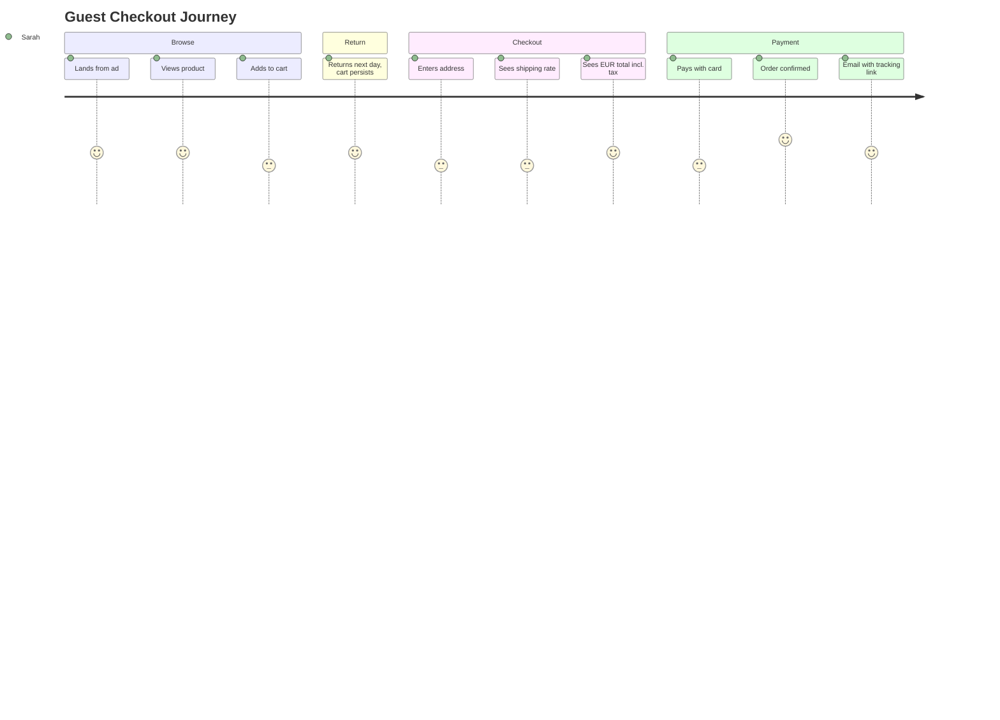

# Document 02a — User Personas (Complete Reference)

> **Platform:** E-Commerce Platform (Working Title: `ECommerce`)
> **Document Type:** UX / Product Research Artifact
> **Status:** Draft v1.0 for review
> **Audience:** Product, UX, Engineering, QA, Finance, Warehouse Ops, Support, Architecture
> **Inputs:** `01a-product-vision.md` (§6), stakeholder workshops
> **Relationship:** Expands Vision §6. Personas are referenced throughout BRD (`03`) and FRS (`04a`) as acceptance anchors.

---

## 1. Document Control

| Version | Date       | Author / Owner | Change Summary                            |
|---------|------------|----------------|--------------------------------------------|
| 0.1     | 2026-07-12 | Product Owner  | Interview/workshop synthesis               |
| 0.2     | 2026-07-25 | Product Owner  | Journey maps, JTBD, requirement mapping    |
| 1.0     | 2026-07-31 | Product Owner  | Baseline release                          |

### 1.1 Approvals

| Role                | Name | Decision | Date |
|----------------------|------|----------|------|
| Product Owner        | —    | —        | —    |
| UX Lead              | —    | —        | —    |
| Enterprise Architect | —    | —        | —    |

---

## 2. Methodology

Personas were derived from:

1. **Stakeholder workshops** (Merchandising, Warehouse Ops, Finance, Support, Platform).
2. **Domain reference data** from comparable large-scale commerce operations.
3. **Goal-Directed Design**: goals → behaviors → JTBD.
4. **Cross-validation** against BRD requirement owners.

Each persona records: narrative, demographics, goals (JTBD), pains, motivations, key scenarios, success metrics, and the platform requirements they anchor. Personas are **role-based archetypes**, not real individuals.

### Persona Utilization Rules

| Artifact | Persona Input |
|----------|---------------|
| BRD acceptance criteria | "The requirement is met when Persona X can …" |
| Use-case actors | Persona names used as primary actors |
| Test scenarios | E2E scenarios written in persona voice |
| UX/admin UX copy | Tone matched to persona needs |

---

## 3. Persona Overview Matrix

| # | Persona | Role | Primary Goals | Key Platform Needs |
|---|---------|------|---------------|--------------------|
| P1 | Sarah Mitchell | Guest Shopper | Buy quickly, no account | Anonymous cart, guest checkout, email order link |
| P2 | Ahmed Hassan | Registered Customer | Fast reorder, track, review | Order history, tracking, wishlist, multi-currency |
| P3 | Elena Petrova | Admin / Merchandiser | Manage catalog & campaigns | Bulk ops, promotions, audit, search |
| P4 | Marcus Webb | Warehouse Employee | Process orders fast & accurately | Live queue, pick lists, shipments, stock |
| P5 | Priya Sharma | Finance Analyst | Reconcile & report | Invoices, refunds, reconciliation feed, reports |
| P6 | Diego Ramírez | Customer Support | Resolve fast | Order timeline, refunds, lookups, moderation |
| P7 | Ingrid Larsen | Super Admin | Govern platform | RBAC, flags, audit, impersonation, webhooks |
| P8 | Yusuf Al-Amin | Integration Developer | Integrate partners | OpenAPI, webhooks, sandbox, rate limits |

---

## 4. Detailed Personas

---

### 4.1 P1 — Sarah Mitchell (Guest Shopper)

> *"I'm not creating an account just to buy a t-shirt. If checkout takes more than a minute, I'm gone."*

| Attribute | Detail |
|-----------|--------|
| Age | 29 |
| Occupation | Marketing coordinator |
| Location | Manchester, UK (shops cross-border in EU) |
| Digital proficiency | High (mobile-first) |
| Devices | Smartphone (primary), laptop |
| Frequency | 1–3 orders/month |
| Avg order | €45–€90 |

**Context**
Sarah browses via social ads and comparison sites. She rarely remembers accounts and abandons carts when forced to register or when checkout is slow. She shops in GBP or EUR depending on the site's currency toggle.

**Goals (JTBD)**

| JTBD | Outcome |
|------|---------|
| "When I want something, help me buy it without friction" | Checkout completed in under 90 seconds |
| "When I'm unsure, let me leave and come back" | Cart persists on same device |
| "When I pay, tell me the real total" | Transparent currency, tax, shipping |

**Pain Points**
- Forced registration at checkout.
- Currency confusion (unknown conversion).
- Stock showing available at browse but sold out at checkout.
- Payment declined with no alternative.

**Key Scenario — Quick Guest Checkout**
1. Sees product in ad → lands on product page (p95 ≤ 150 ms).
2. Adds to cart (no account).
3. Returns next day — cart still present (TTL 30 days).
4. Checkout: address, shipping rate quoted, sees totals in EUR.
5. Pays with card → order confirmed, confirmation email links to tracking.
6. Signs up later via "claim your order" — order auto-links (BR-1401, FRS-A-001).

**Success Metrics**
- Guest-to-paid conversion ≥ baseline.
- Cart abandonment reduced.
- Checkout p95 ≤ 1.5 s (NFR-PERF-01).

**Requirement Anchors**
BR-1301, BR-1303, BR-1401, BR-1406, BR-2404, FRS-C-001, FRS-D-001, FRS-D-002.

---

### 4.2 P2 — Ahmed Hassan (Registered Customer)

> *"My basket should be there when I log in. And when my order ships, I want to know the moment it does."*

| Attribute | Detail |
|-----------|--------|
| Age | 34 |
| Occupation | Product designer |
| Location | Dubai, UAE (travels/orders to 2 countries) |
| Digital proficiency | High |
| Devices | Laptop, tablet |
| Frequency | 2–5 orders/month |
| Avg order | AED 250–600 |

**Context**
Ahmed keeps a wishlist, reorders consumables monthly, and writes reviews for verified purchases. He switches between AED and USD and expects the site to remember his language (Arabic/English).

**Goals (JTBD)**

| JTBD | Outcome |
|------|---------|
| "When I return, put my world back" | Merged cart + wishlist on login |
| "When I run out, reorder in two taps" | Reorder flow (BR-1409) |
| "When I buy, tell me it's real" | Verified-purchase review badge |
| "When it ships, push me the update" | Real-time tracking (SignalR + email) |

**Pain Points**
- Cart lost between devices.
- Price changed between cart and checkout without notice.
- Reviews from non-buyers drowning real feedback.
- No clear return/refund status.

**Key Scenario — Reorder & Track**
1. Logs in → cart merged from guest session (FRS-C-002).
2. Hits "Reorder" on last month's order (BR-1409) → new draft, price revalidated.
3. Applies stored address → checks out with saved card token.
4. Order placed → SignalR pushes status Paid → Picking → Shipped.
5. Reviews product after delivery → gets "Verified Purchase" badge.

**Success Metrics**
- Repeat order rate, review completion rate.
- p95 order-history read ≤ 200 ms (NFR-PERF-06).

**Requirement Anchors**
BR-1302, BR-1306, BR-1407, BR-1409, BR-2101, BR-2001, FRS-C-002, FRS-D-005, FRS-N-001.

---

### 4.3 P3 — Elena Petrova (Admin / Merchandiser)

> *"I manage 300k products and 40 active campaigns. Every catalog change must be safe, fast, and traceable."*

| Attribute | Detail |
|-----------|--------|
| Age | 41 |
| Occupation | Catalog & merchandising manager |
| Location | Warsaw, Poland (store HQ) |
| Digital proficiency | Intermediate–High (desktop power user) |
| Devices | Desktop (primary), laptop |
| Frequency | Daily operations |

**Context**
Elena owns product data quality, pricing, and promotion calendar. She runs seasonal campaigns across 15 countries and needs bulk tooling, scheduling, and a trustworthy audit trail. Any mistake risks pricing errors at scale.

**Goals (JTBD)**

| JTBD | Outcome |
|------|---------|
| "When I update 5,000 SKUs, let me do it in one go" | Bulk import with per-row errors |
| "When I launch a campaign, schedule it" | Time-based activation + pause |
| "When I fix a price, log it" | Full audit of who/when/what |
| "When a SKU dies, hide it everywhere" | Deactivate once, invisible everywhere |

**Pain Points**
- No bulk editing → repetitive manual work.
- Promotions clashing (double discounts) with no stacking control.
- No visibility of who changed a price.
- Slow search across a large catalog.

**Key Scenario — Campaign Launch**
1. Uploads price CSV for 5,000 SKUs → import job runs; error report lists 12 rows (BR-1207, FRS-B-007).
2. Creates "Spring Sale": product % off + free-shipping coupon, country-scoped, stacked per matrix (BR-1702, FRS-E-002).
3. Schedules start Friday 00:00 UTC, sets end + kill-switch (BR-1709, FRS-E-008).
4. Pauses campaign on customer complaint → immediate effect (NFR-OPS-02).
5. Audits all changes (FRS-M-001).

**Success Metrics**
- Time-to-launch campaign < 1 day.
- Zero unauthorized catalog changes (audit).
- Promotion overspend prevented (stacking caps).

**Requirement Anchors**
BR-1201, BR-1207, BR-1701–1704, BR-1709, BR-2301, FRS-B-007, FRS-E-001/002/008, FRS-M-001.

---

### 4.4 P4 — Marcus Webb (Warehouse Employee)

> *"Give me my next pick list the second the payment clears. I don't have time to refresh a screen all day."*

| Attribute | Detail |
|-----------|--------|
| Age | 37 |
| Occupation | Warehouse picker/team lead |
| Location | Rotterdam, NL (one of 30 warehouses) |
| Digital proficiency | Moderate (handheld terminal / mobile web) |
| Devices | Handheld terminal, mobile |
| Frequency | Shift-based (8 h) |

**Context**
Marcus works on a moving line with 3 other pickers. Orders arrive continuously; accuracy and speed are measured. He needs minimal-tap flows, clear pick lists, and instant visibility of stock anomalies.

**Goals (JTBD)**

| JTBD | Outcome |
|------|---------|
| "When a payment clears, give me the order" | Live queue push < 5 s |
| "When I pick, tell me exactly what/where" | Zone-grouped pick list with bins |
| "When stock is short, tell me now" | Real-time low-stock alerts |
| "When I ship, make the label" | One-tap carrier label creation |

**Pain Points**
- Stale stock counts → picking dead items.
- Manual status updates.
- Untracked shipments.
- Silent stock-out surprises at shift start.

**Key Scenario — Fulfillment Shift**
1. Shift starts → sees live queue of 140 paid orders per warehouse (FRS-H-003).
2. Opens first pick list — grouped by zone, barcode-ready (BR-1502, FRS-H-004).
3. Scans each item; a bin mismatch blocks pick (edge case, FRS-H §11.2).
4. Marks packed → system creates shipment + tracking automatically (BR-1504, FRS-H-005).
5. Receives low-stock alert on 3 SKUs mid-shift → triggers reorder (BR-1806).
6. Reports a stock discrepancy → adjustment with reason + approval (BR-1807).

**Success Metrics**
- Orders picked/hour; on-time shipment rate.
- Stock accuracy (cycle counts match ledger).
- Queue push latency < 5 s (NFR-PERF-10).

**Requirement Anchors**
BR-1501–1505, BR-1806, BR-1807, FRS-H-003/004/005, FRS-F-007, FRS-N-002.

---

### 4.5 P5 — Priya Sharma (Finance Analyst)

> *"Reconciliation should be a report I run, not a mystery I chase. If payments and orders disagree, I find out automatically."*

| Attribute | Detail |
|-----------|--------|
| Age | 45 |
| Occupation | Senior finance analyst |
| Location | Bangalore, India (finance shared services) |
| Digital proficiency | Intermediate (desktop, spreadsheet-centric) |
| Devices | Desktop |
| Frequency | Daily + month-end |

**Context**
Priya owns invoicing, refunds oversight, and monthly GL feeds across 5 currencies and 15 countries. She trusts numbers only if traceable to source events. Anything unreconciled becomes her headache.

**Goals (JTBD)**

| JTBD | Outcome |
|------|---------|
| "When money moves, trace it end-to-end" | Payment → order → invoice → refund lineage |
| "When refunds happen, approve by policy" | Refund workflow with approval + audit |
| "When day ends, know we match" | Nightly reconciliation with drift flags |
| "When month ends, export the GL" | Finance reports + exports (BR-2206) |

**Pain Points**
- Manual matching of PSP statements to orders.
- Unapproved refunds slipping through.
- Multi-currency totals without FX provenance.
- Export jobs timing out on large data.

**Key Scenario — Month-End Close**
1. Runs reconciliation — one drift flagged; one order shows captured but not invoiced (BR-1909, FRS-G-009).
2. Drills into lineage: webhook received, invoice job failed, retried — evidence visible (FRS-I-005).
3. Approves 6 pending refunds over threshold (BR-1608, FRS-I-004).
4. Exports finance report asynchronously; gets download link (BR-2207, FRS-L-007).
5. GL feed totals reconcile with 0 undetected drift (NFR-CNS-03).

**Success Metrics**
- Reconciliation drift = 0 undetected.
- Month-end close time reduced.
- 100% refunds policy-approved.

**Requirement Anchors**
BR-1909, BR-1608, BR-2206, BR-2207, BR-2303, FRS-G-009, FRS-I-004/005, FRS-L-006/007.

---

### 4.6 P6 — Diego Ramírez (Customer Support)

> *"Give me one screen with the full order timeline. I should resolve disputes without guessing which system is right."*

| Attribute | Detail |
|-----------|--------|
| Age | 31 |
| Occupation | Customer support specialist |
| Location | Mexico City, MX (support hub) |
| Digital proficiency | Intermediate |
| Devices | Desktop (support console) |
| Frequency | Shift-based; 25–40 tickets/day |

**Context**
Diego handles order, payment, and refund disputes. Customers are frustrated when contacting support; his success depends on fast lookup and clear order state. He needs permission-scoped views, not full admin power.

**Goals (JTBD)**

| JTBD | Outcome |
|------|---------|
| "When a customer calls, find their order fast" | Lookup by number/email/customer |
| "When they dispute, show the timeline" | Unified order + payment + refund timeline |
| "When a refund is due, start it" | Refund initiation per policy |
| "When a review is abusive, pull it" | Moderation + removal with audit |

**Pain Points**
- Order state unclear across systems.
- Can't see payment/refund status together.
- No ability to correct address before shipment.
- Slow moderation queue.

**Key Scenario — Dispute Resolution**
1. Customer calls about a charged but unshipped order → lookup by order number (BR-1412, FRS-D-008).
2. Timeline shows Paid → Picking, carrier label retry pending (BR-1507).
3. Escalates to warehouse queue with priority note.
4. Customer requests refund instead → initiates refund, flagged for approval (BR-1608, FRS-I-004).
5. Flags an abusive review on the same product → moderation queue → removal (BR-2104, FRS-K-004).

**Success Metrics**
- First-contact resolution rate.
- Average handle time.
- Refund turnaround.

**Requirement Anchors**
BR-1412, BR-1507, BR-1608, BR-2104, FRS-D-008, FRS-H-007, FRS-I-004, FRS-K-004.

---

### 4.7 P7 — Ingrid Larsen (Super Admin)

> *"I don't run the store. I make sure the people who do can only do what they're allowed to — and that I can prove it later."*

| Attribute | Detail |
|-----------|--------|
| Age | 48 |
| Occupation | Platform operations director |
| Location | Copenhagen, Denmark |
| Digital proficiency | High |
| Devices | Desktop |
| Frequency | Occasional (governance) |

**Context**
Ingrid governs roles, permissions, feature flags, and integrations. She rarely performs store operations but must control who can, and must be able to answer "who changed what, when" with confidence.

**Goals (JTBD)**

| JTBD | Outcome |
|------|---------|
| "When someone needs access, grant exactly that" | Fine-grained RBAC + permission matrix |
| "When a feature misbehaves, kill it" | Feature-flag kill-switch in 60 s |
| "When asked 'who did this', answer fast" | Tamper-evident audit search |
| "When integrating, approve the partner" | Webhook/API credential management |

**Pain Points**
- Role sprawl / over-privileged accounts.
- No audit trail to prove actions.
- Flag changes without tracking.
- Partners without documented access lifecycle.

**Key Scenario — Governance Audit**
1. Auditor asks: "Who changed the Spring Sale pricing?" → audit query returns actor, time, before/after JSON, hash chain verified (FRS-M-001).
2. Revokes a departed employee's roles — change itself audited (BR-1107, FRS-A-007).
3. Pauses a flagged payment integration globally (kill-switch) within 60 s (BR-2302, NFR-OPS-02).
4. Reviews impersonation logs from a support exercise (BR-1110).
5. Onboards a new partner webhook with scoped credentials + rate limit (BR-2304).

**Success Metrics**
- 100% audit coverage for protected operations.
- Flag rollback ≤ 60 s.
- Permission audit time < 10 min.

**Requirement Anchors**
BR-1107, BR-1110, BR-2301, BR-2302, BR-2304, BR-2305, FRS-A-007/009, FRS-M-001/002/004/005.

---

### 4.8 P8 — Yusuf Al-Amin (Integration Developer)

> *"Give me OpenAPI, a sandbox, and signed webhooks with replay. I can do the rest without calling anyone."*

| Attribute | Detail |
|-----------|--------|
| Age | 33 |
| Occupation | Integration developer (partner company) |
| Location | Amman, Jordan (remote) |
| Digital proficiency | Very high |
| Devices | Laptop, CI runners |
| Frequency | Project-based |

**Context**
Yusuf builds an ERP adapter against the platform. He is not a user of the store; he consumes the public API and webhooks programmatically. His success = stable contracts, good sandbox, and observability of deliveries.

**Goals (JTBD)**

| JTBD | Outcome |
|------|---------|
| "When I integrate, use the spec" | OpenAPI 3.x + versioned endpoints |
| "When I test, use a sandbox" | Isolated environment with synthetic data |
| "When events fire, receive them reliably" | Signed webhooks, retries, replay endpoint |
| "When I break limits, know why" | Rate-limit headers + Problem Details |

**Pain Points**
- Undocumented breaking changes.
- Unsigned / lossy webhooks.
- Ambiguous error bodies.
- No way to replay missed events.

**Key Scenario — ERP Integration**
1. Pulls OpenAPI spec at versioned URL (BR-2305, FRS-M-007).
2. Tests in sandbox: creates products via bulk import, receives `OrderPlaced` webhook signed with HMAC (BR-2304, FRS-M-004).
3. Hits rate limit → 429 with `Retry-After` + headers (FRS-M-005).
4. Loses a webhook during maintenance → replays from `?after=eventId` endpoint.
5. Promotes to production with scoped credentials (FRS-A-006).

**Success Metrics**
- Integration build time ≤ 5 days.
- Webhook delivery success ≥ 99.9%.
- Zero ambiguity on error contracts.

**Requirement Anchors**
BR-2304, BR-2305, BR-1308(webhooks), FRS-M-004/005/007, FRS-X-001/004/007.

---

## 5. Journey Maps

### 5.1 Journey Map — Sarah (Guest → Paid Order)



### 5.2 Journey Map — Marcus (Fulfillment Shift)

```mermaid
journey
    title Warehouse Fulfillment Journey
    section Start
      Opens live queue: 4: Marcus
      Queue pushed under 5s after payment: 4: Marcus
    section Pick
      Pick list by zone with bins: 5: Marcus
      Barcode scan; mismatch blocked: 3: Marcus
    section Pack & Ship
      Marks packed: 4: Marcus
      Label + tracking auto-created: 5: Marcus
    section Inventory
      Low-stock alert triggers reorder: 4: Marcus
      Adjustment logged with reason: 4: Marcus
```

---

## 6. Persona → Capability → Requirement Map

| Persona | Primary Capabilities | Primary Requirements |
|---------|----------------------|----------------------|
| Sarah (Guest) | Cart, Checkout, Payments | BR-1301, BR-1401, BR-1406 |
| Ahmed (Customer) | Cart, Orders, Notifications, Reviews | BR-1302, BR-1407/1409, BR-2001, BR-2101 |
| Elena (Admin) | Catalog, Promotions, Audit | BR-1207, BR-1702/1709, BR-2301 |
| Marcus (Warehouse) | Fulfillment, Inventory | BR-1501–1505, BR-1806/1807 |
| Priya (Finance) | Finance, Reporting | BR-1909, BR-1608, BR-2206/2207 |
| Diego (Support) | Orders, Refunds, Moderation | BR-1412, BR-1608, BR-2104 |
| Ingrid (SuperAdmin) | RBAC, Flags, Audit, Webhooks | BR-1107, BR-2301–2305 |
| Yusuf (Integration) | API, Webhooks | BR-2304, BR-2305 |

---

## 7. Anti-Personas (Out of Scope)

| Anti-Persona | Why Excluded |
|--------------|--------------|
| Casual blog reader | No content platform scope |
| ML recommendation consumer | Recommendations flagged for future |
| Multi-tenant SaaS tenant | Single-tenant-per-deployment model |
| Dropshipping micro-seller | Scale/enterprise targets only |

---

## 8. Assumptions & Data Sources

| Item | Assumption |
|------|-----------|
| Demographics | Synthesized from typical large-commerce operations; refresh at major milestones |
| Frequency | Order volumes per persona reflect target scale (§9 Charter) |
| Devices | Warehouse uses terminals/mobile; back-office desktop |
| Persona maintenance | Personas reviewed when new research or requirements land |

---

## 9. Approval & Sign-off

| Role | Name | Decision | Date |
|------|------|----------|------|
| Product Owner | — | — | — |
| UX Lead | — | — | — |
| Enterprise Architect | — | — | — |

---

*End of Document 02a — User Personas.*
*Next document on request: `02-glossary-and-definitions.md`.*
