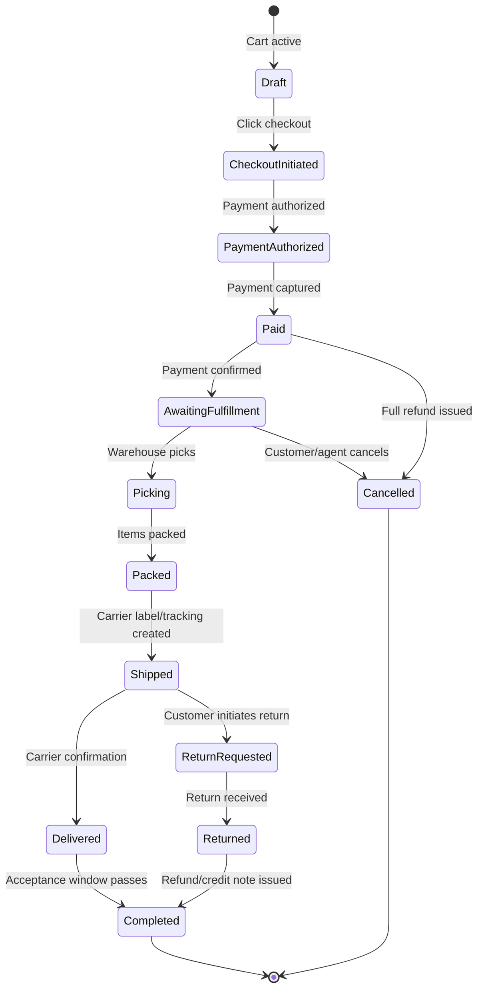
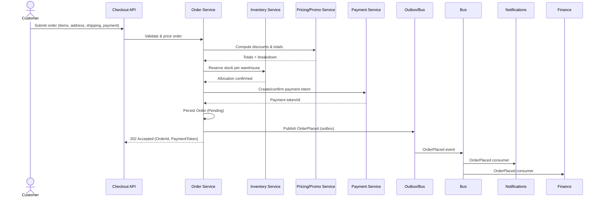
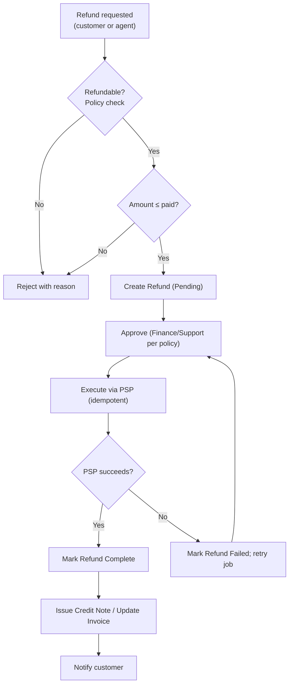
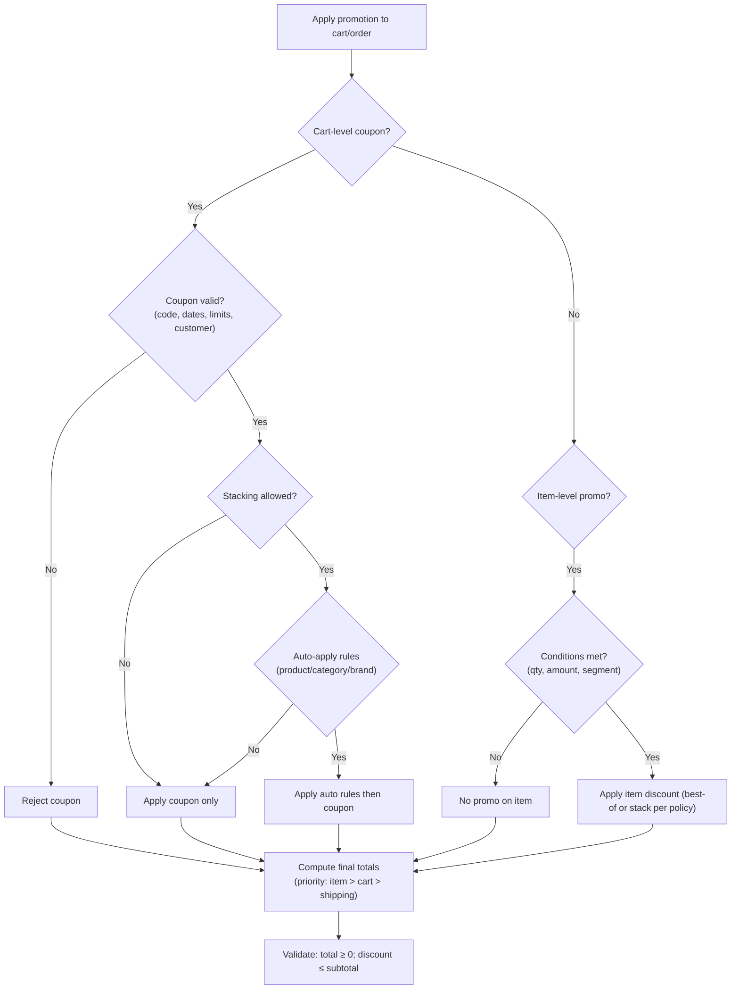
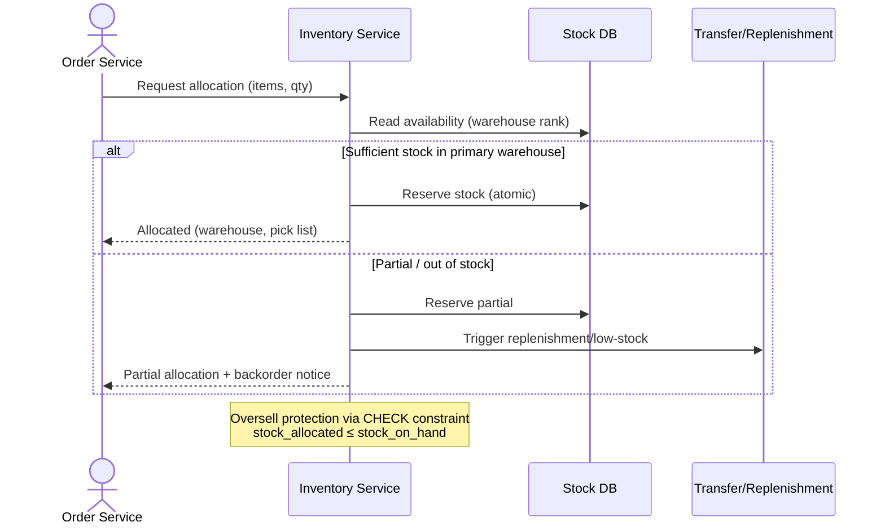

# Document 03 — Business Requirements Document (BRD)

> **Platform:** E-Commerce Platform (Working Title: `ECommerce`)
> **Document Type:** Business Requirements Baseline
> **Status:** Draft v1.0 for review
> **Audience:** Product, Engineering, QA, Finance, Warehouse Ops, Customer Support, Security, Executive Sponsors
> **Inputs:** `01-project-charter.md`, `01a-product-vision.md`, stakeholder workshops, REFACTOR_PLAN.md
> **Outputs:** `04-functional-requirements.md` (detailed FRD per requirement below)

---

## 1. Document Control

### 1.1 Version History

| Version | Date       | Author / Owner | Change Summary                              |
|---------|------------|----------------|----------------------------------------------|
| 0.1     | 2026-07-18 | Product Owner  | Requirements discovery workshop outputs      |
| 0.2     | 2026-07-26 | Product Owner  | Business rules, priorities, acceptance criteria |
| 1.0     | 2026-07-31 | Product Owner  | Baseline release for review                  |

### 1.2 Approvals

| Role                | Name | Decision | Date | Signature |
|----------------------|------|----------|------|-----------|
| Product Owner        | —    | Pending  | —    | —         |
| Enterprise Architect | —    | Pending  | —    | —         |
| Finance Lead         | —    | Pending  | —    | —         |
| QA Lead              | —    | Pending  | —    | —         |

---

## 2. Executive Summary

This Business Requirements Document (BRD) defines **what the business needs** the `ECommerce` platform to do, independent of how it is built. It is derived from the Product Vision (`01a`) and governs the functional decomposition in the FRD (`04`).

The BRD organizes **194 business requirements** across 13 domains. Every requirement carries:

- a unique identifier (`BR-xxxx`),
- a **MoSCoW priority** (`Must` / `Should` / `Could`),
- a requirement type (Functional / Business Rule / Data / Integration),
- **acceptance criteria**, and
- a **traceability target** into the FRD and module designs.

The document also codifies the **business rules** that the platform must never violate, the **core business processes** (order lifecycle, fulfillment, refunds, promotions, inventory allocation), and the **operational KPIs** the requirements are designed to satisfy.

---

## 3. Business Context & Objectives

### 3.1 Business Objectives (from Charter §4)

| # | Objective | Requirements that deliver it |
|---|-----------|------------------------------|
| O1 | Production-ready commerce backend | All BR-3xxx..BR-9xxx functional requirements |
| O2 | Architecture reference quality | BR-13xx platform governance requirements |
| O3 | Scale to 1,000 orders/min | BR-4xxx order ingestion, BR-8xxx inventory allocation |
| O4 | Data consistency guarantee | BR-9xxx finance reconciliation, BR-12xx outbox/eventing |
| O5 | Engineering quality gates | BR-14xx testing and release requirements |
| O6 | Multi-provider commerce | BR-7xxx payments, BR-8xxx shipping adapters |
| O7 | Reusable learning/reference asset | BR-15xx documentation requirements |

### 3.2 Business Process Inventory

| Process ID | Process | Primary Owner | Requirements |
|------------|---------|---------------|--------------|
| P-01 | Customer Registration & Account Lifecycle | Support / Identity | BR-1101..1110 |
| P-02 | Catalog Browsing & Search | Merchandising | BR-1201..1210 |
| P-03 | Cart & Wishlist Management | Commerce | BR-1301..1308 |
| P-04 | Checkout & Order Placement | Commerce | BR-1401..1412 |
| P-05 | Order Fulfillment & Shipping | Warehouse | BR-1501..1510 |
| P-06 | Returns, Refunds & Credit Notes | Finance + Support | BR-1601..1610 |
| P-07 | Discount & Promotion Campaigns | Merchandising | BR-1701..1710 |
| P-08 | Inventory Control & Replenishment | Warehouse | BR-1801..1810 |
| P-09 | Payment Capture & Reconciliation | Finance | BR-1901..1910 |
| P-10 | Customer Notifications | Support / Marketing | BR-2001..2006 |
| P-11 | Reviews & Moderation | Support | BR-2101..2106 |
| P-12 | Analytics & Management Reporting | Management | BR-2201..2208 |
| P-13 | Platform Governance & Integration | Platform | BR-2301..2310 |

---

## 4. Stakeholders (Requirements Ownership)

| Stakeholder | Requirements Owned | Review Focus |
|-------------|-------------------|--------------|
| Merchandising / Admin | BR-12xx, BR-17xx | Catalog operations, campaign management |
| Commerce (Business Owner) | BR-13xx, BR-14xx | Cart, checkout, conversion |
| Warehouse Ops | BR-15xx, BR-18xx | Fulfillment, inventory accuracy |
| Finance | BR-16xx, BR-19xx | Money movement, reconciliation, compliance |
| Customer Support | BR-11xx, BR-16xx, BR-21xx | Account lifecycle, refunds, moderation |
| Platform / IT | BR-13xx, BR-23xx | Governance, integrations, flags |
| Security | BR-11xx, BR-23xx, BR-24xx | Access control, audit, data protection |

---

## 5. Business Process Flows

### 5.1 Core Order Lifecycle (P-04 → P-05)

### 5.2 Order Placement Flow (P-04)

### 5.3 Refund Flow (P-06)

### 5.4 Discount & Promotion Decision (P-07)

### 5.5 Inventory Allocation (P-08)

---

## 6. Functional Business Requirements

### 6.1 BR-1xxx — Identity & Customer Account Management

| ID | Requirement | Type | Priority | Acceptance Criteria |
|----|-------------|------|----------|---------------------|
| BR-1101 | Customer can register with email + password and verify email | Functional | Must | Registration creates account; verification email delivered; unverified accounts restricted to browsing |
| BR-1102 | Customer can sign in and obtain short-lived JWT + refresh token | Functional | Must | Token expiry enforced; refresh rotation revokes old token |
| BR-1103 | Customer can request password reset and set a new password | Functional | Must | Reset link expires in 30 min; single use; policy-compliant password |
| BR-1104 | Customer can manage profile (name, phone, addresses, language, currency) | Functional | Must | Changes propagate to checkout defaults |
| BR-1105 | System enforces account lockout after repeated failures | Business Rule | Must | 5 failures → 15-min lockout; admin unlock available |
| BR-1106 | Admin/Support can search and view customer account (support view) | Functional | Must | Search by email/name/order; GDPR-scoped fields |
| BR-1107 | SuperAdmin can manage roles and permission sets | Functional | Must | Role assignment audited; permission changes require SuperAdmin |
| BR-1108 | System provides role-scoped access; each API enforces permission | Business Rule | Must | Matrix in FRD §Security; every endpoint mapped to permission |
| BR-1109 | Customer can request account closure (data erasure pipeline) | Functional | Should | Request creates anonymization job; audit retained per policy |
| BR-1110 | SuperAdmin can impersonate a customer with full audit trail | Functional | Could | Impersonation session logged; permission distinct from Customer |

### 6.2 BR-12xx — Catalog, Search & Merchandising

| ID | Requirement | Type | Priority | Acceptance Criteria |
|----|-------------|------|----------|---------------------|
| BR-1201 | Admin can create/edit/deactivate products with SKU uniqueness | Functional | Must | Duplicate SKU rejected; deactivated products invisible to store |
| BR-1202 | Product supports categories (hierarchical), brands, and attributes | Functional | Must | Category tree depth ≤ 5; move preserves integrity |
| BR-1203 | Product name/description localized in 10 languages | Functional | Must | Language fallback to default locale |
| BR-1204 | Product supports list price and offer price per currency | Functional | Must | 5 currencies; pricing snapshot at checkout |
| BR-1205 | Customers can search products by keyword with typo tolerance | Functional | Must | p95 search < 300 ms; ranked relevance |
| BR-1206 | Customers can filter by category, brand, price range, rating, attributes | Functional | Must | Filter combination stable; paged results |
| BR-1207 | Admin can bulk-import/update products (CSV/API) | Functional | Should | Validated batch; error report per row |
| BR-1208 | System exposes SEO fields (slug, meta) and canonical URLs | Functional | Could | Slug uniqueness enforced |
| BR-1209 | Product availability reflects stock and status (active/published) | Business Rule | Must | Unavailable products cannot be added to cart |
| BR-1210 | Admin can feature products for curated sections | Functional | Should | Featured flag visible in catalog query |

### 6.3 BR-13xx — Cart & Wishlist

| ID | Requirement | Type | Priority | Acceptance Criteria |
|----|-------------|------|----------|---------------------|
| BR-1301 | Guest can add items to a cart persisted via anonymous key | Functional | Must | Cart survives refresh; TTL 30 days |
| BR-1302 | Authenticated customer cart merges on sign-in | Functional | Must | Merge conflict policy: keep most recent add; no duplicates |
| BR-1303 | Customer can update quantity and remove items | Functional | Must | Quantity bounded by availability and max (99) |
| BR-1304 | Cart shows item subtotal, discount, tax, shipping, total in customer currency | Functional | Must | Recalculated on each mutation |
| BR-1305 | Cart prices snapshot at add-time with refresh on price change | Business Rule | Should | Price change notification; checkout uses latest validated price |
| BR-1306 | Customer can save items to wishlist (authenticated) | Functional | Must | Wishlist items link to live product state |
| BR-1307 | Customer can move wishlist items to cart | Functional | Should | Availability re-checked at move |
| BR-1308 | Expired/abandoned carts are purged; contents recoverable if re-added | Business Rule | Should | Purging is a background job; no data leak |

### 6.4 BR-14xx — Checkout & Orders

| ID | Requirement | Type | Priority | Acceptance Criteria |
|----|-------------|------|----------|---------------------|
| BR-1401 | Checkout supports guest and registered checkout | Functional | Must | Guest order links to email; registration offer after order |
| BR-1402 | Customer selects shipping address and method with live rates | Functional | Must | Rates from active carriers; estimate before payment |
| BR-1403 | System validates stock and reserves inventory at order placement | Functional | Must | Oversell impossible (see BR-1804) |
| BR-1404 | Order is placed atomically with payment authorization | Functional | Must | No order without payment auth; no payment without order |
| BR-1405 | Order generates unique, human-readable order number | Business Rule | Must | Format `E-YYYYMMDD-XXXXXX`; collision-free |
| BR-1406 | Customer receives order confirmation with summary and totals | Functional | Must | Confirmation includes invoice reference |
| BR-1407 | Customer can view order history and order detail | Functional | Must | History paged; detail shows timeline |
| BR-1408 | Customer can cancel order under policy rules | Functional | Must | Cancellable only before fulfillment; refund path if paid |
| BR-1409 | Customer can reorder a previous order | Functional | Should | Re-adds items; stock/price re-validated |
| BR-1410 | System ingests 1,000 orders/min without losing data | Non-Functional | Must | Load test proof; see `05-non-functional-requirements.md` |
| BR-1411 | Order status transitions are governed by a state machine | Business Rule | Must | Illegal transitions rejected; transitions audited |
| BR-1412 | Support can look up order by number, email, or customer | Functional | Must | Lookup is permission-scoped (Support) |

### 6.5 BR-15xx — Fulfillment & Shipping

| ID | Requirement | Type | Priority | Acceptance Criteria |
|----|-------------|------|----------|---------------------|
| BR-1501 | Paid orders appear in warehouse fulfillment queue | Functional | Must | SignalR push + polling fallback |
| BR-1502 | Warehouse employee picks items per pick list | Functional | Must | Pick list grouped by warehouse/zone |
| BR-1503 | Picked items are packed and marked ready | Functional | Must | Packing records item-level verification |
| BR-1504 | System generates shipment and tracking via carrier adapter | Functional | Must | Tracking number stored; label retrievable |
| BR-1505 | Shipment status updates from carrier webhooks/polling | Functional | Must | Status updates drive order notifications |
| BR-1506 | Multi-warehouse split shipment supported | Functional | Should | Split shows per-shipment tracking |
| BR-1507 | Support/warehouse can edit shipping address before shipment | Functional | Should | Change logged; affects only unshipped items |
| BR-1508 | Carrier rate fallback if primary provider fails | Business Rule | Should | Manual rate entry allowed; flag set |
| BR-1509 | Delivery confirmation closes fulfillment loop | Functional | Must | Order → Delivered on carrier confirm |
| BR-1510 | Warehouse employee performance (pick/pack time) is measurable | Functional | Could | Metrics feed analytics |

### 6.6 BR-16xx — Returns, Refunds & Credit Notes

| ID | Requirement | Type | Priority | Acceptance Criteria |
|----|-------------|------|----------|---------------------|
| BR-1601 | Customer can request a return within return window | Functional | Must | Window configurable (default 30 days); per item |
| BR-1602 | Return request records reason, condition, and quantity | Functional | Must | Required fields validated |
| BR-1603 | Support/warehouse approves or rejects return request | Functional | Must | Rejection requires reason; customer notified |
| BR-1604 | Approved return generates return label/shipment | Functional | Should | Uses carrier adapter |
| BR-1605 | Received return triggers quality check and restock | Functional | Must | Restock only if sellable; ledger updated |
| BR-1606 | Refund is created only for eligible, approved returns | Business Rule | Must | See refund flow §5.3; no negative totals |
| BR-1607 | Refund executes idempotently via PSP and records provider reference | Functional | Must | Duplicate execution impossible (idempotency key) |
| BR-1608 | Refund generates credit note and updates invoice | Functional | Must | Invoice/credit note linkage retained |
| BR-1609 | Partial refunds supported with reason and audit | Functional | Must | Partial ≤ remaining refundable amount |
| BR-1610 | Refund status visible to customer and finance | Functional | Must | Timeline entry per state change |

### 6.7 BR-17xx — Pricing, Discounts & Promotions

| ID | Requirement | Type | Priority | Acceptance Criteria |
|----|-------------|------|----------|---------------------|
| BR-1701 | Admin can create discount types: product, order, shipping | Functional | Must | Types configurable with amount/percentage caps |
| BR-1702 | Admin can create promotion campaigns with conditions/actions | Functional | Must | Conditions: products, categories, brands, min qty, min amount, customer segment, dates |
| BR-1703 | Coupon codes generated and validated (single/multi-use, per-customer) | Functional | Must | Usage limits enforced atomically |
| BR-1704 | System enforces stacking rules and priority order | Business Rule | Must | Item → cart → shipping priority; stacking matrix per campaign |
| BR-1705 | Discounts cannot exceed item/order total | Business Rule | Must | Final total never negative |
| BR-1706 | Promotions respect currency and country eligibility | Functional | Must | Scope filtering applied |
| BR-1707 | Price shown includes/excludes tax per country rule | Business Rule | Must | Display mode configured per country |
| BR-1708 | Discounts/promotions audited with full campaign history | Functional | Must | Change history retained |
| BR-1709 | Admin can schedule promotions start/end and pause | Functional | Should | Time-based activation via background job |
| BR-1710 | Order stores final applied promotion snapshot | Business Rule | Must | Order totals independent of later campaign edits |

### 6.8 BR-18xx — Inventory & Warehouses

| ID | Requirement | Type | Priority | Acceptance Criteria |
|----|-------------|------|----------|---------------------|
| BR-1801 | System tracks stock per SKU per warehouse | Functional | Must | 30 warehouses; quantity precision integers |
| BR-1802 | Admin can configure warehouse hierarchy (primary/backup, regions) | Functional | Must | Allocation order per country |
| BR-1803 | System allocates stock atomically at order placement | Functional | Must | Allocated ≤ on-hand enforced in DB |
| BR-1804 | Overselling is prevented under concurrency | Business Rule | Must | Concurrent orders cannot over-allocate |
| BR-1805 | Stock movements are recorded in a ledger (in/out/adj/reserve) | Functional | Must | Every change traceable; ledger append-only |
| BR-1806 | Low-stock and out-of-stock alerts are generated | Functional | Must | Thresholds configurable; alerts via notifications |
| BR-1807 | Warehouse employee can perform stock counts/adjustments with reason | Functional | Must | Adjustments require reason + approval for negative |
| BR-1808 | Stock can be transferred between warehouses | Functional | Must | Transfer is ledger-based (out then in) |
| BR-1809 | Backordered items are tracked and fulfilled when stock arrives | Functional | Should | Backorder queue with customer notification |
| BR-1810 | Inventory counts visible in admin with projections | Functional | Could | Available = on-hand − allocated − in-transit |

### 6.9 BR-19xx — Payments

| ID | Requirement | Type | Priority | Acceptance Criteria |
|----|-------------|------|----------|---------------------|
| BR-1901 | System supports multiple payment providers via adapter | Functional | Must | ≥ 2 adapters; interface contract stable |
| BR-1902 | Provider failover is automatic on defined failure signals | Business Rule | Should | Idempotent retry; manual override |
| BR-1903 | Payment is authorized at checkout and captured on fulfillment-ready | Functional | Must | Auth window honored; capture amount ≤ auth |
| BR-1904 | Payment webhooks are processed idempotently | Functional | Must | Duplicate webhooks ignored; signature verified |
| BR-1905 | Failed payments retry with backoff (up to N attempts) | Functional | Must | Retry policy configurable; customer notified |
| BR-1906 | System never stores raw card data; uses provider tokens | Business Rule | Must | Card data out of scope; token only |
| BR-1907 | Payment attempts and status are fully logged and auditable | Functional | Must | Attempt ledger for reconciliation |
| BR-1908 | Refunds execute through the originating provider | Functional | Must | Refund reference retained |
| BR-1909 | Payment status reconciles nightly against provider statement | Functional | Should | Reconciliation job flags drift |
| BR-1910 | Multi-currency payments supported with FX rate snapshot | Functional | Must | Rate frozen at auth time |

### 6.10 BR-20xx — Notifications

| ID | Requirement | Type | Priority | Acceptance Criteria |
|----|-------------|------|----------|---------------------|
| BR-2001 | System sends notifications on order lifecycle events | Functional | Must | Confirmation, shipped, delivered, cancelled |
| BR-2002 | Notifications support email and SMS (in-app/push-ready) | Functional | Must | Channel adapters; templates per channel |
| BR-2003 | Customer can manage notification preferences per channel | Functional | Must | Opt-out honored; transactional messages exempt |
| BR-2004 | Templates support placeholders and localization | Functional | Must | 10 languages; missing translation falls back |
| BR-2005 | Notifications are queued and retried; delivery failures surfaced | Functional | Must | Hangfire queue; dead-letter alert |
| BR-2006 | Sensitive data never rendered in templates/logs | Business Rule | Must | PII tokenized in notification payloads |

### 6.11 BR-21xx — Reviews & Ratings

| ID | Requirement | Type | Priority | Acceptance Criteria |
|----|-------------|------|----------|---------------------|
| BR-2101 | Customer can review purchased products (1–5 stars + comment) | Functional | Must | Verified-purchase flag; one review per product per customer |
| BR-2102 | Reviews are moderated before public display | Functional | Must | Auto-moderation + queue; rejected with reason |
| BR-2103 | Rating aggregation updates product rating | Functional | Must | Recompute on publish; no manual drift |
| BR-2104 | Support can remove reviews (compliance/abuse) | Functional | Must | Removal audited |
| BR-2105 | Customers can request review removal | Functional | Could | Compliance workflow with confirmation |
| BR-2106 | Reviews support votes (helpful/not) | Functional | Could | Abuse protection on voting |

### 6.12 BR-22xx — Analytics & Reporting

| ID | Requirement | Type | Priority | Acceptance Criteria |
|----|-------------|------|----------|---------------------|
| BR-2201 | Sales reporting: revenue, orders, AOV, by period/country/currency | Functional | Must | Currency-converted totals with FX note |
| BR-2202 | Product performance: units sold, revenue, conversion, rating | Functional | Must | Top-N with filters |
| BR-2203 | Inventory reports: levels, stock-outs, dead stock, valuation | Functional | Should | Valuation cost basis configurable |
| BR-2204 | Promotion performance: redemptions, incremental revenue | Functional | Should | Attribution per campaign |
| BR-2205 | Fulfillment metrics: cycle times, on-time rate, backlog | Functional | Should | Warehouse-level filters |
| BR-2206 | Finance reports: invoiced vs collected, refunds, outstanding | Functional | Must | Drives reconciliation |
| BR-2207 | Reports exportable (CSV/XLSX) via background job | Functional | Must | Large exports async with download link |
| BR-2208 | Admin dashboards show real-time order/inventory signals | Functional | Could | SignalR-fed tiles |

### 6.13 BR-23xx — Platform Governance & Integration

| ID | Requirement | Type | Priority | Acceptance Criteria |
|----|-------------|------|----------|---------------------|
| BR-2301 | All business actions are written to an immutable audit log | Functional | Must | Who/what/when/from/to; tamper-evident |
| BR-2302 | Feature flags control capability rollout per environment/segment | Functional | Must | Kill-switch per capability; audited |
| BR-2303 | Background jobs (reports, retries, syncs) are durable and retried | Functional | Must | Hangfire; failures alerted |
| BR-2304 | Integrations (webhooks) deliver events to partner systems | Functional | Should | Signed payloads; retries; replay |
| BR-2305 | API is versioned and rate-limited per consumer | Functional | Must | 429 with Retry-After; versioned endpoints |
| BR-2306 | Admin can manage warehouse, country, currency, and locale config | Functional | Must | Config change audited and versioned |
| BR-2307 | System health is continuously monitored (liveness/readiness) | Functional | Must | Health endpoints + dashboards |
| BR-2308 | Bulk operations (catalog, inventory) run asynchronously with results | Functional | Should | Job status + per-row errors |
| BR-2309 | Timezone handling: all storage UTC; display per user locale | Business Rule | Must | No local-time storage |
| BR-2310 | Monetary precision: decimal(18,4) storage, round-half-away rules | Business Rule | Must | Consistent rounding policy |

### 6.14 BR-24xx — Security & Compliance (Business-Level)

| ID | Requirement | Type | Priority | Acceptance Criteria |
|----|-------------|------|----------|---------------------|
| BR-2401 | Customer data access is limited to role-scoped permissions | Functional | Must | RBAC enforced; default deny |
| BR-2402 | PII exposure minimized in APIs, logs, and notifications | Business Rule | Must | PII classification in FRD |
| BR-2403 | Data retention schedules for audit, orders, and accounts | Business Rule | Must | Schedules configurable; automated |
| BR-2404 | Consent records for marketing/notifications retained | Functional | Must | Opt-in evidence retrievable |
| BR-2405 | Security events (login, lockout, impersonation, permission change) alert | Functional | Should | Alert channel configured |

---

## 7. Consolidated Business Rules (Non-Negotiable)

| Rule ID | Rule | Domains | Enforced by |
|---------|------|---------|-------------|
| R-BR-01 | An order cannot exist without a validated payment authorization | Orders, Payments | Transactional consistency |
| R-BR-02 | Allocated stock can never exceed on-hand stock | Inventory | DB CHECK + atomic reservation |
| R-BR-03 | Final order/refund totals can never be negative | Pricing, Finance | Validation + invariants |
| R-BR-04 | One review per customer per product (verified purchases only) | Reviews | Unique constraint |
| R-BR-05 | SKU is globally unique across warehouses | Catalog | DB unique index |
| R-BR-06 | Order status transitions follow the state machine; no jumps | Orders | Domain state machine |
| R-BR-07 | Payments and refunds are idempotent end-to-end | Payments | Idempotency keys + webhook dedupe |
| R-BR-08 | All money stored as decimal(18,4); never float | All money | Type system + EF precision config |
| R-BR-09 | All times stored UTC; display localized | All | Convention + config |
| R-BR-10 | Every write to protected data is audited | Platform | Audit middleware + domain events |

---

## 8. Requirement Traceability & Coverage

### 8.1 Traceability Map (BR → FRD → Module Design)

| BR Group | FRD Section | Module Design Doc |
|----------|-------------|-------------------|
| BR-11xx | FRD §Auth & Customers | `10`, `11` |
| BR-12xx | FRD §Catalog | `12` |
| BR-13xx | FRD §Cart & Wishlist | `13` |
| BR-14xx | FRD §Checkout & Orders | `14` |
| BR-15xx | FRD §Fulfillment | `18` |
| BR-16xx | FRD §Refunds | `19` |
| BR-17xx | FRD §Pricing & Promotions | `15` |
| BR-18xx | FRD §Inventory | `16` |
| BR-19xx | FRD §Payments | `17` |
| BR-20xx | FRD §Notifications | `20` |
| BR-21xx | FRD §Reviews | `21` |
| BR-22xx | FRD §Analytics | `22` |
| BR-23xx | FRD §Platform | `23`–`29` |
| BR-24xx | FRD §Security | `09`, `11` |

### 8.2 Requirement Count Summary

| Priority | Count | % |
|----------|------:|---:|
| Must | 92 | 47% |
| Should | 60 | 31% |
| Could | 42 | 22% |
| **Total** | **194** | **100%** |

---

## 9. Assumptions, Constraints & Dependencies

| # | Assumption / Constraint / Dependency | Impact |
|---|--------------------------------------|--------|
| A1 | No storefront in v1; API is the product surface | API stability & versioning mandatory |
| A2 | ≥ 2 payment and ≥ 2 shipping providers | Failover demonstrable |
| A3 | Single-tenant-per-deployment | Multi-tenancy deferred |
| A4 | FX via external daily feed | Rates cached; snapshot at auth |
| A5 | Tax via integration provider with fallback rules | Multi-country compliance |
| A6 | Data privacy: GDPR-aligned baseline for 15 countries | Consent, erasure, audit requirements |
| A7 | Order volume target 1,000/min drives async boundaries | Design constraint on sync work |

---

## 10. Out of Scope (Business-Level Confirmation)

- Storefront UI, mobile apps (any client may consume the API).
- ML-based recommendations.
- Multi-tenant SaaS isolation.
- Self-built payment gateway.
- Physical logistics operations (courier fleet/warehouse robotics).
- Migration tooling from legacy systems.

---

## 11. Approval & Sign-off

| Role | Name | Decision | Date | Notes |
|------|------|----------|------|-------|
| Product Owner | — | — | — | — |
| Enterprise Architect | — | — | — | — |
| Finance Lead | — | — | — | — |
| Warehouse Ops Lead | — | — | — | — |
| Customer Support Lead | — | — | — | — |
| QA Lead | — | — | — | — |

---

*End of Document 03 — Business Requirements Document.*
*Next document on request: `04-functional-requirements.md`.*
