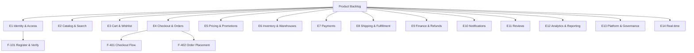
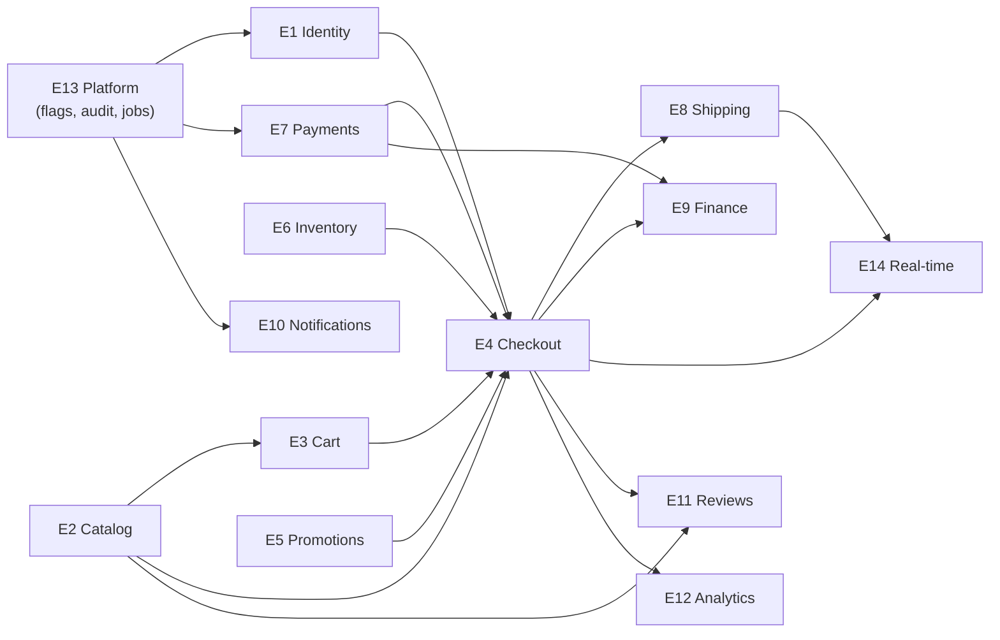
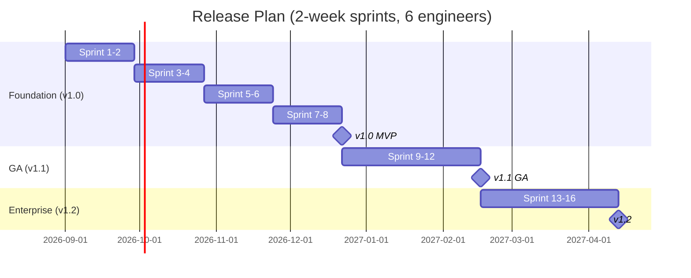
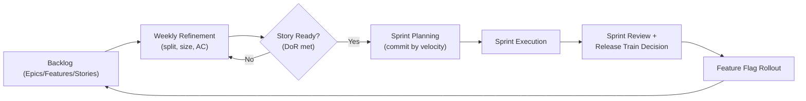

# Document 03b — Product Backlog (Epics, Features & Release Plan)

> **Platform:** E-Commerce Platform (Working Title: `ECommerce`)
> **Document Type:** Product Backlog / Release Planning Baseline
> **Status:** Draft v1.0 for review
> **Audience:** Product, Engineering, QA, Architecture, DevOps
> **Inputs:** `03-business-requirements.md`, `03a-user-stories.md`, `02a-user-personas.md`, `01-project-charter.md` (§15 roadmap)
> **Relationship:** Organizes the 103 stories from `03a` into 14 epics and 48 features, and plans releases v1.0/v1.1/v1.2.

---

## 1. Document Control

| Version | Date       | Author / Owner | Change Summary                       |
|---------|------------|----------------|---------------------------------------|
| 0.1     | 2026-07-21 | Product Owner  | Epic/feature decomposition           |
| 0.2     | 2026-07-29 | Product Owner  | WSJF, release plan, dependency graph |
| 1.0     | 2026-07-31 | Product Owner  | Baseline release                     |

### 1.1 Approvals

| Role         | Name | Decision | Date |
|--------------|------|----------|------|
| Product Owner | —    | —        | —    |
| Technical Lead | —   | —        | —    |
| Enterprise Architect | — | —      | —    |

---

## 2. Backlog Governance

### 2.1 Roles

| Role | Backlog Responsibility |
|------|------------------------|
| Product Owner | Owns priorities, WSJF scoring, acceptance, release commitments |
| Tech Lead | Sizing, technical feasibility, slice identification |
| Enterprise Architect | Architectural runway, NFR gates, ADRs |
| QA Lead | Acceptance criteria quality, testability |
| DevOps | Release train, environments, CI/CD dependencies |

### 2.2 Cadence

| Ceremony | Cadence | Output |
|----------|---------|--------|
| Backlog refinement | Weekly (1 h) | Ready stories, feature clarity |
| Sprint planning | Every 2 weeks | Sprint backlog + commitment |
| Sprint review | Every 2 weeks | Demonstrable increment |
| Release train review | Monthly | Feature-flag rollout decisions |

### 2.3 Backlog Rules

- Story size ≤ 5 points (L); anything larger is split during refinement.
- Must-have stories for the current release are always in the top of the backlog.
- Every story has traceable FRS/BRD IDs (per `03a`).
- WIP limits: max 3 in-progress stories per developer.

---

## 3. Backlog Structure

---

## 4. Epic Registry

| Epic | Name | Personas | Stories | Points | Business Value (1–10) | Priority |
|------|------|----------|--------:|-------:|:----------------------:|:--------:|
| E1 | Identity & Access | Ahmed, Diego, Ingrid | 9 | 22 | 9 | Must |
| E2 | Catalog & Search | Elena, Sarah | 8 | 20 | 9 | Must |
| E3 | Cart & Wishlist | Sarah, Ahmed | 7 | 14 | 8 | Must |
| E4 | Checkout & Orders | Sarah, Ahmed, Diego | 9 | 26 | 10 | Must |
| E5 | Pricing & Promotions | Elena, Ahmed | 8 | 19 | 8 | Must (v1.1) |
| E6 | Inventory & Warehouses | Marcus, Elena, Ahmed | 8 | 20 | 9 | Must |
| E7 | Payments | Ahmed, Ingrid, Priya | 8 | 24 | 10 | Must |
| E8 | Shipping & Fulfillment | Marcus, Ahmed, Diego | 7 | 18 | 9 | Must (v1.1) |
| E9 | Finance & Refunds | Priya | 7 | 18 | 9 | Must (v1.1) |
| E10 | Notifications | Ahmed, Elena, Ingrid | 6 | 12 | 8 | Must |
| E11 | Reviews | Ahmed, Diego | 6 | 11 | 6 | Should |
| E12 | Analytics & Reporting | Priya, Elena, Marcus | 7 | 16 | 7 | Should |
| E13 | Platform & Governance | Ingrid, Yusuf, Elena | 8 | 22 | 9 | Must |
| E14 | Real-time | Ahmed, Marcus, Elena | 5 | 11 | 7 | Should |
| **Total** | | | **103** | **253** | | |

### 4.1 WSJF Prioritization (Epic Level)

| Epic | Business Value | Time Criticality | Risk/Opp. Reduction | Job Size | WSJF | Rank |
|------|:---:|:---:|:---:|:---:|:---:|:---:|
| E4 Checkout & Orders | 10 | 10 | 10 | 26 | 1.15 | 1 |
| E7 Payments | 10 | 9 | 10 | 24 | 1.21 | 2 |
| E1 Identity | 9 | 9 | 10 | 22 | 1.27 | 3 |
| E2 Catalog | 9 | 8 | 7 | 20 | 1.20 | 4 |
| E6 Inventory | 9 | 8 | 9 | 20 | 1.30 | 5 |
| E13 Platform | 9 | 8 | 10 | 22 | 1.23 | 6 |
| E8 Shipping | 9 | 7 | 8 | 18 | 1.33 | 7 |
| E9 Finance | 9 | 7 | 9 | 18 | 1.39 | 8 |
| E5 Promotions | 8 | 8 | 7 | 19 | 1.21 | 9 |
| E3 Cart | 8 | 8 | 6 | 14 | 1.57 | 10 |
| E10 Notifications | 8 | 7 | 7 | 12 | 1.83 | 11 |
| E14 Real-time | 7 | 6 | 6 | 11 | 1.73 | 12 |
| E12 Analytics | 7 | 6 | 6 | 16 | 1.19 | 13 |
| E11 Reviews | 6 | 5 | 5 | 11 | 1.45 | 14 |

> Lower WSJF value = higher priority per formula (Cost of Delay ÷ Size). Rank 1 = highest priority to schedule early where dependencies allow.

---

## 5. Features by Epic

### 5.1 E1 — Identity & Access

| Feature | Description | Stories | Points | Release |
|---------|-------------|---------|-------:|---------|
| F-101 Register & Verify | Registration, email verification, profile | US-A-001, 004 | 7 | v1.0 |
| F-102 Login & Sessions | JWT + refresh rotation, lockout | US-A-002, 009 | 6 | v1.0 |
| F-103 Password Recovery | Reset flow | US-A-003 | 3 | v1.0 |
| F-104 RBAC & Admin | Roles, permissions, account lookup | US-A-005, 006 | 5 | v1.0 |
| F-105 Governance Extras | Closure/erasure, impersonation | US-A-007, 008 | 1 | v1.2 |

### 5.2 E2 — Catalog & Search

| Feature | Description | Stories | Points | Release |
|---------|-------------|---------|-------:|---------|
| F-201 Product Management | CRUD, SKU/slug uniqueness, status | US-B-001 | 5 | v1.0 |
| F-202 Taxonomy | Categories, brands, hierarchy rules | US-B-002 | 4 | v1.0 |
| F-203 Localization & Pricing | 10 languages, 5 currencies | US-B-003, 004 | 5 | v1.0 |
| F-204 Search & Filters | Full-text search, facets, typo tolerance | US-B-005, 006 | 8 | v1.1 |
| F-205 Bulk & Availability | Bulk import, availability-aware visibility | US-B-007, 008 | 4 | v1.1 |

### 5.3 E3 — Cart & Wishlist

| Feature | Description | Stories | Points | Release |
|---------|-------------|---------|-------:|---------|
| F-301 Cart Core | Guest + auth cart, mutations, totals | US-C-001, 003, 004 | 6 | v1.0 |
| F-302 Cart Merge & Price Watch | Merge on login, price-change warnings | US-C-002, 005 | 4 | v1.0 |
| F-303 Wishlist & Purging | Wishlist, move-to-cart, TTL purge | US-C-006, 007 | 4 | v1.1 |

### 5.4 E4 — Checkout & Orders

| Feature | Description | Stories | Points | Release |
|---------|-------------|---------|-------:|---------|
| F-401 Checkout Flow | Initiation, guest checkout, rates, snapshot | US-D-001, 002 | 8 | v1.0 |
| F-402 Order Placement | Atomic placement, idempotency, reservation | US-D-003, 004 | 8 | v1.0 |
| F-403 Order Lifecycle | Confirmation, history, cancel, reorder, lookup | US-D-005–009 | 10 | v1.0/v1.1 |

### 5.5 E5 — Pricing & Promotions

| Feature | Description | Stories | Points | Release |
|---------|-------------|---------|-------:|---------|
| F-501 Discount Engine | Types, caps, non-negative invariant | US-E-001, 005 | 4 | v1.1 |
| F-502 Campaigns & Coupons | Conditions, atomic redemption, stacking | US-E-002, 003, 004 | 8 | v1.1 |
| F-503 Campaign Ops | Eligibility, scheduling, snapshot immutability | US-E-006–008 | 7 | v1.1 |

### 5.6 E6 — Inventory & Warehouses

| Feature | Description | Stories | Points | Release |
|---------|-------------|---------|-------:|---------|
| F-601 Warehouse & Ledger | Warehouses, append-only ledger | US-F-001, 002 | 6 | v1.0 |
| F-602 Allocation & Oversell Guard | Atomic allocation, invariant | US-F-003 | 8 | v1.0 |
| F-603 Stock Operations | Adjustments, transfers, alerts | US-F-004, 005, 006 | 5 | v1.0 |
| F-604 Backorder & Projections | Backorder queue, projections | US-F-007, 008 | 4 | v1.1 |

### 5.7 E7 — Payments

| Feature | Description | Stories | Points | Release |
|---------|-------------|---------|-------:|---------|
| F-701 Provider Abstraction | `IPaymentProvider`, registry, routing | US-G-001 | 6 | v1.0 |
| F-702 Auth & Capture | Authorize/capture lifecycle | US-G-002 | 6 | v1.0 |
| F-703 Webhooks & Idempotency | Signed webhooks, dedupe, retries | US-G-005 | 5 | v1.0 |
| F-704 Risk & Ops | Failover, no-PAN, ledger, reconciliation | US-G-003, 004, 006–008 | 7 | v1.0/v1.1 |

### 5.8 E8 — Shipping & Fulfillment

| Feature | Description | Stories | Points | Release |
|---------|-------------|---------|-------:|---------|
| F-801 Fulfillment Queues | Live queues, pick lists | US-H-001, 002 | 5 | v1.1 |
| F-802 Shipments & Tracking | Labels, tracking, delivery confirmation | US-H-003, 004, 007 | 5 | v1.1 |
| F-803 Multi-warehouse & Corrections | Split shipments, address correction | US-H-005, 006 | 4 | v1.1 |

### 5.9 E9 — Finance & Refunds

| Feature | Description | Stories | Points | Release |
|---------|-------------|---------|-------:|---------|
| F-901 Invoicing & Tax | Invoices, credit notes, tax calc | US-I-001, 002, 003 | 5 | v1.1 |
| F-902 Refund Workflow | Policy approval, idempotent execution | US-I-004, 006 | 6 | v1.1 |
| F-903 Reconciliation & Audit | Feed, audit trail | US-I-005, 007 | 4 | v1.1 |

### 5.10 E10 — Notifications

| Feature | Description | Stories | Points | Release |
|---------|-------------|---------|-------:|---------|
| F-1001 Channels & Preferences | Email/SMS, preferences, PII safety | US-J-002, 003, 006 | 4 | v1.0 |
| F-1002 Templates & i18n | Localized templates | US-J-004 | 3 | v1.0 |
| F-1003 Lifecycle Delivery | Event-driven dispatch, retries | US-J-001, 005 | 5 | v1.0 |

### 5.11 E11 — Reviews

| Feature | Description | Stories | Points | Release |
|---------|-------------|---------|-------:|---------|
| F-1101 Submission & Verification | Verified-purchase reviews | US-K-001 | 3 | v1.1 |
| F-1102 Moderation & Aggregation | Queue, removal, rating recompute | US-K-002, 003, 004 | 5 | v1.1 |
| F-1103 Voting | Helpful/not | US-K-005 | 1 | v1.2 |

### 5.12 E12 — Analytics & Reporting

| Feature | Description | Stories | Points | Release |
|---------|-------------|---------|-------:|---------|
| F-1201 Sales & Product | Sales, product performance | US-L-001, 002 | 5 | v1.1 |
| F-1202 Operational Reports | Inventory, promotion, fulfillment | US-L-003, 004, 005 | 5 | v1.2 |
| F-1203 Finance & Exports | Finance reports, async export | US-L-006, 007 | 5 | v1.1 |

### 5.13 E13 — Platform & Governance

| Feature | Description | Stories | Points | Release |
|---------|-------------|---------|-------:|---------|
| F-1301 Audit & Flags | Audit log, feature flags | US-M-001, 002 | 6 | v1.0 |
| F-1302 Jobs & Health | Hangfire, health endpoints | US-M-003, 006 | 4 | v1.0 |
| F-1303 API & Rate Limits | Versioning, deprecation, rate limits | US-M-005, 007 | 3 | v1.0 |
| F-1304 Webhooks & Bulk | Signed webhooks, bulk ops | US-M-004, 008 | 5 | v1.2 |

### 5.14 E14 — Real-time

| Feature | Description | Stories | Points | Release |
|---------|-------------|---------|-------:|---------|
| F-1401 Customer Hub | Order status push | US-N-001 | 3 | v1.1 |
| F-1402 Warehouse & Ops Hubs | Task push, live tiles, resume | US-N-002, 003, 004 | 5 | v1.1 |

---

## 6. Dependency Graph

### 6.1 Dependency Rules

| Rule | Detail |
|------|--------|
| R1 | E1 Identity precedes E4 (authorization on checkout) |
| R2 | E13 Platform (flags/audit) is foundational runway for all epics |
| R3 | E2 Catalog precedes E3/E4/E11 (products are first-class) |
| R4 | E6 + E7 are hard prerequisites of E4 (allocation + payment auth) |
| R5 | E4 precedes E8/E9/E14/E12 (events flow outward) |
| R6 | E5 Promotions is designed before E4 hardens (pricing snapshot) |

---

## 7. Release Plan

### 7.1 Release Train (v1.0 MVP → v1.1 GA → v1.2 Enterprise)

### 7.2 Epic → Release Mapping

| Release | Epics | Points | Story Count | Exit Criteria |
|---------|-------|-------:|------------:|---------------|
| **v1.0 MVP** | E1, E2, E3, E6, E7, E10, E13 (+E4 core: F-401/402) | 129 | 54 | Checkout-to-order E2E green; 1 PSP; audit/flags/jobs; CI green; load baseline |
| **v1.1 GA** | E4 (full), E5, E8, E9, E11, E14 (+E2 F-204/205, E3 F-303, E6 F-604, E12 F-1201/1203) | 106 | 41 | Promotions, multi-warehouse, 2+ PSP, refunds/invoices, shipping, SignalR; 1,000/min load test |
| **v1.2 Enterprise** | E12 (full), E13 F-1304, E1 F-105, E11 F-1103 | 18 | 8 | Webhooks portal, FX engine, dashboards, 2FA, impersonation; hardening; docs approved |

### 7.3 Capacity & Velocity Assumption

| Item | Value | Notes |
|------|-------|-------|
| Team | 6 engineers (2 BE seniors, 3 BE mids, 1 QA) | FE out of scope |
| Sprint length | 2 weeks | |
| Average velocity | 32–40 points/sprint | After ramp-up |
| Total backlog | 253 points | v1.0–v1.2 |
| Estimated delivery | ≈ 16 sprints (32 weeks) | Including hardening sprints |

---

## 8. Backlog Metrics & Reporting

| Metric | Definition | Target |
|--------|-----------|--------|
| Backlog health | % of top-20 stories with AC + size | ≥ 90% |
| Cycle time | Story opened → Done | ≤ 5 days |
| Throughput | Stories completed / sprint | ≥ 8 |
| Escaped defects | Production defects / story | ≤ 2% |
| Release readiness | All Must stories Done + NFR gates green | 100% per release |
| WIP | In-progress stories | ≤ 3/developer |

---

## 9. Refinement & Planning Process

---

## 10. Approvals

| Role         | Name | Decision | Date |
|--------------|------|----------|------|
| Product Owner | —    | —        | —    |
| Technical Lead | —   | —        | —    |
| Enterprise Architect | — | —      | —    |
| QA Lead       | —    | —        | —    |

---

*End of Document 03b — Product Backlog (Epics, Features & Release Plan).*
*Next document on request: `02-glossary-and-definitions.md`.*
