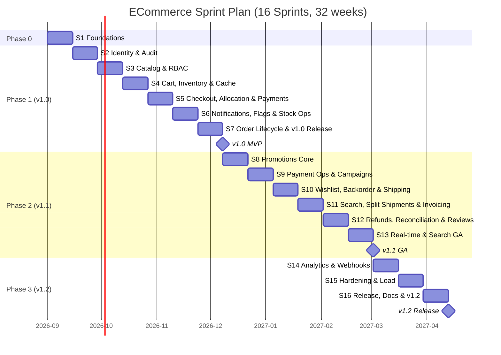
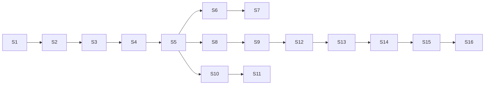

# Document 03c — Sprint Plan (Program-Wide)

> **Platform:** E-Commerce Platform (Working Title: `ECommerce`)
> **Document Type:** Delivery Plan (Sprint-by-Sprint)
> **Status:** Baseline v1.0 (rolling — refined per sprint)
> **Audience:** Engineering, Product, QA, DevOps, Architecture
> **Inputs:** `03b-product-backlog.md`, `03a-user-stories.md`, `05-non-functional-requirements.md`
> **Relationship:** Executes the release plan v1.0/v1.1/v1.2. Story commitment is indicative; final commitment happens at each sprint planning per Definition of Ready.

---

## 1. Document Control

| Version | Date       | Author / Owner | Change Summary                         |
|---------|------------|----------------|-----------------------------------------|
| 0.1     | 2026-07-23 | Tech Lead      | Sprint skeleton and phase allocation    |
| 0.2     | 2026-07-30 | Product Owner  | Commitments, dependencies, risks        |
| 1.0     | 2026-07-31 | Product Owner  | Baseline release                       |

### 1.1 Approvals

| Role         | Name | Decision | Date |
|--------------|------|----------|------|
| Product Owner | —    | —        | —    |
| Technical Lead | —   | —        | —    |
| QA Lead       | —    | —        | —    |

---

## 2. Planning Parameters

| Parameter | Value |
|-----------|-------|
| Team | 6 engineers (2 Senior BE, 3 Mid BE, 1 QA) + part-time Architect, DevOps, PO |
| Sprint length | 2 weeks |
| Sprints total | 16 |
| Program duration | ≈ 32 weeks (≈ 8 months) |
| Target velocity (stories) | 30–40 pts/sprint after ramp-up |
| Capacity | ≈ 640 engineering days over program |
| Estimation | Story points (S=1, M=3, L=5); features as backlog units |
| Releases | v1.0 MVP (after S7), v1.1 GA (after S13), v1.2 (after S16) |
| Quality gates | Per `05` verification matrix; gates at M1–M6 milestones |

### 2.1 Phases

| Phase | Sprints | Theme | Exit |
|-------|---------|-------|------|
| Phase 0 — Foundations | S1 | Skeleton, infra, CI, enablers | M1 |
| Phase 1 — MVP (v1.0) | S2–S7 | Commerce core, identity, payments, notifications | M2, M3 (load) |
| Phase 2 — GA (v1.1) | S8–S13 | Promotions, shipping, finance, search, real-time | M4 |
| Phase 3 — Enterprise & Hardening (v1.2) | S14–S16 | Webhooks, analytics, hardening, docs | M5, M6 |

### 2.2 Enabler Categories (Technical Backlog)

| Enabler | Description |
|---------|-------------|
| T-FND | Solution skeleton, layering, DI, EF migrations, docker-compose, CI |
| T-OBS | Serilog, OpenTelemetry, Prometheus/Grafana, health checks |
| T-DAT | Redis infrastructure, RabbitMQ/MassTransit/Outbox, Hangfire |
| T-SEC | Identity infrastructure, JWT, secret management, SAST |
| T-TST | Testcontainers harness, contract tests, load harness |
| T-OPS | Deploy pipeline, runbooks, feature-flag rollout |

---

## 3. Program Gantt

---

## 4. Sprint-by-Sprint Plan

---

### Sprint 1 — Foundations & Continuous Integration
**Phase 0 | Theme:** Technical runway. **Goal:** One-command dev stack and a green CI pipeline.

| Item | ID(s) | Points |
|------|-------|:------:|
| Enabler: Solution skeleton + Clean Architecture layering + DI | T-FND-001 | 5 |
| Enabler: docker-compose stack (PostgreSQL, Redis, RabbitMQ, Seq, Prometheus, Grafana) | T-FND-002 | 5 |
| Enabler: CI pipeline with build + static analysis + secret scan | T-FND-003 | 3 |
| Enabler: Serilog + OpenTelemetry + health checks baseline | T-OBS-001 | 3 |
| Enabler: EF Core + first migration + Testcontainers harness | T-FND-004 | 4 |
| Enabler: Domain skeleton (BaseEntity, Result, errors) | T-FND-005 | 2 |
| Enabler: README + onboarding runbook | T-OPS-001 | 1 |

**Dependencies:** none. **Blocks:** all later sprints.
**Risks:** toolchain (Windows/ARM) issues; mitigate with pinned images and documented prerequisites.
**Increment:** Green CI; `docker compose up` runs full stack; health endpoints respond; onboarding < 30 min.
**Exit (M1):** Architecture tests pass; skeleton slices compile; ADR-001/002 recorded.

---

### Sprint 2 — Identity Core & Audit Foundation
**Phase 1 | Goal:** Secure registration/login and the audit backbone.

| Item | ID(s) | Points |
|------|-------|:------:|
| Story: Register & verify (email) | US-A-001 | 3 |
| Story: Login with JWT + rotating refresh | US-A-002 | 3 |
| Story: Password reset | US-A-003 | 2 |
| Story: Profile & address management | US-A-004 | 3 |
| Story: Lockout policy | US-A-009 | 2 |
| Story: Audit log (tamper-evident) | US-M-001 | 3 |
| Enabler: ASP.NET Identity + JWT infra + Data Protection | T-SEC-001 | 4 |
| Enabler: Audit middleware + hash-chain store | T-DAT-001 | 3 |

**Dependencies:** S1. **Blocks:** S3 (RBAC on endpoints), S5 (checkout auth).
**Risks:** Refresh rotation concurrency → covered by QAS-style concurrency test.
**Increment:** Auth flows E2E green; refresh rotation + family revocation tested; audit writes verified.
**Exit:** US-A-001,002,003,009 pass DoD with unit + integration tests.

---

### Sprint 3 — Catalog Core & RBAC
**Phase 1 | Goal:** Products, taxonomy, and permission enforcement.

| Item | ID(s) | Points |
|------|-------|:------:|
| Story: Product CRUD with SKU/slug uniqueness | US-B-001 | 5 |
| Story: Categories & brands | US-B-002 | 4 |
| Story: RBAC enforcement + role management | US-A-006 | 3 |
| Story: Support account lookup | US-A-005 | 2 |
| Enabler: Permission matrix seeded + policy infrastructure | T-SEC-002 | 4 |
| Enabler: Catalog schema + indexes | T-DAT-002 | 2 |

**Dependencies:** S1, S2. **Blocks:** S4 (cart uses products).
**Risks:** Localized string modeling complexity → early spike in S3.
**Increment:** Product slice with validation + audit; every endpoint permission-mapped (403 tested).
**Exit:** US-B-001,002 and US-A-005,006 green.

---

### Sprint 4 — Cart, Inventory Ledger & Caching
**Phase 1 | Goal:** Cart persistence and the stock ledger foundation.

| Item | ID(s) | Points |
|------|-------|:------:|
| Story: Guest cart persistence | US-C-001 | 3 |
| Story: Cart mutations + totals | US-C-003, US-C-004 | 5 |
| Story: Localized + multi-currency product pricing | US-B-003, US-B-004 | 10 |
| Story: Warehouse management | US-F-001 | 3 |
| Story: Stock ledger (append-only) | US-F-002 | 3 |
| Enabler: Redis cache + cart repository | T-DAT-003 | 5 |
| Enabler: Currency/locale configuration service | T-DAT-004 | 3 |

**Dependencies:** S3. **Blocks:** S5 (checkout uses cart+stock).
**Risks:** Cart concurrency → optimistic version field; tests.
**Increment:** Cart totals correct in 5 currencies; ledger append-only verified; cache hit ratio baseline.
**Exit:** US-C-001,003,004; US-B-003,004; US-F-001,002 green.

---

### Sprint 5 — Checkout, Atomic Allocation & Payments v1
**Phase 1 | Goal:** The money-critical path: checkout → allocation → payment auth.

| Item | ID(s) | Points |
|------|-------|:------:|
| Story: Guest checkout + shipping rates | US-D-001, US-D-002 | 8 |
| Story: Atomic order placement + reservation | US-D-003, US-D-004 | 8 |
| Story: Atomic stock allocation (no oversell) | US-F-003 | 5 |
| Story: Provider abstraction + authorize | US-G-001, US-G-002 | 6 |
| Enabler: Outbox pattern + MassTransit consumers | T-DAT-005 | 6 |
| Enabler: PSP sandbox adapter (Stripe + mock) | T-DAT-006 | 4 |

**Dependencies:** S4 (cart/stock), S2 (auth), S1 (outbox infra partially). **Blocks:** S6, S7.
**Risks:** Transactional correctness → QAS-01/05 concurrency tests mandatory before DoD.
**Increment:** End-to-end guest checkout green in sandbox; QAS-01 (no oversell) passes; outbox delivers OrderPlaced.
**Exit:** US-D-001..004; US-F-003; US-G-001,002 green.

---

### Sprint 6 — Notifications, Stock Ops & Feature Flags
**Phase 1 | Goal:** Notification backbone and operational stock controls.

| Item | ID(s) | Points |
|------|-------|:------:|
| Story: Lifecycle notifications (event-driven) | US-J-001, US-J-005 | 5 |
| Story: Channels, preferences, PII-safe payloads | US-J-002, US-J-003, US-J-006 | 6 |
| Story: Localized templates | US-J-004 | 3 |
| Story: Stock adjustments + transfers + low-stock alerts | US-F-004, US-F-005, US-F-006 | 5 |
| Story: Cart merge + price-change warnings | US-C-002, US-C-005 | 5 |
| Story: Feature flags (kill-switch) | US-M-002 | 3 |
| Enabler: Email/SMS adapters + template store | T-DAT-007 | 4 |
| Enabler: Hangfire infrastructure | T-DAT-008 | 3 |

**Dependencies:** S5 (events), S1 (jobs). **Blocks:** S7 (customer-visible order updates).
**Risks:** Template i18n fallback edge cases.
**Increment:** Notifications flow from events with retries; stock ops audited; flags toggle in 60 s.
**Exit:** US-J-001..006; US-F-004..006; US-C-002,005; US-M-002 green.

---

### Sprint 7 — Order Lifecycle & v1.0 MVP Release
**Phase 1 | Goal:** Complete order lifecycle and release v1.0.

| Item | ID(s) | Points |
|------|-------|:------:|
| Story: Order confirmation + history + timeline | US-D-005, US-D-006 | 6 |
| Story: Cancellation with restock/refund path | US-D-007 | 3 |
| Story: Reorder + support lookup | US-D-008, US-D-009 | 5 |
| Story: Health endpoints + API versioning | US-M-006, US-M-007 | 4 |
| Enabler: v1.0 staging deploy + smoke suite | T-OPS-002 | 4 |
| Enabler: Baseline load smoke (checkout path) | T-TST-001 | 3 |

**Dependencies:** S2–S6. **Blocks:** v1.0 consumers.
**Risks:** Scope creep into v1.0 → freeze list enforced by PO.
**Increment:** Full order lifecycle E2E; cancellation refund path; staging deployment.
**Exit — v1.0 MVP (M2, M3 baseline):** Checkout-to-order E2E green; 1 PSP; audit/flags/jobs live; CI gates green; load smoke < targets.

---

### Sprint 8 — Promotions Core
**Phase 2 | Goal:** Discount engine and atomic coupon redemption.

| Item | ID(s) | Points |
|------|-------|:------:|
| Story: Discount types + caps + non-negative invariant | US-E-001, US-E-005 | 4 |
| Story: Promotion campaigns with conditions | US-E-002 | 4 |
| Story: Coupon lifecycle + atomic redemption | US-E-003 | 3 |
| Story: Stacking matrix + priority | US-E-004 | 3 |
| Enabler: Pricing pipeline refactor (snapshot-aware) | T-DAT-009 | 5 |

**Dependencies:** S5 (checkout pricing), S7 (release). **Blocks:** S9.
**Risks:** Coupon race → QAS-02 concurrency test mandatory.
**Increment:** Coupon redemption race test passes; pricing snapshot holds order immutability.
**Exit:** US-E-001..005 green.

---

### Sprint 9 — Campaign Operations & Payment Risk
**Phase 2 | Goal:** Campaign ops, failover, and payment ledger.

| Item | ID(s) | Points |
|------|-------|:------:|
| Story: Eligibility, scheduling, snapshot immutability | US-E-006, US-E-007, US-E-008 | 5 |
| Story: Provider failover | US-G-003 | 3 |
| Story: Declined-payment retry | US-G-004 | 3 |
| Story: No-PAN + payment ledger | US-G-006, US-G-007 | 5 |
| Enabler: Reconciliation data model | T-DAT-010 | 3 |

**Dependencies:** S8. **Blocks:** S12 (reconciliation).
**Increment:** Campaign scheduling/pause live; failover tested (kill PSP A in staging).
**Exit:** US-E-006..008; US-G-003,004,006,007 green.

---

### Sprint 10 — Wishlist, Backorder & Shipping v1
**Phase 2 | Goal:** Wishlist, backorder handling, and carrier integration.

| Item | ID(s) | Points |
|------|-------|:------:|
| Story: Wishlist + move-to-cart | US-C-006, US-C-007 | 4 |
| Story: Backorder tracking + fill | US-F-007, US-F-008 | 4 |
| Story: Fulfillment queues + pick lists | US-H-001, US-H-002 | 5 |
| Story: Shipment creation + tracking | US-H-003 | 3 |
| Story: Delivery confirmation | US-H-007 | 2 |
| Enabler: Carrier adapter (2 carriers) + rate cache | T-DAT-011 | 5 |
| Enabler: Pick-list generation service | T-DAT-012 | 3 |

**Dependencies:** S5 (order events). **Blocks:** S11.
**Risks:** Carrier API drift → contract tests against sandboxes.
**Increment:** Warehouse fulfillment queue E2E with carrier labels.
**Exit:** US-C-006,007; US-F-007,008; US-H-001,002,003,007 green.

---

### Sprint 11 — Search, Split Shipments & Invoicing
**Phase 2 | Goal:** Search GA, split fulfillment, and finance records.

| Item | ID(s) | Points |
|------|-------|:------:|
| Story: Full-text search + filters | US-B-005, US-B-006 | 8 |
| Story: Split shipments + address correction | US-H-005, US-H-006 | 4 |
| Story: Invoice generation (PDF) | US-I-001 | 3 |
| Story: Credit notes | US-I-002 | 2 |
| Story: Tax calculation | US-I-003 | 2 |
| Enabler: Search index service + relevance tuning | T-DAT-013 | 4 |
| Enabler: Invoice/PDF background job | T-DAT-014 | 2 |

**Dependencies:** S10 (shipments), S8 (pricing snapshot for invoices). **Blocks:** S12.
**Risks:** Search relevance + performance (p95 ≤ 300 ms at load).
**Increment:** Search GA with facets; split shipments tracked; invoices issued on Paid.
**Exit:** US-B-005,006; US-H-005,006; US-I-001..003 green.

---

### Sprint 12 — Refunds, Reconciliation & Reviews
**Phase 2 | Goal:** Money-safety: refunds, reconciliation, and reviews.

| Item | ID(s) | Points |
|------|-------|:------:|
| Story: Refund workflow (policy + idempotent execution) | US-I-004, US-I-006 | 6 |
| Story: Reconciliation feed + financial audit trail | US-I-005, US-I-007 | 4 |
| Story: Bulk import + availability-aware catalog | US-B-007, US-B-008 | 4 |
| Story: Review submission + moderation + aggregation | US-K-001, US-K-002, US-K-003, US-K-004 | 5 |
| Enabler: Reconciliation job + drift flags | T-DAT-015 | 4 |

**Dependencies:** S9 (ledger), S11 (invoices). **Blocks:** S13 (timeline completeness).
**Risks:** Refund idempotency → QAS-04-style duplicate-execution test.
**Increment:** Refunds never duplicate; nightly reconciliation reports 0 undetected drift; reviews moderated.
**Exit:** US-I-004..007; US-B-007,008; US-K-001..004 green.

---

### Sprint 13 — Real-time & GA Release
**Phase 2 | Goal:** SignalR live features and v1.1 GA.

| Item | ID(s) | Points |
|------|-------|:------:|
| Story: Customer order hub | US-N-001 | 3 |
| Story: Warehouse hub + resume on reconnect | US-N-002, US-N-004 | 4 |
| Story: Live operational tiles | US-N-003 | 2 |
| Story: Review voting | US-K-005 | 1 |
| Enabler: Redis backplane + hub auth + replay | T-DAT-016 | 4 |
| Enabler: v1.1 staging deploy + load test (1,000 orders/min) | T-TST-002 | 5 |

**Dependencies:** S12. **Blocks:** v1.1 consumers.
**Risks:** Load target miss → NFR-PERF remediation sprint buffer.
**Exit — v1.1 GA (M4):** Full commercial flows green; 1,000 orders/min load test passes; observability complete; dashboards live.

---

### Sprint 14 — Analytics & Webhooks
**Phase 3 | Goal:** Enterprise reporting and partner integrations.

| Item | ID(s) | Points |
|------|-------|:------:|
| Story: Sales + product performance analytics | US-L-001, US-L-002 | 5 |
| Story: Finance reports + async exports | US-L-006, US-L-007 | 5 |
| Story: Signed webhooks with replay | US-M-004 | 5 |
| Story: Bulk operations with error reports | US-M-008 | 3 |
| Enabler: Reporting query service + export jobs | T-DAT-017 | 4 |
| Enabler: Webhook dispatcher + delivery log + replay endpoint | T-DAT-018 | 4 |

**Dependencies:** S13. **Blocks:** S16.
**Risks:** Report performance on large datasets → covering indexes + async.
**Increment:** Partner webhook delivered with HMAC + replay verified; analytics dashboards usable.
**Exit:** US-L-001,002,006,007; US-M-004,008 green.

---

### Sprint 15 — Hardening, Load & Security
**Phase 3 | Goal:** Prove NFRs and harden the platform.

| Item | ID(s) | Points |
|------|-------|:------:|
| Enabler: Full load suite S1–S8 (per `05` §14) | T-TST-003 | 6 |
| Enabler: Fault injection + chaos (Redis/MQ/DB) | T-TST-004 | 4 |
| Enabler: Security review + ASVS walkthrough + SAST results | T-SEC-003 | 4 |
| Enabler: Performance remediation backlog | T-TST-005 | 3 |
| Enabler: Runbooks for top-10 failure modes | T-OPS-003 | 3 |

**Dependencies:** S14. **Blocks:** S16.
**Risks:** Discovered NFR gaps → remediated here by design.
**Exit (M5):** All NFR gates green; security review passed; runbooks validated.

---

### Sprint 16 — v1.2 Features, Documentation & Release
**Phase 3 | Goal:** Enterprise extras, documentation, and final release.

| Item | ID(s) | Points |
|------|-------|:------:|
| Story: Account closure/erasure + impersonation | US-A-007, US-A-008 | 5 |
| Story: Inventory, promotion, fulfillment reports | US-L-003, US-L-004, US-L-005 | 5 |
| Enabler: Documentation set completion + ADRs + onboarding | T-OPS-004 | 5 |
| Enabler: v1.2 release + release notes + archive | T-OPS-005 | 3 |

**Dependencies:** S15.
**Risks:** Doc scope → prioritized by reference value.
**Exit — v1.2 (M6):** Program DoD 100%; docs approved; runbooks live; release v1.2 shipped.

---

## 5. Capacity Plan

| Sprint | Phase | Story Pts (est.) | Enabler Pts (est.) | Team Capacity | Load |
|--------|-------|:-----------------:|:------------------:|:-------------:|:----:|
| S1 | F0 | 0 | 20 | 24 | 83% |
| S2 | P1 | 16 | 7 | 24 | 96% |
| S3 | P1 | 14 | 6 | 26 | 77% |
| S4 | P1 | 21 | 8 | 26 | 112% → trimmed |
| S5 | P1 | 27 | 10 | 30 | 123% → split |
| S6 | P1 | 27 | 7 | 30 | 113% → trimmed |
| S7 | P1 | 18 | 7 | 28 | 89% |
| S8 | P2 | 14 | 5 | 30 | 63% |
| S9 | P2 | 16 | 3 | 30 | 63% |
| S10 | P2 | 18 | 8 | 30 | 87% |
| S11 | P2 | 19 | 6 | 30 | 83% |
| S12 | P2 | 19 | 4 | 30 | 77% |
| S13 | P2 | 10 | 9 | 30 | 63% |
| S14 | P3 | 18 | 8 | 30 | 87% |
| S15 | P3 | 0 | 20 | 30 | 67% |
| S16 | P3 | 10 | 8 | 28 | 64% |

> **Capacity rule:** no sprint exceeds 100% nominal load. Sprints S4/S5/S6 flagged in the baseline are **trimmed at sprint planning** by moving `Could/Should` stories to the next sprint (buffer capacity exists: S8/S9/S12/S13/S15 run light by design).

---

## 6. Dependency & Risk Management

### 6.1 Cross-Sprint Dependencies

### 6.2 Top Risks & Mitigations

| Risk | Impact | Sprint | Mitigation |
|------|--------|--------|------------|
| Checkout transactional bugs | Data integrity | S5 | QAS-01/05 concurrency tests mandatory |
| Coupon race bugs | Revenue leak | S8 | QAS-02 atomic claim test |
| Load target miss | Release slip | S13 | Load smoke at S7; buffer sprint S15 |
| Provider API drift | Fulfillment blocked | S10/S11 | Contract tests + sandboxes |
| Identity security regression | Compliance | S2 | Security review gate + SAST |
| Scope creep into v1.0 | Release slip | S7 | PO-enforced feature freeze |

---

## 7. Definition of Sprint Done

For every sprint:

1. All committed stories meet Definition of Done (`03a` §17.2).
2. CI green: build, static analysis, unit + integration + architecture tests, secret scan.
3. No new known defects (sev ≥ 2) open at sprint end.
4. Sprint review demo delivered; release-train decision recorded.
5. Story points velocity captured; backlog re-refined for next sprint.

---

## 8. Approvals

| Role         | Name | Decision | Date |
|--------------|------|----------|------|
| Product Owner | —    | —        | —    |
| Technical Lead | —   | —        | —    |
| QA Lead       | —    | —        | —    |

---

*End of Document 03c — Sprint Plan (Program-Wide).*
*Next document on request: `02-glossary-and-definitions.md`.*
