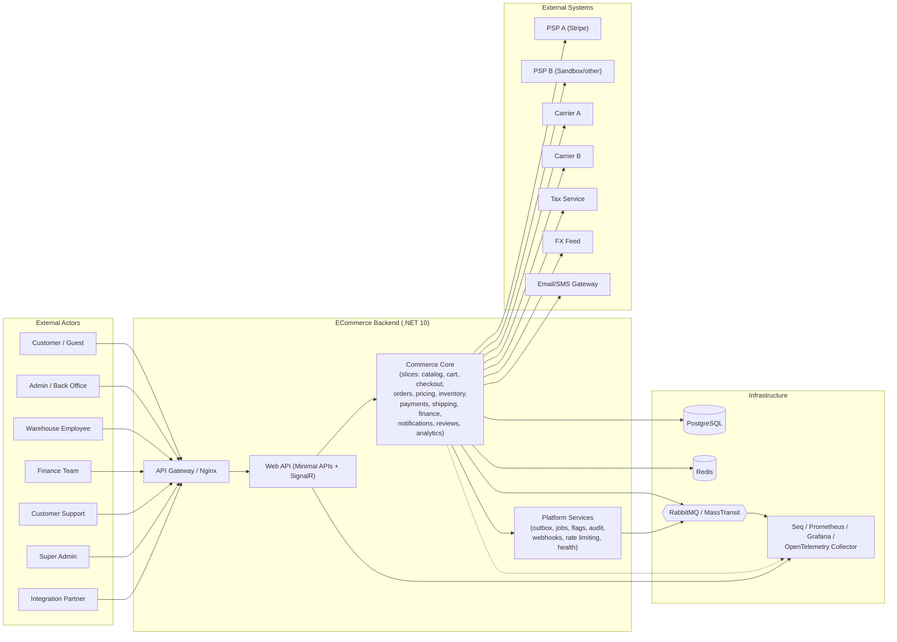
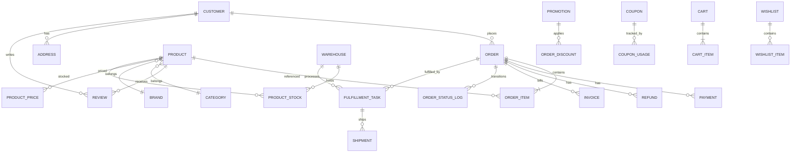

# Document 04 — Software Requirements Specification (SRS)

> **Platform:** E-Commerce Platform (Working Title: `ECommerce`)
> **Document Type:** Software Requirements Specification (IEEE 29148-aligned)
> **Status:** Draft v1.0 for review
> **Audience:** Engineering, QA, Architecture, DevOps, Security, Product
> **Inputs:** `01-project-charter.md`, `01a-product-vision.md`, `03-business-requirements.md`
> **Outputs:** `06-system-architecture.md`, module designs `12`–`29`, test plans `30`, load tests `34`

---

## 1. Document Control

| Version | Date       | Author / Owner | Change Summary                       |
|---------|------------|----------------|---------------------------------------|
| 0.1     | 2026-07-22 | Tech Lead      | SRS skeleton and interface inventory |
| 0.2     | 2026-07-28 | Enterprise Architect | NFRs, data requirements, verification |
| 1.0     | 2026-07-31 | Tech Lead      | Baseline release                     |

### 1.1 Approvals

| Role                | Name | Decision | Date | Signature |
|----------------------|------|----------|------|-----------|
| Enterprise Architect | —    | Pending  | —    | —         |
| Technical Lead       | —    | Pending  | —    | —         |
| QA Lead              | —    | Pending  | —    | —         |
| Security             | —    | Pending  | —    | —         |
| Product Owner        | —    | Pending  | —    | —         |

---

## 2. Introduction

### 2.1 Purpose

This SRS specifies the **software-level requirements** for the `ECommerce` platform: what the system must do functionally (FR-xx), what interfaces it must expose (IFR-xx), what data it must manage (DR-xx), and the measurable quality attributes it must satisfy (NFR-xx). It is the engineering contract between product and delivery teams. Individual module design documents (`12`–`29`) will elaborate implementation detail; this SRS is authoritative on **requirements**.

### 2.2 Scope

The software system is the **backend platform only**. It exposes HTTP/REST and WebSocket (SignalR) interfaces, consumes RabbitMQ events, uses PostgreSQL as its OLTP store, Redis for caching/distributed coordination, and integrates with external payment, shipping, tax, FX, email, and SMS providers. No storefront is in scope.

### 2.3 Conventions

| Convention | Meaning |
|-----------|---------|
| `FR-xx-nnn` | Functional requirement (module, sequence) |
| `NFR-xx-nnn` | Non-functional requirement |
| `IFR-xx` | External interface requirement |
| `DR-xx` | Data requirement |
| `QAS-xx` | Quality attribute scenario (verifiable) |
| `[Must] [Should] [Could]` | MoSCoW priority |
| RFC 9457 | Problem Details error response format (mandatory) |

### 2.4 References

- `01-project-charter.md`, `01a-product-vision.md`, `03-business-requirements.md`
- `02-glossary-and-definitions.md`
- REFACTOR_PLAN.md (existing implementation baseline)
- Standards: IEEE 29148, RFC 9457 (Problem Details), RFC 7519 (JWT), OpenAPI 3.x, OWASP ASVS, GDPR/CCPA-aligned practices

### 2.5 Document Overview

| Section | Contents |
|---------|----------|
| §3 | Overall description: context, functions, users, environment, constraints |
| §4 | Functional requirements by capability |
| §5 | External interface requirements |
| §6 | Non-functional requirements & quality attribute scenarios |
| §7 | Logical database & data requirements |
| §8 | Compliance requirements |
| §9 | Verification approach |
| §10 | Traceability & approvals |

---

## 3. Overall Description

### 3.1 Product Perspective (System Context)

### 3.2 Product Functions (Summary)

| Function Group | ID Prefix | Key Functions |
|----------------|-----------|---------------|
| Identity & Access | FR-01 | Register, login, refresh, reset, RBAC, audit, impersonation |
| Catalog & Search | FR-02 | CRUD, i18n, pricing, search, filters, bulk import |
| Cart & Wishlist | FR-03 | Add/update/remove, merge, expire, wishlist |
| Checkout & Orders | FR-04 | Validate, price, allocate, pay, place, state machine |
| Pricing & Promotions | FR-05 | Discount types, campaigns, coupons, stacking |
| Inventory & Warehouses | FR-06 | Multi-warehouse stock, allocation, ledger, transfers |
| Payments | FR-07 | Provider abstraction, intents, webhooks, failover, refunds |
| Shipping & Fulfillment | FR-08 | Rates, labels, tracking, split shipments, queues |
| Finance | FR-09 | Invoices, credit notes, reconciliation, tax hooks |
| Notifications | FR-10 | Templates, channels, preferences, delivery |
| Reviews | FR-11 | Submit, moderate, aggregate, vote |
| Analytics & Reporting | FR-12 | Dashboards, reports, exports |
| Platform | FR-13 | Audit, flags, jobs, webhooks, rate limiting, health |
| Real-time | FR-14 | SignalR hubs, backplane, delivery guarantees |

### 3.3 User Classes & Characteristics

| Class | Access Level | Typical Session | Skill |
|-------|-------------|-----------------|-------|
| Guest | Anonymous | Single browse/checkout session | Novice |
| Customer | Own data | Recurring | Novice |
| Admin | Store-scoped | Daily operations | Intermediate |
| WarehouseEmployee | Warehouse-scoped | Shift-based | Novice (mobile) |
| Finance | Finance-scoped | Daily | Intermediate |
| Support | Support-scoped | Shift-based | Intermediate |
| SuperAdmin | Platform | Occasional | Expert |
| Integration Partner | API/Webhook | Automated (M2M) | n/a |

### 3.4 Operating Environment

| Environment | Description |
|-------------|-------------|
| Dev | Local Docker Compose: API (Kestrel), PostgreSQL, Redis, RabbitMQ, Seq, Prometheus, Grafana |
| CI | GitHub Actions ephemeral runners; Testcontainers for Postgres/Redis/RabbitMQ |
| Staging | Cloud or local replica; full observability; synthetic data |
| Production | Cloud, Nginx edge → API replicas (horizontal), PostgreSQL primary+replicas, Redis cluster, RabbitMQ HA |

### 3.5 Design & Implementation Constraints

| # | Constraint |
|---|-----------|
| C-01 | .NET 10 / ASP.NET Core; solution layout per `06-system-architecture.md` |
| C-02 | PostgreSQL 16+ primary OLTP; Redis 7+; RabbitMQ 3.13+ |
| C-03 | All money `decimal(18,4)`; all timestamps UTC |
| C-04 | Every state change that matters publishes a domain event via Outbox |
| C-05 | RFC 9457 Problem Details for all HTTP errors |
| C-06 | OpenTelemetry instrumentation in every process |
| C-07 | No raw card data, passwords, or secrets in logs/traces |
| C-08 | Layering: `Domain → UseCases → Infrastructure → API`; no reverse dependencies |
| C-09 | API versioned from day one (`v1`) |
| C-10 | Horizontal scalability: stateless API replicas; distributed cache/backplane |

### 3.6 Assumptions & Dependencies

- External provider SDK availability (PSP, carriers, tax, FX, email/SMS).
- Network latency budget between API and infrastructure ≤ 5 ms within region.
- Clock synchronization (NTP) across nodes (events, outbox timestamps).
- Provider webhooks are signed and can be verified.

---

## 4. Functional Requirements

> Format per requirement: **ID — Title [Priority]** then Description, Input, Processing, Output, Error Handling, Notes.

### 4.1 FR-01 — Identity & Access Management

| ID | Title | Priority | Specification |
|----|-------|----------|---------------|
| FR-01-001 | Customer registration | Must | Input: email, password, name, locale. Processing: validate format/policy, enforce uniqueness, hash password (PBKDF2/Argon2), create account with `Customer` role, issue verification token, publish `CustomerRegistered`. Output: 201 + verification status. Errors: 409 duplicate email; 422 policy violations. |
| FR-01-002 | Login with JWT + refresh token | Must | Input: credentials. Processing: verify, check lockout, issue access JWT (TTL 15 min) + rotating refresh token (TTL 30 days, device-bound, single-use rotation). Output: token pair + claims. Errors: 401 invalid; 423 locked. |
| FR-01-003 | Refresh token rotation | Must | Input: refresh token. Processing: validate signature/expiry/revocation, rotate atomically, revoke used token. Output: new token pair. Errors: 401 on reuse (theft detection → revoke family). |
| FR-01-004 | Password reset | Must | Input: email or token+new password. Processing: generate single-use 30-min token, allow reset, invalidate sessions. Output: 202 always (anti-enumeration). Errors: 422 policy. |
| FR-01-005 | Email verification | Must | Input: verification token. Processing: verify, mark verified, restrict unverified actions per policy. Output: 200. Errors: 400 expired/invalid. |
| FR-01-006 | RBAC enforcement | Must | Processing: policy-based authorization on every endpoint; permission matrix in `11-identity-and-permissions.md`; default deny. Errors: 403 with permission id. |
| FR-01-007 | Role & permission management (SuperAdmin) | Must | Input: role/permission CRUD. Processing: validate assignment, audit every change. Output: 200. Errors: 409 circular/invalid hierarchy. |
| FR-01-008 | Account lockout | Must | Processing: 5 failures → lock 15 min; exponential backoff; admin unlock. Output: 423 with remaining time. |
| FR-01-009 | Impersonation (SuperAdmin) | Could | Processing: dedicated permission `auth.impersonate`; full audit; session marked impersonated. Errors: 403 without permission. |
| FR-01-010 | Account closure & erasure | Should | Processing: enqueue anonymization job (orders retained with anonymized PII per retention), revoke tokens, notify. Output: 202. Errors: 409 open orders. |

### 4.2 FR-02 — Catalog & Search

| ID | Title | Priority | Specification |
|----|-------|----------|---------------|
| FR-02-001 | Product CRUD | Must | Input: name, description, slug, SKU, price, currency, status, images. Processing: uniqueness on SKU/slug; versioned update; publish `ProductUpdated`. Errors: 409 SKU conflict; 422 validation. |
| FR-02-002 | Category hierarchy | Must | Input: name, parent, sort. Processing: enforce depth ≤ 5, prevent cycles. Errors: 400 cycle/depth. |
| FR-02-003 | Localization (10 languages) | Must | Input: locale-specific fields. Processing: store localized strings; fallback chain `locale → default locale → source`. |
| FR-02-004 | Multi-currency pricing | Must | Input: list/offer price per currency. Processing: validate positive, offer ≤ list; store 4-dp decimals. |
| FR-02-005 | Product search | Must | Input: query, filters, page, pageSize, locale, currency. Processing: full-text + tokenization, relevance ranking, facet counts; p95 < 300 ms via cache. Output: paged results + facets. |
| FR-02-006 | Filtering | Must | Input: category, brand, price range, rating, attributes. Processing: combined facets; deterministic ordering. |
| FR-02-007 | Bulk import/update | Should | Input: CSV/JSON batch. Processing: validate per row, enqueue import job, publish per-row results. Output: job id + status; error report. |
| FR-02-008 | Featured products | Should | Input: feature flag per product. Processing: expose in curated queries with expiration. |
| FR-02-009 | Availability-aware catalog | Must | Processing: product is purchasable only if active + stock > 0 (per target warehouse set); cache TTL ≤ 60 s. |

### 4.3 FR-03 — Cart & Wishlist

| ID | Title | Priority | Specification |
|----|-------|----------|---------------|
| FR-03-001 | Anonymous cart | Must | Input: `cart-key` cookie/header, item add. Processing: create cart keyed by anonymous id, TTL 30 days. Errors: 404 product; 409 inactive product. |
| FR-03-002 | Authenticated cart merge | Must | Processing: on login merge guest cart into customer cart; conflict → keep newest `UpdatedAt` per line; publish `CartMerged`. |
| FR-03-003 | Line mutations | Must | Input: add/update qty/remove. Processing: validate 1 ≤ qty ≤ 99, availability check; recompute totals. Errors: 422 limits. |
| FR-03-004 | Totals recomputation | Must | Processing: item subtotal, item/cart discounts, tax, shipping estimate, total; currency-consistent; refresh price snapshot. |
| FR-03-005 | Price change handling | Should | Processing: on price change notify; at checkout re-validate against current price and inform customer. |
| FR-03-006 | Wishlist | Must | Input: add/remove/move-to-cart. Processing: wishlist items reference live SKU; move re-validates availability. Errors: 404 removed product. |
| FR-03-007 | Cart purge | Should | Processing: background job purges expired carts; preserves order snapshots. |

### 4.4 FR-04 — Checkout & Orders

| ID | Title | Priority | Specification |
|----|-------|----------|---------------|
| FR-04-001 | Checkout initiation | Must | Input: cart id, addresses, shipping method, payment method. Processing: validate completeness, snapshot pricing, compute totals, verify stock. Output: `checkoutId` + payment client token. Errors: 409 stock changed; 422 validation. |
| FR-04-002 | Order placement (atomic) | Must | Processing: single transaction — validate payment authorization, allocate stock, create order + items + snapshot, set `Pending`, publish `OrderPlaced` via outbox. Errors: 409 allocation failure → rollback; 402 payment declined. |
| FR-04-003 | Order number generation | Must | Processing: `E-YYYYMMDD-XXXXXX` from atomic sequence; unique. |
| FR-04-004 | Order state machine | Must | States: Draft→PaymentAuthorized→Paid→AwaitingFulfillment→Picking→Packed→Shipped→Delivered→Completed; Cancelled/Return paths. Illegal transitions rejected (410); every transition audited + event published. |
| FR-04-005 | Order history & detail | Must | Input: order number/id, page. Processing: permission-scoped read (owner or role); timeline of state changes. |
| FR-04-006 | Cancellation policy | Must | Processing: cancel allowed until fulfillment starts (Paid/awaiting); refund path for paid; restock allocated items; notify. Errors: 409 beyond policy. |
| FR-04-007 | Reorder | Should | Processing: replay last order lines; re-validate stock/price/status; creates new draft. |
| FR-04-008 | Support order lookup | Must | Processing: search by number/email/customer; results permission-scoped. |
| FR-04-009 | Order ingestion scale | Must | NFR-01-002 applies: sustained 1,000 orders/min; async consumers never block placement. |

### 4.5 FR-05 — Pricing, Discounts & Promotions

| ID | Title | Priority | Specification |
|----|-------|----------|---------------|
| FR-05-001 | Discount types | Must | Product, order, shipping; amount or percentage; caps; currency-aware. |
| FR-05-002 | Promotion campaigns | Must | Input: conditions (products, categories, brands, min qty/amount, segment, dates), actions (percent/amount off). Processing: evaluate deterministically; enforce stacking matrix. |
| FR-05-003 | Coupon lifecycle | Must | Input: code, limits (single/multi/per-customer), dates. Processing: atomic claim (increment counter) to prevent overuse; dedupe per order. Errors: 400 invalid/expired/used. |
| FR-05-004 | Stacking & priority | Must | Processing: item discounts → cart discounts → shipping discounts; per-policy allow/deny stacking; store applied rule ids. |
| FR-05-005 | Non-negative totals | Must | Processing: invariant total ≥ 0, discount ≤ subtotal; validation rejects violating configurations. |
| FR-05-006 | Regional eligibility | Must | Processing: campaigns scoped by country/currency/locale. |
| FR-05-007 | Tax display modes | Must | Processing: per-country price display incl./excl. tax; final totals always include tax. |
| FR-05-008 | Campaign scheduling & pause | Should | Processing: activation/pause via background job; immediate kill-switch. |
| FR-05-009 | Order snapshot immutability | Must | Processing: order stores applied discount breakdown; later campaign edits never mutate historical orders. |

### 4.6 FR-06 — Inventory & Warehouses

| ID | Title | Priority | Specification |
|----|-------|----------|---------------|
| FR-06-001 | Warehouse CRUD | Must | Input: code, name, address, region, country, allocation rank. Processing: unique code; audit changes. |
| FR-06-002 | Stock ledger | Must | Processing: append-only ledger entries (type: in/out/adjust/reserve/release/transfer); each with reference id, reason, user. |
| FR-06-003 | Atomic allocation | Must | Processing: reserve stock in transaction; DB CHECK `allocated ≤ on_hand`; concurrency-safe via row lock/`SELECT ... FOR UPDATE` or optimistic with retry. Errors: 409 insufficient stock. |
| FR-06-004 | Allocation strategy | Must | Processing: pick warehouses by country rank → stock availability → balanced load. |
| FR-06-005 | Stock adjustments | Must | Input: sku, warehouse, delta, reason, approver for negative. Processing: ledger entry + optional approval flow; audit. Errors: 422 negative without approval. |
| FR-06-006 | Warehouse transfers | Must | Processing: two ledger entries (out/in) with transfer reference; publish `StockTransferred`. |
| FR-06-007 | Low-stock alerts | Must | Processing: threshold compare on write; publish `StockLow` event; dedupe cooldown. |
| FR-06-008 | Backorder management | Should | Processing: queue insufficient items; fulfill when stock arrives; notify customer. |
| FR-06-009 | Availability projections | Could | Processing: available = on_hand − allocated − in_transit; computed view. |

### 4.7 FR-07 — Payments

| ID | Title | Priority | Specification |
|----|-------|----------|---------------|
| FR-07-001 | Provider abstraction | Must | Interface `IPaymentProvider` (authorize, capture, refund, get status); adapter per PSP; registry by region/currency. |
| FR-07-002 | Payment authorization | Must | Input: order total, currency, method. Processing: create provider intent; store token + reference; never raw PAN. Errors: 402 provider decline → customer-friendly message. |
| FR-07-003 | Capture strategy | Must | Processing: auth at checkout; capture when order ready (configurable); capture amount ≤ authorized. |
| FR-07-004 | Webhook ingestion | Must | Processing: verify signature, dedupe by event id, idempotent update; reconcile intent state. Errors: 401 bad signature. |
| FR-07-005 | Failover | Should | Processing: on defined failure signals (timeout, provider 5xx) retry/fallback to secondary provider per policy; never double-charge (idempotency). |
| FR-07-006 | Payment retries | Must | Processing: failed payments retried with backoff (configurable attempts); customer notified. |
| FR-07-007 | Refund execution | Must | Input: refund request + idempotency key. Processing: execute via originating provider; store reference; update ledger. Errors: 422 amount > refundable; 409 in-flight. |
| FR-07-008 | Payment ledger & audit | Must | Processing: every attempt/state transition recorded with provider references for reconciliation. |
| FR-07-009 | Nightly reconciliation | Should | Processing: scheduled job compares local ledger to provider statement; flags drift for finance. |
| FR-07-010 | Multi-currency & FX | Must | Processing: FX rate frozen at auth; store rate + source in payment record. |

### 4.8 FR-08 — Shipping & Fulfillment

| ID | Title | Priority | Specification |
|----|-------|----------|---------------|
| FR-08-001 | Carrier abstraction | Must | Interface `IShippingProvider` (rates, create shipment, track); adapter per carrier. |
| FR-08-002 | Rate estimation | Must | Input: address, items (weight/dims), method. Processing: quote via carrier adapters; cache rates (TTL 10 min); manual fallback. Errors: 400 no service. |
| FR-08-003 | Fulfillment queue | Must | Processing: paid orders → per-warehouse queue (SignalR push + REST poll); status Picking→Packed→Shipped. |
| FR-08-004 | Pick list generation | Must | Processing: group by warehouse/zone; item-level qty + bin; printable/barcode-ready. |
| FR-08-005 | Shipment & tracking | Must | Processing: create consignment via carrier; store tracking number; publish `ShipmentCreated`; webhook status → order state. |
| FR-08-006 | Split shipments | Should | Processing: per-warehouse shipments; tracking per shipment; order state from aggregate. |
| FR-08-007 | Address correction | Should | Processing: edit before shipment; audit change; carrier revalidation. |
| FR-08-008 | Delivery confirmation | Must | Processing: carrier delivery signal → order Delivered; start acceptance window. |

### 4.9 FR-09 — Finance, Invoices & Refunds

| ID | Title | Priority | Specification |
|----|-------|----------|---------------|
| FR-09-001 | Invoice generation | Must | Processing: on Paid → generate invoice (PDF via background job); store immutable copy; publish `InvoiceIssued`. |
| FR-09-002 | Credit notes | Must | Processing: refund → credit note; linked to invoice; sequential numbering. |
| FR-09-003 | Tax calculation | Must | Processing: per-country tax via integration provider; fallback local rules; store rate + amount at order level. |
| FR-09-004 | Refund workflow | Must | Processing: state machine Requested→Approved→Executing→Completed/Failed; idempotent PSP call; restock when applicable. |
| FR-09-005 | Reconciliation feed | Must | Processing: daily summary of invoiced/collected/refunded/outstanding per currency; export for GL. |
| FR-09-006 | Financial audit trail | Must | Processing: every money movement references order/invoice/payment; append-only; queryable. |

### 4.10 FR-10 — Notifications

| ID | Title | Priority | Specification |
|----|-------|----------|---------------|
| FR-10-001 | Event-driven sending | Must | Processing: consume domain events (OrderPlaced, OrderShipped, PaymentFailed, RefundCompleted…) → enqueue notification jobs. |
| FR-10-002 | Multi-channel | Must | Email + SMS adapters; in-app inbox; push-ready interface. |
| FR-10-003 | Preferences | Must | Processing: per-channel opt-in/out; transactional messages non-optable. |
| FR-10-004 | Templates & i18n | Must | Processing: template store with placeholders, 10 languages, fallback chain; render + deliver async. |
| FR-10-005 | Delivery reliability | Must | Processing: Hangfire job with retries + DLQ alert; idempotent per (event, channel, recipient). |
| FR-10-006 | PII safety | Must | Processing: payloads carry tokenized references only; redaction in logs. |

### 4.11 FR-11 — Reviews & Ratings

| ID | Title | Priority | Specification |
|----|-------|----------|---------------|
| FR-11-001 | Review submission | Must | Input: product, rating 1–5, comment. Processing: verified-purchase check; unique per (customer, product). Errors: 409 already reviewed; 403 not purchased. |
| FR-11-002 | Moderation | Must | Processing: auto-flag rules + queue; admin approve/reject with reason; publish `ReviewPublished`. |
| FR-11-003 | Rating aggregation | Must | Processing: on publish/removal recompute product rating/aggregate; event-driven cache invalidation. |
| FR-11-004 | Review removal | Must | Processing: support/compilance removal with audit; re-aggregate. |
| FR-11-005 | Review voting | Could | Processing: helpful/not; one vote per customer per review; abuse throttling. |

### 4.12 FR-12 — Analytics & Reporting

| ID | Title | Priority | Specification |
|----|-------|----------|---------------|
| FR-12-001 | Sales analytics | Must | Processing: revenue/orders/AOV by period/country/currency; FX-normalized with rate note; async query service. |
| FR-12-002 | Product performance | Must | Processing: units, revenue, conversion, rating; Top-N + filters. |
| FR-12-003 | Inventory reports | Should | Processing: levels, stock-outs, dead stock, valuation. |
| FR-12-004 | Promotion performance | Should | Processing: redemptions, incremental revenue per campaign. |
| FR-12-005 | Fulfillment metrics | Should | Processing: cycle times, on-time %, backlog by warehouse. |
| FR-12-006 | Finance reports | Must | Processing: invoiced vs collected, refunds, outstanding; reconciliation input. |
| FR-12-007 | Async exports | Must | Processing: large exports as Hangfire jobs with download links and TTL. |
| FR-12-008 | Real-time dashboards | Could | Processing: SignalR-fed tiles (orders/min, stock alerts). |

### 4.13 FR-13 — Platform Services

| ID | Title | Priority | Specification |
|----|-------|----------|---------------|
| FR-13-001 | Audit logging | Must | Processing: middleware + domain events capture who/what/when/from/to; append-only store; tamper-evident (hash chain); queryable. |
| FR-13-002 | Feature flags | Must | Processing: flags with environment/segment targeting; kill-switch semantics; cache TTL 30 s; audited changes. |
| FR-13-003 | Background jobs | Must | Processing: Hangfire dashboard (role-locked); retries, schedules, alerts on failure. |
| FR-13-004 | Webhooks outbound | Should | Processing: signed payloads (HMAC), retries, replay endpoint, delivery log. |
| FR-13-005 | Rate limiting | Must | Processing: distributed (Redis) sliding window per consumer/endpoint; 429 + `Retry-After`; headers `X-RateLimit-*`. |
| FR-13-006 | Health checks | Must | Processing: `/health/live`, `/health/ready`, per-dependency (DB, Redis, MQ, providers); readiness degrades on dependency failure; Prometheus metrics. |
| FR-13-007 | API versioning | Must | Processing: URL + header versioning; deprecated versions warn and retire per policy. |
| FR-13-008 | Bulk operations | Should | Processing: async jobs with status and per-row errors. |

### 4.14 FR-14 — Real-time (SignalR)

| ID | Title | Priority | Specification |
|----|-------|----------|---------------|
| FR-14-001 | Customer hubs | Must | Processing: order status updates pushed to authenticated user groups. |
| FR-14-002 | Warehouse hubs | Should | Processing: new fulfillment tasks + stock alerts pushed to warehouse groups; backplane (Redis) for horizontal scale. |
| FR-14-003 | Admin dashboards | Could | Processing: live metrics tiles via hub; reconnection with resume (last event id). |
| FR-14-004 | Delivery guarantees | Must | Processing: at-least-once with event ids; client resumes missed events from REST fallback. |

---

## 5. External Interface Requirements

### 5.1 Software Interfaces

| IFR | Interface | Protocol | Purpose | Requirements |
|-----|-----------|----------|---------|--------------|
| IFR-01 | HTTP/REST API | HTTPS, JSON, OpenAPI | All platform functions | §4; versioning NFR-05-003 |
| IFR-02 | WebSocket | SignalR (JSON/MessagePack) | Real-time hubs | FR-14 |
| IFR-03 | PostgreSQL | EF Core (Npgsql) | OLTP | §7 |
| IFR-04 | Redis | RESP (StackExchange.Redis) | Cache, rate limit, locks, backplane | NFR-02 |
| IFR-05 | RabbitMQ | AMQP 0-9-1 (MassTransit) | Event bus | NFR-02-006 |
| IFR-06 | PSP A/B | Provider REST/webhooks | Payments | FR-07 |
| IFR-07 | Carrier A/B | Provider REST | Rates/shipments/tracking | FR-08 |
| IFR-08 | Tax service | REST | Tax calc | FR-09 |
| IFR-09 | FX feed | REST/Schedule | Rates | FR-07 |
| IFR-10 | Email/SMS gateway | REST/SMTP | Notifications | FR-10 |
| IFR-11 | Object storage (reports/invoices) | S3-compatible | Exports, PDFs | FR-09, FR-12 |
| IFR-12 | Prometheus/Grafana/Seq | HTTP/gRPC (OTLP) | Observability | NFR-03 |

### 5.2 API Contract Conventions (IFR-01)

- OpenAPI 3.x published at `/swagger/v1/swagger.json`.
- Auth: `Authorization: Bearer <JWT>`; refresh via `POST /api/v1/auth/refresh`.
- Errors: RFC 9457 (`type`, `title`, `status`, `detail`, `traceId`, `errors[]` for validation).
- Pagination: `X-Total-Count`, `page`, `pageSize`, `cursor` where required.
- Idempotency: `Idempotency-Key` header on order/refund/payment endpoints.
- Rate limits: `X-RateLimit-Limit/-Remaining/-Reset`; 429 body includes `retryAfter`.

### 5.3 Communication Interfaces

| Interface | Detail |
|-----------|--------|
| Client↔API | TLS 1.2+; HTTP/1.1 + HTTP/2; payload size limits (1 MB default) |
| API↔Services | In-process (slices) via MediatR; nothing remote in v1 |
| Services↔Broker | AMQP; publisher confirms; consumer acks; DLX |
| API↔Redis | Single logical cluster; encrypted (TLS) in prod |
| Outbound webhooks | HTTPS POST signed with HMAC-SHA256 |

---

## 6. Non-Functional Requirements

### 6.1 Performance & Scalability (NFR-01)

| ID | Requirement | Target | Verification |
|----|-------------|--------|--------------|
| NFR-01-001 | Order ingestion | ≥ 1,000 orders/min sustained | Load test (§9) |
| NFR-01-002 | Checkout p95 latency | ≤ 1.5 s (incl. provider calls) | Trace percentiles |
| NFR-01-003 | Catalog read p95 | ≤ 150 ms cached; ≤ 300 ms cold | Load test |
| NFR-01-004 | Search p95 | ≤ 300 ms | Load test |
| NFR-01-005 | Auth p95 | ≤ 50 ms token validation | Bench |
| NFR-01-006 | Concurrent shoppers | 250,000 with horizontal scale | Load test |
| NFR-01-007 | API RPS peak | 10,000 req/min checkout path; 50,000 req/min catalog | Load test |
| NFR-01-008 | Horizontal scaling | Stateless replicas; no sticky sessions | HA test |
| NFR-01-009 | DB connection efficiency | Pooling; reads via replicas; writes single-primary | Load test |

### 6.2 Availability & Reliability (NFR-02)

| ID | Requirement | Target | Verification |
|----|-------------|--------|--------------|
| NFR-02-001 | Availability | ≥ 99.9% monthly | Uptime probes, dashboards |
| NFR-02-002 | RTO | ≤ 15 min | Disaster drill |
| NFR-02-003 | RPO | ≤ 5 min | Backup/outbox replay test |
| NFR-02-004 | Event delivery p99 | ≤ 2 s outbox→bus | Metric |
| NFR-02-005 | At-least-once + idempotency | Zero duplicate side effects | Consumer tests |
| NFR-02-006 | Bus durability | Queues mirrored/quorum; DLQ alerting | Chaos test |
| NFR-02-007 | Graceful degradation | Cache miss → DB; provider down → fallback/manual | Fault injection |

### 6.3 Observability (NFR-03)

| ID | Requirement | Verification |
|----|-------------|--------------|
| NFR-03-001 | Structured logs (Serilog) every process; request `traceId` correlation | Trace sample |
| NFR-03-002 | OpenTelemetry traces + metrics exported to collector | OTLP export test |
| NFR-03-003 | Prometheus metrics: HTTP, DB, Redis, MQ, outbox lag, jobs, custom business metrics | Dashboard validation |
| NFR-03-004 | Grafana dashboards per domain + SLO burn alerts | Review |
| NFR-03-005 | Health endpoints feed load balancer + probes | E2E test |

### 6.4 Security (NFR-04)

| ID | Requirement | Verification |
|----|-------------|--------------|
| NFR-04-001 | OWASP ASVS L1 baseline applied | Security review |
| NFR-04-002 | No secrets in repo/config; secrets via env/secret store | CI secret scan |
| NFR-04-003 | Input validation everywhere (FluentValidation + DB constraints) | Fuzzing/static |
| NFR-04-004 | Rate limiting on auth + checkout endpoints | Attack simulation |
| NFR-04-005 | Dependency scanning (CI) blocks high/CVSS ≥ 7.0 | Pipeline gate |
| NFR-04-006 | Audit coverage for protected operations | Audit tests |
| NFR-04-007 | Token best practice: short-lived JWT + rotation; no refresh in logs | Code review |

### 6.5 Operability & Maintainability (NFR-05)

| ID | Requirement | Verification |
|----|-------------|--------------|
| NFR-05-001 | One command local stack: `docker compose up` | Onboarding test |
| NFR-05-002 | Feature-flag rollback (kill-switch) for risky capabilities | Drills |
| NFR-05-003 | API versioning + deprecation policy | Contract tests |
| NFR-05-004 | Code architecture enforced by architecture tests (no layer violations) | CI |
| NFR-05-005 | Test coverage ≥ 80% branch | Coverage gate |

### 6.6 Quality Attribute Scenarios (QAS)

| ID | Scenario | Expected |
|----|----------|----------|
| QAS-01 | Stock contention: 1,000 concurrent orders for last 10 units | Exactly 10 succeed; no oversell (FR-06-003) |
| QAS-02 | Coupon claim race: 2,000 concurrent for 100 redemptions | Exactly 100 succeed (FR-05-003) |
| QAS-03 | PSP outage during checkout | Order fails gracefully; retry path; no data loss |
| QAS-04 | Webhook duplication (double delivery) | Single effect (FR-07-004) |
| QAS-05 | API replica crash mid-request | Client retry safe; order not duplicated (idempotency) |
| QAS-06 | Redis down | Cache fallback; degraded but functional |

---

## 7. Logical Database & Data Requirements

### 7.1 Data Requirements

| ID | Requirement |
|----|-------------|
| DR-01 | PostgreSQL primary OLTP; schema per bounded context (catalog, cart, orders, payments, inventory, finance, identity, audit, flags, outbox) |
| DR-02 | All monetary values `decimal(18,4)`; no float anywhere |
| DR-03 | All timestamps `timestamptz`; stored UTC |
| DR-04 | Unique constraints: SKU, order number, slug, coupon code, (customer, product) review |
| DR-05 | Append-only ledger tables (stock, payment attempts, audit) with no UPDATE/DELETE |
| DR-06 | Soft-delete + hard-purge only via compliance jobs; audit retained |
| DR-07 | Outbox table persists events in the same transaction as the write (transactional outbox) |
| DR-08 | Order history stored as immutable snapshots (totals, lines, discounts, addresses) |
| DR-09 | PII fields classified and retention-scheduled (see `09-security-architecture.md`) |
| DR-10 | Indexing policy: covering indexes for hot query paths; b-tree + GIN for search; no FK-lock hotspots on hot tables |

### 7.2 Logical ERD (Capability Level)

> Full ERD with columns, types, and indexes: `07-data-model-erd.md`.

---

## 8. Compliance Requirements

| ID | Requirement |
|----|-------------|
| CMP-01 | GDPR/CCPA-aligned: consent, erasure (FR-01-010), data inventory, retention |
| CMP-02 | PCI scope avoided: no PAN storage/processing; tokens only (FR-07-006) |
| CMP-03 | Tax/VAT handled per country via integration + fallback (FR-09-003) |
| CMP-04 | Accessibility/inclusivity apply to admin surfaces (out of API scope) |
| CMP-05 | Audit retention schedule configurable and enforced (DR-06) |

---

## 9. Verification Strategy (Per Requirement Class)

| Class | Verification Method | Gate |
|-------|--------------------|------|
| FR-xx | Unit tests (domain), integration tests (slice + DB via Testcontainers), contract tests (OpenAPI) | PR |
| QAS-xx | Dedicated integration/concurrency tests | PR |
| NFR-01 | k6/JMeter load tests against staging | M3 milestone |
| NFR-02 | Fault injection + chaos (bus/cache/DB) tests | M5 |
| NFR-03 | Trace + metric validation in staging dashboards | M4 |
| NFR-04 | SAST, secret scan, dependency scan, security review | Every PR + M5 |
| CMP-xx | Compliance walkthrough + audit tests | M5 |
| DR-xx | Schema/migration tests, EF model validation | PR |

---

## 10. Traceability & Approvals

### 10.1 Traceability (Summary)

| Source | Count | Target |
|--------|------:|--------|
| BR-1xxx..BR-24xxx (BRD) | 194 | FR-xx groups mapped 1:1 to modules |
| FR-xx | 14 groups / ~120 requirements | Module designs `12`–`29` |
| NFR-xx | 5 groups / 28 requirements | Load test `34`, runbooks `32` |
| QAS-xx | 6 | Test plan `30` |

### 10.2 Approvals

| Role | Name | Decision | Date |
|------|------|----------|------|
| Enterprise Architect | — | — | — |
| Technical Lead | — | — | — |
| QA Lead | — | — | — |
| Security | — | — | — |
| Product Owner | — | — | — |

---

*End of Document 04 — Software Requirements Specification.*
*Next document on request: `05-non-functional-requirements.md`.*
