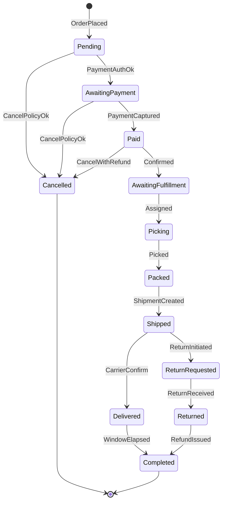
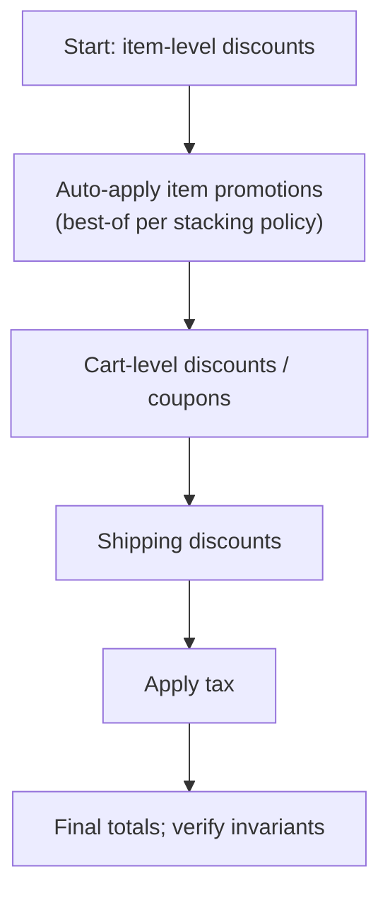
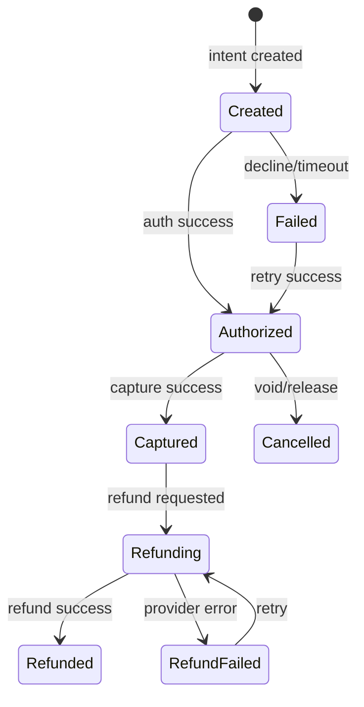
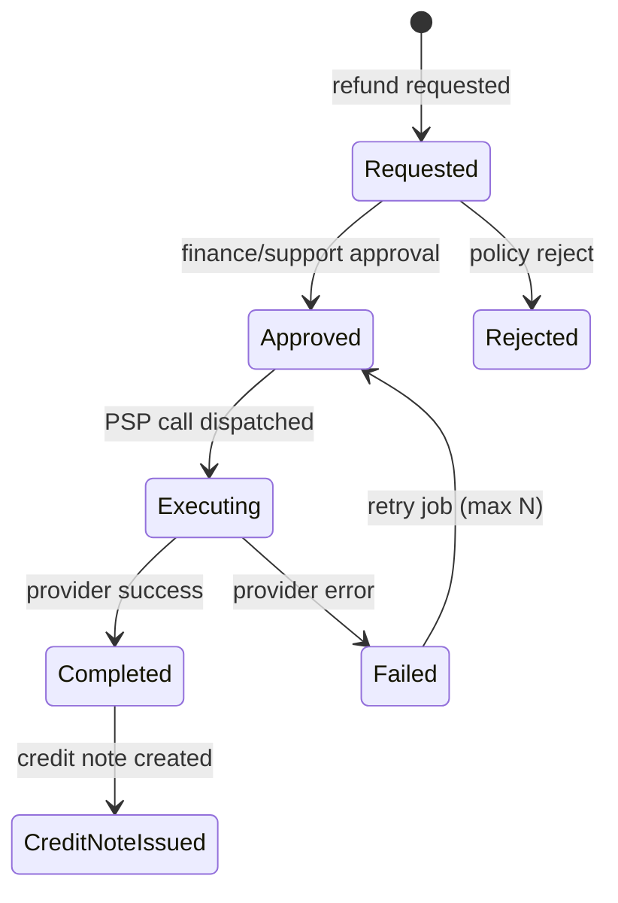

# Document 04a — Functional Requirements Specification (FRS)

> **Platform:** E-Commerce Platform (Working Title: `ECommerce`)
> **Document Type:** Functional Requirements Specification (Detailed)
> **Status:** Draft v1.0 for review
> **Audience:** Engineering (primary), QA, Product, Architecture
> **Inputs:** `03-business-requirements.md` (BRD), `04-software-requirements-specification.md` (SRS)
> **Outputs:** Module designs `12`–`29`, test plans `30`
> **Relationship:** This document is the authoritative, implementation-ready elaboration of SRS §4. Where a detail differs, this FRS governs.

---

## 1. Document Control

| Version | Date       | Author / Owner | Change Summary                       |
|---------|------------|----------------|---------------------------------------|
| 0.1     | 2026-07-24 | Tech Lead      | Structure, error model, core flows    |
| 0.2     | 2026-07-29 | Tech Lead      | All modules completed; edge cases     |
| 1.0     | 2026-07-31 | Tech Lead      | Baseline release                      |

### 1.1 Approvals

| Role                | Name | Decision | Date |
|----------------------|------|----------|------|
| Technical Lead       | —    | —        | —    |
| Enterprise Architect | —    | —        | —    |
| QA Lead              | —    | —        | —    |
| Product Owner        | —    | —        | —    |

---

## 2. Introduction

### 2.1 Purpose

This FRS specifies, at implementation depth, **what each software capability must do**: functional behavior, use-case flows, business rules, field-level validation, error handling, edge cases, emitted events, and acceptance criteria. It is the single source developers implement against and QA verifies against.

### 2.2 Scope

Fourteen functional modules (FRS-A…FRS-N) covering the complete commerce backend as defined in SRS §3.2.

### 2.3 Conventions & Notation

| Item | Convention |
|------|-----------|
| Requirement ID | `FRS-<Module>-<nnn>` |
| Use case ID | `UC-<Module>-<nnn>` |
| Error code | `ERR_<GROUP>_<NNN>` → Problem Details |
| Priority | Must / Should / Could |
| Money | `decimal(18,4)`; amount formatting decimal(2) for display |
| Time | UTC `timestamptz` |

### 2.4 Use Case Template

Each use case records: **Actor(s), Preconditions, Trigger, Main Flow, Alternate Flows, Postconditions, Business Rules, Validation, Error Mapping, Events, Acceptance Criteria.**

---

## 3. Global Error Model (Cross-Cutting)

All HTTP errors use **RFC 9457 Problem Details**:

```json
{
  "type": "https://api.ecommerce.dev/problems/validation-failed",
  "title": "Validation Failed",
  "status": 422,
  "detail": "One or more fields are invalid.",
  "traceId": "00-5c5b...-3d2c...-01",
  "errors": [
    { "field": "quantity", "code": "MIN", "message": "Quantity must be at least 1." }
  ]
}
```

### 3.1 Error Taxonomy

| Code | HTTP | Meaning | Typical Triggers |
|------|:----:|---------|------------------|
| `ERR_VALID_001` | 422 | Field validation failed | `errors[]` populated |
| `ERR_AUTH_001` | 401 | Missing/invalid token | Expired/malformed JWT |
| `ERR_AUTH_002` | 401 | Refresh token invalid/reused | Rotation violation |
| `ERR_AUTH_003` | 423 | Account locked | Lockout policy |
| `ERR_AUTH_004` | 403 | Insufficient permission | RBAC deny |
| `ERR_AUTH_005` | 429 | Too many auth attempts | Brute-force guard |
| `ERR_RES_001` | 404 | Resource not found | Bad id/slug/number |
| `ERR_RES_002` | 409 | State conflict | Illegal state transition |
| `ERR_RES_003` | 409 | Duplicate resource | SKU, coupon, review |
| `ERR_CAT_001` | 409 | Product not purchasable | Inactive/out of stock |
| `ERR_STK_001` | 409 | Insufficient stock | Allocation failure |
| `ERR_STK_002` | 409 | Stock adjusted below zero | Negative adjustment |
| `ERR_PAY_001` | 402 | Payment declined | Provider decline |
| `ERR_PAY_002` | 409 | Payment capture conflict | Capture > auth |
| `ERR_PAY_003` | 409 | Refund exceeds refundable | Policy violation |
| `ERR_PAY_004` | 502 | Provider unavailable | Timeout/5xx |
| `ERR_IDP_001` | 409 | Idempotency conflict | Same key, different payload |
| `ERR_RATE_001` | 429 | Rate limit exceeded | Consumer policy |
| `ERR_EXT_001` | 502 | External dependency failure | Carrier/tax/FX down |
| `ERR_INT_001` | 500 | Unhandled internal error | Bug; never leaks internals |

---

## 4. Module A — Identity & Access Management

### 4.1 Functional Requirements

| ID | Requirement | Priority | Acceptance Criteria |
|----|-------------|----------|---------------------|
| FRS-A-001 | Register customer with email, password, name, locale | Must | 201; verification email; unverified = browse-only |
| FRS-A-002 | Issue JWT + rotating refresh tokens | Must | Access TTL 15 min; refresh TTL 30 days; rotation revokes old |
| FRS-A-003 | Refresh tokens are single-use and device-bound | Must | Reuse → whole family revoked + alert |
| FRS-A-004 | Password reset with single-use 30-min token | Must | 202 always; token consumed once |
| FRS-A-005 | Email verification flow | Must | Token consumed; account flag flipped |
| FRS-A-006 | RBAC enforcement on all endpoints | Must | Default deny; 403 includes permission id |
| FRS-A-007 | Admin CRUD roles & permission assignments | Must | Every change audited |
| FRS-A-008 | Lockout: 5 failures → 15-min lock | Must | 423 with remaining seconds |
| FRS-A-009 | SuperAdmin impersonation with audit | Could | Session flagged; full trail |
| FRS-A-010 | Account closure & PII erasure pipeline | Should | 202; anonymization job; retention kept |

### 4.2 Use Case — UC-A-002 Login (JWT + Refresh)

| Item | Detail |
|------|--------|
| Actor | Customer, Admin, any role |
| Preconditions | Account exists; not locked; credentials valid |
| Trigger | `POST /api/v1/auth/login` |
| Main Flow | 1. Validate credentials. 2. Check lockout state. 3. Issue access JWT (claims: `sub`, `email`, `roles`, `perms`, `jti`). 4. Create refresh token (hashed, stored, device id, family id). 5. Return `{ accessToken, refreshToken, expiresIn, tokenType: "Bearer" }`. |
| Alt Flows | A: Locked → 423 + `retryAfter`. B: Invalid → 401; increment failure counter. C: Unverified email → 403 `emailNotVerified` (configurable). |
| Business Rules | RB-A-01 failure counter increments per (account, IP); resets on success. RB-A-02 access token contains permission codes, not just roles, to avoid DB hits. |
| Validation | email: format ≤ 254; password: ≥ 8, ≤ 128, complexity policy. |
| Error Mapping | 422 `ERR_VALID_001`; 401 `ERR_AUTH_001`; 423 `ERR_AUTH_003`; 429 `ERR_AUTH_005`. |
| Events | `UserLoggedIn` (audit only; no PII in event payload) |
| Acceptance | Token pair issued; `exp` checked; refresh exchanged → old revoked; logs contain `traceId` only. |

### 4.3 Use Case — UC-A-003 Refresh Rotation

| Item | Detail |
|------|--------|
| Main Flow | 1. Receive refresh token. 2. Verify signature + hash match + expiry + family status. 3. Atomically rotate: revoke current, issue new. 4. Return new pair. |
| Alt | Reuse of revoked token → revoke entire family; 401 `ERR_AUTH_002`; alert security channel. |
| Edge Cases | Token near expiry (< 60 s) refresh without failure; concurrent refresh (same token twice) → one wins, family revoked. |
| Acceptance | Rotation atomic under concurrency test (QAS-02 pattern). |

### 4.4 Edge Cases — Module A

| Edge Case | Behavior |
|-----------|----------|
| Email enumeration | Registration/login/reset always return generic responses (202/401) |
| Password hash storage | Argon2id/Bcrypt with per-user salt; never reversible |
| Impersonation expiry | Impersonation session expires with host session; child token claims include `impersonator` |
| Clock skew | JWT `nbf`/`exp` tolerance 30 s |
| Multi-device | Refresh token per device; logout-all revokes family |

---

## 5. Module B — Catalog & Search

### 5.1 Functional Requirements

| ID | Requirement | Priority | Acceptance Criteria |
|----|-------------|----------|---------------------|
| FRS-B-001 | Product create/update/deactivate; SKU + slug unique | Must | 409 on duplicate; inactive invisible |
| FRS-B-002 | Category hierarchy depth ≤ 5, no cycles | Must | 400 on violation |
| FRS-B-003 | Localized fields (10 languages) with fallback | Must | Fallback chain `locale→default→source` |
| FRS-B-004 | Price per currency; offer ≤ list | Must | decimal(18,4); validation |
| FRS-B-005 | Search with typo tolerance, p95 ≤ 300 ms | Must | Ranking deterministic; facets |
| FRS-B-006 | Filters: category, brand, price, rating, attributes | Must | Stable paging |
| FRS-B-007 | Bulk import/update (CSV/JSON) async | Should | Per-row error report |
| FRS-B-008 | Featured products with schedule | Should | Expiration honored |
| FRS-B-009 | Purchasable = active AND stock > 0 | Must | Cart add rejects otherwise (`ERR_CAT_001`) |

### 5.2 Use Case — UC-B-005 Search

| Item | Detail |
|------|--------|
| Flow | 1. Tokenize query. 2. Apply locale filters. 3. Rank (relevance + popularity). 4. Apply filters + facets. 5. Paginate. 6. Cache result key (`q|locale|currency|filters|page`) TTL 60 s. |
| Alt | No results → 200 empty + "suggestions" with relaxed terms. |
| Edge Cases | Diacritics (Arabic/French); stop-words; multi-word exact phrase; empty query → 422. |
| Acceptance | p95 ≤ 300 ms at 50,000 req/min; facet counts consistent with result set. |

### 5.3 Validation Rules (FRS-B field level)

| Field | Rule |
|-------|------|
| `sku` | 3–50 alnum+`-`/`_`; unique; immutable after creation |
| `slug` | 3–160; `[a-z0-9-]`; unique; derived from name |
| `price.amount` | > 0; ≤ 999,999,999.99 |
| `offerAmount` | ≤ list price; optional |
| `name.*` | 1–255 per locale; at least default locale required |
| `category.parentId` | Must not create cycle; depth ≤ 5 |

---

## 6. Module C — Cart & Wishlist

### 6.1 Functional Requirements

| ID | Requirement | Priority | Acceptance Criteria |
|----|-------------|----------|---------------------|
| FRS-C-001 | Guest cart via `cart-key`; TTL 30 days | Must | Survives refresh; purge job |
| FRS-C-002 | Merge on sign-in; conflict → newest `UpdatedAt` | Must | No duplicate lines; `CartMerged` event |
| FRS-C-003 | Add/update/remove lines; 1 ≤ qty ≤ 99 | Must | 422 on bounds; availability checked |
| FRS-C-004 | Totals recompute on every mutation | Must | Currency-consistent; breakdown fields |
| FRS-C-005 | Price change signaling | Should | Revalidation notice at checkout |
| FRS-C-006 | Wishlist add/remove/move-to-cart | Must | Move re-validates availability |
| FRS-C-007 | Expired cart purge | Should | Background job; order snapshots unaffected |

### 6.2 Use Case — UC-C-001 Add to Cart

| Item | Detail |
|------|--------|
| Flow | 1. Resolve cart (by key or customer). 2. Validate product purchasable (`FRS-B-009`). 3. Check qty bounds + availability. 4. Upsert line with current price snapshot. 5. Recompute totals. 6. Publish `CartItemAdded`. |
| Alt | Product price changed since snapshot → totals recalculated; customer notified at checkout. |
| Edge Cases | Same product added twice (merge lines); qty 0 → remove; cart concurrent updates (optimistic concurrency, version field). |
| Acceptance | Qty never exceeds availability at add time; totals correct to 2dp; concurrent updates do not lose lines. |

### 6.3 Validation Rules

| Field | Rule |
|-------|------|
| `productId` | Must exist and be active (`ERR_CAT_001`) |
| `quantity` | Integer 1..99 (`ERR_VALID_001`) |
| `cartKey` | UUIDv4 or customer id (mutually exclusive) |

---

## 7. Module D — Checkout & Orders (Core Flow, Full Detail)

### 7.1 Functional Requirements

| ID | Requirement | Priority | Acceptance Criteria |
|----|-------------|----------|---------------------|
| FRS-D-001 | Checkout initiation: validate, price, snapshot, verify stock | Must | Returns `checkoutId` + payment client token |
| FRS-D-002 | Atomic order placement: payment auth + stock allocation + order persist | Must | Single transaction; no order without auth; no auth without order |
| FRS-D-003 | Unique order number `E-YYYYMMDD-XXXXXX` | Must | Collision-free under concurrency |
| FRS-D-004 | Order state machine (enumerated transitions) | Must | Illegal transition → 409 `ERR_RES_002` |
| FRS-D-005 | Order history/detail (role-scoped) | Must | Timeline included |
| FRS-D-006 | Cancellation policy | Must | Restock on cancel; refund if paid |
| FRS-D-007 | Reorder | Should | Re-validate everything |
| FRS-D-008 | Support lookup | Must | By number/email/customer |
| FRS-D-009 | Ingestion scale 1,000/min | Must | Async consumers; sync path minimal |

### 7.2 Order State Machine (Authoritative)



### 7.3 Use Case — UC-D-001 Initiate Checkout

| Item | Detail |
|------|--------|
| Actor | Customer / Guest |
| Preconditions | Cart non-empty; cart totals computed; currency known |
| Trigger | `POST /api/v1/checkouts` |
| Main Flow | 1. Validate cart + addresses + shipping method + payment method. 2. Re-run pricing (FRS-E) — revalidate prices, stock, promotions. 3. Compute shipping rates (cache-aware). 4. Compute tax. 5. Create `Checkout` aggregate with full price breakdown snapshot. 6. Request payment authorization (see UC-G-001). 7. Return `checkoutId`, `paymentClientToken`, breakdown. |
| Alt | A: stock changed → 409 `ERR_STK_001` with line detail; UI refresh. B: price changed → 409 `PRICE_CHANGED` with delta; requires re-consent. C: promo invalidated → 409 with removed discount list. |
| Postconditions | Checkout stored (TTL 30 min); cart locked for mutation during checkout; stock soft-reserved (short TTL reservation). |
| Business Rules | RB-D-01 checkout price snapshot is immutable once created. RB-D-02 reservation released if checkout not completed in 30 min. |
| Errors | 422 `ERR_VALID_001`; 409 `ERR_STK_001`; 402 `ERR_PAY_001`; 429 `ERR_RATE_001`. |
| Events | `CheckoutCreated`. |
| Acceptance | Snapshot immutable; reservation released on expiry; all totals auditable to 4dp. |

### 7.4 Use Case — UC-D-002 Place Order (Atomic)

| Item | Detail |
|------|--------|
| Preconditions | Checkout exists; payment authorized; reservation active |
| Trigger | `POST /api/v1/checkouts/{id}/place` (with `Idempotency-Key`) |
| Main Flow | 1. Re-verify authorization status (capture or authorize-only per config). 2. Allocate stock atomically (UC-F-003). 3. Insert Order + lines + snapshots + `OrderStatusLog` (Pending). 4. Insert outbox event `OrderPlaced`. 5. Commit. 6. Return `orderNumber`, status, payment refs. |
| Alt | A: allocation fails → rollback, release partial, 409 `ERR_STK_001`. B: capture fails → order → AwaitingPayment; retry job. C: idempotency replay → return original response (200 with stored order). |
| Business Rules | RB-D-03 single DB transaction wraps all writes; outbox row in same transaction. RB-D-04 idempotency key unique per checkout. |
| Edge Cases | Duplicate submission (double-click/retry) → same order; concurrent place calls → one wins, other gets stored result; DB down → 503 (no partial state). |
| Events | `OrderPlaced` (outbox). |
| Acceptance | QAS-05 passes; no order without payment auth; no payment without order; 1,000/min sustained. |

### 7.5 Use Case — UC-D-004 State Transition Guard

| Item | Detail |
|------|--------|
| Flow | 1. Validate requested transition against state machine. 2. Apply transition + log + event. 3. Handle side effects (restock, notify, invoice). |
| Edge Cases | Concurrent transitions (two consumers) → optimistic concurrency; loser retries and sees current state; 409 if no longer valid. |
| Acceptance | Every transition atomic; duplicate events impossible (outbox dedupe by aggregate+sequence). |

### 7.6 Validation & Edge Cases — Module D

| Edge Case | Behavior |
|-----------|----------|
| Guest checkout email format | Validated; guest orders linkable on registration |
| Zero-amount order (100% discount) | Payment step skipped; order proceeds Paid |
| Cart empty at place | 409 `ERR_VALID_001` (cart changed) |
| Address outside supported countries | 422 country not serviced |
| Currency mismatch at place | 409; require new checkout |
| Order number overflow | Sequence resets daily; format guaranteed unique via DB constraint |

---

## 8. Module E — Pricing, Discounts & Promotions

### 8.1 Functional Requirements

| ID | Requirement | Priority | Acceptance Criteria |
|----|-------------|----------|---------------------|
| FRS-E-001 | Discount types: product, order, shipping; amount/percentage + caps | Must | Caps enforced; percentage ≤ 100 |
| FRS-E-002 | Promotion campaigns with conditions/actions | Must | Deterministic evaluation |
| FRS-E-003 | Coupon claim atomicity | Must | QAS-02: exactly N redemptions |
| FRS-E-004 | Stacking matrix + priority order | Must | Item → cart → shipping |
| FRS-E-005 | Non-negative totals invariant | Must | Validation rejects bad config |
| FRS-E-006 | Country/currency eligibility | Must | Scope filter |
| FRS-E-007 | Tax display mode per country | Must | Display incl./excl.; totals always incl. |
| FRS-E-008 | Schedule + pause | Should | Kill-switch immediate |
| FRS-E-009 | Order snapshot of applied promotions | Must | Historical immutability |

### 8.2 Use Case — UC-E-003 Coupon Redemption (Atomic)

| Item | Detail |
|------|--------|
| Flow | 1. Validate code exists, active, in dates. 2. Check usage limits (global + per-customer). 3. Atomically increment usage (`UPDATE ... SET used=used+1 WHERE used < limit`). 4. If rowcount = 0 → reject 409/400. 5. Attach to cart/order discount. |
| Alt | Limit reached → `COUPON_EXHAUSTED`. Customer-specific exceeded → `COUPON_ALREADY_USED`. |
| Business Rules | RB-E-01 redemption increment is a conditional update, never read-then-write. RB-E-02 failed orders roll back usage counters. |
| Acceptance | Concurrent test: exactly limit redemptions succeed. |

### 8.3 Evaluation Priority (Authoritative)



### 8.4 Validation & Edge Cases — Module E

| Edge Case | Behavior |
|-----------|----------|
| Overlapping promotions | Stacking matrix field `allowStackWith`; else best-of |
| Percentage on item < 1 currency unit | Discount floors at min(price, applied) |
| Free shipping coupon + out-of-region | Scope check rejects before application |
| Expired during cart session | Discount dropped; customer notified |
| Amount discount > subtotal | Clamped to subtotal; total ≥ 0 |

---

## 9. Module F — Inventory & Warehouses

### 9.1 Functional Requirements

| ID | Requirement | Priority | Acceptance Criteria |
|----|-------------|----------|---------------------|
| FRS-F-001 | Warehouse CRUD with allocation rank | Must | Unique code; audit |
| FRS-F-002 | Append-only stock ledger | Must | Every change traceable |
| FRS-F-003 | Atomic reservation; `allocated ≤ on_hand` invariant | Must | QAS-01 passes |
| FRS-F-004 | Allocation strategy: country rank → availability → load | Must | Deterministic; logged |
| FRS-F-005 | Adjustments with reason + approval | Must | Negative requires approval |
| FRS-F-006 | Warehouse transfers (ledger pair) | Must | `StockTransferred` event |
| FRS-F-007 | Low-stock alerts with dedupe cooldown | Must | Cooldown configurable |
| FRS-F-008 | Backorder queue + fulfillment on restock | Should | Notify customer on fill |
| FRS-F-009 | Availability projection view | Could | `on_hand − allocated − in_transit` |

### 9.2 Use Case — UC-F-003 Atomic Allocation

| Item | Detail |
|------|--------|
| Flow | 1. Determine target warehouses by country rank. 2. Per line: `SELECT ... FOR UPDATE` stock row. 3. Validate `on_hand − allocated ≥ qty`. 4. Increment `allocated`, write ledger `reserve`. 5. Return allocation map. |
| Alt | Partial availability → allocate available, remainder → backorder (per config) or fail checkout. |
| Edge Cases | Two orders racing for last units → row lock serializes; second fails cleanly. Transfer in flight → in-transit excluded. |
| Acceptance | QAS-01: exactly 10 succeed; invariant holds at all times; no deadlocks in stress test. |

### 9.3 Validation Rules

| Field | Rule |
|-------|------|
| `sku` | Must exist |
| `warehouseId` | Must exist + active |
| `quantity` | Integer > 0 |
| `reasonCode` | Required; whitelist (sales, return, adjustment, transfer, damage, count) |
| Negative adjustment | Requires `approvedBy` (finance/super admin) |

---

## 10. Module G — Payments

### 10.1 Functional Requirements

| ID | Requirement | Priority | Acceptance Criteria |
|----|-------------|----------|---------------------|
| FRS-G-001 | `IPaymentProvider` abstraction + registry | Must | ≥ 2 adapters; region/currency routing |
| FRS-G-002 | Authorize at checkout; capture at fulfillment-ready | Must | Capture ≤ auth; window honored |
| FRS-G-003 | Webhook ingestion: signature + dedupe + idempotent | Must | QAS-04 passes |
| FRS-G-004 | Failover on defined failure signals | Should | No double charge |
| FRS-G-005 | Retry with backoff; customer notified | Must | Config attempts |
| FRS-G-006 | No raw PAN; tokens only | Must | PCI scope out |
| FRS-G-007 | Payment ledger (attempts + transitions) | Must | Reconciliation-ready |
| FRS-G-008 | Refunds via originating provider, idempotent | Must | Reference stored |
| FRS-G-009 | Nightly reconciliation | Should | Drift flagged |
| FRS-G-010 | FX snapshot at auth | Must | Rate + source stored |

### 10.2 Payment State Machine



### 10.3 Use Case — UC-G-001 Authorize Payment

| Item | Detail |
|------|--------|
| Flow | 1. Route provider by (country, currency, enabled). 2. Create intent (amount, currency, method, idempotency). 3. Store `PaymentToken` + provider ref; ledger `authorize`. 4. Return client token. |
| Alt | Decline → 402 `ERR_PAY_001` mapped to friendly message; offer alternate provider. Timeout → failover provider (config) or mark Failed for retry. |
| Business Rules | RB-G-01 idempotency key = checkoutId+attempt#. RB-G-02 amounts always in minor units to provider; store decimal(18,4). |
| Acceptance | Provider abstraction honored; no PAN anywhere; auth window tracked. |

### 10.4 Use Case — UC-G-003 Webhook Processing (Idempotent)

| Item | Detail |
|------|--------|
| Flow | 1. Verify provider signature. 2. Dedupe by provider event id (unique index). 3. Map event → state transition. 4. Apply transition + ledger + domain event. 5. Ack. |
| Alt | Unknown event type → log + drop (no side effects). Out-of-order event (older timestamp) → reject as stale. |
| Acceptance | QAS-04: duplicate delivery yields single effect; stale events ignored. |

### 10.5 Edge Cases — Module G

| Edge Case | Behavior |
|-----------|----------|
| Auth expires before capture | Automatic void; order → AwaitingPayment; retry payment flow |
| Capture amount mismatch | Reject > auth (`ERR_PAY_002`) |
| Partial capture policy | Config per merchant; captured < auth → rest voided |
| Refund race with capture | State machine serializes; retry |
| FX rate change between auth/capture | Uses auth-time rate; delta surfaced in reconciliation |

---

## 11. Module H — Shipping & Fulfillment

### 11.1 Functional Requirements

| ID | Requirement | Priority | Acceptance Criteria |
|----|-------------|----------|---------------------|
| FRS-H-001 | `IShippingProvider` abstraction | Must | ≥ 2 carriers |
| FRS-H-002 | Rate estimation with cache (TTL 10 min) + manual fallback | Must | Fallback flagged |
| FRS-H-003 | Fulfillment queue per warehouse (SignalR + REST) | Must | Push + poll |
| FRS-H-004 | Pick list generation | Must | Grouped by zone; barcode-ready |
| FRS-H-005 | Shipment creation + tracking | Must | `ShipmentCreated` event |
| FRS-H-006 | Split shipments | Should | Per-warehouse tracking |
| FRS-H-007 | Address correction pre-shipment | Should | Audited |
| FRS-H-008 | Delivery confirmation → order Delivered | Must | Carrier signal |

### 11.2 Use Case — UC-H-003 Fulfillment Task Processing

| Item | Detail |
|------|--------|
| Flow | 1. Consumer picks order → warehouse queue. 2. Assign picker. 3. Generate pick list. 4. Picker marks picked → Packed. 5. Create shipment via carrier (label + tracking). 6. Publish `ShipmentCreated`; notify customer. |
| Alt | Item missing → exception logged; shortage workflow (allocate from other warehouse or backorder). |
| Edge Cases | Partial picking; barcode mismatch → block with error; carrier API down → queue retry with escalation. |
| Acceptance | Queue push < 5 s after payment; tracking stored; status propagates to order + customer. |

---

## 12. Module I — Finance, Invoices & Refunds

### 12.1 Functional Requirements

| ID | Requirement | Priority | Acceptance Criteria |
|----|-------------|----------|---------------------|
| FRS-I-001 | Invoice on Paid (PDF via job) | Must | Immutable copy stored |
| FRS-I-002 | Credit notes linked to invoices; sequential numbering | Must | Link retained |
| FRS-I-003 | Tax calc via provider + fallback rules | Must | Rate + amount stored |
| FRS-I-004 | Refund workflow state machine | Must | Idempotent execution |
| FRS-I-005 | Reconciliation feed (invoiced/collected/refunded/outstanding) | Must | Per-currency |
| FRS-I-006 | Financial audit trail | Must | Append-only, queryable |

### 12.2 Refund State Machine



### 12.3 Use Case — UC-I-004 Process Refund

| Item | Detail |
|------|--------|
| Flow | 1. Validate refundable amount ≤ (paid − previously refunded). 2. Create refund (Requested). 3. Approve per policy. 4. Execute idempotently via PSP (key = refundId). 5. On success → Completed + credit note + restock if return. 6. Notify customer. |
| Alt | Provider failure → Failed → retry job (max 5, backoff). Refund > refundable → 409 `ERR_PAY_003`. |
| Edge Cases | Partial refunds; concurrent refund requests (lock); currency mismatch; cancelled then refunded. |
| Acceptance | No double refund (QAS-04 pattern); totals never negative; audit complete. |

---

## 13. Module J — Notifications

| ID | Requirement | Priority | Acceptance Criteria |
|----|-------------|----------|---------------------|
| FRS-J-001 | Event-driven dispatch | Must | Order/refund/payment events → jobs |
| FRS-J-002 | Email + SMS adapters; in-app inbox | Must | Push-ready interface |
| FRS-J-003 | Per-channel preferences; transactional exempt | Must | Opt-out honored |
| FRS-J-004 | Templates with placeholders, 10 languages | Must | Fallback rendering |
| FRS-J-005 | Delivery reliability: retries + DLQ alert | Must | Idempotent per (event, channel, recipient) |
| FRS-J-006 | PII safety: tokenized payloads | Must | Redaction enforced |

### Edge Cases

| Edge Case | Behavior |
|-----------|----------|
| Template missing locale | Fallback chain; admin warning |
| Gateway down | Retry with backoff; alert after N |
| Duplicate event | Dedupe key prevents double send |
| Unsubscribed transactional? | Never suppressed (legal requirement) |

---

## 14. Module K — Reviews & Ratings

| ID | Requirement | Priority | Acceptance Criteria |
|----|-------------|----------|---------------------|
| FRS-K-001 | Submit review (1–5 + comment) | Must | Verified purchase; one per product per customer |
| FRS-K-002 | Moderation (auto-flag + queue) | Must | Approve/reject with reason |
| FRS-K-003 | Rating aggregation on publish/remove | Must | Event-driven recompute + cache invalidation |
| FRS-K-004 | Support/compliance removal with audit | Must | Re-aggregate |
| FRS-K-005 | Voting (helpful/not), abuse throttling | Could | One vote per customer |

### Edge Cases

| Edge Case | Behavior |
|-----------|----------|
| Review before purchase | Rejected 403 |
| Duplicate review | 409 `ERR_RES_003` |
| Product deactivated | Reviews retained; hidden |
| Bulk rejection | Audited with reason |

---

## 15. Module L — Analytics & Reporting

| ID | Requirement | Priority | Acceptance Criteria |
|----|-------------|----------|---------------------|
| FRS-L-001 | Sales analytics (revenue/orders/AOV by period/country/currency) | Must | FX-normalized with rate note |
| FRS-L-002 | Product performance | Must | Units/revenue/conversion/rating |
| FRS-L-003 | Inventory reports | Should | Levels, stock-outs, dead stock, valuation |
| FRS-L-004 | Promotion performance | Should | Redemptions + incremental revenue |
| FRS-L-005 | Fulfillment metrics | Should | Cycle time, on-time %, backlog |
| FRS-L-006 | Finance reports | Must | Invoiced/collected/refunds/outstanding |
| FRS-L-007 | Async exports with download links | Must | Job + TTL |
| FRS-L-008 | Real-time dashboards | Could | SignalR tiles |

### Reporting Contract

| Item | Detail |
|------|--------|
| Source of truth | PostgreSQL read models/queries; no analytics DB in v1 |
| Timezone | Reports group by UTC period; display local |
| Money | Report totals in base currency + source currency columns |
| Export size limit | ≤ 500k rows/file; larger → chunked files (zip) |

---

## 16. Module M — Platform Services

| ID | Requirement | Priority | Acceptance Criteria |
|----|-------------|----------|---------------------|
| FRS-M-001 | Audit logging (who/what/when/from/to, tamper-evident) | Must | Append-only; hash chain |
| FRS-M-002 | Feature flags (env/segment targeting, kill-switch) | Must | Cache TTL 30 s; audited |
| FRS-M-003 | Hangfire jobs with retries, schedules, alerts | Must | Dashboard role-locked |
| FRS-M-004 | Outbound webhooks (signed, retries, replay) | Should | Delivery log |
| FRS-M-005 | Distributed rate limiting (Redis sliding window) | Must | 429 + `Retry-After` |
| FRS-M-006 | Health endpoints (live/ready, dependency status) | Must | Readiness degrades |
| FRS-M-007 | API versioning + deprecation policy | Must | Retire per policy |
| FRS-M-008 | Bulk operations with per-row errors | Should | Async jobs |

### Audit Record Schema (Logical)

| Field | Type | Notes |
|-------|------|-------|
| `id` | bigint | PK |
| `actorId` | uuid | Subject |
| `actorType` | enum | user/system/impersonated |
| `action` | string | `order.cancel`, `stock.adjust`, … |
| `entityType`, `entityId` | string/uuid | Target |
| `before`, `after` | jsonb | Delta |
| `ip`, `userAgent` | string | Request context |
| `traceId` | string | Correlation |
| `hash`, `prevHash` | text | Tamper-evident chain |
| `occurredAt` | timestamptz | UTC |

---

## 17. Module N — Real-time (SignalR)

| ID | Requirement | Priority | Acceptance Criteria |
|----|-------------|----------|---------------------|
| FRS-N-001 | Customer order-status hub | Must | Push to authenticated group |
| FRS-N-002 | Warehouse hub (tasks, stock alerts) | Should | Redis backplane; reconnection resume |
| FRS-N-003 | Admin metrics tiles | Could | Live updates |
| FRS-N-004 | At-least-once with event ids + REST fallback | Must | No missed events |

### Edge Cases

| Edge Case | Behavior |
|-----------|----------|
| Reconnect | Client sends last `eventId`; missed events replayed |
| Scale-out | Redis backplane routes cross-node |
| Auth on hub | JWT validated on connect; group membership server-side |
| Server restart | Events persisted in outbox; replay on reconnect |

---

## 18. Cross-Cutting Functional Requirements

| ID | Requirement |
|----|-------------|
| FRS-X-001 | Every mutating endpoint honors `Idempotency-Key` where marked in OpenAPI |
| FRS-X-002 | Every protected operation writes an audit record (FRS-M-001) |
| FRS-X-003 | Every aggregate change emits domain events via transactional outbox |
| FRS-X-004 | All validation returns `errors[]` with field + code |
| FRS-X-005 | No secrets or PII in logs, traces, or events (redaction policy) |
| FRS-X-006 | All list endpoints paginated (`page`/`pageSize` ≤ 100, `cursor` for hot paths) |
| FRS-X-007 | All endpoints rate-limited per consumer; documented limits |

---

## 19. Use Case Inventory (Complete List)

| Use Case | Title | FRS Ref |
|----------|-------|---------|
| UC-A-001 | Register | A-001 |
| UC-A-002 | Login | A-002 |
| UC-A-003 | Refresh rotation | A-003 |
| UC-A-004 | Password reset | A-004 |
| UC-B-005 | Search | B-005 |
| UC-C-001 | Add to cart | C-001 |
| UC-C-002 | Cart merge | C-002 |
| UC-D-001 | Initiate checkout | D-001 |
| UC-D-002 | Place order | D-002 |
| UC-D-004 | State transition | D-004 |
| UC-E-003 | Coupon redemption | E-003 |
| UC-F-003 | Stock allocation | F-003 |
| UC-G-001 | Authorize payment | G-001 |
| UC-G-003 | Webhook processing | G-003 |
| UC-H-003 | Fulfillment task | H-003 |
| UC-I-004 | Process refund | I-004 |

> Full expanded use cases (all flows, all modules) live in module designs `12`–`29`. This FRS defines the authoritative core set above.

---

## 20. Traceability

| FRS Module | BRD Group | SRS § | Module Design |
|-----------|-----------|-------|---------------|
| A — Identity | BR-11xx | §4.1 | `10`, `11` |
| B — Catalog | BR-12xx | §4.2 | `12` |
| C — Cart | BR-13xx | §4.3 | `13` |
| D — Orders | BR-14xx | §4.4 | `14` |
| E — Pricing | BR-17xx | §4.5 | `15` |
| F — Inventory | BR-18xx | §4.6 | `16` |
| G — Payments | BR-19xx | §4.7 | `17` |
| H — Shipping | BR-15xx | §4.8 | `18` |
| I — Finance | BR-16xx | §4.9 | `19` |
| J — Notifications | BR-20xx | §4.10 | `20` |
| K — Reviews | BR-21xx | §4.11 | `21` |
| L — Analytics | BR-22xx | §4.12 | `22` |
| M — Platform | BR-23xx | §4.13 | `23`–`29` |
| N — Real-time | BR-14xx/15xx | §4.14 | `27` |

---

## 21. Approvals

| Role | Name | Decision | Date |
|------|------|----------|------|
| Technical Lead | — | — | — |
| Enterprise Architect | — | — | — |
| QA Lead | — | — | — |
| Product Owner | — | — | — |

---

*End of Document 04a — Functional Requirements Specification.*
*Next document on request: `05-non-functional-requirements.md`.*
