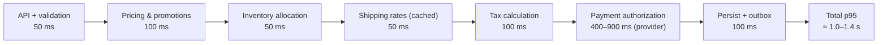
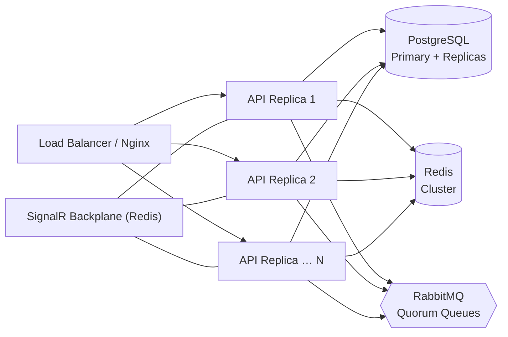
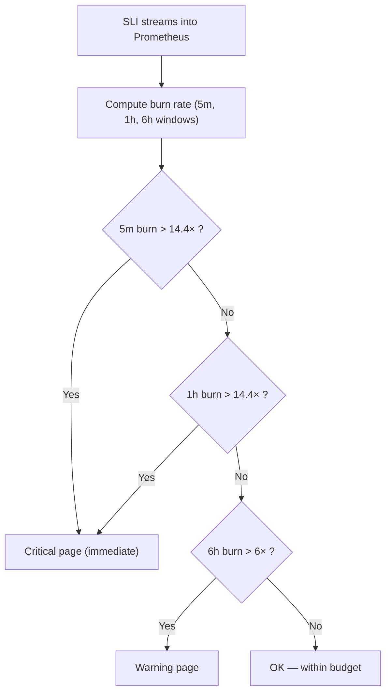
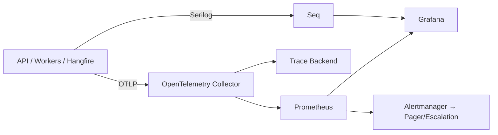

# Document 05 — Non-Functional Requirements & SLOs

> **Platform:** E-Commerce Platform (Working Title: `ECommerce`)
> **Document Type:** Non-Functional Requirements Specification (NFR / SLO Baseline)
> **Status:** Draft v1.0 for review
> **Audience:** Engineering, SRE/DevOps, Architecture, Security, QA, Product
> **Inputs:** `01-project-charter.md` (§9 Scale Targets), `04-software-requirements-specification.md` (§6)
> **Outputs:** Load test plan `34`, runbooks `32`, infrastructure design `32`, Grafana dashboards

---

## 1. Document Control

| Version | Date       | Author / Owner | Change Summary                        |
|---------|------------|----------------|----------------------------------------|
| 0.1     | 2026-07-26 | Enterprise Architect | Capacity model and SLO drafts   |
| 0.2     | 2026-07-30 | SRE Lead      | Burn-rate alerting, verification plans |
| 1.0     | 2026-07-31 | Enterprise Architect | Baseline release                 |

### 1.1 Approvals

| Role                | Name | Decision | Date |
|----------------------|------|----------|------|
| Enterprise Architect | —    | —        | —    |
| Technical Lead       | —    | —        | —    |
| SRE / DevOps Lead    | —    | —        | —    |
| QA Lead              | —    | —        | —    |
| Product Owner        | —    | —        | —    |

---

## 2. Introduction

### 2.1 Purpose

This document defines the **non-functional requirements (NFRs)** of the `ECommerce` platform: the quality attributes, measurable targets (SLOs), capacity model, measurement methodology, and verification strategy. It is the contract against which load tests, resilience tests, and production dashboards are evaluated.

### 2.2 Scope

Covers: performance, capacity, scalability, availability, reliability, consistency, security, observability, operability, portability, compliance. Implementation details belong to architecture (`06`) and infrastructure (`32`) documents.

### 2.3 Definitions

| Term | Definition |
|------|-----------|
| SLO | Service Level Objective — target value for a measurement |
| SLI | Service Level Indicator — the measured quantity |
| Error Budget | `100% − SLO` allowance for bad events per window |
| RTO | Recovery Time Objective — max acceptable outage duration |
| RPO | Recovery Point Objective — max acceptable data loss |
| Burn Rate | Rate at which error budget is consumed relative to window |

---

## 3. NFR Summary & Priority

| Category | Group | Highest-Priority NFRs |
|----------|-------|------------------------|
| Performance | NFR-PERF | Order placement, checkout p95, catalog p95 |
| Capacity & Scale | NFR-CAP | 1,000 orders/min; 250K concurrent; storage model |
| Availability | NFR-AVL | 99.9% availability; RTO ≤ 15 min; RPO ≤ 5 min |
| Reliability | NFR-RLB | At-least-once delivery; idempotency; outbox lag |
| Consistency | NFR-CNS | No oversell; money invariants; reconciliation drift 0 |
| Security | NFR-SEC | ASVS L1; no CVSS≥7 deps; no secrets |
| Observability | NFR-OBS | Traces/metrics/logs 100% of processes |
| Operability | NFR-OPS | One-command stack; flag rollback; architecture tests |
| Compliance | NFR-CMP | GDPR-aligned; PCI out-of-scope; tax per country |

---

## 4. Performance NFRs

### 4.1 Latency SLOs

| ID | Operation | p95 Target | p99 Target | Notes |
|----|-----------|-----------:|-----------:|-------|
| NFR-PERF-01 | Order placement (end-to-end) | ≤ 1.5 s | ≤ 3 s | Includes payment authorization |
| NFR-PERF-02 | Checkout initiation | ≤ 1.2 s | ≤ 2.5 s | Includes pricing + rates + tax |
| NFR-PERF-03 | Cart mutation | ≤ 150 ms | ≤ 400 ms | Redis-assisted |
| NFR-PERF-04 | Catalog product read | ≤ 150 ms | ≤ 300 ms | Cache hit ≥ 90% |
| NFR-PERF-05 | Product search | ≤ 300 ms | ≤ 600 ms | |
| NFR-PERF-06 | Order history read | ≤ 200 ms | ≤ 500 ms | Paged |
| NFR-PERF-07 | Auth token validation | ≤ 50 ms | ≤ 100 ms | Middleware only, no DB |
| NFR-PERF-08 | Notification enqueue | ≤ 500 ms | ≤ 1 s | From event to job queued |
| NFR-PERF-09 | Outbox → bus delivery | p99 ≤ 2 s | p99.9 ≤ 5 s | Publisher latency |
| NFR-PERF-10 | SignalR push to client | ≤ 5 s after state change | — | Warehouse queue push |

### 4.2 Checkout Latency Budget (NFR-PERF-01 decomposition)

> p95 budget leaves headroom under the 1.5 s SLO. Provider calls dominate; everything local stays under 450 ms combined.

### 4.3 Throughput SLOs

| ID | Operation | Sustained Peak | Burst |
|----|-----------|---------------:|------:|
| NFR-PERF-11 | Order placement | 1,000 orders/min (16.7/s) | 2× for 60 s |
| NFR-PERF-12 | Checkout initiation | 1,000/min | 2× |
| NFR-PERF-13 | Cart operations | 3,000/min | — |
| NFR-PERF-14 | Catalog browse | 50,000 req/min (833/s) | 100,000 for 5 min |
| NFR-PERF-15 | Search | 10,000 req/min | 20,000 |
| NFR-PERF-16 | Auth (login+refresh) | 2,000/min | 5,000 burst |
| NFR-PERF-17 | Webhook ingestion | 3,000 events/min | — |
| NFR-PERF-18 | Event bus consumption | 50,000 events/min | — |

---

## 5. Capacity Model

### 5.1 Traffic Profile

```mermaid
gantt
    title Daily Traffic Profile (Orders/min, illustrative)
    dateFormat HH:mm
    axisFormat %H:%M
    section Orders
    Overnight (00-06) : 00:00, 360m
    Ramp up (06-09)   : 06:00, 180m
    Peak hour (09-10) : 09:00, 60m
    Daytime (10-18)   : 10:00, 480m
    Evening peak (18-21) : 18:00, 180m
    Wind down (21-24)  : 21:00, 180m
```

| Load Phase | Orders/min | Duration |
|------------|-----------:|----------|
| Overnight trough | 80 | 06h |
| Morning ramp | 400 | 03h |
| Morning peak | 1,000 | 01h |
| Daytime | 500 | 08h |
| Evening peak | 1,000 | 03h |
| Wind down | 300 | 03h |
| **Daily total** | **≈ 576,000 orders/day** | 24h |
| **Monthly total** | **≈ 17M orders/month** | — |
| **Annual total** | **≈ 210M orders/year** | — |

### 5.2 Storage Model (PostgreSQL)

| Dataset | Growth (per year) | Est. Row Size | Est. Storage/yr |
|---------|-------------------:|--------------:|-----------------:|
| Orders | 210M | 3 KB | ≈ 630 GB |
| Order items | 630M (avg 3/order) | 1 KB | ≈ 630 GB |
| Stock ledger entries | ≈ 1.3B (6/order) | 250 B | ≈ 325 GB |
| Audit records | ≈ 2.1B (10/order) | 500 B | ≈ 1 TB |
| Outbox events | ≈ 4.2B (20/order) | 300 B | ≈ 1.2 TB |
| Payments ledger | 210M+ | 600 B | ≈ 126 GB |
| Catalog (300K products) | static | — | ≈ 20 GB |
| Reviews | 50M | 800 B | ≈ 40 GB |
| **Total (year 1)** | | | **≈ 4 TB** |

### 5.3 Capacity Implications (Derived Requirements)

| # | Requirement | Rationale |
|---|-------------|-----------|
| NFR-CAP-01 | Hot data retained hot; audit/events partitioned + archived after 90 days | Outbox/audit dominate storage |
| NFR-CAP-02 | Read replicas for reporting + reads; primary only for writes | Read:write ≈ 20:1 |
| NFR-CAP-03 | Outbox cleanup job after confirmed delivery | Prevent unbounded growth |
| NFR-CAP-04 | Partitioning by month for ledger/audit/outbox tables | Retention + archive |
| NFR-CAP-05 | Redis holds catalog/cart/session hot data; catalog fully cacheable | ≥ 90% hit ratio |
| NFR-CAP-06 | Indexing policy per hot query in `07-data-model-erd.md` | Avoid seq scans |

### 5.4 Concurrency

| Dimension | Value |
|-----------|-------|
| Concurrent shoppers | 250,000 |
| Concurrent API connections | 20,000 |
| SignalR concurrent connections | 50,000 (3 warehouses × shift) |
| Order placement concurrency | 16.7/s sustained, 33/s burst |

---

## 6. Scalability NFRs

| ID | Requirement | Target / Evidence |
|----|-------------|-------------------|
| NFR-SCL-01 | Horizontal scaling of API replicas | Load test shows linear scaling ≥ 4 replicas |
| NFR-SCL-02 | Statelessness | No in-memory session state; Redis for shared state; sticky sessions disabled |
| NFR-SCL-03 | Redis backplane for SignalR | Cross-node push verified in scale-out test |
| NFR-SCL-04 | Consumer group scale-out for MassTransit | Multiple consumers of same queue with no duplicate effects |
| NFR-SCL-05 | Read/Write separation | Reads via replica; writes via primary; failover documented |
| NFR-SCL-06 | Auto-scaling trigger metrics defined | CPU > 70% for 5 min OR queue depth > threshold → scale out |
| NFR-SCL-07 | No single-node SPOF in data path | Cache, broker, DB all have HA topology (§6 of `32`) |

### Scaling Strategy

---

## 7. Availability & Reliability NFRs

### 7.1 SLO Baseline

| ID | SLO | Window | Error Budget |
|----|-----|--------|--------------|
| NFR-AVL-01 | Availability ≥ 99.9% | Monthly | ≤ 43.8 min/month |
| NFR-AVL-02 | Order placement success ≥ 99.9% | Monthly | 0.1% of requests |
| NFR-AVL-03 | API request success (2xx/4xx) ≥ 99.9% | Monthly | 0.1% |
| NFR-AVL-04 | Event delivery (outbox→bus) ≥ 99.95% within 2 s | Monthly | 0.05% |
| NFR-AVL-05 | RTO ≤ 15 min | Per incident | — |
| NFR-AVL-06 | RPO ≤ 5 min | Per incident | Outbox + WAL |

### 7.2 Availability Composition (Illustrative)

| Component | Target | Notes |
|-----------|--------|-------|
| Nginx/API | 99.99% | ≥ 2 replicas |
| PostgreSQL | 99.95% | Primary + hot standby |
| Redis | 99.95% | Sentinel/cluster |
| RabbitMQ | 99.95% | Quorum queues, HA |
| External providers (PSP/carrier) | 99.9% | Failover/manual fallback |
| **Composite (approx.)** | **≈ 99.94%** | Exceeds 99.9% SLO with headroom |

### 7.3 Burn-Rate Alerting

### 7.4 Reliability NFRs

| ID | Requirement |
|----|-------------|
| NFR-RLB-01 | At-least-once event delivery; all consumers idempotent |
| NFR-RLB-02 | Outbox publisher monitors lag; alert if p99 > 2 s for 5 min |
| NFR-RLB-03 | Dead-letter queues surface to operators within 5 min |
| NFR-RLB-04 | Idempotency enforced on: order placement, payment capture, refund, webhooks |
| NFR-RLB-05 | Graceful degradation matrix (below) |

### 7.5 Degradation Matrix

| Dependency Failure | Behavior | Customer Impact |
|--------------------|----------|-----------------|
| Redis down | Catalog falls back to DB (slower); rate-limit/lock fail-open with alarm | Increased latency, no data loss |
| RabbitMQ down | Outbox accumulates; API still serves reads; writes limited per policy | Delayed notifications/integrations |
| PostgreSQL primary down | Failover to standby (≤ 60 s automatic / ≤ 5 min manual) | Brief write outage |
| PSP unavailable | Retry/backoff; alternate provider if enabled; else decline gracefully | Checkout fails cleanly, no double charge |
| Carrier unavailable | Manual rate fallback; queue shipment | Fulfillment delayed, order state safe |
| Email/SMS gateway down | Jobs retry; DLQ alert | Notifications delayed |

---

## 8. Data Consistency NFRs

| ID | Requirement | Target |
|----|-------------|--------|
| NFR-CNS-01 | No overselling under concurrency | QAS-01 always passes |
| NFR-CNS-02 | Money invariants (non-negative totals, discount ≤ subtotal) | Never violated (tests + DB constraints) |
| NFR-CNS-03 | Payment/refund reconciliation drift | 0 undetected (nightly job) |
| NFR-CNS-04 | Order state machine: no illegal transitions | 0 occurrences |
| NFR-CNS-05 | Outbox guarantees write→event atomicity | 100% of business writes |
| NFR-CNS-06 | Order/checkout snapshot immutability | No post-hoc mutation |

---

## 9. Security NFRs

| ID | Requirement | Evidence |
|----|-------------|----------|
| NFR-SEC-01 | OWASP ASVS Level 1 baseline | Security review checklist |
| NFR-SEC-02 | No dependency with CVSS ≥ 7.0 | CI gate blocks PR |
| NFR-SEC-03 | No secrets in repo/config/artifacts | Secret scan in CI + pre-commit |
| NFR-SEC-04 | JWT TTL 15 min; refresh rotation; no tokens in logs | Code review + tests |
| NFR-SEC-05 | Rate limiting on auth + checkout | Attack simulation in load tests |
| NFR-SEC-06 | Input validation on all boundaries | FluentValidation + DB constraints + fuzzing |
| NFR-SEC-07 | TLS 1.2+ everywhere; HSTS in prod | Infra config |
| NFR-SEC-08 | Audit trail tamper-evident | Hash-chain verification test |
| NFR-SEC-09 | No raw PAN / PII in logs, traces, events | Redaction policy + tests |

---

## 10. Observability NFRs

| ID | Requirement | Target |
|----|-------------|--------|
| NFR-OBS-01 | Structured logs from every process (Serilog) | 100% request coverage with `traceId` |
| NFR-OBS-02 | OpenTelemetry traces on all API + consumer paths | Sampling: 100% errors, 10% success |
| NFR-OBS-03 | Prometheus metrics: HTTP, DB, Redis, MQ, outbox lag, jobs | Dashboards per domain |
| NFR-OBS-04 | Business metrics (orders/min, revenue, refund rate, stock alerts) | Grafana + alerts |
| NFR-OBS-05 | Health endpoints feed load balancer and probes | `/health/live`, `/health/ready` |
| NFR-OBS-06 | MTTR target | ≤ 15 min with runbooks |

### Observability Architecture

---

## 11. Operability & Maintainability NFRs

| ID | Requirement | Target |
|----|-------------|--------|
| NFR-OPS-01 | Local dev environment | `docker compose up` single command |
| NFR-OPS-02 | Feature-flag rollback | Any flagged capability off within 60 s |
| NFR-OPS-03 | Architecture compliance | Architecture tests run in CI (no layer violations) |
| NFR-OPS-04 | Code coverage | ≥ 80% branch |
| NFR-OPS-05 | Zero-downtime deploys | Rolling deploy verified |
| NFR-OPS-06 | DB migrations | Forward-only; backward-compatible releases |
| NFR-OPS-07 | Secrets management | Env vars / secret store; never appsettings |
| NFR-OPS-08 | Runbook coverage | Every top-10 failure mode has a runbook |
| NFR-OPS-09 | Onboarding | New engineer runs full stack in < 30 min |

---

## 12. Portability & Compatibility NFRs

| ID | Requirement |
|----|-------------|
| NFR-PRT-01 | Runs in any CNCF-aligned cloud; no cloud-proprietary APIs in code |
| NFR-PRT-02 | Containerized; Dockerfile multi-stage; images pinned |
| NFR-PRT-03 | OpenAPI 3.x contract; clients versioned |
| NFR-PRT-04 | Timezones: UTC storage, locale display |
| NFR-PRT-05 | Locale support: 10 languages, 5 currencies, 15 countries |

---

## 13. Compliance NFRs

| ID | Requirement |
|----|-------------|
| NFR-CMP-01 | GDPR-aligned: consent, erasure, data inventory, retention schedules |
| NFR-CMP-02 | PCI scope: no PAN storage/processing; tokenization; SAQ evidence |
| NFR-CMP-03 | Tax/VAT per country via provider + fallback rules |
| NFR-CMP-04 | Audit retention configurable; compliance export |
| NFR-CMP-05 | Accessibility of admin surfaces (WCAG 2.1 AA) — out of API scope |

---

## 14. Load Test Profile (Verification of NFR-PERF/CAP)

### 14.1 Scenarios

| Scenario | Load | Duration | Validates |
|----------|------|----------|-----------|
| S1 — Checkout baseline | 1,000 orders/min sustained | 2 h | NFR-PERF-01/02/11 |
| S2 — Catalog browse | 50,000 req/min | 1 h | NFR-PERF-04/14 |
| S3 — Search | 10,000 req/min | 30 min | NFR-PERF-05/15 |
| S4 — Flash sale burst | 2× order load for 60 s | 5 cycles | NFR-PERF-11 burst |
| S5 — Concurrency (stock) | 1,000 orders on last 10 units | 1 run | NFR-CNS-01 |
| S6 — Scale-out | 2 → 4 replicas at same load | 1 h | NFR-SCL-01/02 |
| S7 — Fault injection | kill Redis / MQ / primary | 30 min | NFR-RLB-05, degradation matrix |
| S8 — Webhook flood | 3,000 events/min | 30 min | NFR-PERF-17 |

### 14.2 Pass Criteria

- p95/p99 within §4 targets at target load.
- Zero oversell (S5).
- Zero data loss; outbox lag p99 ≤ 2 s.
- No error rate > 0.1% (excluding injected failures).
- No unplanned memory growth (leak check across 2 h soak).

---

## 15. Measurement & SLO Enforcement

| Aspect | Mechanism |
|--------|-----------|
| SLI source | Prometheus recorded metrics + OTLP spans |
| Windows | 5 m / 1 h / 6 h / 30 d |
| Alerting | Multi-window burn-rate (page ≥ 14.4×; warn ≥ 6×) |
| Reporting | Monthly SLO review in Grafana dashboards |
| Error budget policy | Budget exhausted → freeze risky changes; mandatory blameless review |

---

## 16. Verification Matrix (NFR → Test → Gate)

| NFR Group | Test | Where | Gate |
|-----------|------|-------|------|
| NFR-PERF | Load scenarios S1–S8 | Staging | M3 |
| NFR-CAP | Storage model validation | Staging (soak) | M3/M4 |
| NFR-SCL | Scale-out + backplane test | Staging | M4 |
| NFR-AVL | HA failover drill + chaos | Staging | M5 |
| NFR-RLB | Outbox/lag + dedupe tests | CI + Staging | Every PR / M5 |
| NFR-CNS | QAS-01..06 integration tests | CI | Every PR |
| NFR-SEC | SAST, secret scan, dep scan, ASVS review | CI + Milestone | Every PR / M5 |
| NFR-OBS | Trace/metric validation, dashboards | Staging | M4 |
| NFR-OPS | Onboarding drill, flag rollback drill | Staging | M4 |
| NFR-CMP | Compliance walkthrough | Milestone | M5 |

---

## 17. Risks & Mitigations

| # | Risk | Impact | Mitigation |
|---|------|--------|------------|
| 1 | Storage model too large for single PG | High | Partition + archive (NFR-CAP-01/04) |
| 2 | Provider latency blows latency budget | Medium | Async boundaries, rate caching, failover |
| 3 | Burn-rate misses alerting (silent degradation) | High | Multi-window alerting + SLI review |
| 4 | Replica lag affects reads | Medium | Read-your-write for critical paths (orders) |
| 5 | Load test does not reflect prod | Medium | Prod-proportional staging + traffic replay |

---

## 18. Approvals

| Role | Name | Decision | Date |
|------|------|----------|------|
| Enterprise Architect | — | — | — |
| Technical Lead | — | — | — |
| SRE / DevOps Lead | — | — | — |
| QA Lead | — | — | — |
| Product Owner | — | — | — |

---

*End of Document 05 — Non-Functional Requirements & SLOs.*
*Next document on request: `06-system-architecture.md`.*
