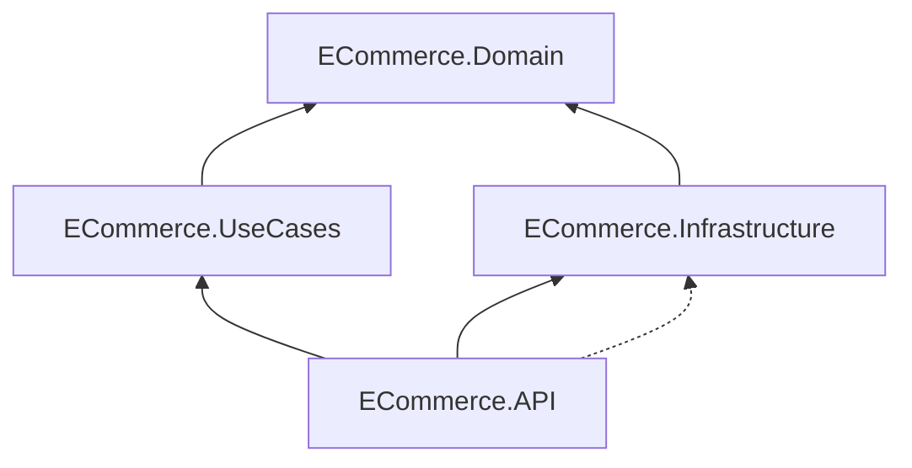
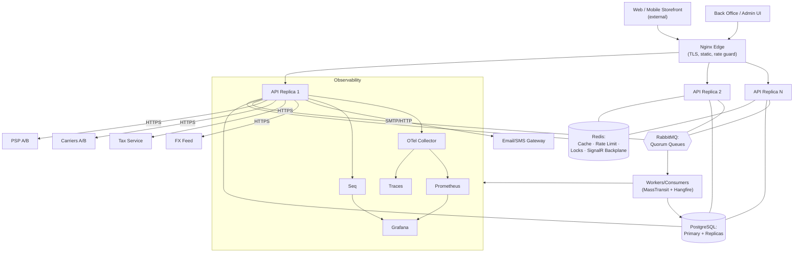
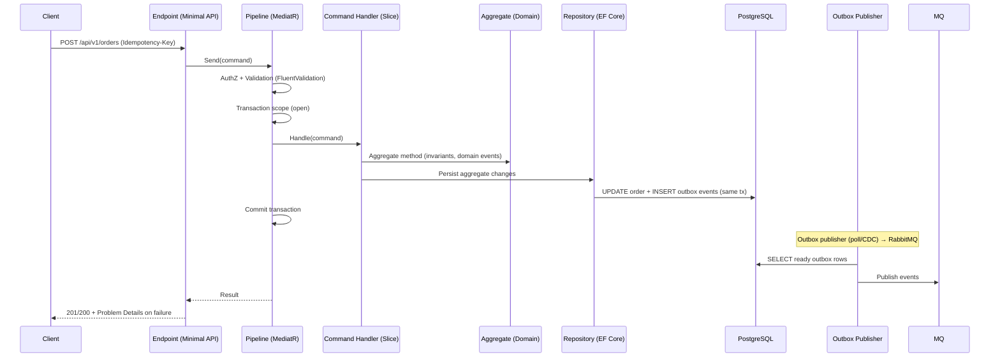
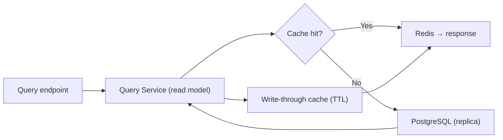
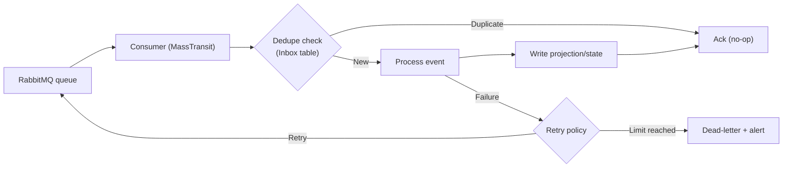
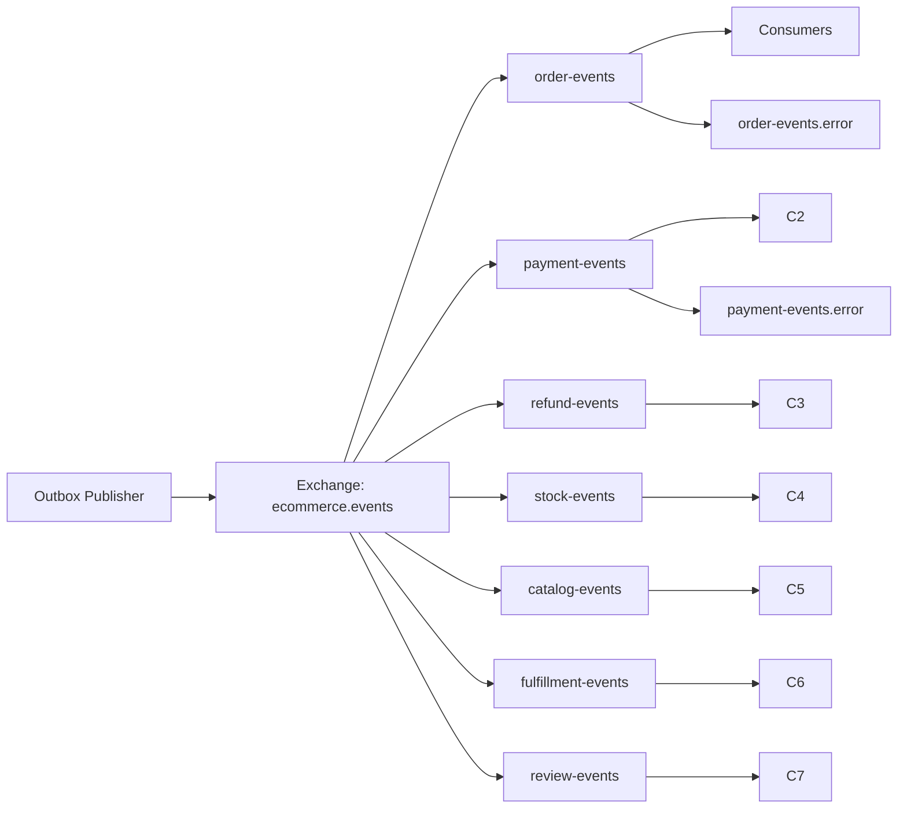
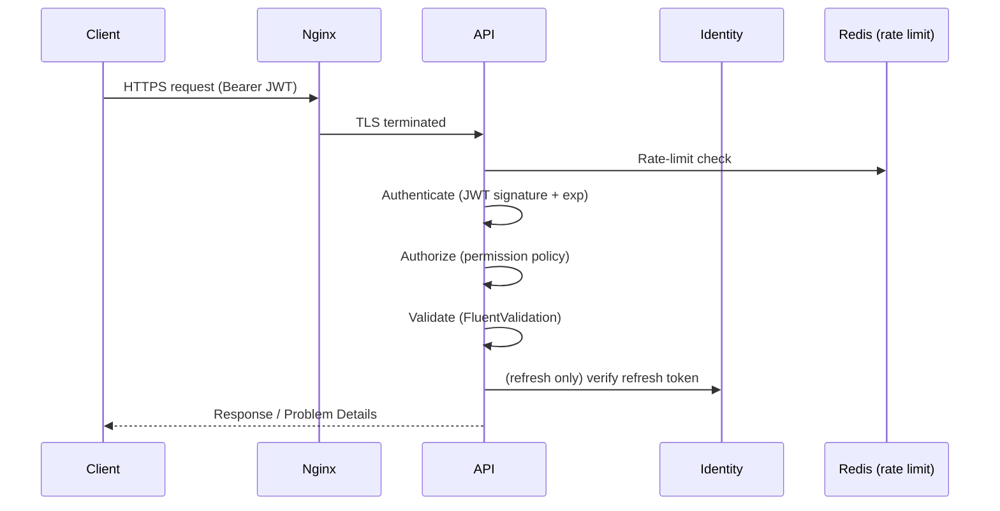
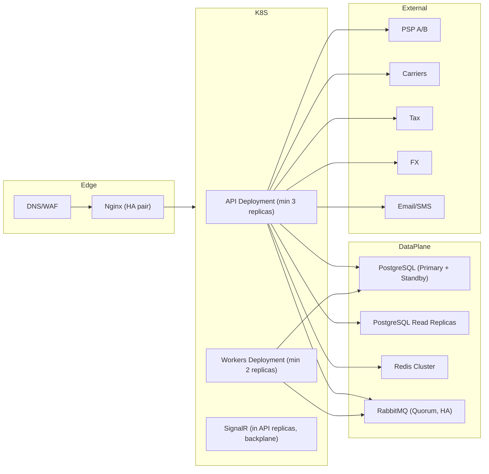
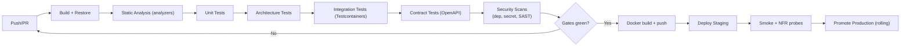

# Document 06 — System Design Document (System Architecture & Solution Design)

> **Platform:** E-Commerce Platform (Working Title: `ECommerce`)
> **Document Type:** System Design / Solution Architecture (Baseline)
> **Status:** Draft v1.0 for review
> **Audience:** Engineering, Architecture, DevOps/SRE, QA, Security, Product
> **Inputs:** `01-project-charter.md`, `04-software-requirements-specification.md`, `05-non-functional-requirements.md`, `06a-domain-model.md`, `06b-event-storming.md`, `06c-bounded-contexts.md`
> **Outputs:** Module designs `12`–`29`, ERD `07`, ADRs, deployment `32`
> **Relationship:** Authoritative for architecture, patterns, and integration topology. Bounded contexts (`06c`) define domain boundaries; this document defines the runtime and code architecture that realizes them.

---

## 1. Document Control

| Version | Date       | Author / Owner | Change Summary                        |
|---------|------------|----------------|----------------------------------------|
| 0.1     | 2026-07-15 | Enterprise Architect | Style, layers, topology drafts |
| 0.2     | 2026-07-27 | Enterprise Architect | Patterns, data, observability, deployment |
| 1.0     | 2026-07-31 | Enterprise Architect | Baseline release                |

### 1.1 Approvals

| Role                | Name | Decision | Date |
|----------------------|------|----------|------|
| Enterprise Architect | —    | —        | —    |
| Technical Lead       | —    | —        | —    |
| DevOps / SRE Lead    | —    | —        | —    |
| Security             | —    | —        | —    |
| QA Lead              | —    | —        | —    |

---

## 2. Introduction

### 2.1 Goals

The System Design satisfies the scale, availability, and quality targets of `05`:

| Goal | Target | Design Response |
|------|--------|-----------------|
| Throughput | 1,000 orders/min | Async boundaries, CQRS reads, caching, transaction discipline |
| Availability | ≥ 99.9% | Stateless replicas, HA dependencies, degradation matrix |
| Consistency | No oversell; no double-charge | Atomic allocation, idempotency, transactional outbox |
| Observability | End-to-end | OTLP + Serilog + Prometheus in every process |
| Extensibility | Provider-agnostic commerce | Adapters (PSP, carrier, tax, FX, channel) |
| Reference quality | Interview-grade | Vertical slices, ADRs, enforced architecture |

### 2.2 Architecture Style (One-Paragraph)

The platform is a **modular monolith** hosted as a stateless, horizontally scalable ASP.NET Core application, structured internally as **vertical slices within Clean Architecture layers**, applying **CQRS via MediatR**, **DDD aggregates** (domain model `06a`), and **event-driven decoupling** between bounded contexts (`06c`) using a **transactional outbox** into **RabbitMQ via MassTransit**. PostgreSQL is the OLTP store; Redis provides cache, rate limiting, distributed locking, and the SignalR backplane; Hangfire executes durable background jobs; the full observability stack (Seq, Prometheus, Grafana, OpenTelemetry) is wired from day one.

---

## 3. Architecture Principles (Applied)

| # | Principle | Applied As |
|---|-----------|-----------|
| P1 | Domain model first | Aggregates enforce invariants; no EF leakage into domain |
| P2 | CQRS everywhere | Commands mutate; queries project; separate query pipeline |
| P3 | Slices over layers | One feature = one slice (command/query + handler + validator + DTO) |
| P4 | Events over polling | Cross-context integration via events only |
| P5 | At-least-once, idempotent | Outbox + consumer idempotency + dedupe |
| P6 | Cache aggressively, invalidate precisely | Redis cache-aside; invalidation via events |
| P7 | Fail fast, degrade gracefully | Health, circuit breakers, provider fallback |
| P8 | Observability by default | Logs/traces/metrics in every handler and consumer |
| P9 | Security at every layer | AuthN, AuthZ, validation, rate limit, audit, secrets |
| P10 | Dependencies inward | Domain ← UseCases ← Infrastructure ← API |

---

## 4. Solution Structure (Code Architecture)

```
ECommerce.slnx
├── ECommerce.API                    # Presentation: Minimal APIs, Controllers, SignalR Hubs, Middleware, DI
├── ECommerce.UseCases               # Application: vertical slices (commands/queries/handlers/validators/DTOs)
│   ├── Identity | Catalog | Cart | Orders | Promotions | Inventory
│   ├── Payments | Fulfillment | Finance | Notifications | Reviews
│   ├── Reports | Integrations
│   └── Common (pipelines, interfaces, contracts)
├── ECommerce.Domain                 # Domain: aggregates, VOs, events, repositories, specs, services
├── ECommerce.Infrastructure         # EF Core, PostgreSQL, Redis, RabbitMQ/MassTransit, Hangfire,
│   │                               # Identity, Serilog, OTel, Audit, FeatureFlags, Seeding, Migrations
├── ECommerce.UnitTests              # Domain + handler unit tests
├── ECommerce.ArchitectureTests      # Layer/context dependency enforcement
└── ECommerce.IntegrationTests       # Testcontainers-based integration tests
```

### 4.1 Dependency Rules



- `Domain` references nothing.
- `UseCases` references `Domain` only.
- `Infrastructure` references `Domain` + `UseCases` contracts.
- `API` references `UseCases` + `Infrastructure`.
- **Enforced by** `ECommerce.ArchitectureTests` (NetArchTest-style) in CI.

---

## 5. Container Architecture (C4 Level 2)



---

## 6. Component Design (C4 Level 3 — Processing Paths)

### 6.1 Write Path (Command → Transaction → Outbox)



### 6.2 Read Path (CQRS Query Service)



### 6.3 Event Consumer Path (Idempotent)



---

## 7. Cross-Cutting Patterns

### 7.1 MediatR Pipeline (Behavior Stack)

| Order | Behavior | Responsibility |
|-------|----------|----------------|
| 1 | `IdempotencyBehavior` | Dedupe by `Idempotency-Key` (commands marked idempotent) |
| 2 | `AuthorizationBehavior` | Permission check against claims (403 before execution) |
| 3 | `ValidationBehavior` | Run FluentValidation; short-circuit on failure (422) |
| 4 | `TransactionBehavior` | Open DB transaction for write commands; commit on success |
| 5 | `DomainEventBehavior` | Collect aggregate events; dispatch to outbox |
| 6 | `AuditBehavior` | Record who/what/when for protected commands |
| 7 | `LoggingBehavior` | Structured log with command, traceId, duration |
| 8 | `MetricsBehavior` | Histogram per command/query |

### 7.2 Transactional Outbox (Critical)

| Aspect | Design |
|--------|--------|
| Table | `outbox_events` (id, aggregate_id, event_type, payload jsonb, created_at, processed_at, attempts) |
| Write | Inserted in the **same transaction** as the domain change |
| Publisher | Polling publisher (periodic `SELECT ... FOR UPDATE SKIP LOCKED`) OR CDC-based |
| Redelivery | Attempts + max threshold → dead-letter + alert |
| Guarantee | At-least-once; consumers idempotent via inbox/dedupe |
| Partitioning | Monthly partitioning + cleanup after confirmed delivery (NFR-CAP-03/04) |
| Metric | `outbox_lag_seconds`, `outbox_published_total`, `outbox_deadletters_total` |

### 7.3 Idempotency

| Aspect | Design |
|--------|--------|
| Scope | Order placement, payment capture, refund execution, webhook application |
| Key | Client-supplied `Idempotency-Key` (UUID) per resource |
| Storage | `idempotency_records` (key, hash of request, response snapshot, status) |
| Behavior | Same key + same payload → return stored response; same key + different payload → 409 `ERR_IDP_001` |
| Cleanup | TTL-based purge (background job) |

### 7.4 Caching Strategy (Redis)

| Layer | Key Pattern | TTL | Invalidation |
|-------|-------------|-----|--------------|
| Catalog product | `cat:p:{id}:{locale}:{currency}` | 60 s | `ProductUpdated`/`PriceChanged` events |
| Catalog list/search | `cat:q:{hash}` | 60 s | Version-based; short TTL |
| Cart | `cart:{ownerKey}` | 30 d | On mutation (write-through) |
| Rate limit counters | `rl:{consumer}:{endpoint}` | window | Sliding window |
| Distributed locks | `lock:{resource}` | per-lock | Leases with TTL |
| SignalR backplane | `signalr:{group}` | — | Pub/sub channels |
| Config/flags | `cfg:{flag}` | 30 s | Flag change events |
| FX rates | `fx:{pair}` | 1 d | Daily refresh job |

**Cache-aside rule:** read-through on miss with 100-ms stampede protection (per-key lock); precise invalidation via events; no full-flush except emergency.

### 7.5 Distributed Locks & Rate Limiting

| Concern | Mechanism |
|---------|-----------|
| Stock reservation | Row lock (`SELECT ... FOR UPDATE`) + DB CHECK — not Redis lock |
| Coupon redemption | Atomic conditional UPDATE — not Redis lock |
| Outbox publisher claim | Redis lock with TTL lease |
| Recurring job dedupe | Redis lock (e.g., reconciliation, report export) |
| Rate limiting | Redis sliding window per consumer/endpoint; `429` + `Retry-After` + `X-RateLimit-*` headers |

### 7.6 Real-time (SignalR)

| Aspect | Design |
|--------|--------|
| Hubs | `OrderHub` (user groups), `WarehouseHub` (warehouse groups), `AdminHub` |
| Auth | JWT on connect; group membership server-side (never client-controlled) |
| Backplane | Redis for multi-replica scale-out |
| Delivery | At-least-once with `eventId`; client resumes via `LastEventId`; REST fallback for missed events |
| Metric | `signalr_connections`, hub message latency |

---

## 8. Messaging Topology (MassTransit)

### 8.1 Exchanges / Queues

| Event Group | Queue | Consumers | Duplicate Risk |
|-------------|-------|-----------|----------------|
| `order.*` | `order-events` | Fulfillment, Finance, Notification, Reporting, Integration | Order placement idempotency |
| `payment.*` | `payment-events` | Ordering, Finance, Notification | Webhook dedupe |
| `refund.*` | `refund-events` | Finance, Notification | Refund idempotency |
| `stock.*` | `stock-events` | Ordering, Notification, Reporting | Consumer inbox |
| `catalog.*` | `catalog-events` | Search, Cart, Reporting | Consumer inbox |
| `fulfillment.*` | `fulfillment-events` | Ordering, Notification | Tracking dedupe |
| `review.*` | `review-events` | Reporting | Consumer inbox |
| Dead letters | `.error` queues | DLQ alerts | — |



### 8.2 Consumer Requirements

- Idempotent (inbox/dedupe by `eventId`).
- Retry with exponential backoff (configurable per queue).
- Poison-message handling → `.error` queue + alert.
- Outbox events are **versioned payloads** (published language `06c` §5.2).

---

## 9. Background Jobs (Hangfire)

| Job | Schedule | Purpose |
|-----|----------|---------|
| Outbox publisher | Every 1 s | Drain outbox to bus |
| Reconciliation (payments) | Daily 02:00 UTC | Compare ledger vs provider |
| Invoice/credit-note PDF | Event-driven + retry | Finance documents |
| Report exports | On-demand (queued) | Async CSV/XLSX |
| Cart purge | Hourly | TTL enforcement |
| Stock low alerts | On-write + cooldown | Alert dedupe |
| Webhook deliveries | On-event + retry | Signed dispatch |
| FX rates refresh | Daily | Multi-currency |
| Idempotency record purge | Daily | TTL cleanup |
| Outbox cleanup | Hourly | Partition maintenance |

> Hangfire dashboard is **role-locked** (`ops.jobs.view`); retry policies per job; failure alerts via metric + notification.

---

## 10. Data Architecture

### 10.1 Persistence

| Aspect | Design |
|--------|--------|
| Database | PostgreSQL 16+ (single logical DB, one schema per bounded context) |
| Access | EF Core 10 with `Npgsql`; migrations forward-only |
| Reads | Read replicas for queries/reporting; read-your-write honored for order paths |
| Concurrency | Optimistic (rowversion) for aggregates; row locks for allocation/coupons |
| Constraints | DB CHECK for money invariants + `allocated ≤ on_hand`; unique indexes (SKU, slug, order number, coupon code) |
| Ledger tables | Append-only (stock_movements, payment_attempts, audit_log) |
| Partitioning | Monthly for outbox, audit, ledger, orders (archive after retention) |
| Backups | WAL + PITR; RPO ≤ 5 min; RTO ≤ 15 min (NFR-AVL-05/06) |

### 10.2 Outbox & Inbox Tables (Logical)

| Table | Purpose |
|-------|---------|
| `outbox_events` | Events to publish (transactional) |
| `inbox_messages` | Consumer dedupe per queue |
| `idempotency_records` | Client idempotency keys |

---

## 11. Security Architecture (Summary)



| Aspect | Detail |
|--------|--------|
| Authentication | ASP.NET Core Identity + JWT (15-min access) + rotating refresh tokens (30 d) |
| Authorization | Policy-based permission codes; default deny |
| Secrets | Env/secret store; never in repo or logs |
| Input | FluentValidation at boundary + DB constraints |
| Output encoding | Not applicable (JSON API); PII redaction enforced in logs |
| Transport | TLS 1.2+; HSTS in prod |
| Audit | Middleware + domain events (FRS-M-001) |
| Rate limiting | Auth, checkout, webhook endpoints prioritized |
| Compliance | GDPR/PCI/tax per `05` §13 |

> Full detail in `09-security-architecture.md` and `10-authentication-authorization-design.md`.

---

## 12. Observability

| Signal | Tool | Coverage |
|--------|------|----------|
| Structured logs | Serilog → Seq | Every process; `traceId` correlation; redaction |
| Traces | OpenTelemetry (OTLP) | API, handlers, consumers, EF, Redis, MQ; 100% errors, 10% success |
| Metrics | Prometheus | HTTP, EF, Redis, MQ, outbox lag, Hangfire, business metrics |
| Dashboards | Grafana | Per-domain + SLO burn-rate |
| Alerts | Alertmanager | Burn-rate pages + DLQ + drift flags |
| Health | `/health/live`, `/health/ready` | LB probes + dependency status |

---

## 13. Deployment & Scaling

### 13.1 Logical Topology (Production)



### 13.2 Scaling Rules

| Component | Scale Trigger | Min/Max |
|-----------|---------------|---------|
| API replicas | CPU > 70% (5 min) or request queue depth | 3 / 30 |
| Workers | Queue depth > threshold | 2 / 10 |
| PostgreSQL | Vertical + replicas (reads) | 1 primary + 2+ replicas |
| Redis | Cluster nodes | 3+ shards |
| RabbitMQ | Quorum queues across nodes | 3+ nodes |

### 13.3 Environments

| Environment | Purpose | Deploy |
|-------------|---------|--------|
| Dev | Local full stack | `docker compose up` |
| CI | Verification | Testcontainers, ephemeral |
| Staging | Load/security/QA | Cloud or local replica |
| Production | Live | Rolling deploy, zero-downtime |

---

## 14. CI/CD Pipeline (GitHub Actions)



| Gate | Tool |
|------|------|
| Dependency scan | `dotnet list package --vulnerable` + NuGet audit |
| Secret scan | gitleaks / trufflehog |
| SAST | Roslyn analyzers + Semgrep |
| Coverage | ≥ 80% branch (report + gate) |
| Container | Trivy scan on images |
| OWASP | ASVS L1 checklist in milestone reviews |

---

## 15. Error Handling Strategy

| Aspect | Design |
|--------|--------|
| Contract | RFC 9457 Problem Details for all errors |
| Validation | 422 with `errors[]` (field + code) |
| AuthN/AuthZ | 401/403 with permission code |
| Concurrency | 409 with conflict type |
| Provider failures | 502/503 mapped; fallback + retry |
| Unhandled | 500 with `traceId`; internals never leaked; logged with stack |
| Global handling | `UseExceptionHandler` + mapping middleware; developer exception page only in Dev |

---

## 16. API Design (Summary)

| Aspect | Design |
|--------|--------|
| Style | Minimal APIs (REST); controllers only where required |
| Versioning | URL + header; `v1` baseline; deprecation policy |
| Docs | OpenAPI 3.x at `/swagger/v1/swagger.json` |
| Serialization | JSON (System.Text.Json), camelCase, enum-as-string with converters |
| Pagination | `page`/`pageSize` (≤ 100) + `X-Total-Count`; cursor for hot paths |
| Idempotency | `Idempotency-Key` on write endpoints |
| Rate limits | Redis sliding window; `X-RateLimit-*` headers |
| Mapping | Mapster (`ECommerce.UseCases/Common/Mappings`) |

> Endpoint inventory per module: `08-api-design.md` and module designs `12`–`29`.

---

## 17. Testing Strategy (Architecture Summary)

| Layer | Tooling | Scope |
|-------|--------|-------|
| Unit | xUnit + FluentAssertions | Domain invariants, handlers, validators |
| Integration | xUnit + Testcontainers (Postgres/Redis/RabbitMQ) | Slice end-to-end, outbox, idempotency |
| Architecture | NetArchTest-style | Layer + context dependency rules |
| Contract | OpenAPI snapshot + schema validation | API stability |
| Load | k6 / JMeter | NFR-PERF/CAP scenarios S1–S8 |
| Chaos | Fault injection | Degradation matrix (`05` §7.5) |

> Full strategy in `30-test-strategy-and-quality-gates.md`.

---

## 18. Architecture Decision Summary (ADRs — see `33`)

| ADR | Decision | Rationale |
|-----|----------|-----------|
| ADR-001 | .NET 10 / ASP.NET Core | LTS, performance, ecosystem |
| ADR-002 | Modular monolith vs microservices | Context integrity, ops simplicity, scale target fits |
| ADR-003 | Transactional outbox | Zero-loss events, single-writer consistency |
| ADR-004 | One DB, one schema per context | Transactions across contexts when needed; clear ownership |
| ADR-005 | Shared Kernel (Inventory↔Ordering allocation) | Atomic allocation guarantee |
| ADR-006 | CQRS in-process via MediatR | Simple, testable, scale-adequate |
| ADR-007 | Redis for cache/rate-limit/locks/backplane | One dependency, four uses |
| ADR-008 | EF Core + PostgreSQL | Developer velocity + relational integrity |
| ADR-009 | Provider adapters for PSP/carrier/tax/FX | Failover + vendor-agnostic |
| ADR-010 | Hangfire for background jobs | Durable, dashboard, .NET-native |
| ADR-011 | SignalR + Redis backplane | Real-time with horizontal scale |
| ADR-012 | API versioning + Problem Details | Contract stability + consistent errors |

---

## 19. Module Design Index

| Module | Document |
|--------|----------|
| Identity & Access | `10`, `11` |
| Catalog & Search | `12` |
| Cart & Wishlist | `13` |
| Checkout & Orders | `14` |
| Pricing & Promotions | `15` |
| Inventory & Warehouses | `16` |
| Payments | `17` |
| Shipping & Fulfillment | `18` |
| Finance & Refunds | `19` |
| Notifications | `20` |
| Reviews | `21` |
| Analytics & Reporting | `22` |
| Platform services | `23`–`29` |
| Real-time | `27` |

---

## 20. Approvals

| Role                | Name | Decision | Date |
|----------------------|------|----------|------|
| Enterprise Architect | —    | —        | —    |
| Technical Lead       | —    | —        | —    |
| DevOps / SRE Lead    | —    | —        | —    |
| Security             | —    | —        | —    |
| QA Lead              | —    | —        | —    |

---

*End of Document 06 — System Design Document.*
*Next document on request: `07-data-model-erd.md`.*
