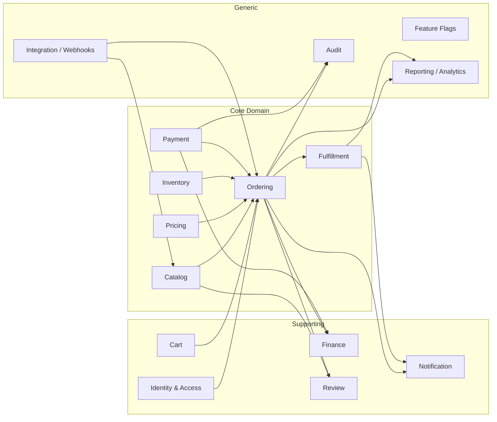
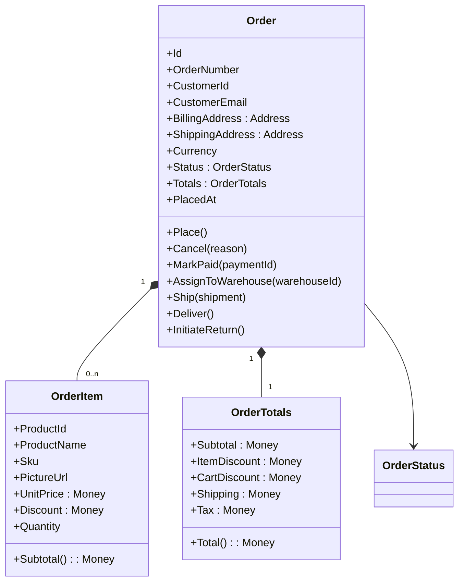
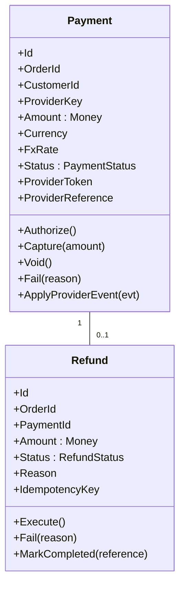

# Document 06a — Domain Model (DDD)

> **Platform:** E-Commerce Platform (Working Title: `ECommerce`)
> **Document Type:** Domain Model & Bounded Context Specification (DDD)
> **Status:** Draft v1.0 for review
> **Audience:** Engineering, Architecture, QA, Product
> **Inputs:** `03-business-requirements.md`, `04a-functional-requirements-specification.md`, `06-system-architecture.md`
> **Outputs:** `07-data-model-erd.md` (persistence mapping), module designs `12`–`29`
> **Relationship:** Authoritative for domain language, aggregates, invariants, and events. Implementation classes live in `ECommerce.Domain`.

---

## 1. Document Control

| Version | Date       | Author / Owner | Change Summary                       |
|---------|------------|----------------|---------------------------------------|
| 0.1     | 2026-07-17 | Enterprise Architect | Bounded contexts and aggregates |
| 0.2     | 2026-07-28 | Enterprise Architect | Events, invariants, repository contracts |
| 1.0     | 2026-07-31 | Enterprise Architect | Baseline release                    |

### 1.1 Approvals

| Role                | Name | Decision | Date |
|----------------------|------|----------|------|
| Enterprise Architect | —    | —        | —    |
| Technical Lead       | —    | —        | —    |
| Product Owner        | —    | —        | —    |

---

## 2. Introduction & Approach

### 2.1 Purpose

This document defines the **domain model** for the `ECommerce` platform using Domain-Driven Design: the **bounded contexts**, **ubiquitous language**, **aggregates**, **entities**, **value objects**, **domain services**, **invariants**, and **domain events**. It is the source of truth for business logic placement. All domain code in `ECommerce.Domain` must conform to this model; where code and this document disagree, the code review process must resolve the document first.

### 2.2 DDD Conventions

| Term | Meaning in this project |
|------|-------------------------|
| Aggregate | Transactional consistency boundary; a cluster of domain objects with a single root |
| Aggregate Root | The only object external actors may hold a reference to |
| Entity | Object with identity (`Id`) and lifecycle |
| Value Object | Immutable object compared by values; no identity |
| Domain Event | Fact about the past, named in past tense, published after state change |
| Invariant | Rule that must always hold inside an aggregate |
| Domain Service | Stateless logic that spans aggregates or lacks a natural home |

### 2.3 Design Rules

- **Rule 1 — Invariants live in aggregates.** No persistence/UI layer may enforce domain invariants.
- **Rule 2 — References across aggregates only by Id.** Navigation between aggregates is via repositories/query services, never via navigation properties that load whole graphs.
- **Rule 3 — One aggregate = one transaction.** Cross-aggregate consistency is eventual, achieved via domain events + outbox.
- **Rule 4 — Events are facts.** Emitted after the fact; never used to drive the triggering aggregate.
- **Rule 5 — Money is never a primitive.** Every monetary value is a `Money` value object.

---

## 3. Bounded Contexts

### 3.1 Context Map

### 3.2 Context Relationships

| Context | Relationship | Pattern |
|---------|--------------|---------|
| Catalog → Ordering | Catalog publishes product facts | **Customer/Supplier** (events: `ProductUpdated`, `PriceChanged`) |
| Pricing → Ordering | Pricing computes at order time | **Conformist** (Ordering consumes computed prices) |
| Inventory → Ordering | Allocation service | **Shared Kernel** (allocation API) / Customer-Supplier |
| Identity → Ordering | `CustomerId` only, no profile data | **Anti-Corruption Layer** (claims → local reference) |
| Payment → Finance | Payment outcomes feed finance | Customer/Supplier via events |

---

## 4. Ubiquitous Language (Extract)

> Full glossary in `02-glossary-and-definitions.md`. Terms below are binding for code, events, and API contracts.

| Term | Definition |
|------|-----------|
| **Order** | The aggregate root representing a customer's purchase |
| **Line Item** | A purchased quantity of one product snapshot at order time |
| **Allocation** | Reservation of stock units against an order |
| **Authorization** | Payment hold placed against a payment method |
| **Capture** | Confirming an authorization into a charge |
| **Refund** | Reversal of captured funds |
| **Invoice** | Financial document representing amounts due/paid |
| **Credit Note** | Financial document offsetting an invoice |
| **Promotion** | Conditional discount rule evaluated at cart/order level |
| **Coupon** | Redeemable promotion code with usage limits |
| **Fulfillment Task** | Work unit for a warehouse to pick/pack/ship an order |
| **Consignment** | Shipment record bound to a carrier and tracking number |
| **Stock Ledger** | Append-only record of every stock movement |

---

## 5. Core Aggregates

---

### 5.1 Order (Ordering Context)

**Aggregate Root.** The heart of the system.

**Responsibilities**

- Enforce the **order state machine** (FRS-D-004): only legal transitions mutate `Status`.
- Enforce **invariant O-1**: every line quantity ≥ 1.
- Enforce **invariant O-2**: `Total = Subtotal − ItemDiscount − CartDiscount + Shipping + Tax`, all non-negative.
- Enforce **invariant O-3**: order snapshot fields are immutable after placement.
- Raise events: `OrderPlaced`, `OrderPaid`, `OrderCancelled`, `OrderShipped`, `OrderDelivered`, `ReturnRequested`.

**Methods (behavioral, not CRUD)**

| Method | Preconditions | Postconditions | Events |
|--------|---------------|----------------|--------|
| `Place()` | Items non-empty; totals computed | Status = Pending; snapshot frozen | `OrderPlaced` |
| `Cancel(reason)` | Status in {Pending, AwaitingPayment, Paid} | Status = Cancelled; reason recorded | `OrderCancelled` |
| `MarkPaid(paymentId)` | Status = Pending/AwaitingPayment | Status = Paid | `OrderPaid` |
| `Ship(shipment)` | Status = Packed | Status = Shipped; shipment attached | `OrderShipped` |
| `Deliver()` | Status = Shipped | Status = Delivered | `OrderDelivered` |
| `MarkBackordered(lines)` | Status = Placed; no open backorder per product | Status = Backordered; `OrderBackorderItem`s queued | `OrderBackordered` |
| `FillBackorderItems(sku, qty)` | Backorder items exist for sku | Filled FIFO; Status = AwaitingFulfillment when all filled | `BackorderFilled` |

**Backorder queue (US-F-007,008):** `OrderBackorderItem` (OrderId, ProductId, Sku, Quantity, FilledQuantity, Status Open/Filled). When place-order allocation has a shortfall:
- Shortfall SKUs with `Product.Backorderable = true` → order becomes `Backordered`; the unallocated remainder (`Requested − Allocated`) is queued; the allocatable portion stays allocated to the order.
- Shortfall SKUs that are not backorderable → order fails with `ERR_STK_001` (unchanged).
- A stock `Receipt` raises `StockRestocked` → outbox → `BackorderFillService` re-allocates available stock and fills open backorders FIFO (oldest order first). Orders whose backorders are fully filled transition `Backordered → AwaitingFulfillment`. Customers are notified via `BackorderFilled` handlers.

**Repository:** `IOrderRepository` — `GetByIdAsync`, `GetByNumberAsync`, `GetByCustomerIdAsync`, `AddAsync`, `SaveAsync`, `ListOpenBackorderItemsBySkuAsync`. **Read models:** separate query service (CQRS).

---

### 5.2 Product (Catalog Context)

**Aggregate Root.**

| Item | Detail |
|------|--------|
| Attributes | Id, SKU (unique), Slug (unique), Name (localized), Description (localized), PictureUrls, CategoryId, BrandId, Status (Draft/Active/Inactive), IsFeatured, Backorderable, Attributes[] |
| Pricing | `PriceList`: per-currency list price + optional offer price (`Price` value object per currency) |
| Invariants | **P-1** SKU unique & immutable. **P-2** offer price ≤ list price per currency. **P-3** status changes are explicit (`Activate()`, `Deactivate()`). |
| Methods | `Create(...)`, `UpdateDetails(...)`, `SetPrice(currency, list, offer)`, `Activate()`, `Deactivate()`, `SetCategory()`, `SetBrand()` |
| Events | `ProductCreated`, `ProductUpdated`, `PriceChanged(currency, oldPrice, newPrice)`, `ProductDeactivated` |
| Notes | Product does **not** own stock; stock lives in Inventory context keyed by SKU. Review aggregation is a **read model**, not part of the aggregate. |

**Repository:** `IProductRepository` — by id/SKU/slug, spec-based paging. **Related entities (not aggregates):** `Category`, `Brand` (managed by their own repositories; referenced by Id).

---

### 5.3 Cart (Cart Context)

**Aggregate Root.** Anonymous or customer-owned.

| Item | Detail |
|------|--------|
| Attributes | Id, OwnerKey (customerId or anonymousKey), Items[], Totals, UpdatedAt, ExpiresAt |
| Item | CartItem: ProductId, Sku, Name (snapshot), UnitPrice (snapshot), Quantity, ImageUrl |
| Invariants | **C-1** quantity 1..99. **C-2** totals recomputed on every mutation. **C-3** price snapshot per line. |
| Methods | `AddItem(product, qty)`, `UpdateQuantity(productId, qty)`, `RemoveItem(productId)`, `MergeFrom(otherCart)`, `Clear()`, `Touch()` |
| Events | `CartItemAdded`, `CartItemRemoved`, `CartMerged`, `CartExpired` |
| Notes | Cart is a **transactional aggregate**; totals are recomputed by pricing at checkout. Merge conflict: keep newer `UpdatedAt` line. |

**Repository:** `ICartRepository`.

---

### 5.4 StockItem (Inventory Context)

**Aggregate Root.** Per SKU per warehouse.

| Item | Detail |
|------|--------|
| Attributes | Id, Sku, WarehouseId, OnHand, Allocated, InTransit, LowStockThreshold |
| Derived | `Available = OnHand − Allocated − InTransit` (never persisted; computed) |
| Invariants | **S-1** `Allocated ≤ OnHand` at all times. **S-2** quantities are non-negative integers. |
| Methods | `Receive(qty, reference)`, `ShipOut(qty, reference)`, `Adjust(delta, reason, approver)`, `Reserve(qty)` (atomic, throws `InsufficientStockException`), `Release(qty)`, `ReceiveTransfer(qty)`, `SendTransfer(qty)` |
| Events | `StockReceived`, `StockShipped`, `StockAdjusted`, `StockReserved`, `StockReleased`, `StockLow`, `StockTransferred` |
| Notes | Every method writes a **StockMovement** ledger entry. Reservation is the classic `UPDATE ... WHERE allocated+qty <= on_hand` guard; implemented with row locking to satisfy QAS-01. |

**Repository:** `IStockItemRepository` — atomic reservation method, by SKU/warehouse.

### 5.5 Warehouse (Inventory Context)

| Item | Detail |
|------|--------|
| Attributes | Id, Code (unique), Name, Address, CountryCode, Region, AllocationRank, IsActive |
| Methods | `Create(...)`, `UpdateDetails(...)`, `SetAllocationRank(rank)`, `Activate()`, `Deactivate()` |
| Events | `WarehouseCreated`, `WarehouseUpdated` |

---

### 5.6 Payment & Refund (Payment Context)

**Aggregate Roots.**

| Payment invariants | **PY-1** Capture ≤ Authorized remaining. **PY-2** Status machine: Created→Authorized→Captured→Refunding→Refunded; Created→Failed. **PY-3** No raw PAN in the aggregate. |
| Payment methods | `Authorize()`, `Capture(amount)`, `Void()`, `Fail(reason)`, `ApplyProviderEvent(evt)` (idempotent, signature-verified upstream) |
| Payment events | `PaymentAuthorized`, `PaymentCaptured`, `PaymentFailed`, `PaymentVoided`, `PaymentRefunded` |
| Refund invariants | **RF-1** Amount ≤ remaining refundable. **RF-2** Execution idempotent by `IdempotencyKey`. |
| Refund events | `RefundRequested`, `RefundApproved`, `RefundCompleted`, `RefundFailed` |
| Repositories | `IPaymentRepository`, `IRefundRepository` |

---

### 5.7 FulfillmentTask & Shipment (Fulfillment Context)

| Aggregate | Detail |
|-----------|--------|
| **FulfillmentTask** | Root. Attributes: Id, OrderId, WarehouseId, Status (Queued/Assigned/Picking/Packed/Shipped/Cancelled), AssignedPickers, Priority, Zone. Methods: `Create(orderId, warehouseId, priority, utcNow, zone?)`, `Assign(pickerId, utcNow)` (Queued→Assigned), `StartPicking(utcNow)` (Assigned→Picking), `MarkPacked(utcNow)` (Picking→Packed), `MarkShipped(utcNow)` (Packed→Shipped), `Cancel(utcNow)` (non-terminal states). Events: `FulfillmentTaskCreated`, `FulfillmentTaskAssigned`, `FulfillmentTaskPicking`, `FulfillmentTaskPacked`, `FulfillmentTaskShipped`, `FulfillmentTaskCancelled`. |
| **Shipment** | Root. Attributes: Id, OrderId, TaskId, CarrierKey, TrackingNumber, LabelUrl, Status (Created/InTransit/OutForDelivery/Delivered/Exception). Methods: `Create(orderId, taskId, carrierKey, trackingNumber, labelUrl, utcNow)`, `ApplyTrackingUpdate(status, utcNow)`. Transition matrix: Created→InTransit, InTransit→OutForDelivery/Exception, Exception→InTransit, OutForDelivery→Delivered (terminal; `AlreadyDelivered`). Invalid transitions return `ERR_SHP_003`. Events: `ShipmentCreated`, `ShipmentStatusChanged`, `ShipmentDelivered`. |
| **FulfillmentTaskItem** | Child of FulfillmentTask. Attributes: TaskId, ProductId, Sku, Quantity, Bin. Added via `FulfillmentTask.AddItem(productId, sku, quantity, bin)`. |
| **TrackingUpdate** | Child of Shipment. Attributes: ShipmentId, Status, Timestamp, Location, Description. Captured by `ApplyTrackingUpdate`. |

Order status integration: `StartFulfillment` (AwaitingFulfillment→Picking), `MarkPacked` (Picking→Packed), `Ship` (Packed→Shipped), `Deliver` (Shipped→Delivered) — driven by the fulfillment task/shipment handlers.

Carrier integration (T-DAT-011): `CarrierRateSelector` quotes all registered `ICarrierAdapter` implementations, orders by rate, caches quotes by `carrier:country:postal:weight` (10 min TTL), and degrades gracefully to available carriers when a quote fails (`ERR_FLM_010 CarrierUnavailable`). Pick lists (T-DAT-012): `PickListGenerationService` groups active task items by warehouse zone, orders by bin+sku, chunks to ≤25 lines, and falls back to an `UNZONED` group for tasks without a zone.

---

### 5.8 Invoice & CreditNote (Finance Context)

| Aggregate | Detail |
|-----------|--------|
| **Invoice** | Root. Attributes: Id, InvoiceNumber (sequential), OrderId, CustomerId, Lines[], TaxAmount, Total, Status (Issued/Paid/PartiallyRefunded/Refunded/Cancelled), PdfUrl. Methods: `Issue()`, `ApplyCreditNote(amount)`. Events: `InvoiceIssued`, `InvoiceCredited`. |
| **CreditNote** | Root. Attributes: Id, CreditNoteNumber, InvoiceId, RefundId, Amount, Reason. Methods: `Issue()`. Event: `CreditNoteIssued`. |

---

### 5.9 Promotion, Coupon & DiscountRule (Pricing Context)

| Aggregate | Detail |
|-----------|--------|
| **Promotion** | Root. Attributes: Id, Name, Conditions[], Actions[], StackingMatrix, EligibleCountries[], EligibleCurrencies[], Schedule (Start/End/Paused). Methods: `Evaluate(cartContext) → DiscountApplication`, `Activate()`, `Pause()`, `Schedule(start,end)`. Invariants: **PR-1** percentage action ≤ 100%; **PR-2** non-negative totals always. Events: `PromotionCreated`, `PromotionPaused`, `PromotionScheduled`. |
| **Coupon** | Root. Attributes: Id, Code (unique), PromotionId, TotalUses, UsedCount, PerCustomerLimit. Methods: `TryRedeem(customerId)` (atomic claim; returns success or exhausted). Events: `CouponRedeemed`, `CouponExhausted`. |
| **DiscountRule** | Value-object set: type (Product/Order/Shipping), basis (Amount/Percent), cap. Used inside Promotion actions and order snapshot. |

---

### 5.10 Review (Review Context)

| Aggregate | Detail |
|-----------|--------|
| Attributes | Id, ProductId, CustomerId, CustomerName, Rating (1–5), Comment, IsVerifiedPurchase, Status (Pending/Published/Rejected/Removed), ModerationNote |
| Invariants | **R-1** one review per (customer, product) — DB unique index + aggregate check. **R-2** rating integer 1–5. |
| Methods | `Submit(purchaseVerified)`, `Publish()`, `Reject(reason)`, `Remove(reason)` |
| Events | `ReviewSubmitted`, `ReviewPublished`, `ReviewRejected`, `ReviewRemoved` |
| Notes | Product rating is a **read model** recomputed on events (event handler → query table), never a field on Product. |

---

### 5.11 User, Role & Permission (Identity Context)

| Aggregate | Detail |
|-----------|--------|
| **User** | Root (wraps ASP.NET Core Identity `ApplicationUser`). Attributes: Id, Email, NormalizedEmail, Name, Locale, Currency, VerificationStatus, LockoutState. Methods: `Register()`, `VerifyEmail(token)`, `ResetPassword(token)`, `CloseAccount()` (→ erasure job). Events: `CustomerRegistered`, `EmailVerified`, `PasswordReset`, `AccountClosed`. |
| **Role** | Root. Attributes: Id, Name, PermissionCodes[]. Methods: `AssignPermission(code)`, `RevokePermission(code)`. Event: `RolePermissionsChanged`. |
| **Permission** | Static catalog value: e.g., `catalog.product.write`, `orders.refund.approve`, `auth.impersonate`. |

---

### 5.12 Notification, Template (Notification Context)

| Aggregate | Detail |
|-----------|--------|
| **Notification** | Root. Attributes: Id, RecipientRef (tokenized), Channel, TemplateKey, Locale, Payload (tokenized), Status (Queued/Sent/Failed/Delivered), Attempts. Methods: `Queue()`, `MarkSent()`, `Retry()`. Event: `NotificationQueued`, `NotificationFailed`. |
| **NotificationTemplate** | Root. Attributes: Id, Key, Channel, Subject/Body per locale, Placeholders[]. Invariants: **N-1** placeholders declared; **N-2** no PII in body definitions. |

---

## 6. Value Objects

| Value Object | Context | Fields | Rules |
|--------------|---------|--------|-------|
| `Money` | Shared | Amount (decimal 18,4), Currency | Immutable; operators +,−,×; equality by value; never float |
| `Address` | Ordering | Street, City, Region, Country, PostalCode | Validation per country; immutability via with-fields |
| `Price` | Catalog | Currency, ListAmount, OfferAmount? | Offer ≤ List |
| `OrderTotals` | Ordering | Subtotal, ItemDiscount, CartDiscount, Shipping, Tax | Total derived; non-negative |
| `Sku` | Shared | Value (string) | Format + uniqueness |
| `OrderNumber` | Ordering | Value (`E-YYYYMMDD-XXXXXX`) | Generated by domain service |
| `Rating` | Review | Value (1–5 int) | Range check |
| `PaymentToken` | Payment | ProviderKey, Token | Opaque; never logged |
| `Period` | Reporting | Start, End (UTC) | Start < End |

---

## 7. Domain Services

| Domain Service | Context | Responsibility |
|----------------|---------|-----------------|
| `PricingEngine` | Pricing/Ordering | Applies promotion rules + coupon, computes OrderTotals, enforces stacking priority (item→cart→shipping) and non-negative invariant |
| `InventoryAllocationService` | Inventory/Ordering | Chooses warehouses by country rank → availability → load; calls `StockItem.Reserve` atomically; produces allocation plan or `InsufficientStock` |
| `OrderNumberGenerator` | Ordering | Produces collision-free order numbers |
| `TaxCalculator` | Finance | Computes tax via provider + fallback rules |
| `FxConverter` | Payment/Finance | Applies frozen FX rate snapshots |
| `CarrierRateSelector` | Fulfillment | Picks carrier/rate with manual fallback |
| `RefundPolicy` | Finance | Evaluates refund eligibility + amount caps |

---

## 8. Domain Events Catalog

| Event | Context | Raised By | Consumed By |
|-------|---------|-----------|-------------|
| `OrderPlaced` | Ordering | Order.Place() | Inventory, Payment, Notification, Finance, Audit, Reporting, Webhooks |
| `OrderPaid` | Ordering | Order.MarkPaid() | Fulfillment, Finance, Notification |
| `OrderCancelled` | Ordering | Order.Cancel() | Inventory (restock), Payment (void/refund), Finance, Notification |
| `OrderShipped` / `OrderDelivered` | Ordering | Order | Notification, Reporting |
| `PaymentAuthorized/Captured/Failed/Refunded` | Payment | Payment | Ordering, Finance, Notification, Audit |
| `RefundRequested/Completed/Failed` | Payment/Finance | Refund | Finance (credit note), Notification |
| `StockReserved/Released/Adjusted/Low/Transferred` | Inventory | StockItem | Ordering, Notification, Reporting |
| `ProductUpdated` / `PriceChanged` | Catalog | Product | Search index, Cart (price-change warnings), Reporting |
| `CartMerged` | Cart | Cart | (internal) |
| `ReviewPublished/Removed` | Review | Review | Catalog read model (rating recompute) |
| `InvoiceIssued` / `CreditNoteIssued` | Finance | Invoice/CreditNote | Notification, Reporting |
| `FulfillmentTaskCreated/TaskPacked/TaskShipped` | Fulfillment | Task | SignalR, Notification, Reporting |
| `ShipmentStatusChanged/Delivered` | Fulfillment | Shipment | Ordering, Notification, Reporting |
| `CouponRedeemed` | Pricing | Coupon | Reporting |
| `CustomerRegistered` | Identity | User | (onboarding) |

> **Delivery guarantee:** all events above publish through the transactional **Outbox** (same DB transaction as the state change) → MassTransit → consumers. Consumers must be idempotent. See `25-eventing-outbox-masstransit.md`.

---

## 9. Aggregate Invariants (Consolidated, Enforced in Domain)

| ID | Invariant | Context | Enforced At |
|----|-----------|---------|-------------|
| O-1 | Line quantity ≥ 1 | Order | Aggregate methods |
| O-2 | Totals non-negative; discount ≤ subtotal | Order | `PricingEngine` + invariant check |
| O-3 | Order snapshot immutable post-place | Order | Aggregate (no mutators) |
| P-1 | SKU unique + immutable | Catalog | Aggregate + DB index |
| P-2 | Offer ≤ list | Catalog | Aggregate |
| C-1 | Cart qty 1..99 | Cart | Aggregate |
| S-1 | `Allocated ≤ OnHand` | Inventory | Aggregate + DB CHECK |
| S-2 | Quantities non-negative | Inventory | Aggregate + DB CHECK |
| PY-1 | Capture ≤ authorized remaining | Payment | Aggregate |
| PY-2 | Payment state machine legal | Payment | Aggregate |
| RF-1 | Refund ≤ remaining refundable | Payment/Finance | Aggregate + `RefundPolicy` |
| RF-2 | Refund execution idempotent | Payment | Idempotency key |
| PR-1 | Percent actions ≤ 100 | Pricing | Aggregate |
| R-1 | One review per (customer, product) | Review | Aggregate + DB unique |
| N-1 | No PII in templates | Notification | Aggregate + policy |

---

## 10. Aggregate Consistency Strategy

| Scenario | Strategy |
|----------|----------|
| Order placement (order + stock + payment auth + outbox) | **Single aggregate boundary per context**; orchestrated by application layer in one DB transaction across bounded contexts' tables (monolith persistence) — Order, StockItem.Reserve, Payment, Outbox |
| After placement (notifications, finance, reporting) | **Eventual**: outbox → consumers |
| Product price change vs open carts | Eventual: `PriceChanged` → cart revalidation warning |
| Rating vs reviews | Eventual: read-model recompute |
| Refund vs invoice | Orchestrated via events: `RefundCompleted` → credit note |

> Architecture note: the platform is a **modular monolith** (one deployment) with bounded contexts as modules; cross-context writes in the order-placement transaction are acceptable in the modular monolith model and guaranteed by DB transaction + outbox. (Full justification: `06-system-architecture.md`, ADR-004.)

---

## 11. Repository Contracts (Domain Layer)

| Repository | Context | Key Operations |
|------------|---------|----------------|
| `IOrderRepository` | Ordering | GetById/ByNumber/ByCustomer, Add, Save |
| `IProductRepository` | Catalog | ById/BySku/BySlug, specs, paging |
| `ICategoryRepository` / `IBrandRepository` | Catalog | CRUD + tree ops |
| `ICartRepository` | Cart | ByOwnerKey, Save |
| `IStockItemRepository` | Inventory | BySkuAndWarehouse, ReserveAtomic, ledger write |
| `IWarehouseRepository` | Inventory | CRUD, by code, ranking query |
| `IPaymentRepository` / `IRefundRepository` | Payment | ById/ByOrder/ByProviderRef, Add, Save |
| `IFulfillmentTaskRepository` / `IShipmentRepository` | Fulfillment | ByOrder/ByWarehouse (queue), ByTracking |
| `IInvoiceRepository` / `ICreditNoteRepository` | Finance | ByNumber/ByOrder, Add |
| `IPromotionRepository` / `ICouponRepository` | Pricing | ByCode, active-by-scope, Save |
| `IReviewRepository` | Review | ByProduct (paging), ByCustomer, Add |
| `IUserRepository` / `IRoleRepository` | Identity | ByEmail, permission queries |
| `INotificationRepository` / `ITemplateRepository` | Notification | ByRecipient/ByStatus, Add |

> Implementations in `ECommerce.Infrastructure` (EF Core). Query side uses dedicated read models — see CQRS in `06-system-architecture.md`.

---

## 12. Mapping to Other Documents

| This document | Mapped To |
|---------------|-----------|
| Aggregates + VOs | `07-data-model-erd.md` (tables, columns, constraints) |
| Events | `25-eventing-outbox-masstransit.md` |
| Repositories | `06-system-architecture.md` (persistence), module designs |
| Invariants | FRS §3 error model, FRS modules, integration tests (`30`) |
| Ubiquitous language | `02-glossary-and-definitions.md` |

---

## 13. Approvals

| Role                | Name | Decision | Date |
|----------------------|------|----------|------|
| Enterprise Architect | —    | —        | —    |
| Technical Lead       | —    | —        | —    |
| Product Owner        | —    | —        | —    |

---

*End of Document 06a — Domain Model (DDD).*
*Next document on request: `07-data-model-erd.md`.*
