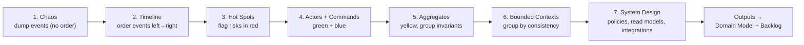
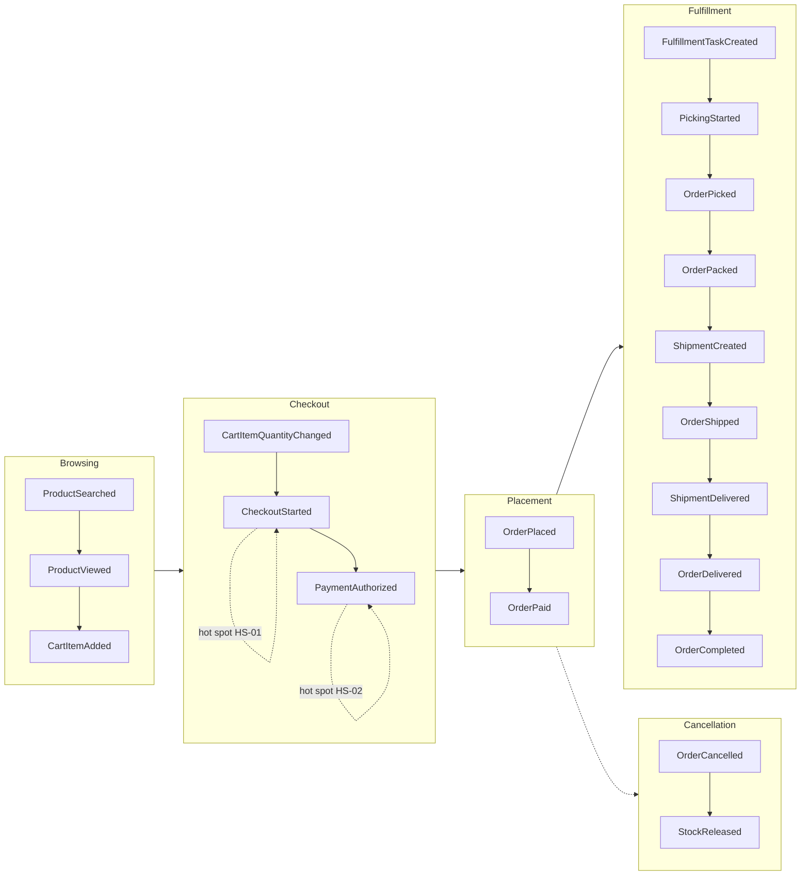
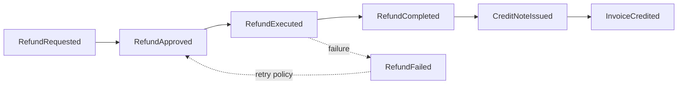
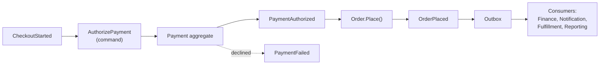
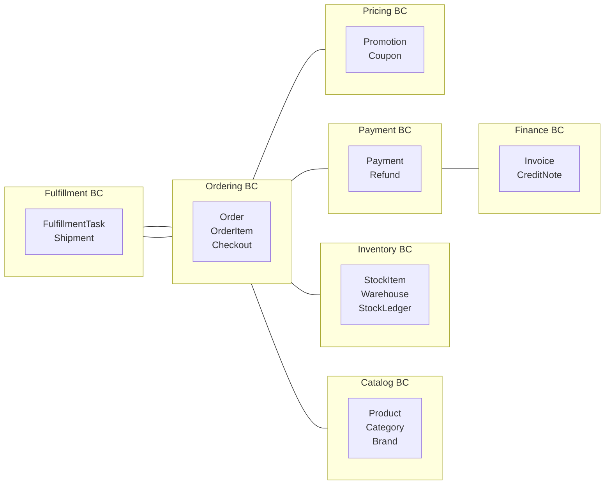

# Document 06b — Event Storming

> **Platform:** E-Commerce Platform (Working Title: `ECommerce`)
> **Document Type:** Collaborative Domain Modeling Output (Event Storming)
> **Status:** Workshop record — v1.0 (Nov 2026 sessions)
> **Audience:** Engineering, Architecture, Product, Finance, Warehouse Ops, Support
> **Inputs:** `03-business-requirements.md`, `06a-domain-model.md`
> **Outputs:** Refined aggregates/events for `06a`, hot-spot backlog, bounded-context boundaries

---

## 1. Document Control

| Version | Date       | Author / Owner | Change Summary                       |
|---------|------------|----------------|---------------------------------------|
| 0.1     | 2026-07-14 | Enterprise Architect | Workshop design + session 1 output  |
| 0.2     | 2026-07-22 | Enterprise Architect | Sessions 2–4, hot spots, timeline maps |
| 1.0     | 2026-07-31 | Enterprise Architect | Baseline record                       |

### 1.1 Approvals

| Role                | Name | Decision | Date |
|----------------------|------|----------|------|
| Enterprise Architect | —    | —        | —    |
| Technical Lead       | —    | —        | —    |
| Product Owner        | —    | —        | —    |

---

## 2. Introduction

### 2.1 What & Why

**Event Storming** is a collaborative, timeboxed workshop technique where cross-functional teams discover a domain by **walking time forward through domain events**. It is used here to:

1. Build a shared understanding of the commerce domain before implementation.
2. Discover the authoritative **domain events**, **commands**, **actors**, and **aggregates**.
3. Identify **hot spots** (risks, ambiguities) while they are cheap to fix.
4. Draw **bounded context boundaries** from real event flows rather than assumptions.
5. Feed the domain model (`06a`) and the persistence model (`07`).

### 2.2 Notation Legend

| Color | Element | Meaning |
|-------|---------|---------|
| 🟠 Orange | Domain Event | A fact that happened (`OrderPlaced`) |
| 🔵 Blue | Command | An actor intent (`PlaceOrder`) |
| 🟡 Yellow | Aggregate | The consistency boundary affected |
| 🟢 Green | Actor / Role | Person/system issuing the command |
| 🟣 Purple | Read Model | Projection used by the UI (`OrderHistoryView`) |
| 🔴 Red | Hot Spot | Risk, open question, policy decision |
| ⚪ White | Process/External | External system event (PSP webhook) |

---

## 3. Workshop Design

### 3.1 Sessions

| Session | Focus | Participants | Duration |
|---------|-------|--------------|----------|
| S1 | Big Picture — full journey (guest → delivery → refund) | PO, Architect, Tech Lead, Ops, Finance, Support | 3 h |
| S2 | Ordering + Pricing depth | PO, Architect, Tech Lead, Merchandising | 3 h |
| S3 | Payments + Finance + Fulfillment depth | Finance, Warehouse, Architect, Tech Lead | 3 h |
| S4 | Inventory + Integrations + Hot-spot resolution | Ops, Integrations, Architect, Tech Lead | 2 h |

### 3.2 Facilitation Rules

- **Write one fact per note.** "Order placed", not "Order is placed then paid".
- **Past tense verbs.** Events describe what already happened.
- **No solutions during chaos phase.** Technical discussion is parked to the parking lot.
- **Follow the timeline.** Left (earliest) → right (latest).
- **Everyone can place notes.** Domain authority beats seniority.
- **Timebox each phase** (see §4). Hot spots get 10-minute slots.

---

## 4. Discovery Process (Phase Order)

---

## 5. Discovered Domain Events (Consolidated)

> Grouped by process; each event = a fact published via Outbox (see `25`).

### 5.1 Order Journey Events

| # | Event | Raised By | Timeline Position |
|---|-------|-----------|-------------------|
| 1 | `ProductSearched` | Search | Browsing |
| 2 | `ProductViewed` | Catalog | Browsing |
| 3 | `CartItemAdded` | Cart | Carting |
| 4 | `CartItemQuantityChanged` | Cart | Carting |
| 5 | `CheckoutStarted` | Ordering | Checkout |
| 6 | `PaymentAuthorized` | Payment | Checkout |
| 7 | `OrderPlaced` | Ordering | Placement |
| 8 | `OrderPaid` | Ordering | Placement |
| 9 | `FulfillmentTaskCreated` | Fulfillment | Fulfillment |
| 10 | `PickingStarted` | Fulfillment | Fulfillment |
| 11 | `OrderPicked` | Fulfillment | Fulfillment |
| 12 | `OrderPacked` | Fulfillment | Fulfillment |
| 13 | `ShipmentCreated` | Fulfillment | Fulfillment |
| 14 | `OrderShipped` | Ordering | Fulfillment |
| 15 | `ShipmentDelivered` | Fulfillment | Fulfillment |
| 16 | `OrderDelivered` | Ordering | Completion |
| 17 | `OrderCompleted` | Ordering | Completion |
| 18 | `OrderCancelled` | Ordering | Cancellation |
| 19 | `StockReleased` | Inventory | Cancellation |
| 20 | `ReturnRequested` | Ordering | Returns |

### 5.2 Payment & Refund Events

| # | Event | Raised By |
|---|-------|-----------|
| 21 | `PaymentAuthorizationRequested` | Ordering/Payment |
| 22 | `PaymentAuthorized` | Payment |
| 23 | `PaymentCaptureRequested` | Payment |
| 24 | `PaymentCaptured` | Payment |
| 25 | `PaymentFailed` | Payment |
| 26 | `PaymentVoided` | Payment |
| 27 | `RefundRequested` | Support/Finance |
| 28 | `RefundApproved` | Finance |
| 29 | `RefundExecuted` | Payment |
| 30 | `RefundCompleted` | Payment/Finance |
| 31 | `RefundFailed` | Payment |
| 32 | `CreditNoteIssued` | Finance |
| 33 | `InvoiceCredited` | Finance |

### 5.3 Inventory & Catalog Events

| # | Event | Raised By |
|---|-------|-----------|
| 34 | `StockReceived` | Inventory |
| 35 | `StockShipped` | Inventory |
| 36 | `StockReserved` | Inventory |
| 37 | `StockReleased` | Inventory |
| 38 | `StockAdjusted` | Inventory |
| 39 | `StockTransferred` | Inventory |
| 40 | `StockLow` | Inventory |
| 41 | `ProductCreated` | Catalog |
| 42 | `ProductUpdated` | Catalog |
| 43 | `PriceChanged` | Catalog |
| 44 | `ProductDeactivated` | Catalog |

### 5.4 Identity, Review, Notification Events

| # | Event | Raised By |
|---|-------|-----------|
| 45 | `CustomerRegistered` | Identity |
| 46 | `EmailVerified` | Identity |
| 47 | `ReviewSubmitted` | Review |
| 48 | `ReviewPublished` | Review |
| 49 | `ReviewRejected` | Review |
| 50 | `ReviewRemoved` | Review |
| 51 | `NotificationQueued` | Notification |
| 52 | `NotificationFailed` | Notification |

---

## 6. Event Flow Maps

### 6.1 Big Picture — Order Journey

### 6.2 Refund Flow

### 6.3 Payment Authorization Detail

---

## 7. Commands → Aggregates → Events Matrix

| Command | Actor | Aggregate(s) | Produced Events |
|---------|-------|--------------|-----------------|
| `RegisterCustomer` | Guest | User | CustomerRegistered |
| `Login` | User | User | (audit only) |
| `AddItemToCart` | Shopper | Cart | CartItemAdded |
| `UpdateCartQuantity` | Shopper | Cart | CartItemQuantityChanged |
| `StartCheckout` | Shopper | Checkout/Order | CheckoutStarted |
| `AuthorizePayment` | System | Payment | PaymentAuthorized / PaymentFailed |
| `PlaceOrder` | System | Order, StockItem, Payment | OrderPlaced, StockReserved |
| `CapturePayment` | System | Payment | PaymentCaptured |
| `AssignFulfillment` | System | FulfillmentTask | FulfillmentTaskCreated |
| `MarkPicked` | Warehouse | FulfillmentTask | OrderPicked |
| `MarkPacked` | Warehouse | FulfillmentTask | OrderPacked |
| `CreateShipment` | System/Warehouse | Shipment | ShipmentCreated |
| `ConfirmDelivery` | Carrier webhook | Shipment, Order | ShipmentDelivered, OrderDelivered |
| `CancelOrder` | Shopper/Support | Order, StockItem, Payment | OrderCancelled, StockReleased, PaymentVoided |
| `RequestRefund` | Support/Finance | Refund | RefundRequested |
| `ApproveRefund` | Finance | Refund | RefundApproved |
| `ExecuteRefund` | System | Refund, Payment | RefundExecuted |
| `IssueCreditNote` | System | CreditNote, Invoice | CreditNoteIssued, InvoiceCredited |
| `ReceiveStock` | Warehouse | StockItem | StockReceived |
| `AdjustStock` | Warehouse | StockItem | StockAdjusted |
| `ReserveStock` | System | StockItem | StockReserved |
| `CreatePromotion` | Admin | Promotion | PromotionCreated |
| `RedeemCoupon` | System | Coupon | CouponRedeemed / CouponExhausted |
| `SubmitReview` | Customer | Review | ReviewSubmitted |
| `ModerateReview` | Support | Review | ReviewPublished / ReviewRejected |

---

## 8. Hot Spots (Red Notes) & Resolutions

| ID | Hot Spot | Workshop Resolution | Owner |
|----|----------|---------------------|-------|
| HS-01 | Cart price can change between `CartItemAdded` and checkout | Price snapshot per line + revalidation at `StartCheckout`; `PriceChanged` event warns customer | Product |
| HS-02 | Race between authorization and placement | Single transaction: authorize → place → outbox (QAS-05); idempotency key on place | Architect |
| HS-03 | Oversell under concurrency | `StockItem.Reserve` atomic guard (`allocated ≤ on_hand`), QAS-01 | Architect |
| HS-04 | Duplicate PSP webhooks | Webhook dedupe by provider event id + idempotent state transition | Tech Lead |
| HS-05 | Refund amount vs captured amount | `RefundPolicy` + remaining-refundable invariant (RF-1) | Finance |
| HS-06 | Split fulfillment order state ambiguity | Order state derives from aggregate of shipment states; `OrderShipped` only when all tasks shipped | Architect |
| HS-07 | Outbox growth | Partitioning + cleanup after confirmed delivery (NFR-CAP-03/04) | SRE |
| HS-08 | Multi-currency FX drift | FX rate frozen at auth; snapshot stored; reconciliation flags delta | Finance |
| HS-09 | Promotion stacking revenue leak | Stacking matrix + non-negative invariant; QAS-02 coupon race | Product/Architect |
| HS-10 | Customer identity across devices | Anonymous cart key + merge on login (`CartMerged`) | Product |

---

## 9. Bounded Context Boundaries (Workshop Result)

> Consistent with `06a` §3. All 10 hot spots resolved before aggregate freeze; any new hot spot discovered during implementation goes through ADR process.

---

## 10. Read Models Discovered

| Read Model | Projection Of | Purpose |
|------------|---------------|---------|
| `OrderHistoryView` | Order events | Customer order list + detail |
| `ProductCatalogView` | Catalog + stock + rating | Storefront catalog (cacheable) |
| `FulfillmentQueueView` | FulfillmentTask events | Warehouse live queue |
| `OrderTimelineView` | All order lifecycle events | Support unified timeline |
| `StockAvailabilityView` | StockItem + ledger | Availability at scale |
| `RatingAggregateView` | ReviewPublished/Removed | Product ratings |
| `SalesAnalyticsView` | Order/Refund events | Reporting |
| `ReconciliationView` | Payment + order + provider | Finance nightly drift |

---

## 11. Open Items / Parking Lot

| # | Item | Status | Owner |
|---|------|--------|-------|
| P-01 | Carrier webhook payload schema variations | Parking lot → adapter spike (Sprint 10) | Tech Lead |
| P-02 | Tax provider fallback depth per country | Parking lot → Finance workshop | Finance |
| P-03 | Voucher/gift-card as future discount type | Deferred (feature-flagged hook) | Product |
| P-04 | Marketplace multi-vendor settlement | Out of scope v1.x | Product |

---

## 12. Traceability

| Workshop Output | Artifact |
|-----------------|----------|
| Events + aggregates | `06a-domain-model.md` §5, §8 |
| Commands | FRS modules (`04a`), API design (`08`) |
| Hot spots | Backlog (`03b`) risk items, NFR (`05`) |
| Read models | CQRS query design (`06`), ERD (`07`) |
| Bounded contexts | Module boundaries in solution layout (`06`) |

---

## 13. Approvals

| Role                | Name | Decision | Date |
|----------------------|------|----------|------|
| Enterprise Architect | —    | —        | —    |
| Technical Lead       | —    | —        | —    |
| Product Owner        | —    | —        | —    |

---

*End of Document 06b — Event Storming.*
*Next document on request: `07-data-model-erd.md`.*
