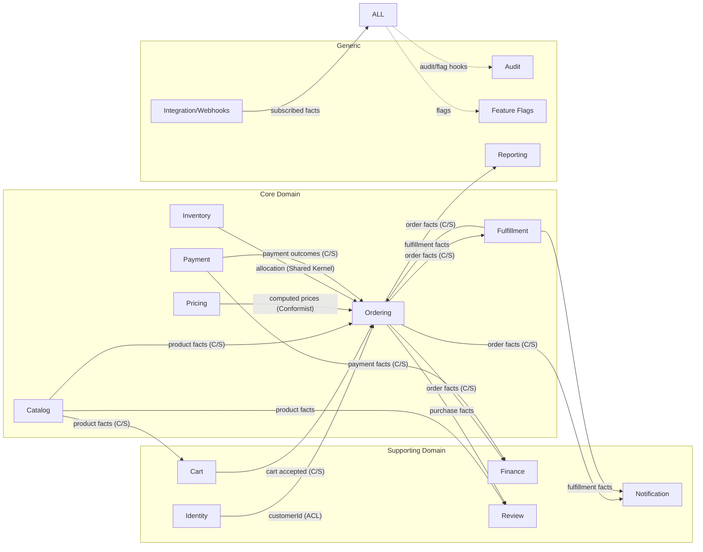

# Document 06c — Bounded Contexts (DDD)

> **Platform:** E-Commerce Platform (Working Title: `ECommerce`)
> **Document Type:** Bounded Context Specification & Context Map
> **Status:** Draft v1.0 for review
> **Audience:** Engineering, Architecture, QA, Product
> **Inputs:** `06a-domain-model.md`, `06b-event-storming.md`
> **Outputs:** Module designs `12`–`29`, `07-data-model-erd.md`, ADR-004 (modular monolith)
> **Relationship:** Authoritative on context boundaries, owned models, contracts, and integration patterns. Aggregates are specified in `06a`.

---

## 1. Document Control

| Version | Date       | Author / Owner | Change Summary                        |
|---------|------------|----------------|----------------------------------------|
| 0.1     | 2026-07-16 | Enterprise Architect | Context list and boundaries      |
| 0.2     | 2026-07-27 | Enterprise Architect | Contracts, ACLs, data ownership |
| 1.0     | 2026-07-31 | Enterprise Architect | Baseline release                |

### 1.1 Approvals

| Role                | Name | Decision | Date |
|----------------------|------|----------|------|
| Enterprise Architect | —    | —        | —    |
| Technical Lead       | —    | —        | —    |
| Product Owner        | —    | —        | —    |

---

## 2. Introduction

### 2.1 Purpose

This document defines the **bounded contexts** of the `ECommerce` platform: their boundaries, purpose, owned domain model, published/consumed events, anti-corruption layers, data ownership, and integration relationships. It translates the workshop results (`06b`) into enforceable engineering boundaries.

### 2.2 Context Map (Big Picture)



---

## 3. Context Summary

| # | Context | Domain Type | Aggregates Owned | Primary Purpose |
|---|---------|-------------|------------------|-----------------|
| 1 | **Identity** | Supporting | User, Role | Authentication, authorization, profiles |
| 2 | **Catalog** | Core | Product, Category, Brand | Product data, taxonomy, pricing lists, search index source |
| 3 | **Cart** | Supporting | Cart | Shopping session, merge, wishlist |
| 4 | **Ordering** | Core | Order | Checkout, placement, order lifecycle |
| 5 | **Pricing** | Core | Promotion, Coupon | Discounts, promotions, coupon redemption |
| 6 | **Inventory** | Core | StockItem, Warehouse | Multi-warehouse stock, allocation, ledger |
| 7 | **Payment** | Core | Payment, Refund | Provider abstraction, authorize/capture, refunds |
| 8 | **Fulfillment** | Core | FulfillmentTask, Shipment | Picking, packing, shipping, tracking |
| 9 | **Finance** | Supporting | Invoice, CreditNote | Invoicing, credit notes, reconciliation |
| 10 | **Notification** | Supporting | Notification, Template | Email/SMS/in-app delivery |
| 11 | **Review** | Supporting | Review | Reviews, moderation, rating projection |
| 12 | **Reporting** | Generic | (read models only) | Analytics and reporting queries |
| 13 | **Audit** | Generic | AuditEntry | Tamper-evident audit trail |
| 14 | **Feature Flags** | Generic | FeatureFlag | Capability rollout and kill-switches |
| 15 | **Integration** | Generic | WebhookEndpoint, WebhookDelivery | Outbound signed webhooks, partner API |

---

## 4. Detailed Context Specifications

### 4.1 Identity (Supporting)

| Aspect | Specification |
|--------|---------------|
| Purpose | Owns "who is acting" and "what they may do". Never owns commerce state. |
| Ubiquitous language | User, Account, Role, Permission, Session, RefreshTokenFamily, VerificationStatus |
| Owned model | User, Role, Permission (catalog), RefreshToken (infra) |
| Published language | `CustomerRegistered`, `EmailVerified`, `AccountClosed` |
| Consumed | none (upstream of all) |
| Commands | Register, Login, Refresh, ResetPassword, VerifyEmail, AssignRole, GrantPermission, Impersonate, CloseAccount |
| Anti-corruption | **Outbound ACL**: exposes only `CustomerId`, `Email`, `Locale`, `Currency`, `Roles`, `Permissions` claims to other contexts — never the internal identity store model. |
| Data owned | `users`, `roles`, `role_permissions`, `refresh_tokens`, `security_events` |
| Read models | `CurrentUserView` (claims), `CustomerLookupView` (support) |
| Repositories | IUserRepository, IRoleRepository |
| Boundary rule | Other contexts must never join on identity tables or read password/security fields. |

### 4.2 Catalog (Core)

| Aspect | Specification |
|--------|---------------|
| Purpose | Owns product truth: what is sellable, at what list/offer price, in which locales. |
| Ubiquitous language | Product, SKU, Slug, Category, Brand, Attribute, PriceList, OfferPrice, Status |
| Owned model | Product, Category, Brand |
| Published language | `ProductCreated`, `ProductUpdated`, `PriceChanged`, `ProductDeactivated` |
| Consumed | — |
| Commands | CreateProduct, UpdateProduct, SetPrice, Activate, Deactivate, ImportProducts, ManageCategory, ManageBrand |
| Contracts to others | Publishes **ProductSnapshotContract**: `{ productId, sku, name(locale), pricePerCurrency[], status, categoryPath, brands }` |
| Data owned | `products`, `product_translations`, `product_prices`, `categories`, `brands`, `product_attributes` |
| Read models | `ProductCatalogView` (storefront, cached), `SearchIndexSourceView` |
| Boundary rule | Availability (stock) is **not** owned here; `ProductCatalogView` joins a projected availability from Inventory via event. |

### 4.3 Cart (Supporting)

| Aspect | Specification |
|--------|---------------|
| Purpose | Owns the shopping session and wishlist; snapshot economics until checkout. |
| Owned model | Cart, CartItem, Wishlist, WishlistItem |
| Published language | `CartItemAdded`, `CartItemRemoved`, `CartMerged`, `CartExpired`, `WishlistItemAdded` |
| Consumed | `ProductUpdated`, `PriceChanged` (revalidation signals) |
| Commands | AddToCart, UpdateQuantity, RemoveItem, MergeCart, SaveToWishlist, MoveWishlistToCart |
| Data owned | `carts`, `cart_items`, `wishlists`, `wishlist_items` |
| Boundary rule | Cart holds **snapshots** (name, unit price); it never re-derives catalog data synchronously except at checkout. |

### 4.4 Ordering (Core — Heart of the System)

| Aspect | Specification |
|--------|---------------|
| Purpose | Owns checkout, placement, and the order lifecycle state machine. |
| Owned model | Order, OrderItem, Checkout; VOs: Address, OrderNumber, OrderTotals, Money |
| Published language | `CheckoutStarted`, `OrderPlaced`, `OrderPaid`, `OrderCancelled`, `OrderShipped`, `OrderDelivered`, `OrderCompleted`, `ReturnRequested` |
| Consumed | `PaymentAuthorized`, `PaymentCaptured`, `PaymentFailed`, `PaymentRefunded`, `ShipmentStatusChanged`, `ShipmentDelivered`, `StockReserved` (completion callback), `StockReleased` |
| Commands | StartCheckout, PlaceOrder, ConfirmPayment, CancelOrder, Ship, Deliver, InitiateReturn, Reorder |
| Domain services | OrderNumberGenerator, PricingEngine (invoked), InventoryAllocationService (invoked) |
| Data owned | `orders`, `order_items`, `order_totals` (snapshot), `order_status_log`, `checkouts` |
| Read models | `OrderHistoryView`, `OrderTimelineView`, `OrderLookupView` (support) |
| Boundary rule | **Order facts are immutable.** No context may amend a placed order; corrections happen via new events (cancel/reissue). |

### 4.5 Pricing (Core)

| Aspect | Specification |
|--------|---------------|
| Purpose | Owns the discount and promotion rule engine; never owns order totals. |
| Owned model | Promotion, Coupon, DiscountRule (VO) |
| Published language | `PromotionCreated`, `PromotionPaused`, `PromotionScheduled`, `CouponRedeemed`, `CouponExhausted` |
| Consumed | (pricing invoked synchronously by Ordering via PricingEngine) |
| Commands | CreatePromotion, SchedulePromotion, PausePromotion, CreateCoupon, RedeemCoupon |
| Contract | `PricingEvaluationRequest` → `PricingResult { itemDiscounts[], cartDiscount, shippingDiscount, appliedRuleIds[], totals }` — **Conformist**: Ordering consumes the computed result, does not reimplement discount math. |
| Data owned | `promotions`, `promotion_conditions`, `promotion_actions`, `coupons`, `coupon_usages` |
| Boundary rule | Coupon redemption is atomic (QAS-02); campaign edits never mutate placed orders (snapshot immutability). |

### 4.6 Inventory (Core)

| Aspect | Specification |
|--------|---------------|
| Purpose | Owns physical stock truth per SKU per warehouse and its ledger. |
| Owned model | StockItem, Warehouse, StockMovement (ledger, append-only) |
| Published language | `StockReceived`, `StockShipped`, `StockReserved`, `StockReleased`, `StockAdjusted`, `StockTransferred`, `StockLow` |
| Consumed | `OrderPlaced` (via allocation service), `OrderCancelled` (release) |
| Commands | ReceiveStock, ReserveStock, ReleaseStock, AdjustStock, TransferStock, ManageWarehouse |
| Shared Kernel | **Allocation API** with Ordering: `ReserveAtomic(sku, warehouse, qty)` with the `allocated ≤ on_hand` invariant enforced here. |
| Data owned | `stock_items`, `warehouses`, `stock_movements` |
| Read models | `StockAvailabilityView`, `FulfillmentPickView` |
| Boundary rule | Ordering never writes stock tables directly; it calls the allocation service (same transaction, bounded via service boundary). |

### 4.7 Payment (Core)

| Aspect | Specification |
|--------|---------------|
| Purpose | Owns money movement with external PSPs; abstraction and idempotency. |
| Owned model | Payment, Refund |
| Published language | `PaymentAuthorized`, `PaymentCaptured`, `PaymentFailed`, `PaymentVoided`, `PaymentRefunded`, `RefundRequested`, `RefundApproved`, `RefundExecuted`, `RefundCompleted`, `RefundFailed` |
| Consumed | `OrderPlaced` (authorize/capture triggers), PSP webhooks (external) |
| Commands | AuthorizePayment, CapturePayment, VoidPayment, ExecuteRefund, ApplyProviderEvent |
| Anti-corruption | **Inbound ACL (PSP)**: adapter normalizes every PSP's webhook schema into `ProviderEvent { providerKey, eventId, type, amount, currency, timestamp, signature }` before touching domain. |
| Data owned | `payments`, `payment_attempts` (ledger), `refunds`, `provider_webhooks` (dedupe) |
| Boundary rule | No raw PAN anywhere; no payment logic in other contexts. |

### 4.8 Fulfillment (Core)

| Aspect | Specification |
|--------|---------------|
| Purpose | Owns warehouse operations and carrier integration. |
| Owned model | FulfillmentTask, Shipment (consignment) |
| Published language | `FulfillmentTaskCreated`, `OrderPicked`, `OrderPacked`, `ShipmentCreated`, `ShipmentStatusChanged`, `ShipmentDelivered` |
| Consumed | `OrderPaid` (task creation), `OrderCancelled` (task cancel) |
| Commands | AssignTask, StartPicking, MarkPacked, CreateShipment, SplitTask, ApplyTrackingUpdate |
| Anti-corruption | **Inbound ACL (Carrier)**: adapter normalizes carrier status payloads into `TrackingUpdate { carrierKey, trackingNumber, status, timestamp }`. |
| Data owned | `fulfillment_tasks`, `task_items`, `shipments`, `tracking_updates` |
| Boundary rule | Order state change (Shipped/Delivered) is owned by Ordering; Fulfillment publishes facts, Ordering decides transitions (hot spot HS-06). |

### 4.9 Finance (Supporting)

| Aspect | Specification |
|--------|---------------|
| Purpose | Owns invoicing, credit notes, tax records, and the reconciliation feed. |
| Owned model | Invoice, CreditNote, TaxRecord (projection) |
| Published language | `InvoiceIssued`, `CreditNoteIssued`, `InvoiceCredited` |
| Consumed | `OrderPaid` (invoice), `RefundCompleted` (credit note), `PaymentCaptured` (ledger) |
| Commands | IssueInvoice, IssueCreditNote, RunReconciliation |
| Data owned | `invoices`, `invoice_lines`, `credit_notes`, `reconciliation_runs`, `reconciliation_drifts` |
| Boundary rule | Finance never mutates orders or payments; it consumes and projects. |

### 4.10 Notification (Supporting)

| Aspect | Specification |
|--------|---------------|
| Purpose | Owns message delivery across channels. |
| Owned model | Notification, NotificationTemplate |
| Published language | `NotificationQueued`, `NotificationFailed` |
| Consumed | All commerce facts (OrderPlaced, OrderShipped, PaymentFailed, RefundCompleted, StockLow, …) |
| Commands | QueueNotification, SendNotification, RetryNotification |
| Data owned | `notifications`, `notification_templates`, `delivery_logs` |
| Boundary rule | Payloads are tokenized references only (N-1 invariant); no PII in events or logs. |

### 4.11 Review (Supporting)

| Aspect | Specification |
|--------|---------------|
| Purpose | Owns customer reviews, moderation, and rating projections. |
| Owned model | Review |
| Published language | `ReviewSubmitted`, `ReviewPublished`, `ReviewRejected`, `ReviewRemoved` |
| Consumed | `ProductUpdated` (identity), `OrderCompleted` (verified-purchase evidence) |
| Commands | SubmitReview, ModerateReview, RemoveReview, VoteReview |
| Data owned | `reviews`, `review_votes` |
| Read models | `RatingAggregateView` (owned projection, feeds Catalog view) |
| Boundary rule | Rating aggregation is a Review-owned read model; Catalog never recomputes it. |

### 4.12 Reporting (Generic)

| Aspect | Specification |
|--------|---------------|
| Purpose | Analytics and reporting queries over projected facts. |
| Owned model | Read models + report definitions only (no writes) |
| Consumed | Order, Refund, Fulfillment, Inventory, Review facts |
| Data owned | `report_queries` (definitions), cached aggregations |
| Boundary rule | Never writes source-of-truth tables; reads replicas. |

### 4.13 Audit (Generic)

| Aspect | Specification |
|--------|---------------|
| Purpose | Tamper-evident record of who did what, when. |
| Owned model | AuditEntry |
| Published language | (none) |
| Consumed | Audit contract from all contexts (`audit.record`) |
| Data owned | `audit_log` (append-only, hash-chained) |
| Boundary rule | Appended by middleware + explicit domain events; never updated or deleted. |

### 4.14 Feature Flags (Generic)

| Aspect | Specification |
|--------|---------------|
| Purpose | Capability rollout and kill-switches. |
| Owned model | FeatureFlag |
| Consumed | Any context may evaluate flags via `IFeatureFlagEvaluator` |
| Data owned | `feature_flags`, `flag_assignments` |
| Boundary rule | Flag changes audited; evaluation cached 30 s; kill-switch semantics honored. |

### 4.15 Integration (Generic)

| Aspect | Specification |
|--------|---------------|
| Purpose | Outbound signed webhooks and partner API surface. |
| Owned model | WebhookEndpoint, WebhookDelivery, PartnerCredential |
| Consumed | Subscribed facts from core contexts |
| Commands | RegisterEndpoint, RotateSecret, ReplayDelivery, SuspendEndpoint |
| Data owned | `webhook_endpoints`, `webhook_deliveries` |
| Boundary rule | HMAC-signed; retries with escalation; replay endpoint keyed by event id. |

---

## 5. Context Relationships & Integration Contracts

### 5.1 Relationship Patterns

| From | To | Pattern | Contract |
|------|-----|---------|----------|
| Identity | Ordering | ACL | Claims envelope (CustomerId, Email, Locale, Currency, Permissions) |
| Catalog | Ordering | Customer/Supplier | ProductSnapshotContract |
| Catalog | Cart | Customer/Supplier | ProductSnapshotContract (slim) |
| Pricing | Ordering | Conformist | PricingResult |
| Cart | Ordering | Customer/Supplier | CheckoutOrderLineContract |
| Inventory | Ordering | Shared Kernel | AllocationService |
| Payment | Ordering | Customer/Supplier | PaymentOutcomeContract |
| Ordering | Fulfillment | Customer/Supplier | OrderFactsContract |
| Fulfillment | Ordering | Customer/Supplier | FulfillmentFactsContract (tracking events) |
| Payment | Finance | Customer/Supplier | PaymentFactsContract |
| Ordering | Finance | Customer/Supplier | OrderFactsContract (billing view) |
| Core | Notification | Customer/Supplier | EventSubscriptions (order/payment/refund/stock) |
| Catalog+Ordering | Review | Customer/Supplier | ProductRef + PurchaseEvidence |
| All | Audit | Shared Kernel | audit.record API |
| All | Feature Flags | Shared Kernel | IFeatureFlagEvaluator |
| Core | Integration | Open-Host Service | Published event contract + webhook registry |

### 5.2 Published-Language Schema (Extract — OrderFactsContract)

```json
{
  "eventId": "uuid",
  "type": "order.placed",
  "occurredAt": "2026-07-31T10:15:00Z",
  "version": "1.0",
  "aggregateId": "order-id",
  "payload": {
    "orderId": "uuid",
    "orderNumber": "E-20260731-001234",
    "customerId": "uuid",
    "currency": "EUR",
    "totals": { "subtotal": "129.9000", "shipping": "9.9000", "tax": "27.9600", "total": "167.7600" },
    "lines": [
      { "productId": "uuid", "sku": "SKU-001", "quantity": 2, "unitPrice": "64.9500" }
    ]
  }
}
```

> Versioned payloads; consumers tolerate unknown fields; breaking changes require new version + migration window.

---

## 6. Consistency Strategy per Relationship

| Relationship | Consistency | Mechanism |
|--------------|-------------|-----------|
| Inventory → Ordering (allocation) | **Transactional** | Same DB transaction via service boundary (modular monolith) |
| Payment → Ordering (authorize+place) | **Transactional** | Order-placement transaction includes payment auth step |
| Catalog → Cart/Ordering | **Eventual** | ProductUpdated/PriceChanged → revalidation signals |
| Ordering → Fulfillment/Finance/Notification/Reporting | **Eventual** | Outbox → MassTransit consumers |
| Payment → Finance | **Eventual** | PaymentCaptured/RefundCompleted events |
| Review → Catalog (rating) | **Eventual** | ReviewPublished/Removed → RatingAggregateView |
| All → Audit | **Synchronous call + event** | Middleware writes; domain events append |

---

## 7. Data Ownership Map

| Table Group | Owning Context |
|-------------|----------------|
| `users`, `roles`, `refresh_tokens` | Identity |
| `products`, `product_translations`, `product_prices`, `categories`, `brands` | Catalog |
| `carts`, `cart_items`, `wishlists` | Cart |
| `orders`, `order_items`, `order_status_log`, `checkouts` | Ordering |
| `promotions`, `coupons`, `coupon_usages` | Pricing |
| `stock_items`, `warehouses`, `stock_movements` | Inventory |
| `payments`, `payment_attempts`, `refunds`, `provider_webhooks` | Payment |
| `fulfillment_tasks`, `shipments`, `tracking_updates` | Fulfillment |
| `invoices`, `credit_notes`, `reconciliation_runs` | Finance |
| `notifications`, `notification_templates` | Notification |
| `reviews`, `review_votes` | Review |
| `audit_log` | Audit |
| `feature_flags` | Feature Flags |
| `webhook_endpoints`, `webhook_deliveries` | Integration |

> Single PostgreSQL database (modular monolith), one schema per context (`identity`, `catalog`, `ordering`, …). Cross-schema access allowed only through the contracts in §5. (ADR-004.)

---

## 8. Anti-Corruption Layers

| ACL | Context | Protects Against | Normalization |
|-----|---------|------------------|---------------|
| Identity ACL | Ordering | Identity internals leaking | Claims envelope only |
| PSP ACL | Payment | PSP API churn | `ProviderEvent` canonical event |
| Carrier ACL | Fulfillment | Carrier payload variance | `TrackingUpdate` canonical event |
| Tax ACL | Finance | Tax provider schema drift | `TaxResult` canonical record |
| FX ACL | Finance/Payment | FX feed variance | `FxRate` canonical record |

---

## 9. Module Mapping (Solution)

| Context | Solution Module |
|---------|-----------------|
| Identity | `ECommerce.UseCases/Identity` + `ECommerce.Domain` |
| Catalog | `ECommerce.UseCases/Catalog` |
| Cart | `ECommerce.UseCases/Cart` |
| Ordering | `ECommerce.UseCases/Orders` |
| Pricing | `ECommerce.UseCases/Promotions` |
| Inventory | `ECommerce.UseCases/Inventory` |
| Payment | `ECommerce.UseCases/Payments` |
| Fulfillment | `ECommerce.UseCases/Fulfillment` |
| Finance | `ECommerce.UseCases/Finance` |
| Notification | `ECommerce.UseCases/Notifications` |
| Review | `ECommerce.UseCases/Reviews` |
| Reporting | `ECommerce.UseCases/Reports` |
| Audit | `ECommerce.Infrastructure/Audit` |
| Feature Flags | `ECommerce.Infrastructure/FeatureFlags` |
| Integration | `ECommerce.UseCases/Integrations` |

> Enforced by architecture tests: cross-context references only via `IPublishedContract` interfaces and event consumers.

---

## 10. Decisions & ADR References

| Decision | ADR |
|----------|-----|
| Modular monolith (one deployable) with context boundaries | ADR-004 |
| Transactional cross-context write only for order placement | ADR-004 |
| All cross-context integration via events + outbox | ADR-003 |
| Shared Kernel for Inventory↔Ordering allocation | ADR-005 |
| Single DB, one schema per context | ADR-006 |

---

## 11. Approvals

| Role                | Name | Decision | Date |
|----------------------|------|----------|------|
| Enterprise Architect | —    | —        | —    |
| Technical Lead       | —    | —        | —    |
| Product Owner        | —    | —        | —    |

---

*End of Document 06c — Bounded Contexts.*
*Next document on request: `07-data-model-erd.md`.*
