# Document 07 — Data Model & Database Design (ERD)

> **Platform:** E-Commerce Platform (Working Title: `ECommerce`)
> **Document Type:** Database Design / ERD Specification
> **Status:** Draft v1.0 for review
> **Audience:** Engineering, DBA/SRE, QA, Architecture
> **Inputs:** `06a-domain-model.md`, `06c-bounded-contexts.md`, `06-system-architecture.md`
> **Relationship:** Maps the domain aggregates to PostgreSQL schema. One schema per bounded context; cross-schema access only via contracts (`06c` §7).

---

## 1. Document Control

| Version | Date       | Author / Owner | Change Summary                        |
|---------|------------|----------------|----------------------------------------|
| 0.1     | 2026-07-19 | Technical Lead  | Conventions, core tables              |
| 0.2     | 2026-07-29 | Technical Lead  | Full schema, indexes, partitioning    |
| 1.0     | 2026-07-31 | Technical Lead  | Baseline release                     |

### 1.1 Approvals

| Role                | Name | Decision | Date |
|----------------------|------|----------|------|
| Technical Lead       | —    | —        | —    |
| Enterprise Architect | —    | —        | —    |
| DBA / SRE Lead       | —    | —        | —    |

---

## 2. Introduction

### 2.1 Purpose

This document specifies the **relational database design** for the platform: schema layout, table/column definitions, constraints, indexes, partitioning, retention, and migration strategy. It is the persistence contract between the EF Core model (`ECommerce.Infrastructure/Data`) and the domain model (`06a`).

### 2.2 Database Platform

| Item | Value |
|------|-------|
| DBMS | PostgreSQL 16+ |
| Access | EF Core 10 + Npgsql |
| Storage | Single logical database `ecommerce`; one schema per bounded context |
| Encoding | UTF-8 |
| Timezone | `timestamptz`; all writes UTC |

---

## 3. Global Conventions

### 3.1 Naming

| Aspect | Convention | Example |
|--------|-----------|---------|
| Schemas | lowercase, context name | `ordering`, `catalog`, `payment` |
| Tables | snake_case, plural | `order_items` |
| Columns | snake_case | `unit_price` |
| Primary keys | `id` (uuid) | — |
| Foreign keys | `<singular_table>_id` | `order_id` |
| Indexes | `ix_<table>_<cols>` | `ix_orders_customer_id` |
| Unique indexes | `ux_<table>_<cols>` | `ux_products_sku` |
| Enums | PostgreSQL `ENUM` via Npgsql mapping OR `varchar` + check | `order_status` |

### 3.2 Common Column Types

| Domain Concept | Type | Notes |
|----------------|------|-------|
| Identity | `uuid` | Generated (EF default `Guid`); app-generated for aggregates |
| Money | `decimal(18,4)` | Never `float`; 2-dp display, 4-dp storage |
| Percentage | `decimal(9,4)` | 0–100 |
| Quantity | `integer` | Stock, cart quantities |
| Timestamps | `timestamptz` | UTC |
| Language keys | `varchar(5)` | `en`, `ar`, `de`, … |
| Currency | `char(3)` | ISO 4217 |
| Status | `varchar(20)` + CHECK | Enumeration safety |
| Audit fields | `created_at`, `updated_at`, `created_by`, `updated_by` | All tables |

### 3.3 Enforced Invariants (DB Level)

| Invariant | Mechanism |
|-----------|-----------|
| `Allocated ≤ OnHand` | CHECK on `stock_items` |
| Non-negative totals | CHECK on `orders` + `order_items` |
| SKU / slug / code uniqueness | Unique indexes |
| One review per (customer, product) | Unique index `ux_reviews_customer_product` |
| Coupon code uniqueness | Unique index |
| Quantity bounds | CHECK on `cart_items` (1–99) |
| Currency consistency | CHECK `order.currency = order_items.currency` |

---

## 4. ERD (Full)

```mermaid
erDiagram
    %% Identity
    USERS ||--o{ REFRESH_TOKENS : has
    USERS ||--o{ SECURITY_EVENTS : generates
    ROLES ||--o{ ROLE_PERMISSIONS : grants
    USERS ||--o{ USER_ROLES : assigned

    %% Catalog
    PRODUCTS }o--|| CATEGORIES : belongs
    PRODUCTS }o--|| BRANDS : belongs
    PRODUCTS ||--o{ PRODUCT_TRANSLATIONS : localizes
    PRODUCTS ||--o{ PRODUCT_PRICES : prices
    PRODUCTS ||--o{ PRODUCT_ATTRIBUTES : describes

    %% Cart
    CARTS ||--|{ CART_ITEMS : contains
    WISHLISTS ||--o{ WISHLIST_ITEMS : contains

    %% Ordering
    ORDERS ||--|{ ORDER_ITEMS : contains
    ORDERS ||--o{ ORDER_STATUS_LOGS : transitions
    USERS ||--o{ ORDERS : places
    PRODUCTS ||--o{ ORDER_ITEMS : snapshot_ref

    %% Pricing
    PROMOTIONS ||--o{ PROMOTION_CONDITIONS : has
    PROMOTIONS ||--o{ PROMOTION_ACTIONS : has
    COUPONS ||--o{ COUPON_USAGES : tracks
    PROMOTIONS ||--o{ COUPONS : issues

    %% Inventory
    STOCK_ITEMS }o--|| WAREHOUSES : stored
    STOCK_ITEMS ||--o{ STOCK_MOVEMENTS : ledgers

    %% Payment
    ORDERS ||--o{ PAYMENTS : paid_by
    PAYMENTS ||--o{ PAYMENT_ATTEMPTS : attempts
    PAYMENTS ||--o{ REFUNDS : refunded_by
    PAYMENTS ||--o{ PROVIDER_WEBHOOKS : receives

    %% Fulfillment
    ORDERS ||--o{ FULFILLMENT_TASKS : fulfilled_by
    FULFILLMENT_TASKS ||--|{ TASK_ITEMS : picks
    FULFILLMENT_TASKS ||--o{ SHIPMENTS : ships
    SHIPMENTS ||--o{ TRACKING_UPDATES : receives

    %% Finance
    ORDERS ||--o{ INVOICES : bills
    INVOICES ||--|{ INVOICE_LINES : contains
    INVOICES ||--o{ CREDIT_NOTES : offsets
    REFUNDS ||--o{ CREDIT_NOTES : generates

    %% Review
    PRODUCTS ||--o{ REVIEWS : receives
    USERS ||--o{ REVIEWS : writes
    REVIEWS ||--o{ REVIEW_VOTES : votes

    %% Platform
    OUTBOX_EVENTS ||--o{ INBOX_MESSAGES : tracked
    WEBHOOK_ENDPOINTS ||--o{ WEBHOOK_DELIVERIES : delivers
```

---

## 5. Core Schemas & Tables

### 5.1 `identity` Schema

#### users

| Column | Type | Null | Notes |
|--------|------|:----:|-------|
| id | uuid | No | PK |
| email | varchar(254) | No | UQ, normalized |
| password_hash | text | No | Argon2id |
| display_name | varchar(120) | No | |
| locale | varchar(5) | No | Default `en` |
| currency | char(3) | No | Default `USD` |
| email_verified_at | timestamptz | Yes | |
| lockout_end | timestamptz | Yes | |
| failed_login_count | integer | No | Default 0 |
| status | varchar(20) | No | `active|closed` |
| created_at / updated_at | timestamptz | No | |
| **Indexes** | | | `ux_users_email` |

#### roles, role_permissions, user_roles, refresh_tokens, security_events

| Table | Key Columns | Notes |
|-------|-------------|-------|
| roles | id, name (UQ), description | Seeded: Customer, Admin, WarehouseEmployee, Finance, Support, SuperAdmin |
| role_permissions | role_id FK, permission_code | PK (role_id, permission_code) |
| user_roles | user_id FK, role_id FK | PK (user_id, role_id) |
| refresh_tokens | id, user_id FK, family_id, device_id, token_hash (UQ), expires_at, revoked_at | Rotation + family revocation |
| security_events | id, user_id FK, event_type, ip, occurred_at | Login/lockout/impersonation/role-change |

### 5.2 `catalog` Schema

#### products

| Column | Type | Null | Notes |
|--------|------|:----:|-------|
| id | uuid | No | PK |
| sku | varchar(50) | No | `ux_products_sku` |
| slug | varchar(160) | No | `ux_products_slug` |
| category_id | uuid | Yes | FK → categories |
| brand_id | uuid | Yes | FK → brands |
| status | varchar(20) | No | `draft|active|inactive` |
| is_featured | boolean | No | |
| image_urls | jsonb | No | Array of URLs |
| attributes | jsonb | Yes | Attribute key/values |
| created_at / updated_at | timestamptz | No | |
| **Indexes** | | | `ix_products_category_id`, `ix_products_status`, GIN(attributes) |

#### product_translations

| Column | Type | Notes |
|--------|------|-------|
| product_id | uuid | FK; PK (product_id, locale) |
| locale | varchar(5) | |
| name | varchar(255) | |
| description | text | |
| meta_title / meta_description | varchar | SEO |

#### product_prices

| Column | Type | Notes |
|--------|------|-------|
| product_id | uuid | FK; PK (product_id, currency) |
| currency | char(3) | |
| list_amount | decimal(18,4) | CHECK > 0 |
| offer_amount | decimal(18,4) | NULL; CHECK offer ≤ list |
| updated_at | timestamptz | |

#### categories, brands

| Table | Key Columns | Notes |
|-------|-------------|-------|
| categories | id, name, slug (UQ), parent_id (self FK), sort_order, level | Depth ≤ 5, cycle prevention app-side |
| brands | id, name (UQ), description, website | |

### 5.3 `cart` Schema

#### carts

| Column | Type | Notes |
|--------|------|-------|
| id | uuid | PK |
| owner_key | varchar(64) | Customer UUID or anonymous key; `ux_carts_owner_key` |
| currency | char(3) | |
| version | bigint | Optimistic concurrency |
| expires_at | timestamptz | TTL 30 d |
| created_at / updated_at | timestamptz | |

#### cart_items

| Column | Type | Notes |
|--------|------|-------|
| cart_id | uuid | FK; PK (cart_id, product_id) |
| product_id | uuid | FK |
| sku / name | varchar | Snapshot |
| unit_price | decimal(18,4) | Snapshot |
| quantity | integer | CHECK 1–99 |
| image_url | varchar | Snapshot |

#### wishlists, wishlist_items

| Table | Key Columns | Notes |
|-------|-------------|-------|
| wishlists | id, user_id (UQ) | |
| wishlist_items | wishlist_id FK, product_id FK, created_at | PK (wishlist_id, product_id) |

### 5.4 `ordering` Schema

#### orders

| Column | Type | Null | Notes |
|--------|------|:----:|-------|
| id | uuid | No | PK |
| order_number | varchar(24) | No | `ux_orders_order_number` |
| customer_id | uuid | No | FK → identity.users (logical) |
| customer_email | varchar(254) | No | Snapshot |
| status | varchar(24) | No | CHECK (FRS-D state machine) |
| currency | char(3) | No | |
| subtotal | decimal(18,4) | No | |
| item_discount | decimal(18,4) | No | |
| cart_discount | decimal(18,4) | No | |
| shipping_total | decimal(18,4) | No | |
| tax_total | decimal(18,4) | No | |
| grand_total | decimal(18,4) | No | CHECK ≥ 0 |
| shipping_address | jsonb | No | Immutable snapshot |
| billing_address | jsonb | No | Immutable snapshot |
| placed_at | timestamptz | No | |
| cancelled_at / cancelled_reason | timestamptz / varchar | Yes | |
| **Indexes** | | | `ix_orders_customer_id`, `ix_orders_placed_at`, `ix_orders_status` |

#### order_items

| Column | Type | Notes |
|--------|------|-------|
| id | bigint | PK (sequence) |
| order_id | uuid | FK; `ix_order_items_order_id` |
| product_id | uuid | |
| sku / product_name | varchar | Snapshot |
| unit_price | decimal(18,4) | Snapshot |
| unit_discount | decimal(18,4) | |
| quantity | integer | CHECK ≥ 1 |
| image_url | varchar | |
| **Constraint** | | CHECK currency consistency via parent |

#### order_status_log

| Column | Type | Notes |
|--------|------|-------|
| id | bigint | PK |
| order_id | uuid | FK |
| from_status / to_status | varchar | |
| actor_id / actor_type | uuid / varchar | |
| trace_id | varchar(32) | Correlation |
| occurred_at | timestamptz | |

#### checkouts

| Column | Type | Notes |
|--------|------|-------|
| id | uuid | PK |
| cart_id | uuid | |
| customer_id | uuid | Nullable (guest) |
| currency | char(3) | |
| price_snapshot | jsonb | Immutable breakdown |
| status | varchar(24) | `created|payment_authorized|placed|expired` |
| expires_at | timestamptz | TTL 30 min |
| created_at / updated_at | timestamptz | |

### 5.5 `pricing` Schema

| Table | Key Columns | Notes |
|-------|-------------|-------|
| promotions | id, name, schedule_start/schedule_end/paused_at, stacking_matrix (jsonb), eligible_countries (varchar[]), eligible_currencies (char(3)[]) | `ix_promotions_active` (partial) |
| promotion_conditions | id, promotion_id FK, condition_type, payload jsonb | product/category/brand/min_qty/min_amount/segment |
| promotion_actions | id, promotion_id FK, action_type, payload jsonb | percent_off/amount_off/free_shipping |
| coupons | id, code (UQ), promotion_id FK, total_uses, used_count, per_customer_limit, starts_at/ends_at | |
| coupon_usages | id, coupon_id FK, order_id FK, customer_id, redeemed_at | `ux_coupon_usages_coupon_customer` (partial per-customer limit) |

### 5.6 `inventory` Schema

#### stock_items

| Column | Type | Null | Notes |
|--------|------|:----:|-------|
| id | uuid | No | PK |
| sku | varchar(50) | No | |
| warehouse_id | uuid | No | FK |
| on_hand | integer | No | CHECK ≥ 0 |
| allocated | integer | No | CHECK `allocated ≤ on_hand` |
| in_transit | integer | No | CHECK ≥ 0 |
| low_stock_threshold | integer | No | |
| version | bigint | No | Optimistic + row locking |
| **Indexes** | | | `ux_stock_items_sku_warehouse`, `ix_stock_items_warehouse` |

#### warehouses

| Column | Type | Notes |
|--------|------|-------|
| id, code (UQ), name, address, country_code, region, allocation_rank, is_active | | |

#### stock_movements (append-only ledger)

| Column | Type | Notes |
|--------|------|-------|
| id | bigint | PK |
| stock_item_id | uuid | FK |
| movement_type | varchar(20) | `receive|ship|reserve|release|adjust|transfer_in|transfer_out` |
| quantity | integer | Signed delta |
| reference_type / reference_id | varchar / uuid | Order, shipment, adjustment, transfer |
| reason_code | varchar(40) | |
| actor_id | uuid | |
| occurred_at | timestamptz | |
| **Indexes** | | `ix_stock_movements_stock_item`, `ix_stock_movements_reference` |

### 5.7 `payment` Schema

#### payments

| Column | Type | Notes |
|--------|------|-------|
| id | uuid | PK |
| order_id | uuid | FK |
| customer_id | uuid | |
| provider_key | varchar(30) | PSP routing key |
| provider_token | text | Opaque; never PAN |
| provider_reference | varchar(120) | |
| currency | char(3) | |
| amount | decimal(18,4) | |
| fx_rate | decimal(18,8) | Snapshot |
| status | varchar(20) | CHECK state machine |
| authorized_at / captured_at / voided_at | timestamptz | |
| **Indexes** | | `ux_payments_order_id`, `ix_payments_provider_reference` |

#### payment_attempts (append-only)

| Column | Type | Notes |
|--------|------|-------|
| id | bigint | PK |
| payment_id | uuid | FK |
| attempt_no | integer | |
| action | varchar(20) | authorize/capture/void/refund |
| amount | decimal(18,4) | |
| provider_response | jsonb | Sanitized |
| status | varchar(20) | success/failed/timeout |
| trace_id | varchar(32) | |
| occurred_at | timestamptz | |

#### refunds

| Column | Type | Notes |
|--------|------|-------|
| id | uuid | PK |
| order_id / payment_id | uuid | FK |
| amount | decimal(18,4) | |
| currency | char(3) | |
| reason | varchar(255) | |
| status | varchar(20) | CHECK |
| idempotency_key | varchar(64) | `ux_refunds_idempotency_key` |
| provider_reference | varchar(120) | |
| approved_by / approved_at | uuid / timestamptz | |

#### provider_webhooks

| Column | Type | Notes |
|--------|------|-------|
| id | bigint | PK |
| provider_key | varchar(30) | |
| provider_event_id | varchar(120) | `ux_provider_webhooks_event_id` (dedupe) |
| event_type | varchar(60) | |
| payload | jsonb | Raw (sanitized) |
| processed_at | timestamptz | |

### 5.8 `fulfillment` Schema

| Table | Key Columns | Notes |
|-------|-------------|-------|
| fulfillment_tasks | id, order_id FK, warehouse_id FK, status, priority, assigned_to, picked_at/packed_at, **version** | `ix_fulfillment_tasks_warehouse_status` (partial queue) |
| task_items | id, task_id FK, product_id, sku, quantity, bin_location | |
| shipments | id, task_id FK(s), carrier_key, tracking_number (UQ), label_url, status | `ux_shipments_tracking_number` |
| tracking_updates | id, shipment_id FK, carrier_key, status, timestamp, raw jsonb | Stale-event guard app-side |

### 5.9 `finance` Schema

| Table | Key Columns | Notes |
|-------|-------------|-------|
| invoices | id, invoice_number (UQ, sequential), order_id FK, customer_id, currency, tax_amount, total, status, pdf_url, issued_at | |
| invoice_lines | id, invoice_id FK, description, quantity, unit_amount, tax_rate, amount | |
| credit_notes | id, credit_note_number (UQ), invoice_id FK, refund_id FK, amount, reason, issued_at | |
| reconciliation_runs | id, run_date, status, drift_count, report_url | |
| reconciliation_drifts | id, run_id FK, drift_type, reference, expected/actual jsonb, resolved_at | |

### 5.10 `notification` Schema

| Table | Key Columns | Notes |
|-------|-------------|-------|
| notifications | id, recipient_ref (tokenized), channel, template_key, locale, status, attempts, dedupe_key (UQ), sent_at | |
| notification_templates | id, key (UQ), channel, subject, body, placeholders jsonb | Body is locale-keyed jsonb |
| delivery_logs | id, notification_id FK, provider_ref, status, error, attempted_at | |

### 5.11 `review` Schema

| Table | Key Columns | Notes |
|-------|-------------|-------|
| reviews | id, product_id FK, customer_id FK, customer_name, rating (CHECK 1–5), comment, is_verified_purchase, status, moderation_note, created_at | `ux_reviews_customer_product`, `ix_reviews_product_status` |
| review_votes | id, review_id FK, customer_id FK, helpful boolean | PK (review_id, customer_id) |

### 5.12 `audit` Schema

| Column | Type | Notes |
|--------|------|-------|
| id | bigint | PK |
| actor_id | uuid | |
| actor_type | varchar(20) | user/system/impersonated |
| action | varchar(80) | `order.cancel`, `stock.adjust` |
| entity_type / entity_id | varchar / uuid | |
| before / after | jsonb | Delta |
| ip / user_agent | varchar | Request context |
| trace_id | varchar(32) | |
| hash / prev_hash | text | Tamper-evident chain |
| occurred_at | timestamptz | |
| **Indexes** | | `ix_audit_log_actor`, `ix_audit_log_entity`, `ix_audit_log_occurred_at` |

### 5.13 `platform` Schema (Cross-Cutting)

#### outbox_events

| Column | Type | Notes |
|--------|------|-------|
| id | uuid | PK |
| aggregate_id / aggregate_type | uuid / varchar | |
| event_type | varchar(120) | |
| payload | jsonb | Versioned contract |
| created_at | timestamptz | |
| processed_at | timestamptz | NULL until published |
| attempts | integer | Default 0 |
| **Indexes** | | `ix_outbox_events_ready (processed_at IS NULL, created_at)` |

#### inbox_messages

| Column | Type | Notes |
|--------|------|-------|
| id | uuid | PK |
| consumer_queue | varchar(60) | |
| message_id | varchar(120) | Dedupe key |
| processed_at | timestamptz | |
| **Constraint** | | `ux_inbox_queue_message` |

#### idempotency_records

| Column | Type | Notes |
|--------|------|-------|
| idempotency_key | varchar(64) | PK |
| resource | varchar(80) | order/refund/payment |
| request_hash | varchar(64) | |
| response_json | jsonb | Stored response |
| status | varchar(20) | in_progress/completed |
| expires_at | timestamptz | TTL |

#### feature_flags, flag_assignments

| Table | Key Columns | Notes |
|-------|-------------|-------|
| feature_flags | id, key (UQ), enabled, targeting jsonb, updated_by, updated_at | |
| flag_assignments | flag_id FK, environment, segment, value | |

#### webhook_endpoints, webhook_deliveries

| Table | Key Columns | Notes |
|-------|-------------|-------|
| webhook_endpoints | id, url, secret_hash, events varchar[], status, created_by | |
| webhook_deliveries | id, endpoint_id FK, event_id, payload jsonb, signature, status, attempts, next_retry_at | `ix_webhook_deliveries_endpoint_status` |

---

## 6. Indexing Strategy (Hot Paths)

| Query (from load profile) | Table | Index |
|---------------------------|-------|-------|
| Product by slug/locale/currency | products + translations + prices | `ux_products_slug`; composite lookups |
| Cart load by owner | carts | `ux_carts_owner_key` |
| Order history by customer | orders | `ix_orders_customer_id_placed_at` |
| Fulfillment queue by warehouse | fulfillment_tasks | partial `ix_tasks_warehouse_status WHERE status IN (...)` |
| Availability by SKU | stock_items | `ux_stock_items_sku_warehouse` |
| Payment by provider reference | payments | `ix_payments_provider_reference` |
| Webhook dedupe | provider_webhooks | `ux_provider_webhooks_event_id` |
| Outbox drain | outbox_events | partial `ix_outbox_ready` |
| Audit search | audit_log | composite `(actor_id, occurred_at)`, `(entity_id)` |
| Reconciliation | payments + refunds | `(order_id)`, `(created_at)` |
| Reports (time range) | orders | `ix_orders_placed_at` (BRIN) |

**Rule:** every index justified by a query in the load profile or a constraint; no speculative indexes. Over-indexing is a review-blocker.

---

## 7. Partitioning & Retention

| Table | Strategy | Retention |
|-------|----------|-----------|
| outbox_events | Monthly partition by created_at | 90 days hot; archive 12 months |
| inbox_messages | Monthly partition | 30 days |
| audit_log | Monthly partition | 24 months (configurable) |
| stock_movements | Monthly partition | 24 months |
| payment_attempts | Monthly partition | 24 months |
| orders / order_items | Monthly partition | 24 months hot; archive beyond |
| tracking_updates | Monthly partition | 12 months |
| idempotency_records | Purge (non-partitioned) | TTL 7 days |

> Partition management + archiving via Hangfire job (NFR-CAP-01/04). Archive export: pg_dump per partition to object storage.

---

## 8. Concurrency Control

| Scenario | Mechanism |
|----------|-----------|
| Stock reservation | `SELECT ... FOR UPDATE` on stock_items + CHECK; version column |
| Coupon redemption | Atomic `UPDATE coupons SET used_count = used_count + 1 WHERE used_count < total_uses` |
| Aggregate updates | Optimistic concurrency via `version` (EF rowversion-style) |
| Outbox publisher | `SELECT ... FOR UPDATE SKIP LOCKED` + Redis lease |
| Order placement | Single DB transaction across schemas (modular monolith) |
| Cart merge | `version` on carts; retry on conflict |

---

## 9. Migrations & Schema Management

| Aspect | Design |
|--------|--------|
| Strategy | EF Core migrations; forward-only; backward-compatible releases |
| Generation | `dotnet ef migrations add` in `ECommerce.Infrastructure` |
| CI check | `ef migrations has-pending-model-changes` + migration tests on Testcontainers |
| Downgrades | Not supported; forward-only with roll-forward |
| Seeding | `DatabaseSeeder` — reference data (roles, permissions, countries, currencies, locales, templates, sample catalog) |
| Data protection | `dotnet user-secrets` dev; secret store prod |
| Script generation | Optional SQL scripts for production DBA review |

---

## 10. Performance Considerations

| Aspect | Design |
|--------|--------|
| Read replicas | Query services target replica connection; critical reads honor primary |
| Connection pooling | Npgsql pooling; max pool sized per replica |
| JSONB use | Snapshots (addresses, price breakdowns, webhook payloads) only — not for queryable data |
| Money math | decimal(18,4) in DB; no float anywhere |
| N+1 prevention | Eager loading rules per query service; tracked in review |
| Long transactions | Banned beyond order-placement transaction; async for everything else |
| Vacuum/statistics | Auto-vacuum tuned; periodic ANALYZE; BRIN for time-series partitions |

---

## 11. Approvals

| Role                | Name | Decision | Date |
|----------------------|------|----------|------|
| Technical Lead       | —    | —        | —    |
| Enterprise Architect | —    | —        | —    |
| DBA / SRE Lead       | —    | —        | —    |
| QA Lead              | —    | —        | —    |

---

*End of Document 07 — Data Model & Database Design.*
*Next document on request: `08-api-design.md`.*
