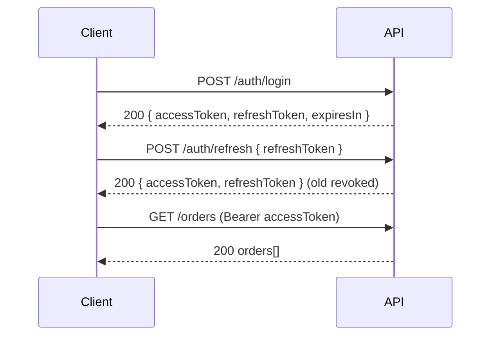

# Document 08 — API Design & Contracts

> **Platform:** E-Commerce Platform (Working Title: `ECommerce`)
> **Document Type:** API Contract Specification
> **Status:** Draft v1.0 for review
> **Audience:** Engineering, Integration Partners, QA, Product
> **Inputs:** `04a-functional-requirements-specification.md`, `06-system-architecture.md`
> **Relationship:** Authoritative for the HTTP/WebSocket contract. Module designs (`12`–`29`) elaborate per-slice behaviors; this document fixes the wire contract.

---

## 1. Document Control

| Version | Date       | Author / Owner | Change Summary                      |
|---------|------------|----------------|--------------------------------------|
| 0.1     | 2026-07-20 | Tech Lead      | Standards, auth, error model        |
| 0.2     | 2026-07-28 | Tech Lead      | Endpoint catalog, detailed contracts |
| 1.0     | 2026-07-31 | Tech Lead      | Baseline release                    |

### 1.1 Approvals

| Role                | Name | Decision | Date |
|----------------------|------|----------|------|
| Technical Lead       | —    | —        | —    |
| Enterprise Architect | —    | —        | —    |
| QA Lead              | —    | —        | —    |

---

## 2. Introduction

### 2.1 Purpose

This document defines the **API contract**: base conventions, authentication, error model, pagination, idempotency, versioning, the endpoint catalog, detailed request/response contracts for key operations, outbound webhooks, and SignalR hub contracts. OpenAPI 3.x is generated from implementation and is the machine-readable source; this document is the human-readable specification of intent.

### 2.2 Base Conventions

| Aspect | Convention |
|--------|-----------|
| Base URL | `https://api.ecommerce.dev` (dev) / environment-specific |
| API prefix | `/api` |
| Version | `/v1` in URL path (future: `v2`) |
| Media type | `application/json` (UTF-8) |
| Compression | gzip (≥ 1 KB responses) |
| Date format | ISO 8601 UTC: `2026-07-31T10:15:00Z` |
| Money in JSON | String, 2-dp (display) or 4-dp (ledger): `"129.9000"` |
| Enum serialization | String camelCase (`"paymentAuthorized"`) |
| Traceability | `traceId` echoed in error bodies; `X-Request-Id` accepted inbound |

---

## 3. Authentication & Authorization

### 3.1 Token Model

| Token | Type | TTL | Placement |
|-------|------|-----|-----------|
| Access | JWT (RS256) | 15 min | `Authorization: Bearer <token>` |
| Refresh | Opaque (hashed) | 30 d | Request body (never cookie in v1; HTTPS-only) |

### 3.2 Auth Endpoints

| Method | Path | Auth | Description |
|--------|------|:----:|-------------|
| POST | `/api/v1/auth/register` | None | Create customer + issue verification token |
| POST | `/api/v1/auth/verify-email` | None | Verify email with one-time token |
| POST | `/api/v1/auth/login` | None | Authenticate → token pair |
| POST | `/api/v1/auth/refresh` | Refresh | Rotate refresh token → new pair |
| POST | `/api/v1/auth/logout` | Access | Revoke refresh token (device) |
| POST | `/api/v1/auth/logout-all` | Access | Revoke entire token family |
| POST | `/api/v1/auth/forgot-password` | None | Send reset email (202 always) |
| POST | `/api/v1/auth/reset-password` | None | Set new password with token |



### 3.3 Authorization

- Claims: `sub`, `email`, `roles[]`, `perms[]`, `jti`, `exp`, `nbf`, `iss`, `aud`.
- Permission codes enforced per endpoint (e.g., `orders.refund.approve`).
- Default deny; 403 Problem Details include `permission` field.

---

## 4. Error Contract (RFC 9457)

### 4.1 Envelope

```json
{
  "type": "https://api.ecommerce.dev/problems/validation-failed",
  "title": "Validation Failed",
  "status": 422,
  "detail": "One or more fields are invalid.",
  "traceId": "00-5c5b1f2e-3d2c4a5b-01",
  "instance": "/api/v1/carts/me/items",
  "errors": [
    { "field": "quantity", "code": "MIN", "message": "Quantity must be at least 1." }
  ]
}
```

### 4.2 Common Problem Types

| `type` (relative) | status | title | When |
|-------------------|:------:|-------|------|
| `problems/validation-failed` | 422 | Validation Failed | Field errors (`errors[]`) |
| `problems/unauthorized` | 401 | Unauthorized | Missing/invalid/expired token |
| `problems/forbidden` | 403 | Forbidden | Permission denied (`permission` field) |
| `problems/not-found` | 404 | Not Found | Resource id/slug/number |
| `problems/conflict` | 409 | Conflict | State/race/duplicate |
| `problems/insufficient-stock` | 409 | Insufficient Stock | Allocation failure (`lines[]`) |
| `problems/payment-declined` | 402 | Payment Declined | PSP decline |
| `problems/rate-limited` | 429 | Rate Limited | `retryAfter` field |
| `problems/upstream-unavailable` | 502 | Upstream Unavailable | Provider/dependency failure |
| `problems/internal` | 500 | Internal Server Error | Unhandled; `traceId` only |

### 4.3 Rules

- No HTML error pages; no stack traces; no internal identifiers.
- 4xx for client faults, 5xx for server faults; never mask.
- Validation errors always include machine-readable `code` + `message`.

---

## 5. Cross-Cutting Contract Features

### 5.1 Pagination

| Header / Param | Meaning |
|----------------|---------|
| `?page=1&pageSize=20` | Offset paging (defaults 1 / 20; `pageSize` max 100) |
| `X-Total-Count` | Total records (for lists) |
| `Link` header | `rel="next"`, `rel="prev"`, `rel="first"`, `rel="last"` |
| `?cursor=<opaque>` | Cursor paging for hot paths (search, order history) |

Response body shape for lists:

```json
{
  "items": [],
  "page": 1,
  "pageSize": 20,
  "totalCount": 145,
  "hasNext": true
}
```

### 5.2 Idempotency

| Header | Meaning |
|--------|---------|
| `Idempotency-Key: <uuid>` | Required on: `POST /checkouts/{id}/place`, `POST /orders/{no}/refunds`, payment webhook processing |
| Behavior | Same key + same payload → replay stored response; same key + different payload → 409 `ERR_IDP_001` |

### 5.3 Rate Limiting

| Header | Meaning |
|--------|---------|
| `X-RateLimit-Limit` | Window quota |
| `X-RateLimit-Remaining` | Remaining calls |
| `X-RateLimit-Reset` | Epoch seconds until reset |
| `Retry-After` (429) | Seconds to wait |

### 5.4 Filtering, Sorting

- Query-style: `?status=paid&from=2026-07-01&to=2026-07-31&sort=-placedAt`
- Sort: `field` asc, `-field` desc; whitelist enforced.
- Filter operators where needed: `price.gte=10&price.lte=50`.

### 5.5 Request ID

- `X-Request-Id` accepted; if absent, API generates one; echoed in response + logs.

---

## 6. Endpoint Catalog (v1)

### 6.1 Identity

| Method | Path | Perm | Description |
|--------|------|------|-------------|
| POST | `/api/v1/auth/register` | public | Register |
| POST | `/api/v1/auth/verify-email` | public | Verify |
| POST | `/api/v1/auth/login` | public | Login |
| POST | `/api/v1/auth/refresh` | refresh | Rotate |
| POST | `/api/v1/auth/logout` | auth | Logout |
| POST | `/api/v1/auth/logout-all` | auth | Logout all |
| POST | `/api/v1/auth/forgot-password` | public | Reset email |
| POST | `/api/v1/auth/reset-password` | public | Reset |
| GET | `/api/v1/me` | auth | Profile |
| PATCH | `/api/v1/me` | auth | Update profile |
| GET | `/api/v1/me/addresses` | auth | Addresses |
| POST | `/api/v1/me/addresses` | auth | Add address |
| DELETE | `/api/v1/me` | auth | Close account |
| GET | `/api/v1/customers` | `customers.read` | Support lookup |
| GET | `/api/v1/customers/{id}` | `customers.read` | Customer detail (support view) |
| GET | `/api/v1/roles` | `roles.read` | List roles |
| POST | `/api/v1/roles` | `roles.write` | Create role |
| POST | `/api/v1/roles/{id}/permissions` | `roles.permissions.write` | Assign permissions |
| POST | `/api/v1/impersonations` | `auth.impersonate` | Impersonate |

### 6.2 Catalog

| Method | Path | Perm | Description |
|--------|------|------|-------------|
| GET | `/api/v1/products` | public | Search/filter list |
| GET | `/api/v1/products/{id}` | public | Product detail (locale/currency-aware) |
| GET | `/api/v1/products/{id}/variants` | public | Variants |
| POST | `/api/v1/products` | `catalog.product.write` | Create |
| PATCH | `/api/v1/products/{id}` | `catalog.product.write` | Update |
| DELETE | `/api/v1/products/{id}` | `catalog.product.delete` | Deactivate |
| GET | `/api/v1/categories` | public | Category tree |
| POST | `/api/v1/categories` | `catalog.product.write` | Create category |
| GET | `/api/v1/brands` | public | Brands |
| POST | `/api/v1/imports/products` | `catalog.product.write` | Bulk import (async) |
| GET | `/api/v1/imports/{id}` | `catalog.product.write` | Import status + errors |

### 6.3 Cart & Wishlist

| Method | Path | Perm | Description |
|--------|------|------|-------------|
| GET | `/api/v1/carts/me` | auth/anon | Get cart (via `X-Cart-Key` for anon) |
| POST | `/api/v1/carts/me/items` | auth/anon | Add item |
| PATCH | `/api/v1/carts/me/items/{productId}` | auth/anon | Update qty |
| DELETE | `/api/v1/carts/me/items/{productId}` | auth/anon | Remove |
| DELETE | `/api/v1/carts/me` | auth | Clear |
| GET | `/api/v1/wishlist` | auth | List |
| POST | `/api/v1/wishlist/items` | auth | Add |
| DELETE | `/api/v1/wishlist/items/{productId}` | auth | Remove |
| POST | `/api/v1/wishlist/items/{productId}/move` | auth | Move to cart |

### 6.4 Checkout & Orders

| Method | Path | Perm | Description |
|--------|------|------|-------------|
| POST | `/api/v1/checkouts` | auth/anon | Initiate checkout |
| GET | `/api/v1/checkouts/{id}` | owner | Checkout state |
| POST | `/api/v1/checkouts/{id}/place` | owner + `Idempotency-Key` | Place order (atomic) |
| GET | `/api/v1/orders` | owner | Order history |
| GET | `/api/v1/orders/{orderNumber}` | owner | Order detail + timeline |
| POST | `/api/v1/orders/{orderNumber}/cancel` | owner | Cancel |
| POST | `/api/v1/orders/{orderNumber}/reorder` | owner | Reorder |
| GET | `/api/v1/orders/{orderNumber}/timeline` | owner/support | Timeline |
| GET | `/api/v1/support/orders` | `orders.support.read` | Support lookup (number/email/customer) |
| GET | `/api/v1/shipping/methods` | auth/anon | Quote shipping methods |

### 6.5 Pricing & Promotions (Admin)

| Method | Path | Perm | Description |
|--------|------|------|-------------|
| GET | `/api/v1/promotions` | `promotions.read` | List |
| POST | `/api/v1/promotions` | `promotions.write` | Create |
| PATCH | `/api/v1/promotions/{id}` | `promotions.write` | Update |
| POST | `/api/v1/promotions/{id}/activate` | `promotions.write` | Activate |
| POST | `/api/v1/promotions/{id}/pause` | `promotions.write` | Pause |
| POST | `/api/v1/promotions/{id}/schedule` | `promotions.write` | Schedule |
| GET | `/api/v1/coupons` | `promotions.read` | List coupons |
| POST | `/api/v1/coupons` | `promotions.write` | Create coupon |
| POST | `/api/v1/carts/me/coupons` | auth | Apply coupon |
| DELETE | `/api/v1/carts/me/coupons` | auth | Remove coupon |

### 6.6 Inventory (Admin/Warehouse)

| Method | Path | Perm | Description |
|--------|------|------|-------------|
| GET | `/api/v1/warehouses` | `inventory.read` | List |
| POST | `/api/v1/warehouses` | `inventory.write` | Create |
| GET | `/api/v1/inventory/stock` | `inventory.read` | Stock query (sku/warehouse) |
| POST | `/api/v1/inventory/stock/receive` | `inventory.write` | Receive |
| POST | `/api/v1/inventory/stock/adjust` | `inventory.adjust` | Adjust (+approval) |
| POST | `/api/v1/inventory/transfers` | `inventory.write` | Transfer between warehouses |
| GET | `/api/v1/inventory/movements` | `inventory.read` | Ledger query |

### 6.7 Payments & Refunds

| Method | Path | Perm | Description |
|--------|------|------|-------------|
| GET | `/api/v1/payments/{id}` | owner/finance | Payment state |
| POST | `/api/v1/payments/{id}/capture` | finance/ops | Capture |
| POST | `/api/v1/payments/{id}/void` | finance/ops | Void |
| GET | `/api/v1/orders/{orderNumber}/refunds` | owner/finance | Refunds list |
| POST | `/api/v1/orders/{orderNumber}/refunds` | finance/support + `Idempotency-Key` | Request refund |
| POST | `/api/v1/refunds/{id}/approve` | `refunds.approve` | Approve |
| POST | `/api/v1/webhooks/{provider}` | provider-signature | PSP webhook receiver |

### 6.8 Fulfillment (Warehouse)

| Method | Path | Perm | Description |
|--------|------|------|-------------|
| GET | `/api/v1/fulfillment/queue` | `fulfillment.read` | Queue by warehouse |
| POST | `/api/v1/fulfillment/tasks/{id}/assign` | `fulfillment.write` | Assign picker |
| POST | `/api/v1/fulfillment/tasks/{id}/picked` | `fulfillment.write` | Mark picked |
| POST | `/api/v1/fulfillment/tasks/{id}/packed` | `fulfillment.write` | Mark packed |
| POST | `/api/v1/fulfillment/tasks/{id}/ship` | `fulfillment.write` | Create shipment |
| POST | `/api/v1/fulfillment/shipments/{id}/address` | `fulfillment.write` | Correct address |
| POST | `/api/v1/webhooks/{carrier}` | carrier-signature | Carrier tracking webhook |

### 6.9 Finance (Finance/Admin)

| Method | Path | Perm | Description |
|--------|------|------|-------------|
| GET | `/api/v1/invoices/{number}` | finance/owner | Invoice |
| GET | `/api/v1/invoices/{number}/pdf` | finance/owner | PDF download |
| GET | `/api/v1/reports/sales` | `reports.read` | Sales report |
| GET | `/api/v1/reports/inventory` | `reports.read` | Inventory report |
| GET | `/api/v1/reports/finance` | `reports.read` | Finance report |
| POST | `/api/v1/exports` | `reports.read` | Async export job |
| GET | `/api/v1/exports/{id}` | owner | Export status/download |
| POST | `/api/v1/reconciliation/run` | `finance.reconcile` | Trigger reconciliation |

### 6.10 Platform (Admin/SuperAdmin)

| Method | Path | Perm | Description |
|--------|------|------|-------------|
| GET | `/api/v1/audit-logs` | `audit.read` | Query audit |
| GET | `/api/v1/feature-flags` | `flags.read` | List flags |
| PATCH | `/api/v1/feature-flags/{key}` | `flags.write` | Toggle flag |
| GET | `/api/v1/health/live` | public | Liveness |
| GET | `/api/v1/health/ready` | public | Readiness |
| GET | `/api/v1/health/ui` | `ops.health` | Health UI |
| GET | `/api/v1/webhook-endpoints` | `integrations.read` | List endpoints |
| POST | `/api/v1/webhook-endpoints` | `integrations.write` | Register |
| POST | `/api/v1/webhook-endpoints/{id}/secret/rotate` | `integrations.write` | Rotate secret |
| POST | `/api/v1/webhooks/replay` | `integrations.write` | Replay delivery |
| GET | `/api/v1/jobs` | `ops.jobs` | Hangfire dashboard (or `/hangfire`) |

### 6.11 Reviews

| Method | Path | Perm | Description |
|--------|------|------|-------------|
| GET | `/api/v1/products/{id}/reviews` | public | Reviews list |
| POST | `/api/v1/products/{id}/reviews` | auth | Submit (verified purchase) |
| POST | `/api/v1/reviews/{id}/vote` | auth | Vote helpful |
| GET | `/api/v1/reviews/moderate` | `reviews.moderate` | Moderation queue |
| POST | `/api/v1/reviews/{id}/publish` | `reviews.moderate` | Approve |
| POST | `/api/v1/reviews/{id}/reject` | `reviews.moderate` | Reject |

---

## 7. Detailed Contracts (Key Endpoints)

### 7.1 POST `/api/v1/auth/register`

**Request**
```json
{
  "email": "ahmed@example.com",
  "password": "Str0ng!Pass",
  "displayName": "Ahmed Hassan",
  "locale": "ar",
  "currency": "AED"
}
```

**201 Response**
```json
{
  "userId": "0c2f...",
  "status": "pendingVerification",
  "message": "Verification email sent."
}
```

**Errors:** 409 duplicate email; 422 policy violations.

### 7.2 POST `/api/v1/auth/login`

**Request**
```json
{ "email": "ahmed@example.com", "password": "Str0ng!Pass" }
```

**200 Response**
```json
{
  "accessToken": "eyJhbGciOi...",
  "refreshToken": "r_6f4b...",
  "expiresIn": 900,
  "tokenType": "Bearer",
  "user": { "id": "0c2f...", "email": "ahmed@example.com", "roles": ["Customer"] }
}
```

**Errors:** 401 invalid; 423 locked (`retryAfter`); 429 too many attempts.

### 7.3 POST `/api/v1/checkouts`

**Request**
```json
{
  "cartId": "cart-id",
  "shippingAddress": {
    "street": "1 Sheikh Zayed Rd",
    "city": "Dubai",
    "region": "Dubai",
    "country": "AE",
    "postalCode": "00000"
  },
  "shippingMethodId": "standard-ae",
  "paymentMethod": { "providerKey": "stripe", "methodType": "card" },
  "currency": "AED"
}
```

**201 Response**
```json
{
  "checkoutId": "ck_7a1c...",
  "payment": { "clientToken": "tok_...", "providerKey": "stripe" },
  "totals": {
    "subtotal": "599.0000",
    "itemDiscount": "60.0000",
    "cartDiscount": "0.0000",
    "shipping": "25.0000",
    "tax": "30.5000",
    "total": "594.5000",
    "currency": "AED"
  },
  "expiresAt": "2026-07-31T11:15:00Z"
}
```

**Errors:** 409 `insufficient-stock` (`lines[]`); 409 `price-changed` (`deltas[]`); 402 `payment-declined`; 422 validation.

### 7.4 POST `/api/v1/checkouts/{id}/place` (Idempotent)

**Request**
```json
{
  "paymentAuth": { "providerToken": "tok_...", "providerKey": "stripe" }
}
```

**201 Response**
```json
{
  "orderId": "ord_...",
  "orderNumber": "E-20260731-000123",
  "status": "pending",
  "paymentStatus": "authorized",
  "allocations": [
    { "sku": "SKU-001", "warehouseCode": "DXB01", "quantity": 2 }
  ],
  "placedAt": "2026-07-31T10:15:00Z"
}
```

**Errors:** 409 conflict (state/stock); 402 declined; 409 `ERR_IDP_001` (key reuse); replay returns stored 201.

### 7.5 GET `/api/v1/products?q=&categoryId=&brandId=&price.gte=&price.lte=&rating.gte=&page=1&pageSize=20&locale=en&currency=AED`

**200 Response**
```json
{
  "items": [
    {
      "id": "prd_...",
      "sku": "SKU-001",
      "name": "Wireless Headphones",
      "slug": "wireless-headphones",
      "price": { "list": "349.0000", "offer": "299.0000", "currency": "AED" },
      "rating": { "average": 4.6, "count": 218 },
      "available": true,
      "isFeatured": false
    }
  ],
  "facets": { "categories": [...], "brands": [...], "priceRanges": [...], "ratings": [...] },
  "page": 1, "pageSize": 20, "totalCount": 12, "hasNext": false
}
```

### 7.6 POST `/api/v1/orders/{orderNumber}/refunds`

**Request**
```json
{
  "amount": "59.0000",
  "reason": "item.damaged",
  "items": [ { "productId": "prd_...", "quantity": 1 } ],
  "restock": true
}
```

**201 Response**
```json
{
  "refundId": "rf_...",
  "status": "requested",
  "refundableAmount": "594.5000",
  "idempotencyKey": "9c1f..."
}
```

**Errors:** 409 `ERR_PAY_003` (exceeds refundable); 422; replay returns stored response.

### 7.7 POST `/api/v1/promotions` (Admin)

**Request** (requires `promotions.write`)

```json
{
  "name": "Summer Sale 2026",
  "conditions": [
    { "type": "min_amount", "minAmount": 300.00 }
  ],
  "actions": [
    { "type": "Order", "basis": "Percent", "value": 15.00, "cap": 100.00 }
  ],
  "allowStack": false,
  "allowStackWith": [],
  "eligibleCountries": ["AE", "EG"],
  "eligibleCurrencies": ["AED", "EGP"],
  "startsAt": "2026-08-01T00:00:00Z",
  "endsAt": "2026-08-31T23:59:59Z"
}
```

`conditions[].type` selects the condition: `product` (`productIds`), `category` (`categoryIds`), `brand` (`brandIds`), `min_qty` (`minQuantity`), `min_amount` (`minAmount`), `segment` (`segment`). `actions[].type` is `Product`/`Order`/`Shipping`; `basis` is `Amount`/`Percent`. Percent values are capped at 100 and caps cannot be negative.

**201 Response** (promotion starts in `Draft`)

```json
{
  "id": "3f2a1b...",
  "name": "Summer Sale 2026",
  "state": "Draft",
  "startsAt": "2026-08-01T00:00:00Z",
  "endsAt": "2026-08-31T23:59:59Z",
  "allowStack": false,
  "allowStackWith": [],
  "conditions": [ { "minAmount": 300.00 } ],
  "actions": [ { "type": "Order", "basis": "Percent", "value": 15.00, "cap": 100.00 } ],
  "eligibleCountries": ["AE", "EG"],
  "eligibleCurrencies": ["AED", "EGP"],
  "createdAt": "2026-08-13T09:00:00Z",
  "updatedAt": "2026-08-13T09:00:00Z"
}
```

> Enum fields (`type`, `basis`, `state`) serialize as strings in this spec; the default wire format is integer unless a string-enum converter is registered. Enum inputs accept either form.

**Errors:** 422 validation (name required, ≥1 action, value/cap rules, invalid schedule); 400 unknown condition type.

### 7.8 POST `/api/v1/promotions/{id}/activate | pause | schedule`

- `activate` (no body): `Draft`/`Paused` → `Active`. **Errors:** 409 `ERR_PROMO_006` when `Ended`.
- `pause` (no body): `Active` → `Paused`. **Errors:** 409 `ERR_PROMO_006` unless `Active`.
- `schedule` body: `{ "startsAt": "2026-09-01T00:00:00Z", "endsAt": "2026-09-30T23:59:59Z" }` → updates dates. **Errors:** 422 `ERR_PROMO_005` on inverted range.
- All return 200 with the updated `PromotionResponse`; 404 `ERR_RES_001` when unknown.

### 7.9 POST `/api/v1/coupons` (Admin)

**Request** (requires `promotions.write`)

```json
{
  "code": "SAVE20",
  "promotionId": "3f2a1b...",
  "totalUses": 1000,
  "perCustomerLimit": 1,
  "startsAt": "2026-08-01T00:00:00Z",
  "endsAt": "2026-12-31T23:59:59Z"
}
```

**201 Response**

```json
{
  "id": "7c0e...",
  "code": "SAVE20",
  "promotionId": "3f2a1b...",
  "totalUses": 1000,
  "usedCount": 0,
  "perCustomerLimit": 1,
  "startsAt": "2026-08-01T00:00:00Z",
  "endsAt": "2026-12-31T23:59:59Z",
  "createdAt": "2026-08-13T09:05:00Z",
  "updatedAt": "2026-08-13T09:05:00Z"
}
```

Codes are trimmed and normalized to uppercase. **Errors:** 404 `ERR_RES_001` (promotion not found); 422 (code, `totalUses > 0`, `perCustomerLimit ≥ 1`, schedule).

### 7.10 POST `/api/v1/carts/me/coupons` (auth)

**Request**

```json
{ "code": "SAVE20" }
```

**200 Response** (cart with coupon attached; header `X-Cart-Key` re-issued for anonymous carts)

```json
{
  "id": "cart-1",
  "currency": "USD",
  "version": 4,
  "expiresAt": "2026-08-23T09:00:00Z",
  "updatedAt": "2026-08-13T09:10:00Z",
  "appliedCouponCode": "SAVE20",
  "items": [ ],
  "totals": { "subtotal": "0.00", "itemDiscount": "0.00", "shipping": "9.90", "tax": "0.00", "total": "9.90" }
}
```

**Errors:** 403 `COUPON_CUSTOMER_REQUIRED` (anonymous cart); 404 `ERR_RES_001` (unknown code); 409 `COUPON_INACTIVE` (out of schedule); 409 `COUPON_EXHAUSTED` (usage limit reached); 409 concurrency conflict on concurrent cart mutation.

`DELETE /api/v1/carts/me/coupons` detaches the coupon and returns the same `CartResponse`; 409 `COUPON_NOT_APPLIED` when none is applied. The coupon is consumed **atomically at order placement** (`POST /api/v1/checkouts/{id}/place`) — the limit is never exceeded under concurrent redemptions (QAS-02).

---

## 8. Webhooks (Outbound — Partner Contract)

### 8.1 Delivery

- Method: `POST` to registered `url`; header `X-Signature: sha256=...` (HMAC-SHA256 over body with endpoint secret).
- Retries: exponential backoff (5 attempts); after that suspended + alert; replay via `POST /api/v1/webhooks/replay`.

### 8.2 Event Catalog (Extract)

| Event Type | Payload Highlights |
|------------|-------------------|
| `order.placed` | orderId, orderNumber, customerId, totals, lines |
| `order.paid` | orderNumber, paymentId, amount, currency |
| `order.shipped` | orderNumber, trackingNumbers[] |
| `order.cancelled` | orderNumber, reason |
| `refund.completed` | refundId, orderNumber, amount, currency |
| `product.updated` | productId, sku, status |
| `stock.low` | sku, warehouseCode, onHand, threshold |

**Payload envelope**
```json
{
  "eventId": "evt_...",
  "type": "order.placed",
  "occurredAt": "2026-07-31T10:15:00Z",
  "version": "1.0",
  "payload": { }
}
```

---

## 9. SignalR Hubs

| Hub | Path | Auth | Groups | Events |
|-----|------|:----:|--------|--------|
| `orderHub` | `/hubs/orders` | JWT | user group (`u:{userId}`) | `OrderStatusChanged`, `OrderTimelineUpdated` |
| `warehouseHub` | `/hubs/warehouse` | JWT + role | warehouse group (`wh:{id}`) | `NewFulfillmentTask`, `TaskStatusChanged`, `StockAlert` |
| `adminHub` | `/hubs/admin` | JWT + admin | `admins` | `LiveOrderMetrics`, `StockAlerts`, `ReconciliationDrift` |

Message envelope:
```json
{
  "eventId": "evt_...",
  "type": "OrderStatusChanged",
  "occurredAt": "2026-07-31T10:15:00Z",
  "data": { "orderNumber": "E-20260731-000123", "status": "shipped" }
}
```

Reconnect contract: client sends `?lastEventId=<opaque>`; server replays missed events; REST fallback documented per hub.

---

## 10. Contract Testing & Governance

| Practice | Tool / Method |
|----------|---------------|
| Generated spec | Swashbuckle OpenAPI at `/swagger/v1/swagger.json` |
| Contract snapshots | OpenAPI diff in CI; breaking change review |
| Schema validation | Contract tests assert response bodies against schemas |
| Versioning policy | Breaking change → new major version + 12-month deprecation window |
| API changelog | `docs/api-changelog.md` per release |
| Partner sandbox | Staging environment with synthetic data + event replay |

---

## 11. Approvals

| Role                | Name | Decision | Date |
|----------------------|------|----------|------|
| Technical Lead       | —    | —        | —    |
| Enterprise Architect | —    | —        | —    |
| QA Lead              | —    | —        | —    |
| Product Owner        | —    | —        | —    |

---

*End of Document 08 — API Design & Contracts.*
*Next document on request: `09-security-architecture.md`.*
