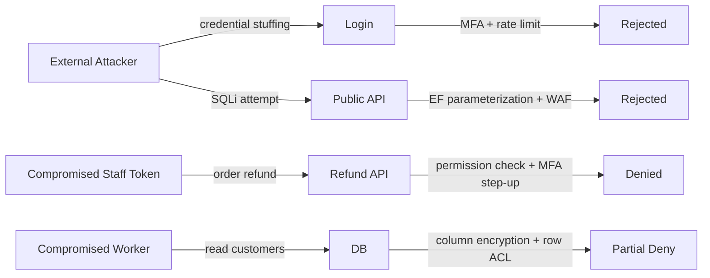

# Document 09 — Security Architecture

> **Platform:** E-Commerce Platform (Working Title: `ECommerce`)
> **Document Type:** Security Architecture & Control Specification
> **Status:** Draft v1.0 for review
> **Audience:** Engineering, DevOps/SRE, Security, QA, Compliance
> **Inputs:** `04a-functional-requirements-specification.md`, `05-non-functional-requirements.md`, `06-system-architecture.md`, `08-api-design.md`
> **Relationship:** Defines security controls, trust boundaries, and threat responses. Module designs (`12`–`29`) implement controls defined here; `10-authentication-authorization-design.md` details identity flows; `35-security-review.md` will validate compliance with this document.

---

## 1. Document Control

| Version | Date       | Author / Owner | Change Summary                       |
|---------|------------|----------------|---------------------------------------|
| 0.1     | 2026-07-20 | Tech Lead      | Principles, threat model             |
| 0.2     | 2026-07-28 | Tech Lead      | Controls per domain, compliance      |
| 1.0     | 2026-07-31 | Tech Lead      | Baseline release                     |

### 1.1 Approvals

| Role                | Name | Decision | Date |
|----------------------|------|----------|------|
| Technical Lead       | —    | —        | —    |
| Enterprise Architect | —    | —        | —    |
| Security Lead        | —    | —        | —    |
| QA Lead              | —    | —        | —    |

---

## 2. Introduction & Scope

### 2.1 Purpose

This document defines the **security architecture** for the platform: principles, threat model, trust boundaries, and the compensating/preventive/detective controls applied across identity, transport, data, APIs, payments, infrastructure, and the software lifecycle. It is the security reference that module designs must conform to.

### 2.2 Scope

In scope: all components in `06-system-architecture.md` — API (public + admin), BFF clients, background workers, PostgreSQL, Redis, RabbitMQ, SignalR, file/object storage, Nginx edge, observability stack.

Out of scope: physical security, office security, third-party SaaS internal controls (relied upon via provider SOC 2).

### 2.3 Security Objectives

| Objective | Statement |
|-----------|-----------|
| Confidentiality | Customer PII, credentials, payment data, and business data readable only by authorized principals |
| Integrity | Data and state changes protected against tampering; audit trails tamper-evident |
| Availability | Controls resist abuse/DoS per NFR availability targets (99.9%) |
| Accountability | Every privileged action attributable and auditable |
| Compliance | GDPR, PCI DSS (SAQ-A scope), OWASP ASVS L2 baseline |

---

## 3. Security Principles

| Principle | Application |
|-----------|-------------|
| **Least privilege** | Granular permission codes; default deny; per-operation scopes |
| **Defense in depth** | Edge → app → data layers each enforce controls independently |
| **Fail closed** | Authz failures deny by default; circuit breakers fail safe |
| **Zero trust network** | No implicit trust within network; mTLS/service auth for east–west |
| **Never trust user input** | Server-side validation always; client validation UX only |
| **Encrypt everywhere** | TLS in transit, AES-256 at rest, field-level for PII |
| **Secrets never in code** | Vault/KMS; rotation enforced |
| **Minimize attack surface** | Bounded contexts isolate; no monolithic trust |
| **Tamper-evident audit** | Hash-chained audit log |

---

## 4. Threat Model (STRIDE)

### 4.1 Threat Register (Top Risks)

| # | STRIDE | Asset | Threat | Mitigating Controls |
|---|--------|-------|--------|---------------------|
| T-01 | Spoofing | User identity | Credential stuffing / phishing | MFA (opt-in TOTP), adaptive rate limit, email verification, breach-password check |
| T-02 | Spoofing | Admin identity | Impersonation | MFA mandatory for staff, hardware-key support, impersonation audit trail |
| T-03 | Spoofing | JWT | Forged/edited token | RS256, kid pinning, 15-min TTL, server-side `jti` revocation |
| T-04 | Tampering | Orders | Price/quantity manipulation | Server-side price authority; amounts signed/versioned; immutable order ledger |
| T-05 | Tampering | Payments | Amount/receiver tampering | PSP tokens; provider-side amount; webhook signature (HMAC-SHA256) verification |
| T-06 | Tampering | Data at rest | DB dump exfiltration | AES-256 TDE/disk, column encryption for PII, key separation |
| T-07 | Repudiation | Privileged action | Deny making unauthorized change | Tamper-evident audit log; signed entries; operator binding |
| T-08 | Info disclosure | PII | Over-API exposure / mass assignment | DTO whitelisting; field-level permissions; masking in support UI |
| T-09 | Info disclosure | API | Excessive data via pagination/facets | Pagination caps; rate limits; minimal facets |
| T-10 | DoS | Public API | Request flooding / scraping | WAF, rate limiting, CDN, per-tenant quotas, stock-throttle for auth |
| T-11 | DoS | Checkout | Inventory abuse (hold flooding) | Allocation TTL, per-customer concurrency cap |
| T-12 | Elevation | Role | Role escalation | Server-side permission checks; RBAC separation; no client-trusted roles |
| T-13 | Elevation | Impersonation feature | Support taking over account | Dual approval, audit, read-only default, OTP challenge |
| T-14 | Injection | SQL | `' OR 1=1--` | EF Core parameterization; raw SQL only in validated views; DAST scans |
| T-15 | Injection | Scripts | Stored XSS in reviews/names | HTML-encode on output; CSP; sanitizer; moderation |
| T-16 | SSRF | Webhooks/imports | Fetch attacker URL | Allowlist outbound targets; IP/port allowlists; DNS rebinding protection |
| T-17 | Supply chain | Dependencies | Malicious package | SBOM, dependency scanning, signed NuGet, lockfiles |
| T-18 | Secrets | CI/CD | Leaked credentials | Vault, short-lived creds, secret scanning in CI |

### 4.2 Key Scenarios

---

## 5. Trust Boundaries

| Boundary | Left (untrusted) | Right (trusted) | Controls |
|----------|------------------|------------------|----------|
| **B1 Edge** | Internet clients | Nginx/CDN | WAF, TLS 1.3, HSTS, rate limits, bot defense |
| **B2 App** | Nginx | API/workers | AuthN at API, input validation, size limits |
| **B3 Service** | API/workers | DB/Redis/RabbitMQ | mTLS/service tokens, least-privilege DB roles, network policy |
| **B4 Partner** | Webhook senders (carrier/PSP) | API webhook receiver | Signature verification, idempotency, replay protection |
| **B5 Outbound** | API workers | Registered webhook URLs | URL allowlist, SSRF guards, retry/backoff |

---

## 6. Authentication Architecture

### 6.1 User Authentication

| Mechanism | Detail |
|-----------|--------|
| Password policy | ≥ 12 chars, breach-password (k-anonymity API) check, bcrypt (cost 12) hashing |
| MFA | TOTP opt-in (customers); mandatory for staff + finance role |
| Session | JWT access (15 min) + rotating opaque refresh (30 d), device-bound, hashed at rest |
| Login throttling | Per-account lockout (5 fails → 15 min), per-IP adaptive limits |
| Email verification | One-time token, 24 h TTL, re-verify on password reset |
| Account recovery | Reset token single-use, 15 min TTL, invalidates prior tokens |
| Impersonation | Requires `auth.impersonate` + second approver; audit log entry mandatory |

### 6.2 Service Authentication

| Direction | Mechanism |
|-----------|-----------|
| Public API | Client credentials (registered apps), scoped OAuth2 tokens |
| Internal (API → worker → DB) | mTLS with short-lived workload identity (K8s/SPIFFE-style) |
| Message bus | TLS + message-level signing; per-queue ACLs |
| Outbound webhooks | Per-endpoint HMAC-SHA256 secret; signed bodies |

---

## 7. Authorization Architecture

### 7.1 Model

- RBAC: roles → permission codes (see `11-identity-and-permissions.md`).
- ABAC where required: warehouse scope, region scope, data-ownership (`ownerId`).
- Policy evaluation: server-side per request; permission claims never trusted from client.

### 7.2 Enforcement Points

| Layer | Enforcement |
|-------|-------------|
| Edge | Path-based allowlist; auth offload only |
| API (authorization middleware) | Policy handlers per endpoint; default deny |
| Application layer | Business rule guards (owner checks, state machine checks) |
| Data layer | EF query filters (tenant/owner scope), DB RLS for multi-tenant data |

### 7.3 Row-Level Security (PostgreSQL)

- RLS enabled on `customers`, `orders`, `addresses`, `payments` for staff query contexts.
- Owner scoping via JWT claims → session `current_user_id`.

---

## 8. Data Protection

### 8.1 At Rest

| Layer | Control |
|-------|---------|
| Disk | AES-256 (LUKS/disk encryption on all nodes) |
| Database | Full volume encryption + per-column encryption for: `email`, `phone`, `address`, `refresh_token`, `card` metadata |
| Column keys | Key hierarchy: master key (KMS) → data keys; rotation scheduled (annual) |
| Object storage | Server-side AES-256 + bucket policies (private by default) |
| Backups | Encrypted snapshots; 30-day retention; restore tests |

### 8.2 In Transit

| Segment | Control |
|---------|---------|
| Client ↔ Edge | TLS 1.3, HSTS, modern ciphers only |
| Edge ↔ Services | TLS 1.3/mTLS |
| DB/Redis/RabbitMQ | TLS enforced; no plaintext listeners |
| Logs/metrics | TLS ingestion |

### 8.3 In Use

- PII processing in memory only; masked in logs (`maskEmail`, `maskPhone`).
- Card data: never stored in platform DB — PSP tokenization only (`SAQ-A`).

### 8.4 Key Management

| Item | Policy |
|------|--------|
| KMS | Cloud KMS / Vault Transparent Encryption |
| JWT signing | RS256; key pair rotation annually; `kid` pinning; allowlist of accepted kids |
| Webhook secrets | Per-endpoint, random 256-bit, rotate via endpoint API |
| DB master key | Stored in KMS, never on disk with data |

---

## 9. API Security

| Control | Specification |
|---------|---------------|
| Rate limiting | Per-IP + per-account + per-endpoint tiers (see `08-api-design.md`) |
| Input validation | FluentValidation server-side; max lengths everywhere; size caps (request ≤ 1 MB) |
| Content type | `application/json` only for API; reject others |
| Security headers | HSTS, `X-Content-Type-Options`, CSP, `Referrer-Policy`, `Permissions-Policy` |
| CORS | Explicit allowlist per environment; credentials only for first-party origins |
| CSRF | Stateless JWT (not cookie) → CSRF not applicable; SignalR tokens in query per spec |
| Query size | URL length cap; pagination caps (max 100); sort/filter whitelists |
| Error handling | RFC 9457; no internals, no stack traces (see `08-api-design.md`) |
| Batching | Disabled at gateway; N+1 risk guarded by result caps |
| Deprecation | Deprecated endpoints return `Deprecation` header; sunset enforced |

---

## 10. Web Application Security

| Risk | Control |
|------|---------|
| XSS | Output encoding everywhere (Razor/React), CSP `default-src 'self'`, nonce-based inline, sanitization on rendered rich text (reviews/descriptions) |
| Stored XSS in reviews | Moderation queue + sanitizer on write and render |
| CSRF | Bearer-token auth; anti-forgery on any cookie-based flows (admin) |
| Clickjacking | `X-Frame-Options: DENY` + CSP `frame-ancestors 'none'` |
| Open redirect | Login/continue URLs validated against allowlist |
| IDOR | Owner checks via query filters; random UUIDs (unguessable) |
| Enumeration | Generic login/register/forgot responses (202); timing equalization on auth |
| Cache poisoning | `Cache-Control: no-store` for authenticated responses |

---

## 11. Payment Security (PCI DSS SAQ-A Scope)

| Control | Detail |
|---------|--------|
| Scope reduction | Card data handled solely by PSP; platform stores tokenized references only |
| Tokenization | Provider tokens (`card_token`, `client_token`) never stored raw beyond PSP |
| Amount integrity | Provider-side amount confirmation; signed requests |
| Webhook trust | Signature verification + idempotency + replay window (5 min) |
| Reconciliation | Daily reconciliation job; drift alerting (`finance.reconcile`) |
| Logging | No PAN/CVV ever logged; token prefixes only; PII masked |
| PCI evidence | Network scan, ASV scan, access control list, quarterly reviews — collated in `35-security-review.md` |

---

## 12. Infrastructure Security

| Domain | Controls |
|--------|----------|
| Network | Private VPC subnets; egress allowlist; no public DB/Redis/RabbitMQ |
| Host | CIS-hardened images; immutable deploys; anti-virus on workloads |
| Container | Non-root, read-only FS, image signing, admission policy, resource limits |
| K8s | Pod security standards (restricted), NetworkPolicies default-deny |
| Secrets | Vault injection; never env for production secrets; rotation schedule |
| Monitoring | SIEM-forwarded security events; anomaly alerting; UEBA on privileged roles |
| Backup | Encrypted, tested restores; RPO ≤ 15 min, RTO ≤ 1 h for critical data |
| WAF/CDN | Managed WAF (OWASP CRS), bot management, geo-fencing for admin console |

---

## 13. Secure SDLC

| Phase | Practice |
|-------|----------|
| Design | Threat modeling (STRIDE) per feature; security design review for critical modules |
| Code | SAST in CI (Semgrep/SonarQube), secret scanning (gitleaks), linting gates |
| Dependencies | SCA (OWASP Dependency-Check/Dependabot), SBOM generation, license checks, lockfiles |
| Build | Reproducible builds, signed packages, minimal base images |
| Test | DAST on staging, fuzzing on parsers, security regression suite (XSS/SQLi/SSRF) |
| Release | Security sign-off gate for production; canary + rollback |
| Run | Continuous scanning, patch SLA (critical ≤ 72 h), vuln dashboard |

### 13.1 Verification Matrix

| Control Area | Tooling | Cadence |
|--------------|---------|---------|
| SAST | Semgrep / SonarQube | Every PR |
| SCA | Dependabot / Trivy | Every build + nightly |
| Secret scan | gitleaks / TruffleHog | Every commit + repo-wide |
| DAST | OWASP ZAP (CI) / Burp (quarterly) | CI + quarterly |
| Container scan | Trivy / Grype | Every image build |
| Dependency SBOM | CycloneDX | Every release |

---

## 14. Audit, Monitoring & Response

### 14.1 Audit Log

- Recorded for: auth events, privileged operations, impersonation, refunds, exports, permission changes, data-subject requests.
- Tamper-evident: hash-chained entries (previous hash in record), written to append-only store.
- Retention: 400 days operational + 6 years archival (regulatory).
- Query API: `GET /api/v1/audit-logs` (`audit.read`), filtered by actor/action/object.

### 14.2 Security Monitoring

| Signal | Source | Action |
|--------|--------|--------|
| Brute force / credential stuffing | Auth events, WAF logs | Auto-block IP/account, alert SOC |
| Privileged anomaly | Audit log UEBA | Alert; step-up MFA |
| Webhook failures | Delivery log | Alert on suspension |
| Recon scans | WAF | Alert; geo-block admin |
| Secret exposure | Scan pipeline | Immediate rotation + incident |

### 14.3 Incident Response

| Step | Action |
|------|--------|
| 1 Detect | SIEM alerts; automated correlation |
| 2 Triage | Severity (S1–S4); S1 = 15 min to activate bridge |
| 3 Contain | Kill tokens, block actors, isolate services, activate maintenance mode |
| 4 Eradicate | Remove persistence, rotate all secrets, patch |
| 5 Recover | Restore from clean backup, verify integrity, regression test |
| 6 Post-mortem | Root cause, timeline, evidence, lessons; update threat register |

---

## 15. Compliance Mapping

| Requirement | Control Reference | Status |
|-------------|-------------------|--------|
| GDPR Art. 5 (minimization) | Section 8, masked logging | Designed |
| GDPR Art. 32 (security) | Sections 8–9 | Designed |
| GDPR (data-subject rights) | DSAR workflow in identity module | Designed |
| PCI DSS SAQ-A | Section 11 | Designed |
| OWASP ASVS L2 | Sections 6–10 verification in `35-security-review.md` | Planned |
| ISO 27001 Annex A | Map in `35-security-review.md` | Planned |

---

## 16. Security Requirements Traceability

| Requirement Source | Reference |
|--------------------|-----------|
| NFR — SEC-01..SEC-12 (`05-non-functional-requirements.md`) | Sections 6–12 |
| FRS Authn/Authz (`04a-functional-requirements-specification.md`) | Section 6–7 |
| API security headers (`08-api-design.md`) | Section 9 |
| Outbox/worker tamper-resistance (`06-system-architecture.md`) | Section 4, 8 |

---

## 17. Approvals

| Role                | Name | Decision | Date |
|----------------------|------|----------|------|
| Technical Lead       | —    | —        | —    |
| Enterprise Architect | —    | —        | —    |
| Security Lead        | —    | —        | —    |
| QA Lead              | —    | —        | —    |

---

*End of Document 09 — Security Architecture.*
*Next document on request: `10-authentication-authorization-design.md`.*
