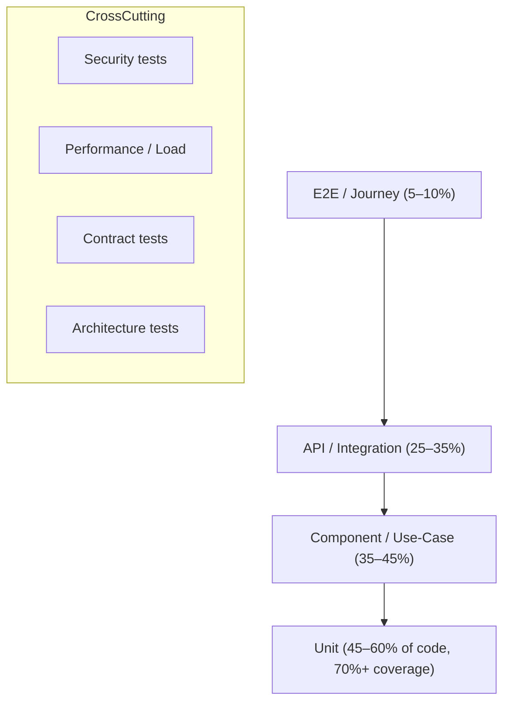

# Document 30 — Test Strategy & Quality Gates

> **Platform:** E-Commerce Platform (Working Title: `ECommerce`)
> **Document Type:** Test Strategy & Quality Assurance Specification
> **Status:** Draft v1.0 for review
> **Audience:** QA, Engineering, DevOps, Product, Tech Lead
> **Inputs:** `04a-functional-requirements-specification.md`, `05-non-functional-requirements.md`, `08-api-design.md`, `09-security-architecture.md`, `31-ci-cd-pipeline-and-release-management.md`, `34-load-and-performance-test-report.md`
> **Relationship:** Defines the layered test approach, coverage targets, quality gates, and QA practices. Pipeline wiring is in `31`; load evidence in `34`; security verification in `35`.

---

## 1. Document Control

| Version | Date       | Author / Owner | Change Summary                    |
|---------|------------|----------------|------------------------------------|
| 0.1     | 2026-07-20 | QA Lead        | Pyramid, coverage targets         |
| 0.2     | 2026-07-28 | QA Lead        | Test types, data mgmt, gates      |
| 1.0     | 2026-07-31 | QA Lead        | Baseline release                  |

### 1.1 Approvals

| Role                | Name | Decision | Date |
|----------------------|------|----------|------|
| QA Lead              | —    | —        | —    |
| Technical Lead       | —    | —        | —    |
| DevOps / SRE Lead    | —    | —        | —    |
| Product Owner        | —    | —        | —    |

---

## 2. Purpose & Scope

This document defines the **testing strategy**: test pyramid, test types per layer, coverage targets, quality gates, test data management, environment strategy, shift-left practices, and responsibilities. It applies to the entire platform (API, workers, integrations, infrastructure) and is enforceable through CI gates (`31-ci-cd-pipeline-and-release-management.md`).

### 2.1 Goals

| Goal | Measure |
|------|---------|
| Prevent defects, not just find them | Shift-left coverage, review checklists |
| High confidence before prod | Gates + sign-off at each promotion |
| Fast feedback | PR suite < 10 min |
| Regression safety net | Full suite green per main merge |
| Evidence for release | Artifacts per run (reports, coverage, traces) |

---

## 3. Test Strategy Overview (Pyramid)

**Balance rule:** The pyramid is the target distribution; the **quality gates (§7)** are the enforceable contract.

---

## 4. Test Types by Layer

### 4.1 Unit Tests (`ECommerce.UnitTests`)

| Aspect | Policy |
|--------|--------|
| Scope | Pure domain logic, value objects, validators, handlers in isolation |
| Frameworks | xUnit + FluentAssertions + NSubstitute (or Moq) |
| Isolation | No I/O, no DB, no network; fakes/stubs only |
| Naming | `Method_Scenario_ExpectedBehavior` |
| Data | Inline theory data; no shared fixtures |
| Coverage gate | ≥ 70% line overall; domain + pricing + inventory ≥ 80% |

### 4.2 Component / Use-Case Tests (`ECommerce.UseCases` tests)

| Aspect | Policy |
|--------|--------|
| Scope | Single use-case / handler with its dependencies stubbed at ports |
| Focus | Business rules, state transitions, invariants, error paths |
| Examples | Checkout totals, coupon stacking, stock allocation, refund limits |
| Value | Fast, deterministic, catches logic regressions |

### 4.3 Integration Tests (Testcontainers)

| Aspect | Policy |
|--------|--------|
| Scope | Real PostgreSQL, Redis, RabbitMQ via Testcontainers |
| Focus | EF mappings, transactions, outbox/inbox, idempotency, locking, RLS |
| Isolation | Per-test database (schema per fixture), cleanup guaranteed |
| Runner | CI main pipeline only (parallelized, ~8–12 min) |
| Determinism | Fixed seeds; no wall-clock asserts |

### 4.4 API / Contract Tests

| Aspect | Policy |
|--------|--------|
| Scope | Public + admin endpoints against `WebApplicationFactory` |
| Focus | Status codes, RFC 9457 errors, pagination, authz (403), validation |
| OpenAPI | Response schema validation against generated `swagger.json` |
| Snapshot | Breaking-change detection via OpenAPI diff in CI |
| Auth matrix | Anonymous, customer, staff, finance, superadmin per endpoint |

### 4.5 E2E / Journey Tests

| Aspect | Policy |
|--------|--------|
| Scope | Critical customer journeys on staged deployment |
| Tools | Playwright (web client) + API-driven orchestrator |
| Journeys | Register→browse→cart→checkout→pay→order; refund; reorder; admin refund approval |
| Env | Staging only; not in PR CI |
| Data | Idempotent synthetic data; cleanup after run |

### 4.6 Architecture Tests (`ECommerce.ArchitectureTests`)

| Aspect | Policy |
|--------|--------|
| Scope | Project references, layer boundaries, forbidden dependencies |
| Rules | UseCases → Domain only; Infrastructure → UseCases; no cycles; no `DbContext` in API; DTO not in Domain; etc. |
| Enforcement | Fail CI on any violation |

### 4.7 Security Tests

| Type | Tool | When |
|------|------|------|
| SAST | Semgrep + .NET analyzers | Every PR / main |
| SCA | Dependabot / Trivy | Every PR + nightly |
| Secret scan | gitleaks | Every PR / main |
| DAST | OWASP ZAP | Staging deploy |
| Authz regression | Dedicated test suite (IDOR, escalation, RLS) | Main CI |
| Manual pen-test | External / internal | Quarterly + `35-security-review.md` |

### 4.8 Performance / Load Tests

| Aspect | Policy |
|--------|--------|
| Tools | k6 (or NBomber) against staging |
| Scenarios | Peak order surge (1,000 orders/min), catalog browsing, mixed workload |
| Thresholds | p95 < 800 ms API, error < 0.5%, 0 SLO burn |
| Evidence | `34-load-and-performance-test-report.md` |
| Cadence | Every release before prod promotion (regression), full quarterly |

### 4.9 Migration Tests

| Aspect | Policy |
|--------|--------|
| Scope | EF migrations up + down paths, expand-contract safety |
| Runner | Testcontainers: apply migrations, seed, verify integrity, roll-forward |
| Guard | Detect destructive changes to non-empty tables |

---

## 5. Test Data Management

| Need | Approach |
|------|----------|
| Unit/component | Inline fixtures, builders (TestDataBuilder) |
| Integration | Per-fixture seeded DB; transaction rollback where safe |
| E2E | Idempotent synthetic customers/products; unique-by-run |
| Staging | Masked prod-shaped dataset + synthetic orders |
| Security tests | Distinct malicious payload fixtures |

### 5.1 Masking Rules

- Real PII never used outside prod; mask `email`, `phone`, addresses.
- Payment data: only PSP sandbox tokens.
- GDPR: data generator cannot contain real customer identity.

---

## 6. Test Environment Strategy

| Env | Suites run | Ownership | Data |
|-----|-----------|-----------|------|
| Dev | Unit, component | Developer | Local |
| CI | Unit, component, integration, contract, arch, security (fast) | Pipeline | Ephemeral |
| Staging | Full + E2E + DAST + load regression | QA + DevOps | Masked synthetic |
| Prod | Smoke + synthetic probes + canary verification | SRE | Prod |

---

## 7. Quality Gates

### 7.1 Gate Definition

| Gate | Where | Rule |
|------|-------|------|
| **G1 PR merge** | CI on PR | Unit ≥ 70%, arch 100%, SAST 0 high, SCA 0 high/critical, secrets 0, build green |
| **G2 main deploy** | CI on main | G1 + integration 100%, contract 100%, image scan 0 critical/high |
| **G3 staging** | Staging deploy | G2 + smoke 100%, E2E journeys pass, DAST 0 high/critical, load regression thresholds |
| **G4 prod promote** | Approval gate | G3 + QA sign-off, security sign-off, change record, SLO burn = 0 |

### 7.2 Coverage Budgets

| Area | Minimum |
|------|---------|
| Overall line coverage | 70% |
| Domain (aggregates, invariants) | 80% |
| Pricing / promotions / inventory | 80% |
| Critical authz paths | 100% (required tests, not just coverage) |
| Migration safety | All migrations exercised |

### 7.3 Failure Policy

- Any gate failure blocks promotion; artifact stays staged.
- Flaky test policy: quarantine after 2 flaky runs in 5; root-cause within 1 week; quarantine entries tracked.

---

## 8. Flakiness & Reliability Controls

| Control | Policy |
|---------|--------|
| Timeouts | Per-test generous but bounded; global CI wall-clock caps |
| Parallelism | Deterministic via isolated DBs and unique data |
| Randomness | Seeded RNG; no wall-clock dependence |
| Quarantine | Tag `[Flaky]`, exclude from blocking, track separately |
| CI retries | Max 1 auto-retry for infra flake only; test flakes never auto-retried silently |

---

## 9. Traceability

| Requirement artifact | Test artifact |
|----------------------|---------------|
| FRS functional requirements (`04a`) | Test cases in TestRail/xUnit `[Trait("FRS","F-14.2")]` |
| NFRs (`05`) | Performance/load + security suites |
| Error contract (`08`) | API error tests |
| Security controls (`09`) | Security test suite |

---

## 10. Responsibilities & Cadence

| Role | Responsibility | Cadence |
|------|----------------|---------|
| Developer | Unit/component/arch tests; fix failures fast | Every PR |
| QA | Integration/E2E/exploratory; sign-off | Per release |
| DevOps | Pipeline health, load harness, test envs | Continuous |
| Security | DAST reviews, pen-test coordination | Quarterly |
| Tech Lead | Gate enforcement, flake governance | Continuous |

---

## 11. Approvals

| Role                | Name | Decision | Date |
|----------------------|------|----------|------|
| QA Lead              | —    | —        | —    |
| Technical Lead       | —    | —        | —    |
| DevOps / SRE Lead    | —    | —        | —    |
| Product Owner        | —    | —        | —    |

---

*End of Document 30 — Test Strategy & Quality Gates.*
*Next document on request: `02-glossary-and-definitions.md` (or any other roadmap item).*
