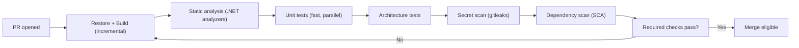
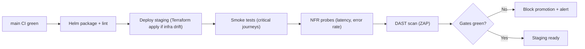
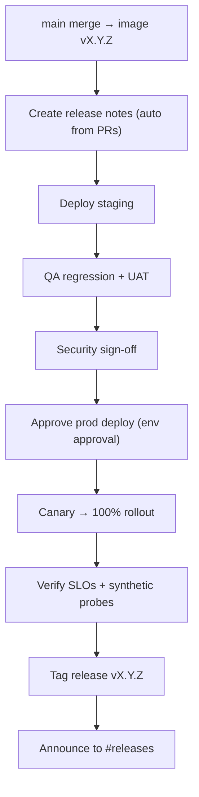

# Document 31 — CI/CD Pipeline & Release Management

> **Platform:** E-Commerce Platform (Working Title: `ECommerce`)
> **Document Type:** DevOps / CI/CD Specification
> **Status:** Draft v1.0 for review
> **Audience:** DevOps/SRE, Engineering, QA, Security, Tech Lead
> **Inputs:** `05-non-functional-requirements.md`, `06-system-architecture.md`, `08-api-design.md`, `09-security-architecture.md`, `32-deployment-infrastructure-and-runbooks.md`
> **Relationship:** Defines how code moves from commit to production. Deployment mechanics, topology, and runbooks are in `32-deployment-infrastructure-and-runbooks.md`; test details in `30-test-strategy-and-quality-gates.md`.

---

## 1. Document Control

| Version | Date       | Author / Owner | Change Summary                      |
|---------|------------|----------------|--------------------------------------|
| 0.1     | 2026-07-20 | DevOps Lead     | Pipeline stages, tooling            |
| 0.2     | 2026-07-28 | DevOps Lead     | Env promotion, release mgmt, SLO gates |
| 1.0     | 2026-07-31 | DevOps Lead     | Baseline release                    |

### 1.1 Approvals

| Role                | Name | Decision | Date |
|----------------------|------|----------|------|
| DevOps / SRE Lead    | —    | —        | —    |
| Technical Lead       | —    | —        | —    |
| QA Lead              | —    | —        | —    |
| Security Lead        | —    | —        | —    |

---

## 2. Purpose & Principles

### 2.1 Purpose

This document specifies the **end-to-end CI/CD pipeline and release management** process: branch strategy, pipeline stages, quality gates, artifact management, environment promotion, release trains, rollback, and metrics.

### 2.2 Principles

| Principle | Policy |
|-----------|--------|
| **Commit → main is releasable** | Every `main` commit produces a deployable, versioned artifact |
| **Shift-left quality** | Gates fail fast in CI; nothing unverified reaches staging |
| **Single artifact promotion** | The same OCI image promoted dev → staging → prod (no rebuild) |
| **Release ≠ deploy** | Feature flags decouple deploy from user-facing release |
| **Immutable + reproducible** | Pinned dependencies, lockfiles, reproducible builds |
| **Auditable** | Every promotion has a record; approvals logged |
| **Automated rollback** | One-command rollback with documented forward-fix policy |

---

## 3. Toolchain

| Concern | Tool | Rationale |
|---------|------|-----------|
| SCM | GitHub | PR workflows, branch protection |
| CI | GitHub Actions | Native GitHub, reusable workflows |
| Artifacts | GitHub Container Registry (GHCR) + Azure Artifacts (NuGet) | Single trust domain |
| IaC | Terraform + Helm | Env parity, declarative |
| Scanning | Trivy, Semgrep, Dependabot, gitleaks | Supply chain + SAST + secrets |
| Test infrastructure | Testcontainers (xUnit) | Ephemeral, no external services |
| Release orchestration | GitHub Environments + approvals | Env-scoped secrets + gates |
| Notifications | Slack webhooks | Status visibility |
| Observability gate | Prometheus/API-driven deploy verification | SLO-informed promotion |

---

## 4. Branch Strategy & Workflow

### 4.1 Model — Trunk-Based with Short-Lived Feature Branches

| Branch | Lifetime | Rules |
|--------|----------|-------|
| `main` | Permanent | Protected; direct pushes blocked; requires PR + checks + 1 approval |
| `feature/*` | Days | Branch from `main`; target `main` |
| `hotfix/*` | Hours | Branch from release tag; PR back to `main` |
| `release/*` | Until promoted | Optional for release trains; merged back to `main` |
| `docs/*` | Days | Docs only changes (`.md`), light pipeline |

### 4.2 Branch Protection (main)

- Require PR review (1 approval; 2 for `/src`).
- Require status checks: build, unit, architecture tests, SAST, SCA, secret scan.
- Require up-to-date branches before merge.
- No force-push; linear history (squash merge).

---

## 5. Pipeline Stages

### 5.1 Pull Request (CI — fast, fail fast)

**Duration target:** < 10 min. **No Docker build, no integration tests on PR** (unless `[full]` label).

### 5.2 Main Merge (CI — full)

| Stage | Job | Detail |
|-------|-----|--------|
| 1 | Restore + Build | Deterministic (`RestoreLockedMode`), publish artifacts |
| 2 | Unit tests | All projects, coverage gate ≥ 70% |
| 3 | Architecture tests | Enforce boundaries (see ArchitectureTests project) |
| 4 | Integration tests | Testcontainers: PostgreSQL, Redis, RabbitMQ |
| 5 | Contract tests | Validate against OpenAPI snapshot |
| 6 | SAST | Semgrep + .NET analyzers; zero new high findings |
| 7 | SCA | Trivy / Dependabot; fail on high/critical |
| 8 | Secret scan | gitleaks; fail on any finding |
| 9 | Build + scan image | Trivy (vulns + config), SBOM (CycloneDX) |
| 10 | Sign image | cosign; attestation |
| 11 | Publish | Push to GHCR `:git-sha`, `:main`, semver tag |

### 5.3 Deploy — Staging

### 5.4 Deploy — Production

| Gate | Owner | Evidence |
|------|-------|----------|
| CI green on `main` | CI | Pipeline report |
| Staging verified | QA | Manual + automated sign-off |
| DAST/security clean | Security | Scan report |
| Change record | Tech Lead | PR/change ticket linked |
| Approval | Tech Lead + DevOps | GitHub Environments approval |
| Load threshold (if peak release) | SRE | Load test reference |

**Deploy mechanics:** rolling via Helm; high-risk = canary 5% → 25% → 100% (rules in `32-…` §7.4).

---

## 6. Artifact & Versioning Strategy

### 6.1 Versioning

| Artifact | Scheme | Example |
|----------|--------|---------|
| App images | SemVer + `git-sha` | `1.4.2-9f3a2c1` |
| NuGet packages (if any) | SemVer | `1.4.2` |
| Helm charts | Chart semver | `0.12.0` |
| Release tag | `vX.Y.Z` | `v1.4.2` |

### 6.2 SemVer Policy (breaking → major)

- **Major:** breaking API/DB/contract change.
- **Minor:** new backward-compatible feature.
- **Patch:** bugfix without contract change.

Version bumps: automated via label (`minor`, `patch`) on PR; default `patch`.

### 6.3 SBOM & Provenance

- CycloneDX SBOM generated per image; attached as OCI attestation.
- Provenance: build URL, git sha, builder identity signed by cosign.
- Policy: admission requires signature + SBOM present.

---

## 7. Release Management

### 7.1 Release Process

### 7.2 Release Cadence

| Track | Cadence | Scope |
|-------|---------|-------|
| Continuous | Multiple/day | Patch, small features behind flags |
| Feature | Weekly | Modules, flagged features |
| Major | Quarterly | Breaking changes, DB schema epoch |
| Hotfix | On-demand | P1/P2 production defects |

### 7.3 Hotfix Flow

1. Branch `hotfix/x.y.z` from last `vX.Y.Z` tag.
2. Fix + tests + full CI.
3. Merge to `main` and backport tag.
4. Deploy prod with expedited gates (QA sanity + security scan only).

### 7.4 Release Notes

- Auto-generated changelog grouped by type (`feature`, `fix`, `refactor`, `security`, `breaking`).
- Breaking changes include migration guidance and links to `docs/api-changelog.md`.

---

## 8. Environment Promotion Model

| Stage | Trigger | Artifact | Data | Approval |
|-------|---------|----------|------|----------|
| `dev` | branch deploy (optional) | branch image | seed | none |
| `staging` | main merge | `:git-sha` | synthetic | none |
| `prod` | release flow | same image | production | Tech Lead + DevOps |

**Rule:** No image built elsewhere is deployable to prod. Promotion is artifact-driven, not rebuild-driven.

### 8.1 Drift Detection

- Terraform plan diff on every infra change and nightly (alert if `prod` drifts).
- Helm diff (`helm diff`) before each deploy.
- Config drift → P2 alert; auto-reconcile for non-secret config.

---

## 9. Quality Gates & SLO Triggers

### 9.1 CI Gates (block merge/promote)

| Gate | Threshold |
|------|-----------|
| Unit coverage | ≥ 70% overall (no regression) |
| Architecture tests | 100% pass |
| Integration tests | 100% pass |
| Contract tests | 100% pass |
| SAST | 0 high/critical new |
| SCA | 0 high/critical |
| Secret scan | 0 findings |
| Image scan | 0 critical / 0 high (fixable) |

### 9.2 Promotion Gates (staging → prod)

| Gate | Threshold |
|------|-----------|
| Smoke suite | 100% pass |
| Error rate (staging load) | < 0.5% |
| p95 latency | < 800 ms |
| SLO burn | 0 budget burned by release |
| DAST | 0 high/critical |
| Rollback drill | recent (≤ 30 d) |

### 9.3 Failure Handling

| Event | Response |
|-------|----------|
| PR CI fail | Author fixes; re-run |
| Main CI fail | Auto-notify; no deploy; fix-forward via revert/PR |
| Staging gates fail | Block promotion; alert #releases |
| Prod deploy fails (canary) | Auto-rollback to previous image; incident RUN-001 |
| SLO burn during release | Halt rollout; rollback; post-mortem |

---

## 10. Rollback & Recovery

### 10.1 Rollback Playbook

| Type | Mechanism | Time |
|------|-----------|------|
| App (bad code) | Helm rollback to previous image | < 5 min |
| Config (bad value) | Restore previous ConfigMap + restart | < 10 min |
| Feature (bad flag) | Flag off (kill switch) | < 1 min |
| DB (bad migration) | **Forward-fix only**, no revert; see §10.2 | — |
| Infra (bad IaC) | `terraform state` restore + apply | < 30 min |

### 10.2 DB Rollback Policy

- Never revert applied migrations (data-loss risk).
- Migration design must be **expand-contract** (see `32-…` §7.3): additive first, destructive last.
- If a migration breaks prod: stop deploy, forward-fix via new migration, verify integrity, re-deploy.

### 10.3 Post-Rollback Checklist

1. Confirm old artifact stable + probes green.
2. Reconcile side effects (outbox replay, webhook replay).
3. Capture failure artifacts (logs, metrics window).
4. Open incident + post-mortem within 48 h.
5. Add regression test + pipeline guard.

---

## 11. Metrics & Visibility

| Metric | Source | Target |
|--------|--------|--------|
| CI duration (PR) | Actions | < 10 min |
| CI duration (main) | Actions | < 20 min |
| Deploy frequency | CD events | ≥ 1/day to staging, ≥ 1/week to prod |
| Lead time (merge → prod) | CD events | < 1 day |
| Change failure rate | Deploys vs incidents | < 15% |
| MTTR | Incidents | < 1 h (P1/P2) |
| Release success (synthetic probe) | Probe | 100% |

Dashboards: `#deployments`, `#releases`, incident Slack channels; Grafana "Delivery" panel.

---

## 12. Security in Pipeline

| Control | Detail |
|---------|--------|
| Scoped tokens | Env-scoped GitHub Environments secrets; short-lived OIDC for cloud |
| No secrets in logs | Redaction on all step outputs; secret scan enforced |
| Build isolation | Untrusted PRs run in sandboxed runner, no secrets |
| Supply chain | cosign signatures, SBOM, pinned action SHAs (dependabot on actions) |
| Audit | Every promote/rollback logged to audit store |

---

## 13. Approvals

| Role                | Name | Decision | Date |
|----------------------|------|----------|------|
| DevOps / SRE Lead    | —    | —        | —    |
| Technical Lead       | —    | —        | —    |
| QA Lead              | —    | —        | —    |
| Security Lead        | —    | —        | —    |

---

*End of Document 31 — CI/CD Pipeline & Release Management.*
*Next document on request: `30-test-strategy-and-quality-gates.md`.*
