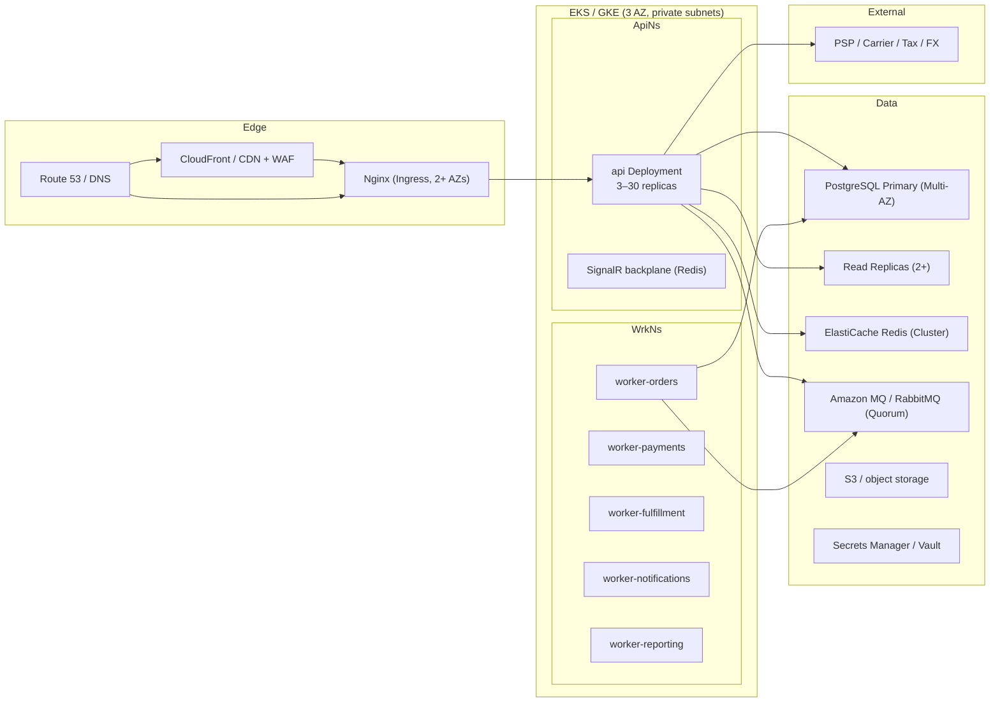
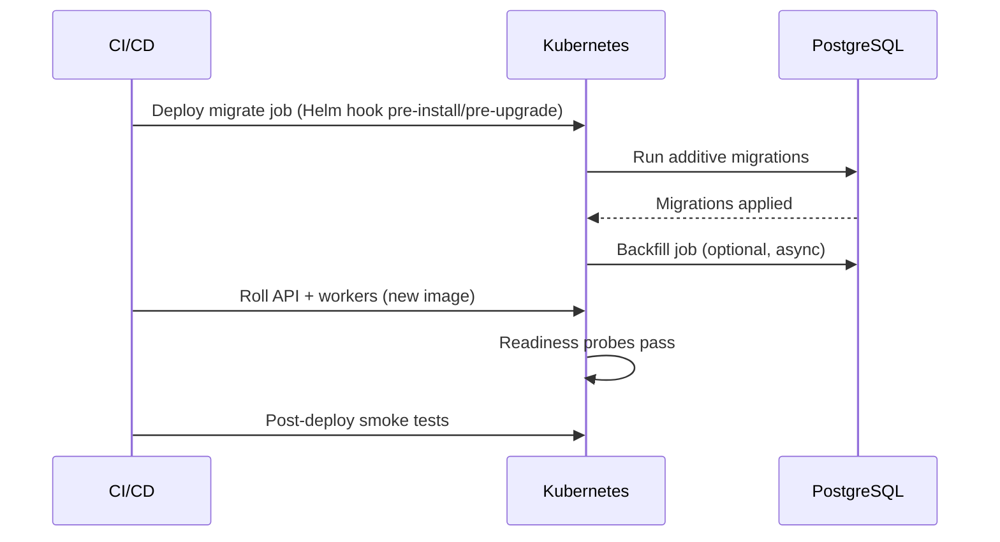

# Document 32 — Deployment, Infrastructure & Runbooks

> **Platform:** E-Commerce Platform (Working Title: `ECommerce`)
> **Document Type:** Deployment & Infrastructure Specification
> **Status:** Draft v1.0 for review
> **Audience:** DevOps/SRE, Engineering, QA, Security
> **Inputs:** `05-non-functional-requirements.md`, `06-system-architecture.md`, `08-api-design.md`, `09-security-architecture.md`
> **Relationship:** Details the target infrastructure, deployment topology, release mechanics, and operational runbooks. CI/CD mechanics are in `31-ci-cd-pipeline-and-release-management.md`.

---

## 1. Document Control

| Version | Date       | Author / Owner | Change Summary                      |
|---------|------------|----------------|--------------------------------------|
| 0.1     | 2026-07-20 | Tech Lead      | Environments, topology              |
| 0.2     | 2026-07-28 | SRE            | IaC, migrations, scaling, runbooks  |
| 1.0     | 2026-07-31 | SRE            | Baseline release                    |

### 1.1 Approvals

| Role                | Name | Decision | Date |
|----------------------|------|----------|------|
| Technical Lead       | —    | —        | —    |
| Enterprise Architect | —    | —        | —    |
| DevOps / SRE Lead    | —    | —        | —    |
| Security Lead        | —    | —        | —    |

---

## 2. Introduction & Scope

### 2.1 Purpose

This document specifies **how the platform is deployed and operated**: environments, cloud topology, Infrastructure-as-Code layout, container orchestration, database migration strategy, release models, scaling, cost controls, disaster recovery, and the operational runbooks used by on-call.

### 2.2 Objectives (trace to `05-non-functional-requirements.md`)

| Objective | Target | Where specified |
|-----------|--------|-----------------|
| Availability | 99.9% monthly | Section 9 (HA/DR) |
| Zero-downtime releases | Rolling + blue/green | Section 7 |
| RPO / RTO | RPO ≤ 15 min, RTO ≤ 1 h | Section 9.3 |
| Reproducibility | 100% IaC, immutable artifacts | Section 4 |
| Cost control | Envelope budget + drift alerts | Section 10 |

---

## 3. Deployment Topology (Production)

### 3.1 High-Level



### 3.2 Runtime Components

| Component | Artifact | Min Replicas | Max | Notes |
|-----------|----------|:------------:|:---:|-------|
| `api` | `ecommerce-api:1.x` | 3 | 30 | Public + admin HTTP, SignalR hosts |
| `worker-orders` | `ecommerce-worker:1.x` | 2 | 8 | Order lifecycle consumers |
| `worker-payments` | `ecommerce-worker:1.x` | 2 | 6 | PSP, reconciliation |
| `worker-fulfillment` | `ecommerce-worker:1.x` | 2 | 6 | Fulfillment, tracking |
| `worker-notifications` | `ecommerce-worker:1.x` | 1 | 4 | Email/SMS/push |
| `worker-reporting` | `ecommerce-worker:1.x` | 1 | 3 | Reports, exports, retention |
| `hangfire` (in api) | embedded | — | — | Scheduled jobs on dedicated queue |

### 3.3 Node Pools

| Pool | Machine type | Min/Max | Taints/Tolerations |
|------|--------------|:-------:|--------------------|
| `system` | 2 vCPU / 8 GB | 2 / 4 | Critical system workloads |
| `apps` | 4 vCPU / 16 GB | 3 / 30 | API + workers (spot eligible) |
| `data` | 8 vCPU / 32 GB | 2 / 4 | No application pods |

---

## 4. Infrastructure as Code

### 4.1 Repository Layout

```
infra/
├── terraform/
│   ├── modules/
│   │   ├── networking/       # VPC, subnets, NAT, security groups
│   │   ├── eks/              # cluster, node groups, OIDC
│   │   ├── postgres/         # RDS primary + replicas
│   │   ├── redis/            # ElastiCache cluster
│   │   ├── rabbitmq/         # MQ broker
│   │   └── observability/    # Prometheus, Grafana, Loki, Alertmanager
│   ├── environments/
│   │   ├── dev/              # lightweight single-AZ
│   │   ├── staging/          # full parity
│   │   └── prod/             # multi-AZ, hardened
│   └── remote-state/
├── helm/
│   ├── ecommerce/
│   │   ├── charts/api/
│   │   ├── charts/workers/
│   │   └── values/           # per-environment values
└── k8s/                      # raw manifests (pre-Helm quickstarts)
```

### 4.2 Principles

| Principle | Enforcement |
|-----------|-------------|
| No manual changes | All infra via Terraform; drift detection in CI (plan diff) |
| Env parity | `staging` mirrors `prod` shape at reduced size |
| Immutable artifacts | Single OCI image per commit, promoted across environments |
| State protection | Remote state + state locking + plan approval for `prod` |
| Tagging | Cost allocation tags on every resource |

---

## 5. Container Build & Registry

### 5.1 Image Specification

| Item | Value |
|------|-------|
| Base | `mcr.microsoft.com/dotnet/aspnet:10.0` (bookworm-slim), non-root user `app` |
| Distroless | Production target where feasible (no shell) |
| Signature | cosign-signed images; admission policy requires signature |
| Scan | Trivy in CI; critical/high findings block promotion |
| Tags | `git-sha` + semver; environment tags are mutable pointers |
| Runtime | `ASPNETCORE_ENVIRONMENT=Production`, read-only root FS |

### 5.2 Multi-Stage Build

```dockerfile
FROM mcr.microsoft.com/dotnet/sdk:10.0 AS build
WORKDIR /src
COPY . .
RUN dotnet publish src/ECommerce.Api -c Release -o /out
FROM mcr.microsoft.com/dotnet/aspnet:10.0
USER app
COPY --from=build /out /app
WORKDIR /app
EXPOSE 8080
ENTRYPOINT ["dotnet", "ECommerce.Api.dll"]
```

---

## 6. Configuration & Secrets

### 6.1 Configuration Hierarchy

```
Defaults (appsettings.json)
  → Environment (appsettings.{Environment}.json)
  → Kubernetes ConfigMap (non-secret, env-specific)
  → Secrets (Vault / K8s Secret / Secret Manager)
```

### 6.2 Secret Categories

| Secret | Storage | Rotation |
|--------|---------|----------|
| DB credentials | Secret Manager + DB-generated | 90 days |
| JWT signing keys | KMS | Annual (overlapping kids) |
| PSP/carrier API keys | Vault | 90 days / incident |
| Webhook HMAC secrets | Vault | 90 days / via API |
| Redis/RabbitMQ passwords | Secret Manager | 90 days |

Rules: never in git, never in logs, injected via CSI driver / env, masked in any output.

---

## 7. Release & Deployment Strategy

### 7.1 Release Model

| Aspect | Policy |
|--------|--------|
| Cadence | Continuous; batch deploys to `staging`, promoted to `prod` after gates |
| Deploy style | Rolling update (zero downtime) with `maxSurge=1`, `maxUnavailable=0` |
| High-risk (DB schema / payment / breaking) | Blue/green or canary with traffic split |
| Rollback | Instant via previous image tag; DB rollback via forward-fix (never revert migrations) |
| Feature exposure | Feature flags (see `29-feature-flags-and-configuration.md`) decouple deploy from release |
| Approval | `prod` gate requires tech lead + DevOps approval; change record in audit log |

### 7.2 Rolling Update Parameters

```yaml
strategy:
  type: RollingUpdate
  rollingUpdate:
    maxUnavailable: 0
    maxSurge: 1
readinessProbe:
  httpGet: { path: /api/v1/health/ready, port: 8080 }
  initialDelaySeconds: 10
  periodSeconds: 5
  failureThreshold: 3
livenessProbe:
  httpGet: { path: /api/v1/health/live, port: 8080 }
  periodSeconds: 15
```

### 7.3 DB Migration Strategy

| Aspect | Policy |
|--------|--------|
| Tooling | EF Core migrations + `ECommerce.Infrastructure` project |
| Deployment order | Migrations run as a **pre-deploy job** (`migrate` init container / Helm hook), expand-contract style |
| Zero-downtime rules | Additive changes first (new columns nullable, new tables), then backfill job, then data-move, then drop old in a later release |
| Long migrations | Run via background job on `worker-reporting`, not during deploy |
| Locking | `pg_advisory_lock` guard so only one migrator runs |
| Backout | No automatic DB rollback; forward-fix only |
| Verification | Post-migration integrity checks + smoke probes |



### 7.4 Canary Rules (High-Risk Deploys)

| Parameter | Value |
|-----------|-------|
| Initial traffic | 5% |
| Increments | 5% → 25% → 100% |
| Gate metric | Error rate < 0.1%, p95 latency < 800 ms, no SLO burn over 30 min |
| Auto-abort | Metrics breach → rollback automatically |

---

## 8. Environment Definitions

| Environment | Purpose | Topology | Data |
|-------------|---------|----------|------|
| `dev` | Developer loop | Single node, docker-compose parity | Anonymized seed |
| `ci` | Pipeline verification | Ephemeral, Testcontainers | Synthetic |
| `staging` | QA, load, security, UAT | Full multi-AZ shape (small nodes) | Synthetic + masked subset |
| `prod` | Live | Multi-AZ hardened | Production |
| `dr` | Disaster recovery | Warm standby (RPO ≤ 15 min) | Replicated |

### 8.1 Promotion Gate Matrix

| Gate | dev | staging | prod |
|------|:---:|:-------:|:----:|
| Build + unit tests | Y | — | — |
| Architecture tests | Y | — | — |
| Integration (Testcontainers) | Y | — | — |
| Contract tests | Y | — | — |
| SAST / SCA / secret scan | Y | — | — |
| Deploy + smoke | — | Y | — |
| Load regression (gate threshold) | — | Y | — |
| Security scans (DAST) | — | Y | — |
| Manual QA sign-off | — | Y | — |
| Approval + change record | — | — | Y |

---

## 9. High Availability & Disaster Recovery

### 9.1 HA Design

| Component | Redundancy |
|-----------|------------|
| Nginx/Ingress | 2+ nodes across AZs; health-checked DNS |
| API/workers | ≥ 3 / ≥ 2 replicas across AZs (PodTopologySpread) |
| PostgreSQL | Multi-AZ primary + synchronous standby, auto-failover |
| Read replicas | 2+ across AZs for read paths |
| Redis | Cluster mode, 3+ shards, replicas per shard |
| RabbitMQ | Quorum queues across 3 nodes |
| Object storage | Regional redundancy |

### 9.2 SLIs / SLO (from `05-non-functional-requirements.md`)

| SLO | Target |
|-----|--------|
| Availability | 99.9% monthly |
| Error rate | < 0.5% |
| Latency p95 API | < 800 ms |
| Recovery | RPO ≤ 15 min, RTO ≤ 1 h |

### 9.3 Disaster Recovery Plan

| Tier | RPO | RTO | Approach |
|------|-----|-----|----------|
| POD failure | 0 | minutes | K8s self-heal, replicas across AZs |
| AZ failure | 0–15 min | < 30 min | Multi-AZ primary, replicas in other AZs, standby capacity |
| Region failure | ≤ 15 min | ≤ 1 h | Warm DR region: replicated DB (streaming), replicated object storage, IaC-spun compute; runbook `DR-001` |
| Data corruption | ≤ 15 min | ≤ 1 h | PITR from automated backups; restore to new instance; traffic cutover |

**DR runbook (DR-001):** Declare → activate runbook → promote DR primary → start compute from IaC → validate smoke suite → switch DNS (weighted, then full) → run reconciliation → communicate status.

### 9.4 Backup Policy

| Dataset | Frequency | Retention | Restore Test |
|---------|-----------|-----------|--------------|
| PostgreSQL | Continuous WAL + daily snapshots | 30 d (prod), 6 y archival | Monthly automated |
| Object storage | Versioned | 30 d | Quarterly |
| Redis | RDB snapshots | 7 d | On restore drills |

---

## 10. Scaling & Cost Controls

### 10.1 Autoscaling

| Component | Metric | Behavior |
|-----------|--------|----------|
| API | CPU > 70% (5 min) or RPS threshold | HPA 3 → 30 |
| Workers | Queue depth / lag | KEDA scaled objects per consumer |
| Node pools | Aggregate requests | Cluster autoscaler; spot for apps pool |

### 10.2 Cost Controls

| Control | Detail |
|---------|--------|
| Budgets | Monthly envelope per environment; alert at 80%, hard-stop at 110% (staging) |
| Spot | Apps pool uses spot capacity where resilient |
| Storage tiers | Cold tier for archived audit/reports |
| Right-sizing | Quarterly review; unused replica detection |
| Tags | Allocation tags enforced by policy |

---

## 11. Observability & Alerting (Prod)

### 11.1 Stack

| Signal | Tool | Path |
|--------|------|------|
| Metrics | Prometheus + Grafana | `ecommerce/*` dashboards |
| Logs | Loki / OpenSearch | `ecommerce-*` indexes, 400 d |
| Traces | OpenTelemetry → Tempo/Jaeger | sampling: 100% errors, 10% success |
| Uptime | Synthetic probes | `/api/v1/health/ready` + critical journeys |
| SLOs | Prometheus rules → burn-rate alerts | error budget panel |

### 11.2 Alert Routing

| Severity | Example | Channel | Target |
|----------|---------|---------|--------|
| P1 | API down, DB failover, SLO burn | Page (on-call) | < 15 min ack |
| P2 | Error rate high, queue lag | Chat + ticket | < 1 h |
| P3 | Capacity warnings, backup failures | Ticket | next day |
| P4 | Info | Dashboard | — |

---

## 12. Operational Runbooks

| ID | Runbook | Trigger | Key Steps |
|----|---------|---------|-----------|
| RUN-001 | API replicas failing readiness | > 50% replicas unhealthy | Check deploy status → rollback image → inspect crash logs → restore traffic |
| RUN-002 | PostgreSQL failover | Primary unhealthy | Confirm failover event → verify standby promoted → check app reconnects → reconcile sessions |
| RUN-003 | RabbitMQ quorum loss | Queue unavailable | Verify node quorum → restart broker → replay outbox/inbox (idempotent) → verify consumers |
| RUN-004 | Redis failover | Cluster failover | Confirm automatic failover → flush cache warm via backfill job → verify SignalR backplane |
| RUN-005 | Webhook delivery failing | Suspension alert | Inspect delivery log → fix target/secret → rotate secret → replay events |
| RUN-006 | Long-running migration | Migrate job timeout | Check `pg_locks` → advisory lock holder → resume/restart backfill → integrity check |
| RUN-007 | Compromised secret | Incident | Rotate credential → revoke sessions → audit access logs → update threat register |
| RUN-008 | Disk full (DB) | Space alert | WAL archiving check → purge old backups → extend volume → verify replication |
| RUN-009 | Queue lag (orders) | Lag alert | Scale workers → inspect consumer errors → dead-letter review → replay failed |
| RUN-010 | Performance regression | p95 breach | Capture profile → check new flags/deploys → scale out → engage module owner |

### 12.1 On-Call Expectations

| Aspect | Policy |
|--------|--------|
| Rotation | 1 primary + 1 secondary, weekly |
| Response | P1 ack ≤ 15 min, engage bridge ≤ 30 min |
| Handover | Structured handoff doc, updated dashboard links |
| Post-incident | Blameless post-mortem within 48 h for P1/P2 |

---

## 13. Deployment Approval Matrix

| Action | Dev | Staging | Prod |
|--------|:---:|:-------:|:----:|
| Deploy application | auto | auto | A/R |
| Database migration | auto | auto | A/R (tech lead) |
| Infrastructure change | auto | A | A/R (DevOps) |
| Secret rotation | auto | A | A/R (DevOps + security) |
| Rollback | auto | auto | auto (documented) |

---

## 14. Approvals

| Role                | Name | Decision | Date |
|----------------------|------|----------|------|
| Technical Lead       | —    | —        | —    |
| Enterprise Architect | —    | —        | —    |
| DevOps / SRE Lead    | —    | —        | —    |
| Security Lead        | —    | —        | —    |

---

*End of Document 32 — Deployment, Infrastructure & Runbooks.*
*Next document on request: `31-ci-cd-pipeline-and-release-management.md` (or any other roadmap item).*
